<!----- Conversion time: 86.44 seconds.

Using this Markdown file:

1. Cut and paste this output into your source file.
2. See the notes and action items below regarding this conversion run.
3. Check the rendered output (headings, lists, code blocks, tables) for proper
   formatting and use a linkchecker before you publish this page.

Conversion notes:

* Docs to Markdown version 1.0β17
* Thu May 02 2019 22:01:10 GMT-0700 (PDT)
* Source doc: https://docs.google.com/open?id=1cSuVrHqid6g2Bf0dVsT3IjIdOsle6mbYYsJE-gXHH8o

ERROR:
undefined internal link to this URL: "#heading=h.heytalj5nhno".link text: Final Consonants
?Did you generate a TOC?

ERROR:
undefined internal link to this URL: "#heading=h.lb0zt9iswpxx".link text: Khmer Orthography
?Did you generate a TOC?

ERROR:
undefined internal link to this URL: "#heading=h.yvvrciwby1p".link text: Series Assimilation
?Did you generate a TOC?

ERROR:
undefined internal link to this URL: "#heading=h.6rj55mx00poh".link text: Inherent Vowels
?Did you generate a TOC?

ERROR:
undefined internal link to this URL: "#heading=h.nkrxdor2oauz".link text: Consonant Shifters
?Did you generate a TOC?

ERROR:
undefined internal link to this URL: "#heading=h.m5yfr5ee1x2b".link text: Appendix 1
?Did you generate a TOC?

ERROR:
undefined internal link to this URL: "#heading=h.jixwp7pzuotl".link text: Appendix 2
?Did you generate a TOC?

ERROR:
undefined internal link to this URL: "#heading=h.ifeekzpbj2si".link text: Appendix 3
?Did you generate a TOC?

ERROR:
undefined internal link to this URL: "#heading=h.cwjnd241t8ct".link text: Appendix 4
?Did you generate a TOC?

ERROR:
undefined internal link to this URL: "#heading=h.85tjn5trf11a".link text: Consonant Clusters
?Did you generate a TOC?

ERROR:
undefined internal link to this URL: "#heading=h.nkrxdor2oauz".link text: Consonant Shifters
?Did you generate a TOC?

ERROR:
undefined internal link to this URL: "#heading=h.p5qypot06j09".link text: Special Treatment of Consonant Shifters
?Did you generate a TOC?

ERROR:
undefined internal link to this URL: "#heading=h.oyx5zcphqrku".link text: Consonant Shifters with Consonant Clusters
?Did you generate a TOC?

ERROR:
undefined internal link to this URL: "#heading=h.l37q2kq6hfy6".link text: Appendix 5
?Did you generate a TOC?

ERROR:
undefined internal link to this URL: "#heading=h.2h1z5j4cirxy".link text: Pali
?Did you generate a TOC?

ERROR:
undefined internal link to this URL: "#heading=h.cgp0lxiftpvs".link text: Sanskrit
?Did you generate a TOC?

ERROR:
undefined internal link to this URL: "#heading=h.hc7eoqxwknzd".link text: Inscriptions
?Did you generate a TOC?

ERROR:
undefined internal link to this URL: "#heading=h.e6qfme7q5uf3".link text: Khmer Months of the Year
?Did you generate a TOC?

ERROR:
undefined internal link to this URL: "#heading=h.7chsfkqvhpuw".link text: Phase of the Moon
?Did you generate a TOC?

ERROR:
undefined internal link to this URL: "#heading=h.4m4qzxge5ekq".link text: Luna dates
?Did you generate a TOC?

ERROR:
undefined internal link to this URL: "#heading=h.f69y44o16z2b".link text: Consonant 
?Did you generate a TOC?

ERROR:
undefined internal link to this URL: "#heading=h.yoj90q2ioma".link text: Independent 
?Did you generate a TOC?

ERROR:
undefined internal link to this URL: "#heading=h.nkrxdor2oauz".link text:  Triisap or Muusikatoan
?Did you generate a TOC?

ERROR:
undefined internal link to this URL: "#heading=h.p5qypot06j09".link text: Special Treatment on Consonant Shifters
?Did you generate a TOC?

ERROR:
undefined internal link to this URL: "#heading=h.jowrd5ecyj4r".link text: Special Treatment of Consonant Shifters
?Did you generate a TOC?

ERROR:
undefined internal link to this URL: "#heading=h.z08bndir6nke".link text: Appendix 5
?Did you generate a TOC?

ERROR:
undefined internal link to this URL: "#heading=h.m5yfr5ee1x2b".link text: Initial Consonant Clusters
?Did you generate a TOC?

ERROR:
undefined internal link to this URL: "#heading=h.nkrxdor2oauz".link text: Consonant Shifters
?Did you generate a TOC?

* This document has images: check for >>>>>  gd2md-html alert:  inline image link in generated source and store images to your server.
----->

>>>>>  gd2md-html alert:  ERRORs: 28; WARNINGs: 0; ALERTS: 57.

<ul style="color: red; font-weight: bold"><li>See top comment block for details on ERRORs and WARNINGs. <li>In the converted Markdown or HTML, search for inline alerts that start with >>>>>  gd2md-html alert:  for specific instances that need correction.</ul>

Links to alert messages:
<a href="#gdcalert1">alert1</a>
<a href="#gdcalert2">alert2</a>
<a href="#gdcalert3">alert3</a>
<a href="#gdcalert4">alert4</a>
<a href="#gdcalert5">alert5</a>
<a href="#gdcalert6">alert6</a>
<a href="#gdcalert7">alert7</a>
<a href="#gdcalert8">alert8</a>
<a href="#gdcalert9">alert9</a>
<a href="#gdcalert10">alert10</a>
<a href="#gdcalert11">alert11</a>
<a href="#gdcalert12">alert12</a>
<a href="#gdcalert13">alert13</a>
<a href="#gdcalert14">alert14</a>
<a href="#gdcalert15">alert15</a>
<a href="#gdcalert16">alert16</a>
<a href="#gdcalert17">alert17</a>
<a href="#gdcalert18">alert18</a>
<a href="#gdcalert19">alert19</a>
<a href="#gdcalert20">alert20</a>
<a href="#gdcalert21">alert21</a>
<a href="#gdcalert22">alert22</a>
<a href="#gdcalert23">alert23</a>
<a href="#gdcalert24">alert24</a>
<a href="#gdcalert25">alert25</a>
<a href="#gdcalert26">alert26</a>
<a href="#gdcalert27">alert27</a>
<a href="#gdcalert28">alert28</a>
<a href="#gdcalert29">alert29</a>
<a href="#gdcalert30">alert30</a>
<a href="#gdcalert31">alert31</a>
<a href="#gdcalert32">alert32</a>
<a href="#gdcalert33">alert33</a>
<a href="#gdcalert34">alert34</a>
<a href="#gdcalert35">alert35</a>
<a href="#gdcalert36">alert36</a>
<a href="#gdcalert37">alert37</a>
<a href="#gdcalert38">alert38</a>
<a href="#gdcalert39">alert39</a>
<a href="#gdcalert40">alert40</a>
<a href="#gdcalert41">alert41</a>
<a href="#gdcalert42">alert42</a>
<a href="#gdcalert43">alert43</a>
<a href="#gdcalert44">alert44</a>
<a href="#gdcalert45">alert45</a>
<a href="#gdcalert46">alert46</a>
<a href="#gdcalert47">alert47</a>
<a href="#gdcalert48">alert48</a>
<a href="#gdcalert49">alert49</a>
<a href="#gdcalert50">alert50</a>
<a href="#gdcalert51">alert51</a>
<a href="#gdcalert52">alert52</a>
<a href="#gdcalert53">alert53</a>
<a href="#gdcalert54">alert54</a>
<a href="#gdcalert55">alert55</a>
<a href="#gdcalert56">alert56</a>
<a href="#gdcalert57">alert57</a>

>>>>> PLEASE check and correct alert issues and delete this message and the inline alerts.

# Khmer Character Specification/Usages

Author: Makara Sok \
Contributors: Marc Durdin, \
Todd Bequette, \
Becky Bequette, \
Seth Wilson, and \
Martin Hosken \
Last Update: Sept 5, 2018

[TOC]

1. **Introduction**

The Khmer language is the national language of the Kingdom of Cambodia and the Khmer script is the official script used not only in writing the Khmer language, but other ethnic minority languages. It is also used to write religious documents (i.e. Dharma). 

This document seeks to describe how the Khmer script is used in various languages nowadays, namely:

*   Khmer language, 
*   ethnic minority languages, 
*   Pali and 
*   Sanskrit.

Before getting into greater details, let’s look at the evolution of the Khmer script.

2. Khmer Language and Khmer Script

According to the Unicode Consortium (2017:631), the Khmer script is the official script of Cambodia and it is descended from the Brahmi script. It has been in use for more than 1400 years. During this period of time, the script has evolved substantially.   

According to a study on Khmer letters (Doek 2000:5), Khmer letters evolved from Brahmi script. Deok (2000:13) and Maspero (1915:48) claim, as noted by Kul (2008:179-181), that Khmer letters (Khmer Script) have undergone ten distinct evolutions since the 6th century. The list below gives the details on when the changes happened and inscription it was used on.

*   6th century, inscription found in the reign of Pavavarman
*   early 7th century, in the reign of Mahendravarman Jetrasen
*   667 AD, in the reign of Jayavarman I
*   970 AD, in the reign of Jayavarman V
*   1002 AD, in the reign of Suryavarman I
*   1066 AD, in the reign of Utyadityavarman II
*   12th century, in the reign of Suryavarman II
*   13th century, in the reign of Jayavarman VII
*   1702 AD, in the mid of the Udong era
*   Nowadays

During the French protectorate era, an attempt to romanize Khmer language was made, but it was not welcomed because it was seen as an attack on traditional learning and the Khmer society (Scheuren 2010:19). The process of Khmer romanization was then failed, and it gave rise to Khmerization.

3. The Linguistic Situation in Cambodia
    1. Languages of Cambodia

There are 27 languages spoken in Cambodia, according to the Ethnologue (Simons et al. 2017).

<table>
  <tr>
   <td><strong>Status</strong>
   </td>
   <td><strong>#</strong>
   </td>
   <td><strong>Languages with Ethnologue Codes</strong>
   </td>
  </tr>
  <tr>
   <td>national
   </td>
   <td>1
   </td>
   <td>Khmer [khm]
   </td>
  </tr>
  <tr>
   <td>wider communication
   </td>
   <td>4
   </td>
   <td>Mandarin Chinese [cmn], Min Nan Chinese [nan], English [eng], French [fra]
   </td>
  </tr>
  <tr>
   <td>dispersed
   </td>
   <td>2
   </td>
   <td>Thai [tha], Vietnamese [vie]
   </td>
  </tr>
  <tr>
   <td>developing
   </td>
   <td>3
   </td>
   <td>Brao [brb], Jarai [jra], Central Mnong[^1] [cmo]
   </td>
  </tr>
  <tr>
   <td>vigorous
   </td>
   <td>4
   </td>
   <td>wester Cham [cja], Hakka Chinese [hak], Kraol [rka], Tampuan [tpu]
   </td>
  </tr>
  <tr>
   <td>threatened
   </td>
   <td>6
   </td>
   <td>Kaco’ [xkk], Kavet [krv], Krung [krr], Lao [lao], Lao Phuon [phu], Stieng Bulo [sti]
   </td>
  </tr>
  <tr>
   <td>shifting
   </td>
   <td>2
   </td>
   <td>Kuay[^2] [kdt], Su’ung [syo]
   </td>
  </tr>
  <tr>
   <td>moribund
   </td>
   <td>2
   </td>
   <td>Pear [pcb], Somray [smu]
   </td>
  </tr>
  <tr>
   <td>nearly extinct
   </td>
   <td>1
   </td>
   <td>Chung [scq]
   </td>
  </tr>
  <tr>
   <td>dormant
   </td>
   <td>2
   </td>
   <td>Chong [cog], Samre [sxm]
   </td>
  </tr>
  <tr>
   <td><strong>Total</strong>
   </td>
   <td><strong>27</strong>
   </td>
   <td>
   </td>
  </tr>
</table>

    2. Languages Using Khmer Script

Other than the Khmer language, Khmer script is also used to write ethnic minority languages, such as: Kuay, Bunong, Tampuan, Jarai, Krung, Brao and Kavet.

<table>
  <tr>
   <td><strong>Language Name</strong>
   </td>
   <td><strong>Population</strong>

<strong>(in Cambodia)</strong>
   </td>
   <td><strong>Location</strong>

<strong>(Provinces in Cambodia)</strong>
   </td>
   <td><strong>Language Status (EGIDS)</strong>
   </td>
  </tr>
  <tr>
   <td>Kuay
   </td>
   <td>37,700
   </td>
   <td>Kampong Thom and Preah Vihear
   </td>
   <td>7 (Shifting)
   </td>
  </tr>
  <tr>
   <td>Bunong
   </td>
   <td>37,500 
   </td>
   <td>Kratie, Mondolkiri
   </td>
   <td>5 (Developing)
   </td>
  </tr>
  <tr>
   <td>Tampuan
   </td>
   <td>31,000 
   </td>
   <td>Ratanakiri
   </td>
   <td>6a (Vigorous)
   </td>
  </tr>
  <tr>
   <td>Jarai
   </td>
   <td>20,800
   </td>
   <td>Ratanakiri
   </td>
   <td>5 (Developing)
   </td>
  </tr>
  <tr>
   <td>Krung
   </td>
   <td>20,700
   </td>
   <td>Ratanakiri and Stung Treng
   </td>
   <td>6b (Threatened)
   </td>
  </tr>
  <tr>
   <td>Brao
   </td>
   <td>9,030 
   </td>
   <td>Ratanakiri
   </td>
   <td>5 (Developing)
   </td>
  </tr>
  <tr>
   <td>Kavet
   </td>
   <td>6,220
   </td>
   <td>Ratanakiri and Stung Treng 
   </td>
   <td>6b (Threatened)
   </td>
  </tr>
</table>

More information on each language can be found on the ethnologue website at [https://www.ethnologue.com/country/kh/languages](https://www.ethnologue.com/country/kh/languages). 

4. Khmer Phoneme Inventory

Khmer phoneme inventory varies from one scholar to another. The inventory hereunder is adapted from Huffman (1970:6-11) and Ehrman (1972:4-9) as stated in Sok (2016:11-13) and Headley (2014:x). 

    3. Consonants
        1. Initial Consonants

There are 21 consonant phonemes shown in the table below. Twelve of them can only occur in the initial position (i.e. they are marked with a hyphen).

<table>
  <tr>
   <td>
   </td>
   <td><strong>Bilabial</strong>
   </td>
   <td><strong>Alveolar</strong>
   </td>
   <td><strong>Palatal</strong>
   </td>
   <td><strong>Velar</strong>
   </td>
   <td><strong>Glottal</strong>
   </td>
  </tr>
  <tr>
   <td><strong>Plosives</strong>
   </td>
   <td>/p/
   </td>
   <td>/t/
   </td>
   <td>/c/
   </td>
   <td>/k/
   </td>
   <td>/ʔ/
   </td>
  </tr>
  <tr>
   <td><strong>Asp. Plosives</strong>
   </td>
   <td>/pʰ-/
   </td>
   <td>/tʰ-/
   </td>
   <td>/cʰ-/
   </td>
   <td>/kʰ-/
   </td>
   <td>
   </td>
  </tr>
  <tr>
   <td><strong>Implosives</strong>
   </td>
   <td>/ɓ-/
   </td>
   <td>/ɗ-/
   </td>
   <td>
   </td>
   <td>
   </td>
   <td>
   </td>
  </tr>
  <tr>
   <td><strong>Fricatives</strong>
   </td>
   <td>
   </td>
   <td>/s-/
   </td>
   <td>
   </td>
   <td>
   </td>
   <td>/h/
   </td>
  </tr>
  <tr>
   <td><strong>Nasals</strong>
   </td>
   <td>/m/
   </td>
   <td>/n/
   </td>
   <td>/ɲ/
   </td>
   <td>/ŋ/
   </td>
   <td>
   </td>
  </tr>
  <tr>
   <td><strong>Semi-vowels</strong>
   </td>
   <td>/w/
   </td>
   <td>
   </td>
   <td>/j/
   </td>
   <td>
   </td>
   <td>
   </td>
  </tr>
  <tr>
   <td><strong>Lateral</strong>
   </td>
   <td>
   </td>
   <td>/l/
   </td>
   <td>
   </td>
   <td>
   </td>
   <td>
   </td>
  </tr>
  <tr>
   <td><strong>Flap</strong>
   </td>
   <td>
   </td>
   <td>/r-/
   </td>
   <td>
   </td>
   <td>
   </td>
   <td>
   </td>
  </tr>
</table>

There is still a discussion on whether these phonemes are a combination of two phonemes: (unaspirated plosive + glottal fricative), i.e. (a) /ph, th, ch, kh/ versus (b) /pʰ, tʰ, cʰ, kʰ/. One might  argue that (a) is more likely to be more reasonable because the aspiration can be separated from the plosive when there is an infix. i.e. ខុស /khoh/ ‘to be wrong’ + -ម-, កំហុស /kɑm.hoh/ ‘mistake’.

For some foreign loan words, certain phonemes are used, yet they are not included in the table above as it is reserved for native phonemes. The phonemes are: labiodental fricative /f/, voiced alveolar fricative /z/, palatal fricative /ʃ/ and an alveolar implosive /ɠ/. They are usually found at the beginning of a syllable.

        2. Initial Consonant Clusters

Initial consonant clusters may be composed of two or three consonants (i.e. C1C2 or C1C2C3).

**C1 = { p t c k s ʔ m l }**

**C2 = { p t c k ʔ ɓ ɗ m n ɲ ŋ w j l r s h }**

**C3 = { r }**

        3. Final Consonants

Aspirated plosives (pʰ, tʰ, cʰ, kʰ) , implosives (ɓ, ɗ, ɠ), fricatives (f, s, z, ʃ; except glottal fricative /h/) and a flap (r) can never occur in the syllable final position. Each consonant in the syllable final position is pronounced without any audible release.

**F = { p t c k ʔ h m n ɲ ŋ l w j }**

Some foreign loanwords (i.e. English or French) may break this rule. For instance, ហ្វេសប៊ុក ‘Facebook’ may be pronounced as /fees.ɓuk/. 

Also note that the orthographic representation may be different from the actual pronunciation when it comes to Pali/Sanskrit loanwords. See 

>>>>>  gd2md-html alert: undefined internal link (link text: "Final Consonants"). Did you generate a TOC?  (<a href="#">Back to top</a>)(<a href="#gdcalert2">Next alert</a>) >>>>> 

[Final Consonants](#heading=h.heytalj5nhno) in 

>>>>>  gd2md-html alert: undefined internal link (link text: "Khmer Orthography"). Did you generate a TOC?  (<a href="#">Back to top</a>)(<a href="#gdcalert3">Next alert</a>) >>>>> 

[Khmer Orthography](#heading=h.lb0zt9iswpxx).

    4. Vowels

Khmer vowels are divided into two main groupsː monophthongs and diphthongs.

        4. Monophthongs

There are 18 monophthongsː 10 long monophthongs and 8 short monophthongs.

<table>
  <tr>
   <td>
   </td>
   <td colspan="2" ><strong>Front</strong>
   </td>
   <td colspan="2" ><strong>Central</strong>
   </td>
   <td colspan="2" ><strong>Back</strong>
   </td>
  </tr>
  <tr>
   <td><strong>High</strong>
   </td>
   <td>i
   </td>
   <td>ii
   </td>
   <td>ɨ[^3]
   </td>
   <td>ɨɨ
   </td>
   <td>u
   </td>
   <td>uu
   </td>
  </tr>
  <tr>
   <td><strong>Mid</strong>
   </td>
   <td>e
   </td>
   <td>ee[^4]
   </td>
   <td>ə
   </td>
   <td>əə[^5]
   </td>
   <td>o
   </td>
   <td>oo[^6]
   </td>
  </tr>
  <tr>
   <td><strong>Mid-Low</strong>
   </td>
   <td>
   </td>
   <td>ɛɛ
   </td>
   <td>
   </td>
   <td>
   </td>
   <td>
   </td>
   <td>ɔɔ
   </td>
  </tr>
  <tr>
   <td><strong>Low</strong>
   </td>
   <td>a
   </td>
   <td>aa
   </td>
   <td>
   </td>
   <td>
   </td>
   <td>ɑ
   </td>
   <td>ɑɑ
   </td>
  </tr>
</table>

        5. Diphthongs

There are 9 diphthongsː / iə, ie, ae, ao, aə, ɨə, uə, ea, oa/. Vowels whose second members is a semi-vowel (i.e. /j/ or /w/) are not considered as diphthongs Ehrman (1972:9). A complete list of them is given belowː

*   /ɨw/, /əw/, /aw/
*   /ɨj/, /əj/ and /aj/.

**V = { i ii ɨ ɨɨ u uu e ee ə əə o oo ɛɛ ɔɔ a aa ɑ ɑɑ iə ie ae ao aə ɨə uə ea oa }**

    5. Stress

Stress falls on the last syllable and it is not phonemic (Schiller 1994:312). Therefore it is not included in the phonemic transcription.

    6. Syllable Structures

Khmer syllable structures are divided into three typesː monosyllables, disyllables and polysyllables (Huffman 1970:11-12). 

<table>
  <tr>
   <td>
   </td>
   <td><strong>Syllable Structures</strong>
   </td>
   <td><strong>Description</strong>
   </td>
  </tr>
  <tr>
   <td><strong>Monosyllables</strong>
   </td>
   <td>C1C2C3VF
   </td>
   <td>The onset can have up to three consonants in a row. The final consonant is optional.
   </td>
  </tr>
  <tr>
   <td><strong>Disyllables</strong>
   </td>
   <td>minor syllable + major syllable

where:

- minor syllable is C(r)V(N)
<ul>

<li>C, any consonant

<li>r, the flap /r/

<li>V, any vowel

<li>N, any nasal consonant

- major syllable is C1C2V(F)
<ul>

<li>C1, any C1 consonant

<li>C2, any C2 consonant

<li>V, any vowel

<li>F, any final consonant
</li>
</ul>
</li>
</ul>
   </td>
   <td>A disyllabic word is made up of a minor syllable and a major syllable. The minor syllable is susceptible to extreme syllable reduction (Huffman 1972ː59-60). Here are some examplesː
<ul>

<li>/cɑm.kaa/ ‘farm’ > [cə.kaa]

<li>/kɑn.ɗaal/ ‘middle’ > [kə.ɗaal]

<li>/kaɲ.craeŋ/ ‘bamboo basket’ > [kə.craeŋ]

<li>/ɓɑŋ.riən/ ‘to teach’ > [pə.riən]

<li>/rɔ.ɓɑɑŋ/ ‘fence’ > [lə.ɓɑɑŋ]

<li>/prɑ.hael/ ‘perhaps’ > [pə.hael]
</li>
</ul>
   </td>
  </tr>
  <tr>
   <td><strong>Polysyllable</strong>
   </td>
   <td>multiple monosyllables
   </td>
   <td>This syllable type is common in foreign loanwords, i.e. Pali/Sanskrit, English, French, etc.
   </td>
  </tr>
</table>

    7. Series Assimilation

Sok (2016:24) wrote:

    _Series assimilation, សម្របសូរ or ការលំឱនសូ "lit. sound adaptation" as proposed by Prom (2013:24) and ទំនាញសូរ "lit. sound inclination" by Chan (2010:100), is the core of Khmer pronunciation and it is regularly correlated with the writing system. The series system and the sonority hierarchy drive the series assimilation phenomenon. Huffman (1970:43) refers to this phenomenon as Vowel Governance, for the pronunciation of a vowel symbol, including the invisible inherent vowel, is determined or governed by the series of the initial consonant symbol it is attached to (see Table 6 above). Thus, it is simple to pronounce a Khmer word which begins with a single consonant and a consonant cluster whose members are from the same series. For instance,_

*   _ក ‘neck’ and កា (ក+ា) 'cup' are pronounced as _/kɑɑ/_ and _/kaa/_ respectively because these words begin with first series consonant symbol (ក), and the first series of the inherent vowel is _/ɑɑ/_ and the first series of vowel symbol ា is _/aa/.
*   _គ ‘to be mute’ and គា (គ+ា) are pronounced as /kɔɔ/ and /kie/ respectively because they begin with the second series consonant symbol (គ), and the second series of the inherent vowel is /ɔɔ/ and the second series of vowel symbol ា is /ie/._
*   _ក្បាល (ក+្+ប+ា+ល) 'head' is pronounced as /kɓaal/ because ក /k/ and ប /ɓ/ are in the first series, and the first series of vowel symbol ា is _/aa/_._
*   _គ្នា (គ+្+ន+ា) 'first person singular (informal)' is pronounced as /knie/ because គ and ន are both in the second series, and the second series of the vowel symbol ា is /ie/._

After describing three accounts on the series assimilation, Sok (ibidː26-27) categorized the orthographic consonants into five groupsː IMPLOSIVE, UNASPIRATED PLOSIVE, ASPIRATED PLOSIVE, FRICATIVE, and SONORANT (See the table below). He hypothesized that the least sonorous consonant of an initial cluster determines the series of the following vowel based on the three accounts (Huffman (1970ː44), Kin (2007ː63) and Chan (2010ː107)).

The table below reads IMPLOSIVE consonants are the least sonorous and SONORANT consonants are the most sonorous. Those in between are ordered by increasing sonority. For instance. IMPLOSIVE consonants are less sonorous than UNASPIRATED PLOSIVE, and UNASPIRATED PLOSIVE are less sonorous than ASPIRATED PLOSIVE, and so forth.	

<table>
  <tr>
   <td rowspan="3" >IMPLOSIVE
   </td>
   <td>1st Series
   </td>
   <td>ដ     ប
   </td>
  </tr>
  <tr>
   <td>2nd Series
   </td>
   <td>ឌ     -
   </td>
  </tr>
  <tr>
   <td>Phoneme
   </td>
   <td>ɗ     ɓ
   </td>
  </tr>
  <tr>
   <td rowspan="3" >UNASPIRATED PLOSIVE
   </td>
   <td>1st Series
   </td>
   <td>ក      ច      ត      -     អ[^7]
   </td>
  </tr>
  <tr>
   <td>2nd Series
   </td>
   <td>គ      ជ      ទ      ព    -
   </td>
  </tr>
  <tr>
   <td>Phoneme
   </td>
   <td>k       c       t       p    ʔ
   </td>
  </tr>
  <tr>
   <td rowspan="3" >ASPIRATED PLOSIVE
   </td>
   <td>1st Series
   </td>
   <td>ខ       ឆ        ឋ      ថ     ផ
   </td>
  </tr>
  <tr>
   <td>2nd Series
   </td>
   <td>ឃ     ឈ     ឍ     ធ     ភ
   </td>
  </tr>
  <tr>
   <td>Phoneme
   </td>
   <td>kʰ      cʰ        tʰ      tʰ     pʰ
   </td>
  </tr>
  <tr>
   <td rowspan="3" >FRICATIVE
   </td>
   <td>1st Series
   </td>
   <td>ស     ហ
   </td>
  </tr>
  <tr>
   <td>2nd Series
   </td>
   <td>-         -
   </td>
  </tr>
  <tr>
   <td>Phoneme
   </td>
   <td>s        h
   </td>
  </tr>
  <tr>
   <td rowspan="3" >SONORANT
   </td>
   <td>1st Series
   </td>
   <td>-       -        ណ     -       -        -     ឡ    -
   </td>
  </tr>
  <tr>
   <td>2nd Series
   </td>
   <td>ង     ញ     ន        ម     យ     រ     ល    វ
   </td>
  </tr>
  <tr>
   <td>Phoneme
   </td>
   <td>ŋ      ɲ       n        m     j        r      l       w
   </td>
  </tr>
</table>

For examples, the vowel of ល្ហុង ‘papaya’ takes the 1st series because the least sonorous consonant of the initial cluster is in the 1st series.

<table>
  <tr>
   <td colspan="5" >ល្ហុង ‘papaya’
   </td>
  </tr>
  <tr>
   <td>character sequence
   </td>
   <td>ល
   </td>
   <td>្ហ
   </td>
   <td>ុ
   </td>
   <td>ង
   </td>
  </tr>
  <tr>
   <td>character mapping
   </td>
   <td>l
   </td>
   <td>h
   </td>
   <td>o|u
   </td>
   <td>ŋ
   </td>
  </tr>
  <tr>
   <td>series of character
   </td>
   <td>2nd
   </td>
   <td>1st
   </td>
   <td>1st|2nd
   </td>
   <td>2nd
   </td>
  </tr>
  <tr>
   <td>series of syllable
   </td>
   <td colspan="4" >1st
   </td>
  </tr>
  <tr>
   <td>phonemic transcription
   </td>
   <td colspan="4" >/lhoŋ/
   </td>
  </tr>
</table>

ខ្នាយ ‘spur’ is pronounced with the 1st series of the vowel governed by the series of the least sonorous initial consonant, ខ /kʰ/.

<table>
  <tr>
   <td colspan="5" >ខ្នាយ ‘spur’
   </td>
  </tr>
  <tr>
   <td>character sequence
   </td>
   <td>ខ
   </td>
   <td>្ន
   </td>
   <td>ា
   </td>
   <td>យ
   </td>
  </tr>
  <tr>
   <td>character mapping
   </td>
   <td>kʰ
   </td>
   <td>n
   </td>
   <td>aa|ie
   </td>
   <td>j
   </td>
  </tr>
  <tr>
   <td>series of character
   </td>
   <td>1st
   </td>
   <td>2nd
   </td>
   <td>1st|2nd
   </td>
   <td>2nd
   </td>
  </tr>
  <tr>
   <td>series of syllable
   </td>
   <td colspan="4" >1st
   </td>
  </tr>
  <tr>
   <td>phonemic transcription
   </td>
   <td colspan="4" >/knaaj/
   </td>
  </tr>
</table>

The series assimilation does not only occur in the monosyllabic words, but also disyllabic words. The rule is the same, the vowel of the second syllable (a.k.a. major syllable) is determined by the series of the series of the least sonorous initial consonant of the first syllable (a.k.a. minor syllable). However, this comes with a caveat. 

Sok (ibid:29) describes:

    _Khin (2007:63) wrote that, in disyllabic words, if the initial consonant of the major syllable is one of these (ង /ŋ/, ញ /ɲ/, ន /n/, ម /m/, យ /j/, រ /r/, ល /l/, and វ /w/), the vowel of the major syllable should be in the same series as the series of the initial consonant of the minor syllable. [...]_

    _Exceptions: _

    _• អន្លក់ 'vegetable' is pronounced as_ /ʔɑn.luək/_, not _/ʔɑn.lɑk/_ (if assimilation occurs) _

    _• អង្រែ 'pestle' is pronounced as /ʔɑŋ.rɛɛ/, not _/ʔɑŋ.rae/_ (if assimilation occurs)_

For instance, បន្លា ‘thorn’ is pronounced as /ɓɑn.laa/ not /ɓɑn.lie/ because the minor syllable is in the 1st series, and the initial of the major syllable is one of the consonant listed above.

<table>
  <tr>
   <td colspan="5" >បន្លា ‘thorn’
   </td>
  </tr>
  <tr>
   <td>character sequence
   </td>
   <td>ប
   </td>
   <td>ន
   </td>
   <td>្ល
   </td>
   <td>ា
   </td>
  </tr>
  <tr>
   <td>character mapping
   </td>
   <td>ɓ
   </td>
   <td>n
   </td>
   <td>l
   </td>
   <td>aa|ie
   </td>
  </tr>
  <tr>
   <td>series of character
   </td>
   <td>1st
   </td>
   <td>2nd
   </td>
   <td>2nd
   </td>
   <td>1st|2nd
   </td>
  </tr>
  <tr>
   <td>series of syllable
   </td>
   <td colspan="2" >1st
   </td>
   <td colspan="2" >1st
   </td>
  </tr>
  <tr>
   <td>phonemic transcription
   </td>
   <td colspan="4" >/ɓɑn.laa/
   </td>
  </tr>
</table>

Sok (ibid:30) continues:

    [...] if each syllable of a disyllable word begins with a plosive or fricative, the series of each vowel is determined independently. Thus, for example, បន្ទាយ (ប /ɓ/, ន /n/, ទ /t/, ា \
 /aa|ie/, យ /j/) 'barracks' is pronounced as /ɓɑn.tiej/ (not /ɓɑn.taaj/) and ទន្សាយ (ទ /t/, ន /n/, ស /s/, ា /aa|ie/, យ /j/) 'rabbit' is pronounced as /tun.saaj/ (not /tun.siej/). Khin (2007:63) and Chan (2010:107) also agree that if the initial consonant of the major syllable is a strong consonant group (i.e. implosives, plosives, or fricative) then the series of the vowel of the major and minor syllable should be independent from one another (i.e. no series assimilation between the two syllables), as show in the example below.

<table>
  <tr>
   <td colspan="5" >បន្ទាយ ‘barracks’
   </td>
   <td>
   </td>
  </tr>
  <tr>
   <td>character sequence
   </td>
   <td>ប
   </td>
   <td>ន
   </td>
   <td>្ទ
   </td>
   <td>ា
   </td>
   <td>យ
   </td>
  </tr>
  <tr>
   <td>character mapping
   </td>
   <td>ɓ
   </td>
   <td>n
   </td>
   <td>t
   </td>
   <td>aa|ie
   </td>
   <td>j
   </td>
  </tr>
  <tr>
   <td>series of character
   </td>
   <td>1st
   </td>
   <td>2nd
   </td>
   <td>2nd
   </td>
   <td>1st|2nd
   </td>
   <td>2nd
   </td>
  </tr>
  <tr>
   <td>series of syllable
   </td>
   <td colspan="2" >1st
   </td>
   <td colspan="3" >2nd
   </td>
  </tr>
  <tr>
   <td>phonemic transcription
   </td>
   <td colspan="4" >/ɓɑn.tiej/
   </td>
   <td>
   </td>
  </tr>
</table>

<table>
  <tr>
   <td colspan="5" >ទន្សាយ ‘rabit’
   </td>
   <td>
   </td>
  </tr>
  <tr>
   <td>character sequence
   </td>
   <td>ទ
   </td>
   <td>ន
   </td>
   <td>្ស
   </td>
   <td>ា
   </td>
   <td>យ
   </td>
  </tr>
  <tr>
   <td>character mapping
   </td>
   <td>ɓ
   </td>
   <td>n
   </td>
   <td>t
   </td>
   <td>aa|ie
   </td>
   <td>j
   </td>
  </tr>
  <tr>
   <td>series of character
   </td>
   <td>2nd
   </td>
   <td>2nd
   </td>
   <td>1st
   </td>
   <td>1st|2nd
   </td>
   <td>2nd
   </td>
  </tr>
  <tr>
   <td>series of syllable
   </td>
   <td colspan="2" >2nd
   </td>
   <td colspan="3" >1st
   </td>
  </tr>
  <tr>
   <td>phonemic transcription
   </td>
   <td colspan="4" >/tun.saaj/
   </td>
   <td>
   </td>
  </tr>
</table>

5. 
Khmer Orthography

    8. Series System

“Series” is the term used by Huffman (1970ː15) to refer to two distinct group of consonants which determine how a syllable should be pronounced, 1st series and 2nd series. They are also called សំឡេងតូច ‘small voice’ and សំឡេង​ធំ ‘big voice’ or សំឡេង​ស្រាល ‘light voice’ and សំឡេង​ធ្ងន់ ‘heavy voice’ respectively. Henderson (1952ː151) refers to this term as “registers”, 1st register and 2nd register. The pitch of the 2nd register tends to be lower than the 1st register. 

In an essence, the vowel quality is changed in harmony with the series of the initial consonant or consonant cluster while its orthographic representation stays the same. For example, consonant ក /k/ is in the 1st series and consonant គ /k/ is in the 2nd series. Vowel ា is realized phonemically as /aa/ in the 1st series and as /ie/ in the 2nd series. When ក is concatenated with ា, it creates a syllable which is pronounced as /kaa/. When គ is concatenated with ា, the syllable is pronounced as /kie/.

ក /k/ (1st series) + ា /aa|ie/	>	កា	/kaa/

គ /k/ (2nd series) + ា /aa|ie/	>	គា	/kie/

When a word begins with an initial consonant cluster, the 

>>>>>  gd2md-html alert: undefined internal link (link text: "Series Assimilation"). Did you generate a TOC?  (<a href="#">Back to top</a>)(<a href="#gdcalert4">Next alert</a>) >>>>> 

[Series Assimilation](#heading=h.yvvrciwby1p) comes in to play--the least sonorous consonant determines the series of the vowel.

    9. Phoneme-Grapheme Correspondence

Phoneme-grapheme correspondence of initial consonants, modified initial consonants, initial consonant digraphs, initial consonant clusters and final consonants are illustrated in tables in the following sections. Glosses are adopted from the Khmer-English dictionary (Headley 1997).

        6. Initial Consonants
            1. Initial Consonant Monographs

The table below illustrates the grapheme-phoneme correspondences with their Unicode code points, series and examples. 

<table>
  <tr>
   <td><strong>Grapheme</strong>
   </td>
   <td><strong>Code Points</strong>
   </td>
   <td><strong>Phoneme</strong>
   </td>
   <td><strong>Series</strong>
   </td>
   <td colspan="3" ><strong>Examples</strong>
   </td>
  </tr>
  <tr>
   <td>ក
   </td>
   <td>U+1780
   </td>
   <td>k
   </td>
   <td>1st
   </td>
   <td colspan="3" >កាត់ /kat/ ‘to cut’
   </td>
  </tr>
  <tr>
   <td>ខ
   </td>
   <td>U+1781
   </td>
   <td>kʰ
   </td>
   <td>1st
   </td>
   <td colspan="3" >ខាត់ /kʰat/ ‘to polish’
   </td>
  </tr>
  <tr>
   <td>គ
   </td>
   <td>U+1782
   </td>
   <td>k
   </td>
   <td>2nd
   </td>
   <td colspan="3" >គាត់ /koat/ ‘3P’
   </td>
  </tr>
  <tr>
   <td>ឃ
   </td>
   <td>U+1783
   </td>
   <td>kʰ
   </td>
   <td>2nd
   </td>
   <td colspan="3" >ឃាត់ /kʰoat/ ‘to forbid’
   </td>
  </tr>
  <tr>
   <td>ង
   </td>
   <td>U+1784
   </td>
   <td>ŋ
   </td>
   <td>2nd
   </td>
   <td colspan="3" >ងារ /ŋie/ ‘role’
   </td>
  </tr>
  <tr>
   <td>ច
   </td>
   <td>U+1785
   </td>
   <td>c
   </td>
   <td>1st
   </td>
   <td colspan="3" >ចាត់ /cat/ ‘to designate’
   </td>
  </tr>
  <tr>
   <td>ឆ
   </td>
   <td>U+1786
   </td>
   <td>cʰ
   </td>
   <td>1st
   </td>
   <td colspan="3" >ឆត្រ /cʰat/ ‘umbrella’
   </td>
  </tr>
  <tr>
   <td>ជ
   </td>
   <td>U+1787
   </td>
   <td>c
   </td>
   <td>2nd
   </td>
   <td colspan="3" >ជាត់ /coat/ ‘to drain off (liquid)’
   </td>
  </tr>
  <tr>
   <td>ឈ
   </td>
   <td>U+1788
   </td>
   <td>cʰ
   </td>
   <td>2nd
   </td>
   <td colspan="3" >ឈោង /cʰooŋ/ ‘to reach for (something)’
   </td>
  </tr>
  <tr>
   <td>ញ
   </td>
   <td>U+1789
   </td>
   <td>ɲ
   </td>
   <td>2nd
   </td>
   <td colspan="3" >ញាត់ /ɲoat/ ‘to stuff (something) in tightly’
   </td>
  </tr>
  <tr>
   <td>ដ
   </td>
   <td>U+178A
   </td>
   <td>ɗ
   </td>
   <td>1st
   </td>
   <td colspan="3" >ដៃ /ɗaj/ ‘hand/arm’
   </td>
  </tr>
  <tr>
   <td>ឋ
   </td>
   <td>U+178B
   </td>
   <td>tʰ
   </td>
   <td>1st
   </td>
   <td colspan="3" >ឋាន /tʰaan/ ‘place/location’
   </td>
  </tr>
  <tr>
   <td>ឌ
   </td>
   <td>U+178C
   </td>
   <td>ɗ
   </td>
   <td>2nd
   </td>
   <td colspan="3" >ឌឺ /ɗɨɨ/ ‘to be obstinate’
   </td>
  </tr>
  <tr>
   <td>ឍ
   </td>
   <td>U+178D
   </td>
   <td>tʰ
   </td>
   <td>2nd
   </td>
   <td colspan="3" >ឍាល /tʰiel/ ‘shield’
   </td>
  </tr>
  <tr>
   <td>ណ
   </td>
   <td>U+178E
   </td>
   <td>n
   </td>
   <td>1st
   </td>
   <td colspan="3" >ណាត់ /nat/ ‘to set (an appointment)’
   </td>
  </tr>
  <tr>
   <td>ត
   </td>
   <td>U+178F
   </td>
   <td>t
   </td>
   <td>1st
   </td>
   <td colspan="3" >តោង /taoŋ/ ‘to hang on to’
   </td>
  </tr>
  <tr>
   <td>ថ
   </td>
   <td>U+1790
   </td>
   <td>tʰ
   </td>
   <td>1st
   </td>
   <td colspan="3" >ថា /tʰaa/ ‘to say/tell’
   </td>
  </tr>
  <tr>
   <td>ទ
   </td>
   <td>U+1791
   </td>
   <td>t
   </td>
   <td>2nd
   </td>
   <td colspan="3" >ទា /tie/ ‘duck’
   </td>
  </tr>
  <tr>
   <td>ធ
   </td>
   <td>U+1792
   </td>
   <td>tʰ
   </td>
   <td>2nd
   </td>
   <td colspan="3" >ធាត់ /tʰoat/ ‘fat’
   </td>
  </tr>
  <tr>
   <td>ន
   </td>
   <td>U+1793
   </td>
   <td>n
   </td>
   <td>2nd
   </td>
   <td colspan="3" >នាឡិ /niel/ ‘unit of weight (~12oz.)’
   </td>
  </tr>
  <tr>
   <td>ប
   </td>
   <td>U+1794
   </td>
   <td>ɓ
   </td>
   <td>1st
   </td>
   <td colspan="3" >បាត់ /ɓat/ ‘to disappear’
   </td>
  </tr>
  <tr>
   <td>ផ
   </td>
   <td>U+1795
   </td>
   <td>pʰ
   </td>
   <td>1st
   </td>
   <td colspan="3" >ផាត់ /pʰat/ ‘to blow away (of the wind)’
   </td>
  </tr>
  <tr>
   <td>ព
   </td>
   <td>U+1796
   </td>
   <td>p
   </td>
   <td>2nd
   </td>
   <td colspan="3" >ព័ទ្ធ /poat/ ‘to besiege’
   </td>
  </tr>
  <tr>
   <td>ភ
   </td>
   <td>U+1797
   </td>
   <td>pʰ
   </td>
   <td>2nd
   </td>
   <td colspan="3" >ភក់ /pʰuək/ ‘mud’
   </td>
  </tr>
  <tr>
   <td>ម
   </td>
   <td>U+1798
   </td>
   <td>m
   </td>
   <td>2nd
   </td>
   <td colspan="3" >មាត់ /moat/ ‘mouth’
   </td>
  </tr>
  <tr>
   <td>យ
   </td>
   <td>U+1799
   </td>
   <td>j
   </td>
   <td>2nd
   </td>
   <td colspan="3" >យោង /jooŋ/ ‘to pull upward’
   </td>
  </tr>
  <tr>
   <td>រ
   </td>
   <td>U+179A
   </td>
   <td>r
   </td>
   <td>2nd
   </td>
   <td colspan="3" >រោង /rooŋ/ ‘roofed structure’
   </td>
  </tr>
  <tr>
   <td>ល
   </td>
   <td>U+179B
   </td>
   <td>l
   </td>
   <td>2nd
   </td>
   <td colspan="3" >លា /lie/ ‘donkey’
   </td>
  </tr>
  <tr>
   <td>វ
   </td>
   <td>U+179C
   </td>
   <td>w
   </td>
   <td>2nd
   </td>
   <td colspan="3" >វារ /wie/ ‘to crawl’
   </td>
  </tr>
  <tr>
   <td>ស
   </td>
   <td>U+179F
   </td>
   <td>s
   </td>
   <td>1st
   </td>
   <td colspan="3" >សក់ /sɑk/ ‘hair’
   </td>
  </tr>
  <tr>
   <td>ហ
   </td>
   <td>U+17A0
   </td>
   <td>h
   </td>
   <td>1st
   </td>
   <td colspan="3" >ហក់ /hɑk/ ‘to jump’
   </td>
  </tr>
  <tr>
   <td>ឡ
   </td>
   <td>U+17A1
   </td>
   <td>l
   </td>
   <td>1st
   </td>
   <td colspan="3" >ឡាន /laan/ ‘car/truck’
   </td>
  </tr>
  <tr>
   <td>អ
   </td>
   <td>U+17A2
   </td>
   <td>ʔ
   </td>
   <td>1st
   </td>
   <td colspan="3" >អាន /ʔaan/ ‘to read’
   </td>
  </tr>
</table>

            2. Subscript Consonants

A subscript (a.k.a. Coeng, _lit. ‘foot’_) is an alternate form of a consonant which is usually placed after a consonant to form a consonant cluster. In Khmer orthography, if two consonants are put one after another, that means the first consonant is the initial consonant and the other one is the final consonant. កង and ក្ង are different and they are pronounced differently, /kɑɑŋ/ and /kŋɑɑ/ respectively. 

A list of subscripts are included below. Thun (2011:17-18) wrote “ញ and ឡ must be written with their subscript (​្ញ and ្ឡ), but the subscript of ឡ (​្ឡ) /l/ is never used. [...] When subscript ញ (​្ញ) is placed under itself, it has to be replaced by its full form, but smaller in size, i.e. ញ្ញ. Consonant ដ /ɗ/ and ត /t/ have the same subscript because most words written with ត /t/ are pronounced as ដ /ɗ/, for example, មាតាបិតា /mie.ɗaa.ɓej.ɗa/, តំណាង /ɗɑm.naaŋ/ [...].”   

<table>
  <tr>
   <td colspan="2" ><strong>Grapheme</strong>
   </td>
   <td rowspan="2" ><strong>Unicode Code Points of the Subscript</strong>
   </td>
   <td rowspan="2" ><strong>Phoneme</strong>
   </td>
   <td rowspan="2" ><strong>Series</strong>
   </td>
  </tr>
  <tr>
   <td><strong>Consonant</strong>
   </td>
   <td><strong>Subscript</strong>
   </td>
  </tr>
  <tr>
   <td>ក
   </td>
   <td>្ក
   </td>
   <td>U+17D2 U+1780
   </td>
   <td>k
   </td>
   <td>1st
   </td>
  </tr>
  <tr>
   <td>ខ
   </td>
   <td>្ខ
   </td>
   <td>U+17D2 U+1781
   </td>
   <td>kʰ
   </td>
   <td>1st
   </td>
  </tr>
  <tr>
   <td>គ
   </td>
   <td>្គ
   </td>
   <td>U+17D2 U+1782
   </td>
   <td>k
   </td>
   <td>2nd
   </td>
  </tr>
  <tr>
   <td>ឃ
   </td>
   <td>្ឃ
   </td>
   <td>U+17D2 U+1783
   </td>
   <td>kʰ
   </td>
   <td>2nd
   </td>
  </tr>
  <tr>
   <td>ង
   </td>
   <td>្ង
   </td>
   <td>U+17D2 U+1784
   </td>
   <td>ŋ
   </td>
   <td>2nd
   </td>
  </tr>
  <tr>
   <td>ច
   </td>
   <td>្ច
   </td>
   <td>U+17D2 U+1785
   </td>
   <td>c
   </td>
   <td>1st
   </td>
  </tr>
  <tr>
   <td>ឆ
   </td>
   <td>្ឆ
   </td>
   <td>U+17D2 U+1786
   </td>
   <td>cʰ
   </td>
   <td>1st
   </td>
  </tr>
  <tr>
   <td>ជ
   </td>
   <td>្ជ
   </td>
   <td>U+17D2 U+1787
   </td>
   <td>c
   </td>
   <td>2nd
   </td>
  </tr>
  <tr>
   <td>ឈ
   </td>
   <td>្ឈ
   </td>
   <td>U+17D2 U+1788
   </td>
   <td>cʰ
   </td>
   <td>2nd
   </td>
  </tr>
  <tr>
   <td>ញ
   </td>
   <td>្ញ
   </td>
   <td>U+17D2 U+1789
   </td>
   <td>ɲ
   </td>
   <td>2nd
   </td>
  </tr>
  <tr>
   <td>ដ
   </td>
   <td>្ដ
   </td>
   <td>U+17D2 U+178A
   </td>
   <td>ɗ
   </td>
   <td>1st
   </td>
  </tr>
  <tr>
   <td>ឋ
   </td>
   <td>្ឋ
   </td>
   <td>U+17D2 U+178B
   </td>
   <td>tʰ
   </td>
   <td>1st
   </td>
  </tr>
  <tr>
   <td>ឌ
   </td>
   <td>្ឌ
   </td>
   <td>U+17D2 U+178C
   </td>
   <td>ɗ
   </td>
   <td>2nd
   </td>
  </tr>
  <tr>
   <td>ឍ
   </td>
   <td>្ឍ
   </td>
   <td>U+17D2 U+178D
   </td>
   <td>tʰ
   </td>
   <td>2nd
   </td>
  </tr>
  <tr>
   <td>ណ
   </td>
   <td>្ណ
   </td>
   <td>U+17D2 U+178E
   </td>
   <td>n
   </td>
   <td>1st
   </td>
  </tr>
  <tr>
   <td>ត
   </td>
   <td>្ត
   </td>
   <td>U+17D2 U+178F
   </td>
   <td>t
   </td>
   <td>1st
   </td>
  </tr>
  <tr>
   <td>ថ
   </td>
   <td>្ថ
   </td>
   <td>U+17D2 U+1790
   </td>
   <td>tʰ
   </td>
   <td>1st
   </td>
  </tr>
  <tr>
   <td>ទ
   </td>
   <td>្ទ
   </td>
   <td>U+17D2 U+1791
   </td>
   <td>t
   </td>
   <td>2nd
   </td>
  </tr>
  <tr>
   <td>ធ
   </td>
   <td>្ធ
   </td>
   <td>U+17D2 U+1792
   </td>
   <td>tʰ
   </td>
   <td>2nd
   </td>
  </tr>
  <tr>
   <td>ន
   </td>
   <td>្ន
   </td>
   <td>U+17D2 U+1793
   </td>
   <td>n
   </td>
   <td>2nd
   </td>
  </tr>
  <tr>
   <td>ប
   </td>
   <td>្ប
   </td>
   <td>U+17D2 U+1794
   </td>
   <td>ɓ
   </td>
   <td>1st
   </td>
  </tr>
  <tr>
   <td>ផ
   </td>
   <td>្ផ
   </td>
   <td>U+17D2 U+1795
   </td>
   <td>pʰ
   </td>
   <td>1st
   </td>
  </tr>
  <tr>
   <td>ព
   </td>
   <td>្ព
   </td>
   <td>U+17D2 U+1796
   </td>
   <td>p
   </td>
   <td>2nd
   </td>
  </tr>
  <tr>
   <td>ភ
   </td>
   <td>្ភ
   </td>
   <td>U+17D2 U+1797
   </td>
   <td>pʰ
   </td>
   <td>2nd
   </td>
  </tr>
  <tr>
   <td>ម
   </td>
   <td>្ម
   </td>
   <td>U+17D2 U+1798
   </td>
   <td>m
   </td>
   <td>2nd
   </td>
  </tr>
  <tr>
   <td>យ
   </td>
   <td>្យ
   </td>
   <td>U+17D2 U+1799
   </td>
   <td>j
   </td>
   <td>2nd
   </td>
  </tr>
  <tr>
   <td>រ
   </td>
   <td>្រ
   </td>
   <td>U+17D2 U+179A
   </td>
   <td>r
   </td>
   <td>2nd
   </td>
  </tr>
  <tr>
   <td>ល
   </td>
   <td>្ល
   </td>
   <td>U+17D2 U+179B
   </td>
   <td>l
   </td>
   <td>2nd
   </td>
  </tr>
  <tr>
   <td>វ
   </td>
   <td>្វ
   </td>
   <td>U+17D2 U+179C
   </td>
   <td>w
   </td>
   <td>2nd
   </td>
  </tr>
  <tr>
   <td>ស
   </td>
   <td>្ស
   </td>
   <td>U+17D2 U+179F
   </td>
   <td>s
   </td>
   <td>1st
   </td>
  </tr>
  <tr>
   <td>ហ
   </td>
   <td>្ហ
   </td>
   <td>U+17D2 U+17A0
   </td>
   <td>h
   </td>
   <td>1st
   </td>
  </tr>
  <tr>
   <td>ឡ
   </td>
   <td>្ឡ
   </td>
   <td>U+17D2 U+17A1
   </td>
   <td>l
   </td>
   <td>1st
   </td>
  </tr>
  <tr>
   <td>អ
   </td>
   <td>្អ
   </td>
   <td>U+17D2 U+17A2
   </td>
   <td>ʔ
   </td>
   <td>1st
   </td>
  </tr>
</table>

Subscript(s) may occur in the initial clusters, disyllabic words and final clusters. They can be stacked up to two in a row; no more than that is allowed.

Here are some examples of when subscript(s) occur. The subscripts are highlighted.

*   in initial cluster: 		ល្ហុង	= 	ល	្ហ	ុ	ង
*   in disyllabic word: 		បន្លា	=	ប	ន	្ល	ា
*   in final cluster: 			សាស្ត្រ	=	ស	ា	ស	្ត	្រ
*   after an independent vowel:	ឱ្យ	=	ឱ	្យ

In rare occurrences, independent vowel can be a subscript, i.e. សុហ្ឫទ /soʔ.rɨt/ ‘buddy’.

            3. Modified Initial Consonants

Khmer consonants can be changed from one series to another if they do not have a counterpart. Those consonant are listed below. The characters used to modify these consonants are described in the following section (

>>>>>  gd2md-html alert: undefined internal link (link text: "Inherent Vowels"). Did you generate a TOC?  (<a href="#">Back to top</a>)(<a href="#gdcalert5">Next alert</a>) >>>>> 

[Inherent Vowels](#heading=h.6rj55mx00poh) and 

>>>>>  gd2md-html alert: undefined internal link (link text: "Consonant Shifters"). Did you generate a TOC?  (<a href="#">Back to top</a>)(<a href="#gdcalert6">Next alert</a>) >>>>> 

[Consonant Shifters](#heading=h.nkrxdor2oauz)).

Here is a list of consonants which can be modified.

<table>
  <tr>
   <td><strong>Grapheme</strong>
   </td>
   <td><strong>Code Points</strong>
   </td>
   <td><strong>Phoneme</strong>
   </td>
   <td><strong>Series</strong>
   </td>
   <td colspan="3" ><strong>Examples</strong>
   </td>
  </tr>
  <tr>
   <td>ង៉
   </td>
   <td>U+1784 U+17C9
   </td>
   <td>ŋ
   </td>
   <td>1st
   </td>
   <td colspan="3" >ង៉ៃ /ŋaj/ ‘day (colloquial)’
   </td>
  </tr>
  <tr>
   <td>ញ៉
   </td>
   <td>U+1789 U+17C9
   </td>
   <td>ɲ
   </td>
   <td>1st
   </td>
   <td colspan="3" >ញ៉ាំ /ɲam/ ‘to eat’
   </td>
  </tr>
  <tr>
   <td>ម៉
   </td>
   <td>U+1798 U+17C9
   </td>
   <td>m
   </td>
   <td>1st
   </td>
   <td colspan="3" >ម៉ឺន /məən/ ‘ten thousand’
   </td>
  </tr>
  <tr>
   <td>យ៉
   </td>
   <td>U+1799 U+17C9
   </td>
   <td>j
   </td>
   <td>1st
   </td>
   <td colspan="3" >យ៉ាង /jaaŋ/ ‘way, kind’
   </td>
  </tr>
  <tr>
   <td>រ៉
   </td>
   <td>U+179A U+17C9
   </td>
   <td>r
   </td>
   <td>1st
   </td>
   <td colspan="3" >រ៉ក /rɑɑk/ ‘pulley’
   </td>
  </tr>
  <tr>
   <td>វ៉
   </td>
   <td>U+179C U+17C9
   </td>
   <td>w
   </td>
   <td>1st
   </td>
   <td colspan="3" >វ៉ៃ /waj/ ‘hit, fight (colloquial)’
   </td>
  </tr>
  <tr>
   <td>ប៉
   </td>
   <td>U+1794 U+17C9
   </td>
   <td>p
   </td>
   <td>1st
   </td>
   <td colspan="3" >ប៉ិន /pən/ ‘to be skillful’
   </td>
  </tr>
  <tr>
   <td>ប៊
   </td>
   <td>U+1794 U+17CA
   </td>
   <td>ɓ
   </td>
   <td>2nd
   </td>
   <td colspan="3" >ប៊ុត /ɓut/ ‘topaz’
   </td>
  </tr>
  <tr>
   <td>ស៊
   </td>
   <td>U+179F U+17CA
   </td>
   <td>s
   </td>
   <td>2nd
   </td>
   <td colspan="3" >ស៊ើប /səəp/ ‘to investigate’
   </td>
  </tr>
  <tr>
   <td>ហ៊
   </td>
   <td>U+17A0 U+17CA
   </td>
   <td>h
   </td>
   <td>2nd
   </td>
   <td colspan="3" >ហ៊ាន /hien/ ‘to be bold’
   </td>
  </tr>
  <tr>
   <td>អ៊
   </td>
   <td>U+17A2 U+17CA
   </td>
   <td>ʔ
   </td>
   <td>2nd
   </td>
   <td colspan="3" >អ៊ំ /ʔum/ ‘aunt, uncle’
   </td>
  </tr>
</table>

            4. Initial Complex Consonants

Eight initial complex consonants are used to transliterate foreign loanwords where there is no parallel single orthographic consonant. To fit into the Khmer spelling convention, they also have to have their counterparts which, in an essence, are modified by Consonant Shifter.

<table>
  <tr>
   <td><strong>Grapheme</strong>
   </td>
   <td><strong>Unicode</strong>
   </td>
   <td><strong>Phoneme</strong>
   </td>
   <td><strong>Series</strong>
   </td>
   <td colspan="3" ><strong>Examples</strong>
   </td>
  </tr>
  <tr>
   <td>ហ្វ
   </td>
   <td>U+17A0 U+17D2 U+179C
   </td>
   <td rowspan="2" >f
   </td>
   <td>1st
   </td>
   <td colspan="3" >ហ្វូន /foon/ ‘phone’
   </td>
  </tr>
  <tr>
   <td>ហ្វ៊
   </td>
   <td>U+17A0 U+17D2 U+179C U+17CA
   </td>
   <td>2nd
   </td>
   <td colspan="3" >ហ្វ៊ីល /fiil/ ‘film’
   </td>
  </tr>
  <tr>
   <td>ស្ហ
   </td>
   <td>U+179F U+17D2 U+17A0
   </td>
   <td rowspan="2" >ʃ
   </td>
   <td>1st
   </td>
   <td colspan="3" >ស្ហេបាប់ /ʃee.ɓap/ ‘Shebab’
   </td>
  </tr>
  <tr>
   <td>ស្ហ៊
   </td>
   <td>U+179F U+17D2 U+17A0 U+17CA
   </td>
   <td>2nd
   </td>
   <td colspan="3" >ស្ហ៊ីអ៊ីត /ʃii.ʔiit/ ‘Shiite’
   </td>
  </tr>
  <tr>
   <td>ហ្ស
   </td>
   <td>U+17A0 U+17D2 U+179F
   </td>
   <td rowspan="2" >z
   </td>
   <td>1st
   </td>
   <td colspan="3" >អាហ្សង់ទីន /ʔaa.zɑŋ.tin/ ‘Argentina’
   </td>
  </tr>
  <tr>
   <td>ហ្ស៊
   </td>
   <td>U+17A0 U+17D2 U+179F U+17CA
   </td>
   <td>2nd
   </td>
   <td colspan="3" >ហ្ស៊ូម /zuum/ ‘zoom’
   </td>
  </tr>
  <tr>
   <td>ហ្ក
   </td>
   <td>U+17A0 U+17D2 U+1780
   </td>
   <td rowspan="2" >ɠ
   </td>
   <td>1st
   </td>
   <td colspan="3" >ហ្កាណា /ɠaa.naa/ ‘Ghana’
   </td>
  </tr>
  <tr>
   <td>ហ្គ
   </td>
   <td>U+17A0 U+17D2 U+1782
   </td>
   <td>2nd
   </td>
   <td colspan="3" >ហ្គេម /ɠeem/ ‘game’
   </td>
  </tr>
</table>

        7. Consonant Clusters
            5. Two Consonant Clusters

This [spreadsheet](https://docs.google.com/spreadsheets/d/1iEmx09fLJx3zxViglL9OM7ihoMeNIm2ULoEgc7sMKAk/edit#gid=563719400) shows the instances of consonant clusters occurring in word-initial position (in transparent cells, for examples see 

>>>>>  gd2md-html alert: undefined internal link (link text: "Appendix 1"). Did you generate a TOC?  (<a href="#">Back to top</a>)(<a href="#gdcalert7">Next alert</a>) >>>>> 

[Appendix 1](#heading=h.m5yfr5ee1x2b)), in word medial position (in grey cells, for examples see 

>>>>>  gd2md-html alert: undefined internal link (link text: "Appendix 2"). Did you generate a TOC?  (<a href="#">Back to top</a>)(<a href="#gdcalert8">Next alert</a>) >>>>> 

[Appendix 2](#heading=h.jixwp7pzuotl)) and in final position (in yellow cells, for examples see 

>>>>>  gd2md-html alert: undefined internal link (link text: "Appendix 3"). Did you generate a TOC?  (<a href="#">Back to top</a>)(<a href="#gdcalert9">Next alert</a>) >>>>> 

[Appendix 3](#heading=h.ifeekzpbj2si)).  Consonants on the top rows are the first member of the clusters (C1), and those on the far left column are the second member (C2), which are in subscript forms. The IPA corresponding to each consonant is included in the row and column next to C1 and C2. The orthographic realization of the clusters are placed in the intersecting cell. For example, the first cluster (ឆ្ក) is composed of ឆ and ក. ក and ក, ខ and ក, គ and ក, ឃ and ក, and ច and ក do not make a cluster, which is why the intersecting cells are empty. 

Note that ឋ /tʰ/ almost never have a subscript after it, only one instance that ឋ /tʰ/ is followed by a subscript as in ដ្ឋ្យ (ដ ្ឋ ្យ). 

Subscript ឡ /l/ is not included here, as mentioned above that it is never been used in the contemporary Khmer. 

ឱ្យ (or ឲ្យ, as an alternative spelling) “to give” is a commonly used word that does not follow the Khmer spelling convention due to its historical background. It is the one and only instance that a subscript occurs after an independent vowel in contemporary Khmer. 

ហ្ឫ is the only instance that an independent vowel occurs as a subscript form. It is not commonly used though. For instance, ហ្ឫទ័យ is usually written as ហឫទ័យ.

Both ឱ្យ and ហ្ឫ are found as headwords in the Chuon Nath Dictionary, the official Khmer-Khmer dictionary published in 1967.

            6. Three Consonant Clusters

Initial consonant clusters composed of three consonants are rarely found in Khmer. They usually occur in foreign loanwords. There are three instances of three consonants in a row in the initial position in the headwords of the Khmer-Khmer dictionary.

*   ស្ត្រ-	ស ្ត ្រ		as in	ស្ត្រី		/strəj/			‘woman’
*   ហ្វ្រ-	ហ ្វ ្រ		as in 	ហ្វ្រង្ក		/frɑŋ/			‘French currency’

In the present-day Khmer, there are more instances of words with the initial clusters of three consonants. These are very rare as well. Here are a few examples:

*   ស្ព្រ-	ស ្ព ្រ		as in	ស្ព្រីង		/spriiŋ/			‘spring’
*   ស្គ្រ-	ស ្គ ្រ		as in 	ស្គ្រីន		/skriin/			‘screen’
*   ស្ទ្រ	ស ្ទ ្រ		as in	ស្ទ្រីត		/striit/			‘street’
*   ហ្គ្រ-	ហ ្គ ្រ		as in	ហ្គ្រីន		/ɠriin/			‘green’
*   ហ្វ្ល-	ហ ្វ ្ល		as in	ហ្វ្លាស		/flaah/			‘flash’

Three consonant clusters in medial position:

*   -ក្ស្ម-	ក ្ស ្ម		as in	លក្ស្មី		/leak.sməj/		‘wellness, glory’
*   -ដ្ឋ្យ-	ដ ្ឋ ្យ		as in	បិដ្ឋ្យដ្ឋិក​សត្វ	/pət.tjat.tʰeʔ.kaʔ.sat/	‘vertebrae’
*   -ស្ក្រ-	ស ្ក ្រ		as in	សំស្ក្រឹត		/saŋ.skrət/		‘Sanskrit’
*   -ស្គ្វ-	ស ្គ ្វ		as in	ប៊ិស្គ្វីត៍		/ɓii.skwii/		‘biscuit’
*   -ង្ក្រ-	ង ្ក ្រ 		as in 	អង្ក្រង		/ʔɑŋ.krɑɑŋ/		‘k.o. large red ant’
*   -ង្ខ្យ-	ង ្ខ ្យ 		as in 	សង្ខ្យា		/sɑŋ.kjaa/		‘counting’
*   -ង្គ្រ-	ង ្គ ្រ		as in	សង្គ្រោះ		/sɑŋ.kruəh/		‘to save/rescue’
*   -ង្ក្ល-	ង ្ក ្ល		as in 	អង្គ្លេស		/ʔɑŋ.kleh/ 		‘English’
*   -ង្ឃ្រ-	ង ្ឃ ្រ		as in 	សង្ឃ្រាជ	/sɑŋ.kreac/		‘monk chief’
*   -ញ្ច្រ-	ញ ្ច ្រ		as in	ចិញ្ច្រាំ		/cəɲ.cram/		‘to chop repeatedly’
*   -ញ្ជ្រ-	ញ ្ជ ្រ		as in	កញ្ជ្រោង	/kaɲ.crooŋ/		‘fox’
*   -ន្ទ្រ-	ន ្ទ ្រ		as in	កន្ទ្រាញ		/kɑn.trieɲ/		‘chief of a clane’
*   -ន្ធ្យ-	ន ្ធ ្យ		as in	សន្ធ្យា		/sɑn.tjie/		‘twilight’
*   -ន្ត្រ-	ន ្ត ្រ		as in 	កន្ត្រៃ		/kɑn.traj/		‘scissors’

Three consonant clusters are also found in the final position. 

*   -ន្ត្រ	ន ្ត ្រ		as in	កន្ត្រ		/kɑn.trɑɑ/		‘wheelless pulley’
*   -ស្ត្រ	ស ្ត ្រ		as in	តារាសាស្ត្រ	/ɗaa.raa.sah/		‘astronomyy’
*   -ន្ទ្រ	ន ្ទ ្រ		as in	សុរេន្ទ្រ		/soʔ.reen/		‘Indra’
*   -ក្ត្រ	ក ្ត ្រ		as in	ភក្ត្រ		/pʰeak/			‘face’

រ /r/ seems to play an important role in the three consonant clusters. According to the Chuon Nath dictionary data, it usually occurs as the last member of the cluster, but never to be found in between the first and the last member, or it is not pronounceable. For instance, ស្ព្រីង should be typed as it is spelled, like (ស /s/+ ្ព /p/+ ្រ /r/+ ី /ii/+ ង/ŋ/ → /spriiŋ/), not (ស /s/+ ្រ /r/+ ្ព /p/+ ី /ii/+ ង /ŋ/ → /srpiiŋ/). For a list of 50 instances of words with three consonant in the final position (i.e. one consonant followed by two subscripts), please refer to 

>>>>>  gd2md-html alert: undefined internal link (link text: "Appendix 4"). Did you generate a TOC?  (<a href="#">Back to top</a>)(<a href="#gdcalert10">Next alert</a>) >>>>> 

[Appendix 4](#heading=h.cwjnd241t8ct).

        8. Final Consonants

A final consonant occurs after a vowel in an orthographic syllable. For instance, ក /k/ in ស្អែក /sʔaek/ ‘tomorrow’ is a final consonant because it is in the coda position of the syllable and it is pronounced after the vowel ែ /ae/. However, it is impossible to do syllable analysis algorithmically because of the ambiguities in determining where the syllable boundaries in a sentence given that spaces are not used in between words in Khmer.  

According to the data in the Khmer-Khmer dictionary, it is observed that six orthographic consonants are not found in the coda position of orthographic words. They are ឆ /cʰ/, ឈ /cʰ/, ផ /pʰ/, ហ /h/, ឡ /l/ and អ /ʔ/. There are instances which could be confusing whether they are a final consonant or an initial consonant. For instance, ក្រឡ ‘jug’ is composed of three orthographic characters: ក ្រ ឡ, and it may be thought that ឡ is the final consonant. It is actually not a case. It is, instead, the initial consonant of the second syllable with an inherent vowel. The word is pronounced as /krɑ.lɑɑ/, not /krɑɑl/. 

Consonant clusters are found in the coda position of Pali/Sanskrit loanwords. These are unpredictable and the combination can be composed of any two or three consonants which are always left unpronounced, unless an orthographic vowel is placed after them.

សាស្ត្រ		/sah/		‘science or subject’	(no vowel after the final consonant cluster)

សាស្ត្រា		/sah.straa/	‘palm leaf manuscript’	(with a vowel after it)

សាស្ត្រ does not have a vowel after the cluster -ស្ត្រ, which is why it is left out of the pronunciation; សាស្ត្រា, however, has ា after the cluster (-ស្ត្រ). In this case, another syllable is created--ស្ត្រា /straa/. 

**F = 	{ក ខ គ ឃ ង ច ជ ញ ដ ឋ ឌ ឍ ណ ត ថ ទ ធ ន ប ព ភ ម យ រ ល វ ស} or \
	a random consonant clusters of two or three consonants (See 

>>>>>  gd2md-html alert: undefined internal link (link text: "Consonant Clusters"). Did you generate a TOC?  (<a href="#">Back to top</a>)(<a href="#gdcalert11">Next alert</a>) >>>>> 

[Consonant Clusters](#heading=h.85tjn5trf11a))**

It is important to note that, unlike old Khmer, subscript never occurs after a dependent vowel in the present day Khmer. Here are some examples from Bernard (1902:40-42) and their corresponding words from Khmer Choun Nath Dictionary (1967).

**Old Khmer				Present Day Khmer	Gloss**

ចក្រី្យ					ចក្រី	/caʔ.krej/	‘chakri’

ចំហា្យ					ចំហាយ	/cɑm.haaj/	‘steam (n)’

ចំហុយ					ចំហុយ /cɑm.hoj/	‘steam (v)’

Bernard (ibid) mostly used subscript ្យ after dependent vowel. For instance, ចំហុយ (with consonant យ) ‘to steam’ was not written as ចំហុ្យ (with subscript ្យ). 

Maspero (1915:38) explained in his book entitled “Grammar of Khmer Language” that the subscript ្យ after a dependent vowel is a semi-vowel. For examples:

ញី្យ					ញី	/ɲii/		‘female’	

ដី្យ					ដី	/ɗej/		‘soil’

ជ្រៃ្យ					ជ្រៃ	/cej/		‘fig tree’

He further gave more examples that Sanskrit loanwords with “aya” at the end are written with ៃ and a final subscript ្យ . For examples:

ជៃ្យ “jaya”				ជ័យ	/cej/		‘victory’

ភៃ្យ “bhaya”				ភ័យ	/pʰej/		‘fright’

Maspero (ibid:70,138) also described the used of subscript ្ង can also be placed after a dependent vowel, and it is equivalent to the final consonant. For example

ទាំ្ង = ទាង				ទាំង	/teaŋ/		‘all’	

        9. Vowels

Vowels are divided into three types in this paper: Inherent Vowels, Dependent Vowels and Independent Vowels. 

            7. Inherent Vowels

Inherent vowels are invisible, so they do not have their orthographic representation. Two inherent vowels are used in the present day Khmer, consonants in the 1st series take /ɑɑ/, and those in the 2nd series take /ɔɔ/. Therefore each Khmer orthographic consonant should be pronounced as shown in the table below. The grey cells shows the modified consonants in correspondent with their counterparts. Explanation as to how they are modified, see 

>>>>>  gd2md-html alert: undefined internal link (link text: "Consonant Shifters"). Did you generate a TOC?  (<a href="#">Back to top</a>)(<a href="#gdcalert12">Next alert</a>) >>>>> 

[Consonant Shifters](#heading=h.nkrxdor2oauz).

<table>
  <tr>
   <td colspan="2" ><strong>1st Series</strong>
   </td>
   <td colspan="2" ><strong>2nd Series</strong>
   </td>
  </tr>
  <tr>
   <td><strong>Orthographic</strong>
   </td>
   <td><strong>Phonemic</strong>
   </td>
   <td><strong>Orthographic </strong>
   </td>
   <td><strong>Phonemic</strong>
   </td>
  </tr>
  <tr>
   <td>ក
   </td>
   <td>/kɑɑ/
   </td>
   <td>គ
   </td>
   <td>/kɔɔ/
   </td>
  </tr>
  <tr>
   <td>ខ
   </td>
   <td>/kʰɑɑ/
   </td>
   <td>ឃ
   </td>
   <td>/kʰɔɔ/
   </td>
  </tr>
  <tr>
   <td>ង៉
   </td>
   <td>/ŋɑɑ/
   </td>
   <td>ង
   </td>
   <td>/ŋɔɔ/
   </td>
  </tr>
  <tr>
   <td>ច
   </td>
   <td>/cɑɑ/
   </td>
   <td>ជ
   </td>
   <td>/cɔɔ/
   </td>
  </tr>
  <tr>
   <td>ឆ
   </td>
   <td>/cʰɑɑ/
   </td>
   <td>ឈ
   </td>
   <td>/cʰɔɔ/
   </td>
  </tr>
  <tr>
   <td>ញ៉
   </td>
   <td>/ɲɑɑ/
   </td>
   <td>ញ
   </td>
   <td>/ɲɔɔ/
   </td>
  </tr>
  <tr>
   <td>ដ
   </td>
   <td>/ɗɑɑ/
   </td>
   <td>ឌ
   </td>
   <td>/ɗɔɔ/
   </td>
  </tr>
  <tr>
   <td>ឋ
   </td>
   <td>/tʰɑɑ/
   </td>
   <td>ឍ
   </td>
   <td>/tʰɔɔ/
   </td>
  </tr>
  <tr>
   <td>ណ
   </td>
   <td>/nɑɑ/
   </td>
   <td>ន
   </td>
   <td>/nɔɔ/
   </td>
  </tr>
  <tr>
   <td>ត
   </td>
   <td>/tɑɑ/
   </td>
   <td>ទ
   </td>
   <td>/tɔɔ/
   </td>
  </tr>
  <tr>
   <td>ថ
   </td>
   <td>/tʰɑɑ/
   </td>
   <td>ធ
   </td>
   <td>/tʰɔɔ/
   </td>
  </tr>
  <tr>
   <td>ប
   </td>
   <td>/ɓɑɑ/
   </td>
   <td>ព
   </td>
   <td>/pɔɔ/
   </td>
  </tr>
  <tr>
   <td>ផ
   </td>
   <td>/pʰɑɑ/
   </td>
   <td>ភ
   </td>
   <td>/pʰɔɔ/
   </td>
  </tr>
  <tr>
   <td>យ៉
   </td>
   <td>/jɑɑ/
   </td>
   <td>យ
   </td>
   <td>/jɔɔ/
   </td>
  </tr>
  <tr>
   <td>រ៉
   </td>
   <td>/rɑɑ/
   </td>
   <td>រ
   </td>
   <td>/rɔɔ/
   </td>
  </tr>
  <tr>
   <td>ឡ
   </td>
   <td>/lɑɑ/
   </td>
   <td>ល
   </td>
   <td>/lɔɔ/
   </td>
  </tr>
  <tr>
   <td>វ៉
   </td>
   <td>/wɑɑ/
   </td>
   <td>វ
   </td>
   <td>/wɔɔ/
   </td>
  </tr>
  <tr>
   <td>ស
   </td>
   <td>/sɑɑ/
   </td>
   <td>ស៊
   </td>
   <td>/sɔɔ/
   </td>
  </tr>
  <tr>
   <td>ហ
   </td>
   <td>/hɑɑ/
   </td>
   <td>ហ៊
   </td>
   <td>/hɔɔ/
   </td>
  </tr>
  <tr>
   <td>អ
   </td>
   <td>/ʔɑɑ/
   </td>
   <td>អ៊
   </td>
   <td>/ʔɔɔ/
   </td>
  </tr>
</table>

Inherent vowels in Pali/Sanskrit loanwords are different from those of Khmer. They are /aʔ/ in 1st series and /eaʔ/ in the 2nd series. Therefore, ក /kɑɑ/ and គ /kɔɔ/ in Khmer are pronounced as /kaʔ/and /keaʔ/ respectively.

            8. Dependent Vowels

There are two types of themː dependent vowels and independent vowels. The first type is always attached to an initial consonant, and the second one can start a syllable on its own. It is important to note that different vowels stand in various places around the base consonant. It can go before, after, above, below and around the base. Please see the examples below.

*   before		កេ	ក េ	/kee/
*   after		កា	ក ា	/kaa/
*   above		កិ	ក ិ	/keʔ/
*   below		កុ	ក ុ	/koʔ/
*   around		កៀ	ក ៀ	/kiə/

The table below shows the vowels as taught in school (Um & Seng 2012ː1).

<table>
  <tr>
   <td colspan="8" ><strong>Dependent Vowels</strong>
   </td>
  </tr>
  <tr>
   <td><strong>Grapheme</strong>
   </td>
   <td><strong>Unicode</strong>
   </td>
   <td colspan="3" ><strong>1st Series</strong>
   </td>
   <td colspan="3" ><strong>2nd Series</strong>
   </td>
  </tr>
  <tr>
   <td>(inherent)
   </td>
   <td>-
   </td>
   <td colspan="3" >ក /k<strong>ɑɑ/ </strong>‘neck’
   </td>
   <td colspan="3" >គ /k<strong>ɔɔ</strong>/ ‘to be mute’
   </td>
  </tr>
  <tr>
   <td>ា
   </td>
   <td>U+17B6
   </td>
   <td colspan="3" >តា /t<strong>aa/ </strong>‘grandfather’
   </td>
   <td colspan="3" >ទា /t<strong>ie</strong>/ ‘duck’
   </td>
  </tr>
  <tr>
   <td>ិ[^8]
   </td>
   <td>U+17B7
   </td>
   <td colspan="3" >ប៉ិត /p<strong>ə</strong>t/ ‘to cut obliquely’
   </td>
   <td colspan="3" >ពិត /p<strong>ɨ</strong>t/ ‘to be true or real’
   </td>
  </tr>
  <tr>
   <td>ី
   </td>
   <td>U+17B8
   </td>
   <td colspan="3" >សី /s<strong>əj/ </strong>‘shuttlecock’
   </td>
   <td colspan="3" >ស៊ី /s<strong>ii</strong>/ ‘to eat (impolite)’
   </td>
  </tr>
  <tr>
   <td>ឹ
   </td>
   <td>U+17B9
   </td>
   <td colspan="3" >តឹក /t<strong>ə</strong>k/ ‘10 cm’
   </td>
   <td colspan="3" >ទឹក /t<strong>ɨ</strong>k/ ‘water’
   </td>
  </tr>
  <tr>
   <td>ឺ
   </td>
   <td>U+17BA
   </td>
   <td colspan="3" >កឺ /k<strong>əə/ </strong>‘heart(s) (suit of ‘cards)’
   </td>
   <td colspan="3" >គឺ /k<strong>ɨɨ</strong>/ ‘to be’
   </td>
  </tr>
  <tr>
   <td>ុ
   </td>
   <td>U+17BB
   </td>
   <td colspan="3" >កុក /k<strong>o</strong>k/ ‘egret’
   </td>
   <td colspan="3" >គុក /k<strong>u</strong>k/ ‘prison’
   </td>
  </tr>
  <tr>
   <td>ូ
   </td>
   <td>U+17BC
   </td>
   <td colspan="3" >កូរ /k<strong>oo/ </strong>‘to stir’
   </td>
   <td colspan="3" >គូរ /k<strong>uu</strong>/ ‘to draw’
   </td>
  </tr>
  <tr>
   <td>ួ
   </td>
   <td>U+17BD
   </td>
   <td colspan="3" >កួរ /k<strong>uə/ </strong>‘pod’
   </td>
   <td colspan="3" >គួរ /k<strong>uə</strong>/ ‘should’
   </td>
  </tr>
  <tr>
   <td>ើ
   </td>
   <td>U+17BE
   </td>
   <td colspan="3" >តើ /t<strong>aə/ </strong>‘question marker’
   </td>
   <td colspan="3" >ទើរ /t<strong>əə</strong>/ ‘to be held’
   </td>
  </tr>
  <tr>
   <td>ឿ
   </td>
   <td>U+17BF
   </td>
   <td colspan="3" >តឿ /t<strong>ɨə/ </strong>‘dwarf’
   </td>
   <td colspan="3" >ជឿ /c<strong>ɨə</strong>/ ‘to believe’
   </td>
  </tr>
  <tr>
   <td>ៀ
   </td>
   <td>U+17C0
   </td>
   <td colspan="3" >តៀប /t<strong>iə</strong>p/ ‘k.o. bowl’
   </td>
   <td colspan="3" >ទៀប /t<strong>iə</strong>p/ ‘custard apple’
   </td>
  </tr>
  <tr>
   <td>េ
   </td>
   <td>U+17C1
   </td>
   <td colspan="3" >កេង /k<strong>ee</strong>ŋ/ ‘to cheat or exploit’
   </td>
   <td colspan="3" >គេង /k<strong>ee</strong>ŋ/ ‘to sleep (for kid)’
   </td>
  </tr>
  <tr>
   <td>ែ
   </td>
   <td>U+17C2
   </td>
   <td colspan="3" >កែ /k<strong>ae/ </strong>‘to edit or adjust’
   </td>
   <td colspan="3" >គែ /k<strong>ɛɛ</strong>/ ‘craw (of birds)’
   </td>
  </tr>
  <tr>
   <td>ៃ
   </td>
   <td>U+17C3
   </td>
   <td colspan="3" >កៃ /k<strong>aj/ </strong>‘trigger’
   </td>
   <td colspan="3" >គៃ /k<strong>ej</strong>/ ‘to be frugal’
   </td>
  </tr>
  <tr>
   <td>ោ
   </td>
   <td>U+17C4
   </td>
   <td colspan="3" >កោរ /k<strong>ao/ </strong>‘to shave’
   </td>
   <td colspan="3" >គោ /k<strong>oo</strong>/ ‘cow’
   </td>
  </tr>
  <tr>
   <td>ៅ
   </td>
   <td>U+17C5
   </td>
   <td colspan="3" >តៅ /t<strong>aw/ </strong>‘unit of measurement’
   </td>
   <td colspan="3" >ទៅ /t<strong>ɨw</strong>/ ‘to go’
   </td>
  </tr>
  <tr>
   <td>ុំ
   </td>
   <td>U+17BB U+17C6
   </td>
   <td colspan="3" >កុំ /k<strong>om/ </strong>‘(don’t)’
   </td>
   <td colspan="3" >គុំ /k<strong>um</strong>/ ‘to hold a grudge’
   </td>
  </tr>
  <tr>
   <td>ំ
   </td>
   <td>U+17C6
   </td>
   <td colspan="3" >ចំ /c<strong>ɑm/ </strong>‘to be exactly at’
   </td>
   <td colspan="3" >ជំ /c<strong>um</strong>/ ‘to discuss’
   </td>
  </tr>
  <tr>
   <td>ាំ
   </td>
   <td>U+17B6 U+17C6
   </td>
   <td colspan="3" >ចាំ /c<strong>am/ </strong>‘to remember’
   </td>
   <td colspan="3" >ជាំ /c<strong>oam</strong>/ ‘to bruise’
   </td>
  </tr>
  <tr>
   <td>ះ
   </td>
   <td>U+17C7
   </td>
   <td colspan="3" >តះ /t<strong>ah/ </strong>‘hurriedly’
   </td>
   <td colspan="3" >ទះ /t<strong>eah</strong>/ ‘to slap’
   </td>
  </tr>
  <tr>
   <td>ុះ
   </td>
   <td>U+17BB U+17C7
   </td>
   <td colspan="3" >ចុះ /c<strong>oh/ </strong>‘to go down’
   </td>
   <td colspan="3" >ជុះ /c<strong>uh</strong>/ ‘to defecate’
   </td>
  </tr>
  <tr>
   <td>េះ
   </td>
   <td>U+17C1 U+17C7
   </td>
   <td colspan="3" >ចេះ /c<strong>eh/ </strong>‘to know’
   </td>
   <td colspan="3" >ជេះ /c<strong>eh</strong>/ ‘to chip (of skin/bark)’
   </td>
  </tr>
  <tr>
   <td>ោះ
   </td>
   <td>U+17C4 U+17C7
   </td>
   <td colspan="3" >កោះ /k<strong>ɑh/ </strong>‘island’
   </td>
   <td colspan="3" >គោះ /k<strong>uəh</strong>/ ‘to knock’
   </td>
  </tr>
</table>

These vowels (i.e. ើ ឿ ៀ ែ ៃ ោ) are composed of more than one part of vowels with similar look, but they do not have the quality of the each part (Kin 2007:45). That is to say, when writing, we write two parts of each of them by lifting up the pen. For instance, ើ is made up of េ /ee/ and \
 ី /əj|ii/, but the realization of ើ is /aə/, not /ee+əj/.

Vowels whose second member is ំ (a.k.a. Nikahit) or ះ (a.k.a. Reahmuk) always have /m/ or /h/ in the final position. Nikahit and Reahmuk act as a final /m/ and /n/ respectively. It marks the end of the syllable and cannot be followed by a vowel.

A sign behaves like a vowel, ៈ (a.k.a. Yuukaleapintu), yet it is not counted as a vowel. It has its 1st and 2nd series realizations, and it never takes a final consonant.

<table>
  <tr>
   <td><strong>Grapheme</strong>
   </td>
   <td><strong>Code Points</strong>
   </td>
   <td colspan="3" ><strong>1st Series</strong>
   </td>
   <td colspan="3" ><strong>2nd Series</strong>
   </td>
  </tr>
  <tr>
   <td>ៈ
   </td>
   <td>U+17C8
   </td>
   <td colspan="3" >សុតៈ /soʔ.t<strong>aʔ</strong>/ ‘listening (to)’
   </td>
   <td colspan="3" >សុទ្ទៈ /sot.t<strong>eaʔ</strong>/ ‘laborer’
   </td>
  </tr>
</table>

Yuukaleapintu can also be used to combine with another vowel just like Nikahit and Reahmuk. 

<table>
  <tr>
   <td><strong>Grapheme</strong>
   </td>
   <td><strong>Code Points</strong>
   </td>
   <td colspan="3" ><strong>1st Series</strong>
   </td>
   <td colspan="3" ><strong>2nd Series</strong>
   </td>
  </tr>
  <tr>
   <td>ែៈ
   </td>
   <td>U+17C2 U+17C8
   </td>
   <td colspan="3" >ហែៈ /h<strong>eʔ</strong>/ ‘(startle)’
   </td>
   <td colspan="3" > អ្ហ៊ែៈ /ʔhɛʔ/ ‘(interjection)’
   </td>
  </tr>
</table>

These are the vowels that do not exist in the official alphabetical order.

<table>
  <tr>
   <td><strong>Grapheme</strong>
   </td>
   <td><strong>Code Points</strong>
   </td>
   <td colspan="3" ><strong>1st Series</strong>
   </td>
   <td colspan="3" ><strong>2nd Series</strong>
   </td>
  </tr>
  <tr>
   <td>ិះ
   </td>
   <td>U+17B7 U+17C7
   </td>
   <td colspan="3" >តិះ /t<strong>eh</strong>/ ‘to insult’
   </td>
   <td colspan="3" >ជិះ /c<strong>ih</strong>/ ‘to ride’
   </td>
  </tr>
  <tr>
   <td>ឹះ
   </td>
   <td>U+17B9 U+17C7
   </td>
   <td colspan="3" >ឆ្កឹះ /ck<strong>əh</strong>/ ‘to pluck out’
   </td>
   <td colspan="3" >ឆ្ពឹះ /cp<strong>ɨh</strong>/ ‘to be rough (of fabrics)’
   </td>
  </tr>
  <tr>
   <td>ឺះ
   </td>
   <td>U+17BA U+17C7
   </td>
   <td colspan="3" >ច្រឺះ /cr<strong>əəh</strong>/ ‘to be tightly packed’
   </td>
   <td colspan="3" >ព្រឺះ /pr<strong>ɨɨh</strong>/ ‘to be spirited’
   </td>
  </tr>
  <tr>
   <td>ែះ
   </td>
   <td>U+17C2 U+17C7
   </td>
   <td colspan="3" >ច្រែះ /cr<strong>aeh</strong>/ ‘rust’
   </td>
   <td colspan="3" >ជ្រែះ /cr<strong>ɛɛh</strong>/ ‘to chop away’
   </td>
  </tr>
  <tr>
   <td>ាំង
   </td>
   <td>U+17B6 U+17C6 U+1784
   </td>
   <td colspan="3" >តាំង /t<strong>aŋ</strong>/ ‘from/since’
   </td>
   <td colspan="3" >ទាំង /t<strong>eaŋ</strong>/ ‘together with’
   </td>
  </tr>
</table>

            9. Independent Vowels

Independent vowels are able to start a syllable without an initial consonant or initial consonant cluster (Um & Seng 2012:3). They are usually used in Pali/Sanskrit loanwords. The corresponding phonemic transcription to each grapheme are in **bold **next to the example words. Independent vowel are rarely used in any new words in the contemporary Khmer language. Even in the 1990s, there were not many either. See how often they are used in the headwords in the Chuon Nath dictionary below.

<table>
  <tr>
   <td colspan="6" ><strong>Independent Vowels</strong>
   </td>
  </tr>
  <tr>
   <td><strong>Grapheme</strong>
   </td>
   <td><strong>Code Points</strong>
   </td>
   <td colspan="3" ><strong>Examples</strong>
   </td>
   <td><strong>Frequency</strong>
   </td>
  </tr>
  <tr>
   <td rowspan="2" >ឥ
   </td>
   <td rowspan="2" >U+17A5
   </td>
   <td colspan="3" >ឥដ្ឋ /<strong>ʔə</strong>t/ ‘brick’
   </td>
   <td rowspan="2" >75
   </td>
  </tr>
  <tr>
   <td colspan="3" >ឥឡូវ /<strong>ʔəj</strong>.ləw/ ‘now’
   </td>
  </tr>
  <tr>
   <td>ឦ
   </td>
   <td>U+17A6
   </td>
   <td colspan="3" >ឦសាន /<strong>ʔəj</strong>.saan/ ‘north east’
   </td>
   <td>5
   </td>
  </tr>
  <tr>
   <td rowspan="2" >ឧ
   </td>
   <td rowspan="2" >U+17A7
   </td>
   <td colspan="3" >ឧកញ៉ា /<strong>ʔo</strong>k.ɲaa/ ‘tycoon’
   </td>
   <td rowspan="2" >242
   </td>
  </tr>
  <tr>
   <td colspan="3" >ឧបមា /<strong>ʔuʔ</strong>.paʔ.maa/ ‘to be comparable to’
   </td>
  </tr>
  <tr>
   <td>ឩ
   </td>
   <td>U+17A9
   </td>
   <td colspan="3" >ឩរុ /<strong>ʔuu</strong>.ruʔ/ ‘chest (royalty)’
   </td>
   <td>7
   </td>
  </tr>
  <tr>
   <td>ឪ
   </td>
   <td>U+17AA
   </td>
   <td colspan="3" >ឪ /<strong>ʔəw</strong>/ ‘father’
   </td>
   <td>13
   </td>
  </tr>
  <tr>
   <td>ឫ
   </td>
   <td>U+17AB
   </td>
   <td colspan="3" >ឫក /<strong>rɨ</strong>k/ ‘behavior’
   </td>
   <td>38
   </td>
  </tr>
  <tr>
   <td>ឬ
   </td>
   <td>U+17AC
   </td>
   <td colspan="3" >ឬ /<strong>rɨɨ</strong>/ ‘or’
   </td>
   <td>2
   </td>
  </tr>
  <tr>
   <td>ឭ
   </td>
   <td>U+17AD
   </td>
   <td colspan="3" >រឭក /rɔ.<strong>lɨ</strong>k/ ‘to be alert’
   </td>
   <td>3
   </td>
  </tr>
  <tr>
   <td>ឮ
   </td>
   <td>U+17AE
   </td>
   <td colspan="3" >ឮ /<strong>lɨɨ</strong>/ ‘to hear’
   </td>
   <td>8
   </td>
  </tr>
  <tr>
   <td>ឯ
   </td>
   <td>U+17AF
   </td>
   <td colspan="3" >ឯក /<strong>ʔae</strong>k/ ‘one’
   </td>
   <td>28
   </td>
  </tr>
  <tr>
   <td>ឰ
   </td>
   <td>U+17B0
   </td>
   <td colspan="3" >ឰដ៏ /<strong>ʔaj</strong>.ɗɑɑ/ ‘LOC’
   </td>
   <td>7
   </td>
  </tr>
  <tr>
   <td>ឱ
   </td>
   <td>U+17B1
   </td>
   <td rowspan="2" colspan="3" >ឱ្យ or ឲ្យ[^9] /<strong>ʔao</strong>j/ ‘to give’
   </td>
   <td rowspan="2" >55

0
   </td>
  </tr>
  <tr>
   <td>ឲ
   </td>
   <td>U+17B2
   </td>
  </tr>
  <tr>
   <td>ឳ
   </td>
   <td>U+17B3
   </td>
   <td colspan="3" >ក្រឳ /krɑ.<strong>ʔaw</strong>/ ‘edible root of the lotus’
   </td>
   <td>6
   </td>
  </tr>
</table>

In the present day, there is no evidence of an instance where an independent vowel is used as a subscript in the contemporary Khmer, even though there are three instances of ឫ being used as a subscript in three headwords (i.e. សុហ្ឫទ, សៅហ្ឫទ, and ហ្ឫទ័យ ), plus more than 190 instances of Sanskrit transliteration in the Chuon Nath dictionary. Here are some examples:

Khmer Contemporary Spelling		Sanskrit Transliteration		Gloss

ក្រិស					ក្ឫឝ				‘small, dwarf’

គ្រឹះ					គ្ឫហ				‘house’

ព្រឹក្ស					វ្ឬក្ស				‘tree’

មុសា					ម្ឫឞា				‘to be false’

វុឌ្ឍិ					វ្ឫទ្ធិ				‘prosperity’

សតិ					ស្ម្ឫតិ				‘consciousness’

សំស្ក្រឹត					សំស្ក្ឫត				‘Sanskrit’

ស្រឹង្គារ					ឝ្ឫង្គារ				‘love, lover’

ឧក្រិដ្ឋ					ឧត្ក្ឫឞ្ដ				‘seriously, criminally’

    10. Diacritics (signs)

Eight diacritical signs are currently used in the present-day Khmer. They are Muusikatoan (​៉), Triisap (​៊), Bantoc (​់), Robat (​៌), Kakabat (​៎), Ahsda (​៏), Samyok Sannya (​័) and Toandakhiat (​៍). These play different roles in the Khmer spelling conventions. The following sections describe the usage of each of these. The following table shows the frequency of each diacritic as occurred in the headwords of the Chuon Nath Dictionary. _Usually, there is no occurrence of two diacritics in a row, except a combination of Consonant Shifter and a Samyok Sannya. _(See **

>>>>>  gd2md-html alert: undefined internal link (link text: "Special Treatment of Consonant Shifters"). Did you generate a TOC?  (<a href="#">Back to top</a>)(<a href="#gdcalert13">Next alert</a>) >>>>> 

[Special Treatment of Consonant Shifters](#heading=h.p5qypot06j09)**)

<table>
  <tr>
   <td><strong>Diacritic Name</strong>
   </td>
   <td><strong>Diacritic Character</strong>
   </td>
   <td><strong>Code Points</strong>
   </td>
   <td><strong>Frequency in KKD</strong>
   </td>
  </tr>
  <tr>
   <td>Muusikatoan
   </td>
   <td> ៉
   </td>
   <td>U+17C9
   </td>
   <td>722
   </td>
  </tr>
  <tr>
   <td>Triisap
   </td>
   <td> ៊
   </td>
   <td>U+17CA
   </td>
   <td>215
   </td>
  </tr>
  <tr>
   <td>Bantoc
   </td>
   <td>់
   </td>
   <td>U+17CB
   </td>
   <td>1801
   </td>
  </tr>
  <tr>
   <td>Robat
   </td>
   <td>៌
   </td>
   <td>U+17CC
   </td>
   <td>83
   </td>
  </tr>
  <tr>
   <td>Kakabat
   </td>
   <td>៎
   </td>
   <td>U+17CE
   </td>
   <td>15
   </td>
  </tr>
  <tr>
   <td>Ahsda
   </td>
   <td>៏
   </td>
   <td>U+17CF
   </td>
   <td>10
   </td>
  </tr>
  <tr>
   <td>Samyok Sannya
   </td>
   <td>័
   </td>
   <td>U+17D0
   </td>
   <td>384
   </td>
  </tr>
  <tr>
   <td>Toandakhiat
   </td>
   <td>៍
   </td>
   <td>U+17CD
   </td>
   <td>248
   </td>
  </tr>
</table>

        10. Consonant Shifters

Consonant Shifters are also known as “Series Shifters” or “Register Shifters”. As the name suggests, Consonant Shifters change the series of the consonant from the 1st to the 2nd or vice versa. This is done in order that the Khmer consonant chart is complete and each consonant has their corresponding counterpart as you can See Inherent Vowels above. 

Consonant Shifters can also be used to change the series of consonant clusters. It is usually placed after the cluster, for it changes the series of the cluster, not either of the first nor the second alone (See **

>>>>>  gd2md-html alert: undefined internal link (link text: "Consonant Shifters with Consonant Clusters"). Did you generate a TOC?  (<a href="#">Back to top</a>)(<a href="#gdcalert14">Next alert</a>) >>>>> 

[Consonant Shifters with Consonant Clusters](#heading=h.oyx5zcphqrku)**).

            10. Muusikatoan (​៉)

Muusikatoan (​៉), a.k.a. ធ្មេញ​កណ្ដុរ ‘Thmenh Kandol’ or សម្លាប់​ពីរ ‘Samlab Pii’, is used to change the series of the consonants -- from the 2nd series to 1st series. Not any consonant can be used with Muusikatoan. It is only applicable with the ones that does not have their counterpart in the 1st series. 

ង /ŋɔɔ/		+ ​៉	> 	ង៉ /ŋɑɑ/

ញ /ɲɔɔ/	+ ​៉	> 	ញ៉ /ɲɑɑ/

ម /mɔɔ/	+ ​៉	> 	ម៉ /mɑɑ/

យ /jɔɔ/		+ ​៉	> 	យ៉ /jɑɑ/

រ /rɔɔ/		+ ​៉	> 	រ៉ /rɑɑ/

វ /wɔɔ/		+ ​៉ 	> 	វ៉ /wɑɑ/

ប /ɓɑɑ/		+ ​៉ 	> 	ប៉ /pɑɑ/ 

            11. Triisap (​៊)

Triisap (​៊), a.k.a. សក់ក ‘Sakka’,  is used to change the series of the consonants -- from the 1st series to the 2nd series.

ប /ɓɑɑ/		+ ៊	>	ប៊ /ɓɔɔ/

ស /sɑɑ/	+ ៊ 	>	ស៊ /sɔɔ/

ហ /hɑɑ/	+ ៊ 	>	ហ៊ /hɔɔ/

អ /ʔɑɑ/		+ ៊	> 	អ៊ /ʔɔɔ/

            12. Special Case of ប

ប is the only consonant that either Muusikatoan or Triisap can be attached to, and Muusikatoan does not change the series of it, it changes the consonant instead; On the other hand, Triisap does changes the series of ប from the first to the second series. 

ប			/ɓɑɑ/

ប ៊	ប៊		/ɓɔɔ/

ប ៉	ប៉ 		/pɑɑ/

Another special case for ប is that even though its consonant quality is /ɓ/, it would be realized as /p/ when it precedes subscript ្រ in a cluster, i.e. ប្រៃ ‘salty’ is pronounced as /praj/ not /ɓraj/. 

            13. Special Treatment of Consonant Shifters

According to the spelling convention (Khin 2017:44), Muusikatoan or Triisap has to be turned into a glype that looks like ុ when there is a vowel on top of the base consonant (a.k.a. Above Vowels). Khin (ibid) does not give a list of these vowels, but other scholars do include them. The ុ is not U+17BB, but it is a rendering version of the consonant shifter. Um & Seng (2012:52) and Kul (2008:28-31) state that ិ (U+17B7), ី (U+17B8), ឹ (U+17B9), ឺ (U+17BA), ើ (U+17BE) and ាំ (U+17B6 U+17C6) are the Above Vowels that fall into this special case.

Kul (ibid) and Nuon (1954:វសហ) describes a few exceptional cases of when Shifters should or should not turn into the character that looks like ុ.

*   One caveat is that when Triisap is attached to ប and they followed by one of the Above Vowels mentioned above, Triisap does not change its orthographic realization to ុ. It should stay the same. If changing, it would get confused with Muusikatoan.
    *   ប៊ិក	ប ៊ ិ ក		/ɓɨc/	‘pen’
    *   ប៊ិន	ប ៊ ិ ន		/ɓɨn/	‘cooler box’
    *   ប៉ិន	ប ៉ ិ ន		/pən/	‘to be keen on something’
*   Triisap may stay the same when attached to អ even though there is an above vowel after it.
    *   អ៊‌ឹម[^10]	អ ៊ ZWNJ ឹ ម	/ʔɨm/	‘to be breastfed’

    *   អ៊ំ	អ ៊ ំ		/ʔum/	‘uncle/aunty’
*   Triisap may stay the same or be changed when there is an above vowel attached to it. This is only with ហ (U+17A0).
    *   ហ៊ឹម	ហ ៊ ឹ ម	/hɨm/	‘(sigh)’ \
ហ៊‌ឹម	ហ ៊ ZWNJ ឹ ម (The ZWNJ is placed in between the Triisap and the vowel in order to prevent the default rendering from happening.)
*   For the above two cases of Triisap  ៊ being used with អ and ហ, Um & Seng (2012:52) rules out that the Triisap has to change its glype to look like ុ, i.e. ហ៊ីង, អ៊ីកអ៊ាក។ 
*   Samyok Sannya (​័) is seen to influence the orthographic realization of the consonant shifter in the same way the above vowels do. However, no reference has been found to describe this phenomenon.
    *   ប៉័ង	ប ៉ ័ ង	/paŋ/	‘bread’ 
    *   ប៊័រ	ប ៊ ័ រ		/ɓəə/	‘butter’
*   Disyllabic words should never take a consonant shifter in the second syllable. The series assimilation does the job of changing the series of the second syllable​ which results in changing the vowel of the syllable (Sok 2016:28-30).
    *   ច្រងាង			/crɑ.ŋaaŋ/	‘scatter in the way’ \
not 	ច្រង៉ាង	
    *   ព្រហើន			/prɔ.həən/	‘to be insolent’ \
not	ព្រហ៊ើន nor ព្រហ៊‌ើន
*   When the Triisap is followed by this vowel (​​ុំ), one has to change the second part of the vowel (i.e. ំ) to ម (Kul ibid:32). 
    *   ស៊ុំ should be written as ស៊ុម 
    *   ហ៊ុំ should be written as ហ៊ុម

    However, both spellings are found in everyday use. It may be because this rule has been overlooked.

            14. Consonant Shifters with Consonant Clusters

Consonant Shifters can also be used with consonant clusters when the desired vowel is not the default one that determine by the least sonorous consonant or the cluster composed of consonants from the same series. The consonant shifter is usually placed in between the subscript and the vowel. To some, it should go after the base consonant, but in fact the shifter does not merely change the series of one of the two members. It changes the series of the cluster as a whole.

*   ស្រ៊ឹប	ស ្រ ៊ ឹ ប	/srɨp/		‘sound of a heavy, solid object falling, thud’ \
as opposed to ស្រឹប /srəp/
*   ស្អ៊ុយ	ស ្អ ៊ ុ យ	/sʔuj/		‘to be fat (of the belly)’ \
as opposed to ស្អុយ /sʔoj/
*   ម្ង៉ៃ	ម ្ង ៉ ៃ	/mŋaj/		‘one day’ \
as opposed to ម្ងៃ /mŋej/
*   ស្ប៉ឹម	ស ្ប ៉ ឹ ម	/spəm/		‘to be stuck at the mouth or entrance’ \
as opposed to ស្បឹម /sɓəm/

For list of all possible initial consonant clusters with their corresponding counterparts, please see 

>>>>>  gd2md-html alert: undefined internal link (link text: "Appendix 5"). Did you generate a TOC?  (<a href="#">Back to top</a>)(<a href="#gdcalert15">Next alert</a>) >>>>> 

[Appendix 5](#heading=h.l37q2kq6hfy6).

        11. Bantoc (​់)

Sok (2016ː66-68) called this phenomenon “Vowel Modification”. Here is a quote of the accountː

    _Two vowels could be modified by adding a diacritic to it. The diacritic used is called Bantoc "់". The Bantoc is used to shorten as well as change the vowel quality completely. The two vowels are:_

*   _Inherent vowels in the first series and the second series_
*   _ ា in the first series and the second series_

    _Bantoc is usually placed on the final consonant, and only certain orthographic consonants could have the Bantoc. They could be one of these nine final consonants: -ក /k/, -ង /ŋ/, -ច /c/, -ញ /ɲ/, -ត /t/, -ន​ /n/, ​-ល​ /l/, -ស /s/, or -ប /ɓ/. [...]_

<table>
  <tr>
   <td>
    <strong><em>No.</em></strong>
   </td>
   <td>
    <strong><em>Syllable Structure</em></strong>
   </td>
   <td>
    <strong><em>1st Series</em></strong>
   </td>
   <td>
    <strong><em>Syllable Structure</em></strong>
   </td>
   <td>
    <strong><em>2nd Series</em></strong>
   </td>
  </tr>
  <tr>
   <td>
    <em> </em>
   </td>
   <td colspan="2" >
    <em>a</em>
   </td>
   <td colspan="2" >
    <em>b</em>
   </td>
  </tr>
  <tr>
   <td rowspan="2" >
    <em>1</em>
   </td>
   <td>
    <em>CF់</em>

    <em>C៉F់</em>
   </td>
   <td rowspan="2" >
    <em>/</em>ɑɑ<em>/ ​ is shorted to  /</em>ɑ<em>/</em>

    <em>Where</em>

    <em>F = -ក/-ង/-ច/-ញ/</em>

    <em>-ត/-ន/-ល/-ស/-ប</em>
   </td>
   <td>
    <em>CF់</em>

    <em>C៊F់</em>
   </td>
   <td rowspan="2" >
    <em>/</em>ɔɔ<em>/  is changed to  /</em>uə<em>/</em>

    <em>Where</em>

    <em>F = -ក/-ស</em>

    <em>/</em>ɔɔ<em>/  is changed to  /</em>u<em>/</em>

    <em>(else where)</em>

    <em>F = -ង/-ច/-ញ/-ត/</em>

    <em>-ន/-ល/-ប</em>
   </td>
  </tr>
  <tr>
   <td>
    <em>C្CF់</em>

    <em>C្C៉F់</em>
   </td>
   <td>
    <em>C្CF់</em>

    <em>C្C៊F់</em>
   </td>
  </tr>
  <tr>
   <td rowspan="2" >
    <em>2</em>
   </td>
   <td>
    <em>CាF់</em>

    <em>C៉ាF់</em>
   </td>
   <td rowspan="2" >
    <em>/</em>aa<em>/  is shorten to  /</em>a<em>/</em>

    <em>Where</em>

    <em>F = -ក/-ង/-ច/-ញ/</em>

    <em>-ត/-ន/-ល/-ស/-ប</em>
   </td>
   <td>
    <em>CាF់</em>

    <em>C៊ាF់</em>
   </td>
   <td rowspan="2" >
    <em>/ie/  is changed to  /</em>ea<em>/</em>

    <em>Where</em>

    <em>F = -ក/-ង/-ច/-ញ</em>

    <em>/</em>ie<em>/  is changed to  /</em>oa<em>/</em>

    <em>Where</em>

    <em>F = -ត/-ន/-ល/-ស/-ប</em>
   </td>
  </tr>
  <tr>
   <td>
    <em>C្CាF់</em>

    <em>C្C៉ាF់</em>
   </td>
   <td>
    <em>C្CាF់</em>

    <em>C្C៊ាF់</em>
   </td>
  </tr>
</table>

    _1a.  The first series inherent vowel /ɑɑ/ is shortened to /ɑ/ when the Bantoc is placed on the final consonant. For example, កក 'to be harden/frozen' is transcribed as /kɑɑk/, while កក់ 'to wash (hair)' is transcribed as /kɑk/._

<table>
  <tr>
   <td colspan="5" >
<em>កក ‘to be harden/frozen’</em>
   </td>
   <td>
   </td>
  </tr>
  <tr>
   <td><em>character sequence</em>
   </td>
   <td><em>ក</em>
   </td>
   <td>
   </td>
   <td><em>ក</em>
   </td>
   <td>
   </td>
   <td>
   </td>
  </tr>
  <tr>
   <td><em>character mapping</em>
   </td>
   <td><em>k</em>
   </td>
   <td>ɑɑ|ɔɔ
   </td>
   <td><em>k</em>
   </td>
   <td>
   </td>
   <td>
   </td>
  </tr>
  <tr>
   <td><em>series of character</em>
   </td>
   <td><em>1</em>
   </td>
   <td><em>1|2</em>
   </td>
   <td>
   </td>
   <td>
   </td>
   <td>
   </td>
  </tr>
  <tr>
   <td><em>series of syllable</em>
   </td>
   <td colspan="2" ><em>1</em>
   </td>
   <td colspan="3" >
   </td>
  </tr>
  <tr>
   <td><em>phonemic transcription</em>
   </td>
   <td colspan="4" ><em>/</em>kɑɑk<em>/</em>
   </td>
   <td>
   </td>
  </tr>
</table>

<table>
  <tr>
   <td colspan="5" ><em>កក់ ‘to wash (hair)’</em>
   </td>
   <td>
   </td>
  </tr>
  <tr>
   <td><em>character sequence</em>
   </td>
   <td><em>ក</em>
   </td>
   <td>
   </td>
   <td><em>ក</em>
   </td>
   <td><em>់</em>
   </td>
   <td>
   </td>
  </tr>
  <tr>
   <td><em>character mapping</em>
   </td>
   <td><em>k</em>
   </td>
   <td>ɑɑ|ɔɔ
   </td>
   <td><em>k</em>
   </td>
   <td>
   </td>
   <td>
   </td>
  </tr>
  <tr>
   <td><em>series of character</em>
   </td>
   <td><em>1</em>
   </td>
   <td><em>1|2</em>
   </td>
   <td>
   </td>
   <td>
   </td>
   <td>
   </td>
  </tr>
  <tr>
   <td><em>series of syllable</em>
   </td>
   <td colspan="2" ><em>1</em>
   </td>
   <td colspan="3" >
   </td>
  </tr>
  <tr>
   <td><em>phonemic transcription</em>
   </td>
   <td colspan="4" ><em>/</em>kɑk<em>/</em>
   </td>
   <td>
   </td>
  </tr>
</table>

        _1b.  The second series inherent vowel /ɔɔ/ is changed to /uə/ when the Bantoc is placed on one of the these two final consonants (-ក /k/ or -ស /s/), and it is changed to /u/ when the Bantoc is placed on any other final consonants. Therefore, for instance, គក់ 'to wash (clothes)' is transcribed as /kuək/ (See the illustration below)_

<table>
  <tr>
   <td colspan="5" ><em>គក់ ‘to wash (clothes)’</em>
   </td>
   <td>
   </td>
  </tr>
  <tr>
   <td><em>character sequence</em>
   </td>
   <td><em>គ</em>
   </td>
   <td>
   </td>
   <td><em>ក</em>
   </td>
   <td><em>់</em>
   </td>
   <td>
   </td>
  </tr>
  <tr>
   <td><em>character mapping</em>
   </td>
   <td><em>k</em>
   </td>
   <td>ɑɑ|ɔɔ
   </td>
   <td><em>k</em>
   </td>
   <td>
   </td>
   <td>
   </td>
  </tr>
  <tr>
   <td><em>series of character</em>
   </td>
   <td><em>2</em>
   </td>
   <td><em>1|2</em>
   </td>
   <td>
   </td>
   <td>
   </td>
   <td>
   </td>
  </tr>
  <tr>
   <td><em>series of syllable</em>
   </td>
   <td colspan="2" ><em>2</em>
   </td>
   <td colspan="3" >
   </td>
  </tr>
  <tr>
   <td><em>phonemic transcription</em>
   </td>
   <td colspan="4" ><em>/</em>kuək<em>/</em>
   </td>
   <td>
   </td>
  </tr>
</table>

        _2a.  The first series vowel ា /_aa_/ is shorten to /_a_/ when the Bantoc is placed on the final consonant. Thus, as illustrate below, កាក់ 'coin' is transcribed as /_kak_/._

<table>
  <tr>
   <td colspan="5" ><em>កាក់ ‘coin’</em>
   </td>
   <td>
   </td>
  </tr>
  <tr>
   <td><em>character sequence</em>
   </td>
   <td><em>ក</em>
   </td>
   <td><em>ា</em>
   </td>
   <td><em>ក</em>
   </td>
   <td><em>់</em>
   </td>
   <td>
   </td>
  </tr>
  <tr>
   <td><em>character mapping</em>
   </td>
   <td><em>k</em>
   </td>
   <td>aa|ie
   </td>
   <td><em>k</em>
   </td>
   <td>
   </td>
   <td>
   </td>
  </tr>
  <tr>
   <td><em>series of character</em>
   </td>
   <td><em>1</em>
   </td>
   <td><em>1|2</em>
   </td>
   <td>
   </td>
   <td>
   </td>
   <td>
   </td>
  </tr>
  <tr>
   <td><em>series of syllable</em>
   </td>
   <td colspan="2" ><em>1</em>
   </td>
   <td colspan="3" >
   </td>
  </tr>
  <tr>
   <td><em>phonemic transcription</em>
   </td>
   <td colspan="4" ><em>/</em>kak<em>/</em>
   </td>
   <td>
   </td>
  </tr>
</table>

        _2b.  The second series vowel ា /_ie_/ is changed to /_ea_/ when the Bantoc is placed on -ក /-k/, -ង /-ŋ/, -ច /-c/, or -ញ /-ɲ/ as in ទាក់ 'to trap' which is transcribed phonemically as /teak/ (see the illustration of ទាក់ below); and it is changed to /_oa_/ when the Bantoc is placed on any other final consonant as in គាត់ '3S' phonetically transcribed as /_koat_/ (see the illustration of គាត់ below)._

<table>
  <tr>
   <td colspan="5" ><em>ទាក់ ‘to trap’</em>
   </td>
   <td>
   </td>
  </tr>
  <tr>
   <td><em>character sequence</em>
   </td>
   <td><em>ទ</em>
   </td>
   <td><em>ា</em>
   </td>
   <td><em>ក</em>
   </td>
   <td><em>់</em>
   </td>
   <td>
   </td>
  </tr>
  <tr>
   <td><em>character mapping</em>
   </td>
   <td><em>t</em>
   </td>
   <td>aa|ie
   </td>
   <td><em>k</em>
   </td>
   <td>
   </td>
   <td>
   </td>
  </tr>
  <tr>
   <td><em>series of character</em>
   </td>
   <td><em>2</em>
   </td>
   <td><em>1|2</em>
   </td>
   <td>
   </td>
   <td>
   </td>
   <td>
   </td>
  </tr>
  <tr>
   <td><em>series of syllable</em>
   </td>
   <td colspan="2" ><em>2</em>
   </td>
   <td colspan="3" >
   </td>
  </tr>
  <tr>
   <td><em>phonemic transcription</em>
   </td>
   <td colspan="4" ><em>/</em>teak<em>/</em>
   </td>
   <td>
   </td>
  </tr>
</table>

<table>
  <tr>
   <td colspan="5" ><em>គាត់ ‘3S’</em>
   </td>
   <td>
   </td>
  </tr>
  <tr>
   <td><em>character sequence</em>
   </td>
   <td><em>គ</em>
   </td>
   <td><em>ា</em>
   </td>
   <td><em>ត</em>
   </td>
   <td><em>់</em>
   </td>
   <td>
   </td>
  </tr>
  <tr>
   <td><em>character mapping</em>
   </td>
   <td><em>k</em>
   </td>
   <td>aa|ie
   </td>
   <td><em>t</em>
   </td>
   <td>
   </td>
   <td>
   </td>
  </tr>
  <tr>
   <td><em>series of character</em>
   </td>
   <td><em>2</em>
   </td>
   <td><em>1|2</em>
   </td>
   <td>
   </td>
   <td>
   </td>
   <td>
   </td>
  </tr>
  <tr>
   <td><em>series of syllable</em>
   </td>
   <td colspan="2" ><em>2</em>
   </td>
   <td colspan="3" >
   </td>
  </tr>
  <tr>
   <td><em>phonemic transcription</em>
   </td>
   <td colspan="4" ><em>/</em>koat<em>/</em>
   </td>
   <td>
   </td>
  </tr>
</table>

Bantoc never occurs after a consonant cluster.

Bantoc is never used in Pali/Sanskrit loanwords.

*   កុហក		/koʔ.hɑk/	‘to tell a lie’ \
not កុហក់
*   សុគត		/soʔ.kut/	‘to die (royal register)’

Note: The combination of ា ង ់ is not allowed in Khmer spelling convention (Kol 2008:33). In cases uəlike that, ាំ ង is used instead.

*   តាំង 		/taŋ/		‘to exhibit’ \
not	តាង់
*   ទាំង		/teaŋ/		‘both, all’ \
not	ទាង់
        12. Robat (​៌)

According to the Khmer-English dictionary, Robat (​៌), which literally means ‘subscript រ (្រ)’; however, it looks like the top part of the consonant (រ), is a diacritical mark which indicates  an orthographic ‘r’ in some words borrowed from Sanskrit. It is never used in Pali loanwords nor Khmer words. It is used in the same way as Repha in Sanskrit, but it is silent in Khmer (i.e. It does not have any audible pronunciation). It also silents the final consonant which has no vowel after it, but when a vowel is attached to the consonant, the consonant should be pronounced as normal.

Robat is always put on the consonant, but never on a subscript. It may be followed by a vowel. It never occurs after a consonant cluster. No sign or vowel should be put above it.

	គភ៌	/koa/		‘pregnancy’ 

	ធម៌	/tʰoa/		‘Dhama’

	មាគ៌ា	/mie.kie/	‘road, way’

        13. Kakabat (​៎)

There is no reference on where Kakabat (​៎) should be placed. In a manual on how to type Khmer Unicode characters, it is said to be placed after a consonant, a subscript or a dependent vowel. Words with Kakabat have to be pronounced with loud voice and the speaker may use high or low pitch (Khin 2007ː72).

Here are some examples of words (from the Choun Nath Dictionary) written with Kakabat.

*   កូ៎ក !		ក ូ ៎ ក !		/kook/	‘sound made to catch others’ attention’
*   កូ៎កៗ		ក ូ ៎ ក ៗ		/kook.kook/
*   ណា៎ !		ណ ា ៎ !		/naa/	‘(affirmation)’ \
ណ៎ះ[^11] !		ណ ៎ ះ !		/nah/ \
ហ្ន៎ះ !		ហ ្ន ៎ ះ !		/nah/

*   អឺ៎ះ !		អ ឺ ៎ ះ !		/ʔəəh/	‘(exclamation denoting surprise)’
*   អុ៎ក		អ ុ ៎ ក			/ʔok/	‘to blame’
*   អោ៎ !		អ ោ ៎ ! 		/ʔao/	‘(exclamation of distress)’
*   អ្ហ៊‌ឺ៎ះ !		អ ្ហ ៊ ZWNJ ‍ ឺ ៎ ះ	/ʔhɨh/	‘(exclamation of when having a burden)’
*   ឆា៎		ឆ ា ៎			/cʰaa/	‘(a word used to refrain in a song)’
        14. Ahsda (​៏)

Ahsda (​៏)  is restrictedly used on five consonants: ក ដ ន ម ហ. They are pronounced with their respective inherent vowel. It is used to disambiguate the single character words

ក៏	/kɑɑ/		‘also’

ដ៏	/ɗɑɑ/		‘so, very’

ន៏	/nɑɑ/		‘(usually used with នុ៎ះ)’

ម៏	/mɔɔ/		‘to come (colloquial)’

ហ៏ 	/hɑɑ/		‘(say this when passing something to someone)’

Ahsda never occurs after a consonant cluster.

There is only one occurence of when Ahsda is placed after a dependent vowelː ទៅ៏ ! /tɨw/ ‘go’. In the present day Khmer, Ahsda has never seen being used after any vowel, but if it does, it should still be rendered above the consonant. If there is an above vowel, it should be render right above the vowel above the consonant.

        15. Samyok Sannya (​័)

Samyok Sannya (​័) is usually placed after a consonant, a subscript or after a consonant shifter. 

	ជ័រ	ជ ័ រ		/coa/		‘rubber’

	ប៉័ង	ប ៉ ័ ង	/paŋ/		‘bread’

	ត្រ័យ	ត ្រ ័ យ	/traj/		‘threefold’

Samyok Sannya is equivalent with vowel /a/ when the consonant preceding it is in the 1st series, but it can realize as /ea/, /e/ or /oa/ in other environments. 

<table>
  <tr>
   <td>័
   </td>
   <td>ខ័ន
   </td>
   <td>kʰ<strong>a</strong>n
   </td>
   <td>sword (royalty)
   </td>
   <td>ព័រ
   </td>
   <td>p<strong>oa</strong>
   </td>
   <td>Pear ethnic group
   </td>
  </tr>
  <tr>
   <td>
   </td>
   <td>
   </td>
   <td>
   </td>
   <td>
   </td>
   <td>ល័ខ
   </td>
   <td>l<strong>ea</strong>k
   </td>
   <td>artificial dye
   </td>
  </tr>
  <tr>
   <td>
   </td>
   <td>
   </td>
   <td>
   </td>
   <td>
   </td>
   <td>ន័យ
   </td>
   <td>n<strong>e</strong>j
   </td>
   <td>meaning or sense
   </td>
  </tr>
  <tr>
   <td>័ង
   </td>
   <td>ប៉័ង
   </td>
   <td>p<strong>aŋ</strong>
   </td>
   <td>bread
   </td>
   <td>ទីន័ង
   </td>
   <td>tii.n<strong>eaŋ</strong>
   </td>
   <td>seat (royalty)
   </td>
  </tr>
</table>

Samyok Sannya (​័) in the present-day Khmer has another phonetic property, it is [əə]. Most words borrowed from English with the rhotacization at the end usually are transliterated into a consonant with Samyok.

ម៉ាស្ទ័រ	ម ៉ ា ស ្ទ ័ រ		/maa.stəə/		‘master’

កុំព្យូទ័រ	ក ុំ ព ្យ ូ ទ ័ រ	/kom.pjuu.təə/		‘computer’

កុងទ័រ	ក ុ ង ទ ័ រ		/koŋ.təə/		‘counter’

គូល័រ	គ ូ ល ័ រ		/kuu.ləə/		‘color’

        16. Toandakhiat (​៍)

Toandakhiat is used to silence the character, which usually is a consonant) it is placed on. It is found to be used after a subscript once in the Choun Nath dictionary (i.e. អ្នកសិល្ប៍). It is also found after certain vowels with a few instances of when it preceded by a subscript. It gets ambiguous as to which character is silenced when Toandakhiat is placed after a consonant cluster and/or vowel.

Examples of words with Toandakhiat placed:

*   after a subscript and a vowel:
    *   កិរ្តិ៍		ក ិ រ ្ត ិ ៍			/kee/ ‘reputation’ \
កេរ្តិ៍		ក េ រ ្ត ិ ៍
    *   ប៉ុស្តិ៍		ប ៉ ុ ស ្ត ិ ៍			/poh/ ‘post office’
    *   ប្រសិទ្ធិ៍		ប ្រ ស ិ ទ ្ធ ិ ៍		/prɑ.sət/ ‘a place name’
    *   រាមកិរ្តិ៍		រ ា ម ក ិ រ ្ត ិ ៍		/riem.kee/ ‘Ramayanak’
    *   សួស្តិ៍		ស ួ ស ្ត ិ ៍			/suah/ ‘glory’
*   after a consonant and vowel ិ 
*   កឡោបិ៍		ក ឡ ោ ប ិ ៍			/kaʔ.laop/ ‘a kind of basket’
*   តែនតិ៍		ត ែ ន ត ិ ៍			/taen/ ‘tent’
*   ទីបេតិ៍		ទ ី ប េ ត ិ ៍			/tii.ɓee/ ‘Tibet mount’
*   នាំអាទិ៍		ន ាំ អ ា ទ ិ ៍			/noam.ʔaat/ ‘to initiate’
*   ពោធិ៍		ព ោ ធ ិ ៍			/poo/ ‘banyan’
*   ពោធិ៍ធំ		ព ោ ធ ិ ៍ ធ ំ			/poo.tʰum/ ‘a kind of plant’
*   ពោធិ៍ធ្លេ		ព ោ ធ ិ ៍ ធ ្ល េ		/poo.tlee/ ‘a kind of plant’
*   ពោធិ៍បាយ	ព ោ ធ ិ ៍ ប ា យ		/poo.ɓaaj/ ‘a kind of banyan tree’
*   ពោធិ៍សាត់	ព ោ ធ ិ ៍ ស ា ត ់		/poo.sat/ ‘Pursat province’
*   ព្យាធិ៍		ព ្យ ា ធ ិ ៍			/pjie/ ‘leprosy’
*   ព្រហស្បតិ៍	ព ្រ ហ ស ្ប ត ិ ៍		/prɔ.hoah/ ‘Thursday’
*   វាទអាទិ៍		វ ា ទ អ ា ទ ិ ៍		/wiet.ʔaat/ ‘to try to gain power’
*   សកវាទិ៍		ស ក វ ា ទ ិ ៍			/sak.kak.waa/	‘’
*   ស្មាធិ៍		ស ្ម ា ធ ិ ៍			/smaat/	 ‘meditate’
*   ស្លឹកពោធិ៍	ស ្ល ឹ ក ព ោ ធ ិ ៍		/slək.poo/ ‘banyan leaf’
*   after ុ 
    *   រាហុ៍		រ ា ហ ុ ៍			/rie/ ‘name of a giant’
    *   ចារុ៍		ច ា រ ុ ៍			/caa/ ‘small tubes made of gold’

It should be rendered right on the consonant. It has never seen being used with any other vowel besides the ones mentioned above.

    11. Obsolete Characters

Some signs are no longer used in the present-day Khmer texts. They have been known to be used in Pali/Sanskrit loanwords (see sections on 

>>>>>  gd2md-html alert: undefined internal link (link text: "Pali"). Did you generate a TOC?  (<a href="#">Back to top</a>)(<a href="#gdcalert16">Next alert</a>) >>>>> 

[Pali](#heading=h.2h1z5j4cirxy), 

>>>>>  gd2md-html alert: undefined internal link (link text: "Sanskrit"). Did you generate a TOC?  (<a href="#">Back to top</a>)(<a href="#gdcalert17">Next alert</a>) >>>>> 

[Sanskrit](#heading=h.cgp0lxiftpvs) and 

>>>>>  gd2md-html alert: undefined internal link (link text: "Inscriptions"). Did you generate a TOC?  (<a href="#">Back to top</a>)(<a href="#gdcalert18">Next alert</a>) >>>>> 

[Inscriptions](#heading=h.hc7eoqxwknzd)).

*   Bathamasat (​៓)
*   Atthacan (​៝)
*   Viriam (​៑)
*   Avakrahasanya (ៜ) 
*   Obsolete consonants (ឝ and ឞ)
*   Obsolete independent vowel (ឨ)

Here is a list of them with their code point.

<table>
  <tr>
   <td><strong>Code Point</strong>
   </td>
   <td><strong>Orthographic</strong>
   </td>
   <td><strong>Character Name</strong>
   </td>
  </tr>
  <tr>
   <td>U+17D3
   </td>
   <td>៓
   </td>
   <td>KHMER SIGN BATHAMASAT
   </td>
  </tr>
  <tr>
   <td>U+17DD
   </td>
   <td>៝
   </td>
   <td>KHMER SIGN ATTHACAN
   </td>
  </tr>
  <tr>
   <td>U+17D1
   </td>
   <td>៑
   </td>
   <td>KHMER SIGN VIRIAM
   </td>
  </tr>
  <tr>
   <td>U+17DC
   </td>
   <td>ៜ
   </td>
   <td>KHMER SIGN AVAKRAHASANYA
   </td>
  </tr>
  <tr>
   <td>U+179D
   </td>
   <td>ឝ
   </td>
   <td>KHMER LETTER SHA
   </td>
  </tr>
  <tr>
   <td>U+179E
   </td>
   <td>ឞ
   </td>
   <td>KHMER LETTER SSO
   </td>
  </tr>
  <tr>
   <td>U+17A8
   </td>
   <td>ឨ
   </td>
   <td>KHMER INDEPENDENT VOWEL QUK
   </td>
  </tr>
</table>

    12. Punctuation

Two types of punctuation are used in Khmer: (1) native punctuation and (2) foreign punctuation. According to Khin (2007:87-90), 6 native punctuations were created by Khmer people and they are used in ancient and modern texts; 10 foreign punctuations were borrowed from French to be used in writing and printing. Prom (2006:55-69)  lists more than that.

        17. Native Punctuation

<table>
  <tr>
   <td>
<strong>Name in Khmer</strong>
   </td>
   <td><strong>Name in English</strong>
   </td>
   <td><strong>Sign</strong>
   </td>
   <td><strong>Usage</strong>
   </td>
  </tr>
  <tr>
   <td>ភ្នែក​មាន់
   </td>
   <td>Phnaek Muan
   </td>
   <td>៙
   </td>
   <td>-  mark the beginning of a poem
   </td>
  </tr>
  <tr>
   <td>គោមូត្រ
   </td>
   <td>Koomuut 
   </td>
   <td>៚
   </td>
   <td>- mark the end of a poem
   </td>
  </tr>
  <tr>
   <td>ល្បះ ឬ ខណ្ឌ
   </td>
   <td>Lbah or Khan 
   </td>
   <td>។
   </td>
   <td>- placed at the end of a sentence or a section of a poem 

- used in lunar dates
   </td>
  </tr>
  <tr>
   <td>ល្បះចប់ ឬ ល្បះ​បរិយោសាន
   </td>
   <td>Lbah Chob or Lbah Pareyaosan
   </td>
   <td>។៚
   </td>
   <td>- Khin (2007:88) wrote it was used in the old days to mark the end of an article or a book, which is different from Prom (20006:55) who presented ៕ with the same name. 
   </td>
  </tr>
  <tr>
   <td>ដកឃ្លា
   </td>
   <td>White Space
   </td>
   <td> 
   </td>
   <td>- mark a pause in the speech, not to separate words (Open Forum of Cambodia 2004:15).

- used in the same way as a comma and a semicolon in French.
   </td>
  </tr>
  <tr>
   <td>បេយ្យាលៈ ឬ ឡាក់
   </td>
   <td>Beyyal or Lak
   </td>
   <td>។ល។ or ។ប។
   </td>
   <td>- used at the end of a list to denote that the list goes on
   </td>
  </tr>
  <tr>
   <td>ចំណុច​ពីរ​គូស

ឬ ដំពីរ
   </td>
   <td>Camnuc Pii Kuuh or Dompii
   </td>
   <td>៖
   </td>
   <td>- placed before a list or a direct quote in the same way that French and English uses colon (:). Colon is used in place of Comnuc Pii Kuuh for Comnuc Pii Kuuh is hard to find and type in the computer (Prom 2006:58).
   </td>
  </tr>
</table>

        18. Foreign Punctuation

<table>
  <tr>
   <td>
<strong>Name in Khmer</strong>
   </td>
   <td><strong>Name in English</strong>
   </td>
   <td><strong>Sign</strong>
   </td>
   <td><strong>Usage</strong>
   </td>
  </tr>
  <tr>
   <td>រជ្ជុសញ្ញា
   </td>
   <td>hyphen
   </td>
   <td>-
   </td>
   <td>- begin a list

- placed after a number list

- begin a dialogue exchange

- denote the continuation of a word at the end of a line

- denote “to” or “till”

- connect related two items

- syllable break

- denote omitted syllable
   </td>
  </tr>
  <tr>
   <td>វង់ក្រចក
   </td>
   <td>brackets
   </td>
   <td>()
   </td>
   <td>- denote extra information
   </td>
  </tr>
  <tr>
   <td>ចុច​មួយ
   </td>
   <td>point
   </td>
   <td>.
   </td>
   <td>- place after abbreviation
   </td>
  </tr>
  <tr>
   <td>ចុច​ពីរ
   </td>
   <td>colon
   </td>
   <td>:
   </td>
   <td>- used in place of Chomnuc Pii Kuuh
   </td>
  </tr>
  <tr>
   <td>ចំណុច​រាយ / ពងត្រី
   </td>
   <td>ellipsis
   </td>
   <td>...
   </td>
   <td>- denote “etc”

- denote unfinished phrase

- denote a section of quote that is out of focus (usually place in side square brackets)
   </td>
  </tr>
  <tr>
   <td>ក្បៀស
   </td>
   <td>comma
   </td>
   <td>,
   </td>
   <td>- separate items with spaces in between
   </td>
  </tr>
  <tr>
   <td>ចុចក្បៀស
   </td>
   <td>semicolon
   </td>
   <td>;
   </td>
   <td>In Chuon Nath dictionary, it is used

- to denote the list has not ended yet

- placed before ប៉ុន្តែ ‘but’

- separate two or more related sentences
   </td>
  </tr>
  <tr>
   <td>សញ្ញាសួរ 
   </td>
   <td>question mark
   </td>
   <td>?
   </td>
   <td>- end interrogative sentence
   </td>
  </tr>
  <tr>
   <td>សញ្ញាឧទាន 
   </td>
   <td>exclamation mark
   </td>
   <td>!
   </td>
   <td>- end an interjection
   </td>
  </tr>
  <tr>
   <td>អព្ភន្តរ 
   </td>
   <td>double quotes
   </td>
   <td>“”
   </td>
   <td>- mark a quote or direct quote

- encircle a title or name of a book or news article

- focus point
   </td>
  </tr>
  <tr>
   <td>ឃ្នាប or តង្កៀប
   </td>
   <td>square brackets
   </td>
   <td>[]
   </td>
   <td>- used in place of the normal brackets when there is brackets-in-brackets to avoid confusion

- used for phonetic transcription
   </td>
  </tr>
  <tr>
   <td>សញ្ញា “និង” 
   </td>
   <td>ampersand
   </td>
   <td>&
   </td>
   <td>- used to emphasize the items on its left and right
   </td>
  </tr>
  <tr>
   <td>បន្ទាត់​ទ្រេត
   </td>
   <td>forward slash
   </td>
   <td>/
   </td>
   <td>- separate numbers

- used in place of ឬ ‘or’
   </td>
  </tr>
  <tr>
   <td>ផ្កាយ
   </td>
   <td>asterisk
   </td>
   <td>*
   </td>
   <td>- denote errors in a phrase
   </td>
  </tr>
  <tr>
   <td>រ៉ាត់ឃ្នាប
   </td>
   <td>curly brackets
   </td>
   <td>{}
   </td>
   <td>- used in syntax to wrap around certain things
   </td>
  </tr>
  <tr>
   <td>សញ្ញាស្មើ
   </td>
   <td>equal; that is
   </td>
   <td>=
   </td>
   <td>- denote ‘that means’ or ‘equal to’
   </td>
  </tr>
  <tr>
   <td>សញ្ញាធំជាង
   </td>
   <td>greater than; to
   </td>
   <td>>
   </td>
   <td>- denote greater than

- denote what is on its left becomes what is on its right
   </td>
  </tr>
  <tr>
   <td>សញ្ញាតូចជាង
   </td>
   <td>smaller than;

from
   </td>
   <td><
   </td>
   <td>- denote less than

- denote what is on its left is derived from what is on its right
   </td>
  </tr>
  <tr>
   <td>សញ្ញាផ្ទុយ
   </td>
   <td>opposite
   </td>
   <td>≠
   </td>
   <td>the word on its left and its right are opposite
   </td>
  </tr>
</table>

    13. Numerals

The table below shows Khmer numerals in the first row, Unicode code points in the second, and their gloss in the third row.

<table>
  <tr>
   <td>០
   </td>
   <td>១
   </td>
   <td>២
   </td>
   <td>៣
   </td>
   <td>៤
   </td>
   <td>៥
   </td>
   <td>៦
   </td>
   <td>៧
   </td>
   <td>៨
   </td>
   <td>៩
   </td>
  </tr>
  <tr>
   <td>U+17E0
   </td>
   <td>U+17E1
   </td>
   <td>U+17E2
   </td>
   <td>U+17E3
   </td>
   <td>U+17#4
   </td>
   <td>U+17E5
   </td>
   <td>U+17E6
   </td>
   <td>U+17E7
   </td>
   <td>U+17E8
   </td>
   <td>U+17E9
   </td>
  </tr>
  <tr>
   <td>‘zero’
   </td>
   <td>‘one’
   </td>
   <td>‘two’
   </td>
   <td>‘three’
   </td>
   <td>‘four’
   </td>
   <td>‘five’
   </td>
   <td>‘six’
   </td>
   <td>‘seven’
   </td>
   <td>‘eight’
   </td>
   <td>‘nine’
   </td>
  </tr>
</table>

Note that Thai and Lao numerals are derived from Khmer’s which is why they are very similar.

Numerals can never be used as a base of an orthographic syllable. It does not have a consonant quality, thus it is impossible to pronounce it when if it ever gets to combine with a vowel. 

    14. Divination Lore (a.k.a. លេខ​អត្ត “Lek Attak”)

Divination lore (a.k.a. លេខ​អត្ត “Lek Attak”) is used in Old Khmer to calculate and foretell the future of an event, but not in the present-day Khmer. The table below shows the divination lore in the first row and their Unicode code points.

<table>
  <tr>
   <td>៰
   </td>
   <td>៱
   </td>
   <td>៲
   </td>
   <td>៳
   </td>
   <td>៴
   </td>
   <td>៵
   </td>
   <td>៶
   </td>
   <td>៷
   </td>
   <td>៸
   </td>
   <td>៹
   </td>
  </tr>
  <tr>
   <td>U+17F0
   </td>
   <td>U+17F1
   </td>
   <td>U+17F2
   </td>
   <td>U+17F3
   </td>
   <td>U+17F4
   </td>
   <td>U+17F5
   </td>
   <td>U+17F6
   </td>
   <td>U+17F7
   </td>
   <td>U+17F8
   </td>
   <td>U+17F9
   </td>
  </tr>
  <tr>
   <td>‘zero’
   </td>
   <td>‘one’
   </td>
   <td>‘two’
   </td>
   <td>‘three’
   </td>
   <td>‘four’
   </td>
   <td>‘five’
   </td>
   <td>‘six’
   </td>
   <td>‘seven’
   </td>
   <td>‘eight’
   </td>
   <td>‘nine’
   </td>
  </tr>
</table>

    15. Lunar Dates

Khmer traditional date system follows the moon’s phase. It is divided into two main categories: ខ្នើត “waxing moon” and រនោច “waning moon”. The proper way of writing the date is using the Khmer numerals with a Khmer punctuation character “។”. Khin (2007:87-88) illustrates that the number to the left of the Khan (។) denotes days of the week (i.e. ១ for Sunday, ២ for Monday and so forth), to the right of it is the number value of Khmer months as given in 

>>>>>  gd2md-html alert: undefined internal link (link text: "Khmer Months of the Year"). Did you generate a TOC?  (<a href="#">Back to top</a>)(<a href="#gdcalert19">Next alert</a>) >>>>> 

[Khmer Months of the Year](#heading=h.e6qfme7q5uf3), and the number that goes above or underneath the sign corresponding with the 

>>>>>  gd2md-html alert: undefined internal link (link text: "Phase of the Moon"). Did you generate a TOC?  (<a href="#">Back to top</a>)(<a href="#gdcalert20">Next alert</a>) >>>>> 

[Phase of the Moon](#heading=h.7chsfkqvhpuw) (i.e. if number if above the sign, it denotes “waxing moon”; underneath, “waning moon”). For instance, ១᧺៥ is read as “Sunday, 10th day of the waning moon, 

        19. Phase of the Moon
            15. ខ្នើត “Waxing Moon”

Waxing moon, a.k.a. ខ្នើត /knaət/ in Khmer, is the first 15 days of the lunar month.

*   ᧠	U+19E0		/paʔ.tʰaa.mie.saat/	‘the first Ashadha (eighth month of the lunar calendar)’
*   ᧡	U+19E1		/muəj.koət/		‘the first day’
*   ᧢	U+19E2		/pii.koət/		‘the second day’
*   ᧣	U+19E3		/ɓəj.koət/		‘the third day’
*   ᧤	U+19E4		/ɓuən.koət/		‘the fourth day’
*   ᧥	U+19E5		/pram.koət/		‘the fifth day’
*   ᧦	U+19E6		/pram.muəj.koət/	‘the sixth day’
*   ᧧	U+19E7		/pram.pii.koət/		‘the seventh day’
*   ᧨	U+19E8		/pram.ɓəj.koət/		‘the eighth day’
*   ᧩	U+19E9		/pram.ɓuən.koət/	‘the ninth day’
*   ᧪	U+19EA		/ɗɑp.koət/		‘the tenth day’
*   ᧫	U+19EB		/ɗɑp.muəj.koət/	‘the eleventh day’
*   ᧬	U+19EC		/ɗɑp.pii.koət/		‘the twelfth day’
*   ᧭	U+19ED		/ɗɑp.ɓəj.koət/		‘the thirteenth day’
*   ᧮	U+19EE		/ɗɑp.ɓuən.koət/	‘the fourteenth day’
*   ᧯	U+19EF		/ɗɑp.pram.koət/	‘the fifteenth day’
            16. រនោច “Waning Moon”

Waning moon, a.k.a. រនោច /rɔ.nooc/ in Khmer, is a period of 15 days in the lunar calendar counting from the day after the full moon back to the new moon (i.e. complete darkness).

*   ᧰ 	U+19F0		/tuʔ.tiʔ.jeak.saat/	‘the second Ashadha during the Adhikameas leap year’
*   ᧱	U+19F1		/muəj.rooc/		‘the first day’
*   ᧲	U+19F2		/pii.rooc/		‘the second day’
*   ᧳	U+19F3		/ɓəj.rooc/		‘the third day’
*   ᧴	U+19F4		/ɓuən.rooc/		‘the fourth day’
*   ᧵	U+19F5		/pram.rooc/		‘the fifth day’
*   ᧶	U+19F6		/pram.muəj.rooc/	‘the sixth day’
*   ᧷	U+19F7		/pram.pii.rooc/		‘the seventh day’
*   ᧸	U+19F8		/pram.ɓəj.rooc/		‘the eighth day’
*   ᧹	U+19F9		/pram.ɓuən.rooc/	‘the ninth day’
*   ᧺	U+19FA		/ɗɑp.rooc/		‘the tenth day’
*   ᧻	U+19FB		/ɗɑp.muəj.rooc/	‘the eleventh day’
*   ᧼	U+19FC		/ɗɑp.pii.rooc/		‘the twelfth day’
*   ᧽	U+19FD		/ɗɑp.ɓəj.rooc/		‘the thirteenth day’
*   ᧾	U+19FE		/ɗɑp.ɓuən.rooc/	‘the fourteenth day’
*   ᧿	U+19FF		/ɗɑp.pram.rooc/	‘the fifteenth day’
        20. Khmer Months of the Year

Khmer months of the year is used in fortune telling and they have their own numeric value which is also used in Luna date described in a section on 

>>>>>  gd2md-html alert: undefined internal link (link text: "Luna dates"). Did you generate a TOC?  (<a href="#">Back to top</a>)(<a href="#gdcalert21">Next alert</a>) >>>>> 

[Luna dates](#heading=h.4m4qzxge5ekq).

<table>
  <tr>
   <td><strong>Khmer Name</strong>
   </td>
   <td><strong>Sankrit Name</strong>[^12]
   </td>
   <td><strong>English Transliteration</strong>
   </td>
   <td><strong>Numeric Value</strong>
   </td>
  </tr>
  <tr>
   <td>មិគសិរ
   </td>
   <td>Mārgaśīrṣa (मार्गशीर्ष)
   </td>
   <td>Mikeaser
   </td>
   <td>១
   </td>
  </tr>
  <tr>
   <td>បុស្ស
   </td>
   <td>Pauṣa (पौष)
   </td>
   <td>Boss
   </td>
   <td>២
   </td>
  </tr>
  <tr>
   <td>មាឃ
   </td>
   <td>Māgha (माघ)
   </td>
   <td>Meakh
   </td>
   <td>៣
   </td>
  </tr>
  <tr>
   <td>ផល្គុន
   </td>
   <td>Phālguna (फाल्गुन)
   </td>
   <td>Phalkun
   </td>
   <td>៤
   </td>
  </tr>
  <tr>
   <td>ចេត្រ
   </td>
   <td>Caitra (चैत्र)
   </td>
   <td>Chetr
   </td>
   <td>៥
   </td>
  </tr>
  <tr>
   <td>ពិសាខ
   </td>
   <td>Vaiśākha (वैशाख)
   </td>
   <td>Pisakh
   </td>
   <td>៦
   </td>
  </tr>
  <tr>
   <td>ជេស្ឋ
   </td>
   <td>Jyeṣṭha (ज्येष्ठ)
   </td>
   <td>Chesth
   </td>
   <td>៧
   </td>
  </tr>
  <tr>
   <td>អាសាឍ
   </td>
   <td>Ashadha (आषाढ)
   </td>
   <td>Asath
   </td>
   <td>៨
   </td>
  </tr>
  <tr>
   <td>ស្រាពណ៍
   </td>
   <td>Śrāvaṇa (श्रावण)
   </td>
   <td>Srapn
   </td>
   <td>៩
   </td>
  </tr>
  <tr>
   <td>ភទ្របទ
   </td>
   <td>Bhadrapada (भाद्रपद)
   </td>
   <td>Phutrabot
   </td>
   <td>១០
   </td>
  </tr>
  <tr>
   <td>អស្សុជ
   </td>
   <td>Āśvina (अश्विन)
   </td>
   <td>Assoch
   </td>
   <td>១១
   </td>
  </tr>
  <tr>
   <td>កក្ដិក
   </td>
   <td>Kārtika (कार्तिक)
   </td>
   <td>Kakdek
   </td>
   <td>១២
   </td>
  </tr>
</table>

6. Ligatures

    16. 
Consonant and Vowel Combination
Khin (2007:41) illustrates the anatomy of Khmer consonants and how Khmer characters should be written. There are three levels to consider: (1) the top level is reserved for a vowel, Consonant Shifters and/or a diacritic, (2) the middle level is for consonants and (3) the bottom level is for subscripts and/or a vowel (see the image below). In level (1), if a vowel and a diacritic occur together, the diacritic stay above the vowel (i.e. អឺ៎), but if the diacritic is a Triisap, the vowel should be placed above the Triisap (i.e. អ៊‌ីត). In level (3), if a subscript is used with a Below Vowel[^13], the Below vowel should be placed right below the subscript (i.e. ស្ដុក). 

>>>>>  gd2md-html alert: inline image link here (to images/Khmer-Character0.png). Store image on your image server and adjust path/filename if necessary.  (<a href="#">Back to top</a>)(<a href="#gdcalert22">Next alert</a>) >>>>> 

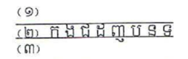

However, given that the space is limited when below subscript and below vowel stacked together. Two solutions have been done: (a) put the below subscript and below vowel sideways and (b) shrink the base consonant to accommodate the subscript allowing the below vowel to stay above its default position.

>>>>>  gd2md-html alert: inline image link here (to images/Khmer-Character1.png). Store image on your image server and adjust path/filename if necessary.  (<a href="#">Back to top</a>)(<a href="#gdcalert23">Next alert</a>) >>>>> 

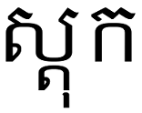
 (a) 

>>>>>  gd2md-html alert: inline image link here (to images/Khmer-Character2.png). Store image on your image server and adjust path/filename if necessary.  (<a href="#">Back to top</a>)(<a href="#gdcalert24">Next alert</a>) >>>>> 

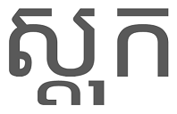
	(b) 

>>>>>  gd2md-html alert: inline image link here (to images/Khmer-Character3.png). Store image on your image server and adjust path/filename if necessary.  (<a href="#">Back to top</a>)(<a href="#gdcalert25">Next alert</a>) >>>>> 

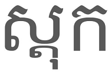

A consonant consists of two parts: the body and the head or usually called hair. For instance, ក is composed of an upside down U shape and a wavy line above it. The upside down U shape is the body and the wavy line is the hair. When ក stands on its own, the wavy line presides on the body fully; however, when a vowel[^14] that looks like ា is attached to it. The wavy line goes beyond the body and gets merged with the vowel as illustrated in (b). (a) is not recommended as it goes against the consonant and vowel composition convention.

(a)

>>>>>  gd2md-html alert: inline image link here (to images/Khmer-Character4.png). Store image on your image server and adjust path/filename if necessary.  (<a href="#">Back to top</a>)(<a href="#gdcalert26">Next alert</a>) >>>>> 

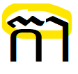
(b)

>>>>>  gd2md-html alert: inline image link here (to images/Khmer-Character5.png). Store image on your image server and adjust path/filename if necessary.  (<a href="#">Back to top</a>)(<a href="#gdcalert27">Next alert</a>) >>>>> 

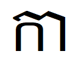

A proof of how Khmer characters should be presented when combining a consonant with a wavy line and a ា looking vowel exists in Khmer manuscript written on palm leaves (see image below). The word highlighted is ភាសា (ភ ា ស ា) and you may notice the difference in how the wavy line looks when the consonant stands alone and when it is attached to ា.

>>>>>  gd2md-html alert: inline image link here (to images/Khmer-Character6.jpg). Store image on your image server and adjust path/filename if necessary.  (<a href="#">Back to top</a>)(<a href="#gdcalert28">Next alert</a>) >>>>> 

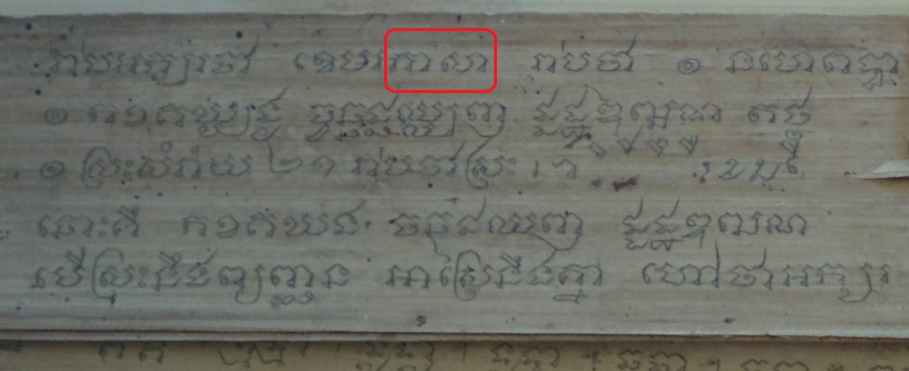

NOTE: When ប is combined with ា ោ or ៅ , the shape of the consonant change to បា បោ and បៅ respectively (see the image below).

>>>>>  gd2md-html alert: inline image link here (to images/Khmer-Character7.png). Store image on your image server and adjust path/filename if necessary.  (<a href="#">Back to top</a>)(<a href="#gdcalert29">Next alert</a>) >>>>> 

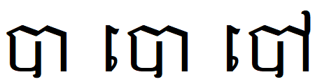

    17. ញ with a Subscript

ញ has a little curvy line at the bottom level. When a subscript is placed underneath it, that curvy line should disappear and be replaced by the expected subscript.

This is the character when it stands alone.

>>>>>  gd2md-html alert: inline image link here (to images/Khmer-Character8.png). Store image on your image server and adjust path/filename if necessary.  (<a href="#">Back to top</a>)(<a href="#gdcalert30">Next alert</a>) >>>>> 

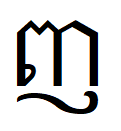

This is the character with ្ច attached to it.

>>>>>  gd2md-html alert: inline image link here (to images/Khmer-Character9.png). Store image on your image server and adjust path/filename if necessary.  (<a href="#">Back to top</a>)(<a href="#gdcalert31">Next alert</a>) >>>>> 

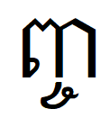

If the character (ញ) needs to be combined with its own subscript (្ញ), the combination should look like this:

>>>>>  gd2md-html alert: inline image link here (to images/Khmer-Character10.png). Store image on your image server and adjust path/filename if necessary.  (<a href="#">Back to top</a>)(<a href="#gdcalert32">Next alert</a>) >>>>> 

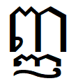

    18. 
ិ and ៍ Combination
When vowel ិ [U+17B7] is followed by diacritic ៍ [U+17CD], they get connected (ិ៍).

    19. 
ក, គ, ត, ភ, វ and ិ, ី, ឹ, ឺ
In some font, Khmer OS Muol for example, the combination of consonants ក (U+1780), គ (U+1782), ត (U+178F), ភ (U+1797) and វ (U+17) and above vowels (i.e.  ិ (), ី (), ឹ (), ឺ ()) becomes a glyph whose top line (i.e. the hair, the wavy line) got straighten and be in a shape similar to the vowels.

>>>>>  gd2md-html alert: inline image link here (to images/Khmer-Character11.png). Store image on your image server and adjust path/filename if necessary.  (<a href="#">Back to top</a>)(<a href="#gdcalert33">Next alert</a>) >>>>> 

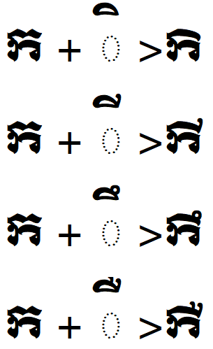

>>>>>  gd2md-html alert: inline image link here (to images/Khmer-Character12.png). Store image on your image server and adjust path/filename if necessary.  (<a href="#">Back to top</a>)(<a href="#gdcalert34">Next alert</a>) >>>>> 

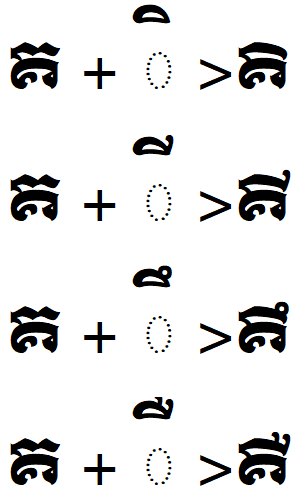

>>>>>  gd2md-html alert: inline image link here (to images/Khmer-Character13.png). Store image on your image server and adjust path/filename if necessary.  (<a href="#">Back to top</a>)(<a href="#gdcalert35">Next alert</a>) >>>>> 

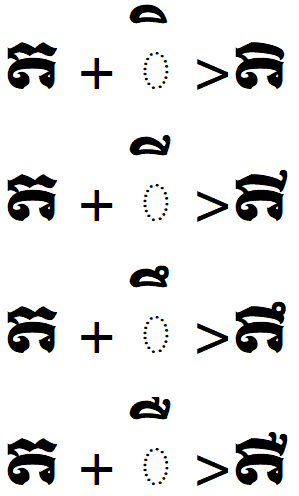

>>>>>  gd2md-html alert: inline image link here (to images/Khmer-Character14.png). Store image on your image server and adjust path/filename if necessary.  (<a href="#">Back to top</a>)(<a href="#gdcalert36">Next alert</a>) >>>>> 

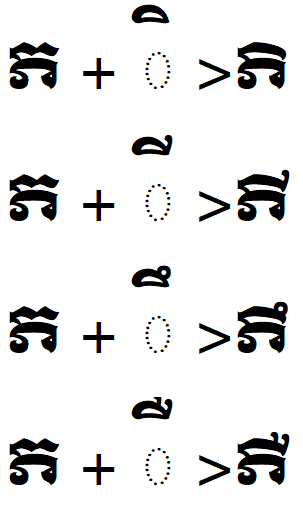

>>>>>  gd2md-html alert: inline image link here (to images/Khmer-Character15.png). Store image on your image server and adjust path/filename if necessary.  (<a href="#">Back to top</a>)(<a href="#gdcalert37">Next alert</a>) >>>>> 

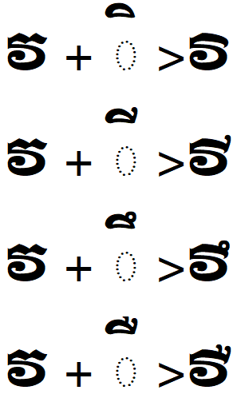

7. Unicode Encoding
    20. Overview

There are discrepancies in character sequences posited by Unicode Standard (2018:646), OpenType (2018) and the Open Forum (2004:7-14). Only the conflicting characters are in the table below.

<table>
  <tr>
   <td>
   </td>
   <td><strong>Unicode Standard</strong>
   </td>
   <td><strong>OpenType</strong>
   </td>
   <td><strong>Open Forum</strong>
   </td>
  </tr>
  <tr>
   <td>RegShift
   </td>
   <td>after the base consonant
   </td>
   <td>between a consonant and a subscript
   </td>
   <td>between a subscript and a vowel
   </td>
  </tr>
  <tr>
   <td>Robat
   </td>
   <td>before or after a subscript
   </td>
   <td>considered as an Above Sign which goes after an Above vowel
   </td>
   <td>in between the base consonant and a subscript
   </td>
  </tr>
  <tr>
   <td>Subscript
   </td>
   <td>at the end
   </td>
   <td>n/a
   </td>
   <td>n/a
   </td>
  </tr>
  <tr>
   <td>IndV
   </td>
   <td>can be the base
   </td>
   <td>can’t be the base
   </td>
   <td>can be the base
   </td>
  </tr>
  <tr>
   <td>Nikahit
   </td>
   <td>sign
   </td>
   <td>sign
   </td>
   <td>vowel/sign?
   </td>
  </tr>
  <tr>
   <td>Reahmuk
   </td>
   <td>sign
   </td>
   <td>sign
   </td>
   <td>vowel/sign?
   </td>
  </tr>
</table>

Unlike Unicode Standard and Open Forum, the OpenType breaks vowels into four subcategories: 

(1) Pre-base Vowels (PreV): េ​ [U+17C1], ែ [U+17C2], ​ៃ [U+17C3], 

(2) Below-base Vowel (BlwV):  ុ [U+17BB], ូ [U+17BC], ួ [U+17BD], ុំ [U+17BB U+17C6], 

(3) Above-base Vowel (AbvV):  ិ [U+17B7], ី [U+17B8], ឹ [U+17B9], ឺ [U+17BA], ើ [U+17BE], and

(4) Post-base Vowels (PstV):  ោ [U+17C4], ៅ [U+17C5], ៀ [U+17C0], ឿ [U+17BF], ា [U+17B6].

In Khmer language grammar textbook, Nikahit ( ំ U+17C6) and Reahmuk ( ះ U+17C7) are included in the vowel inventory, even though they are described elsewhere that they are diacritics or signs. The public usually consider these two as vowels. Plus when these two characters are used with other vowels, i.e. ុ (U+17BB) as in ុះ, េ (U+17C1) as in េះ and ោ (U+17C4) as in ោះ, Khmer linguists usually consider them as one vowel unit. Unicode Standard, however, considers these as a combination of vowel and diacritics (Nikahit and Reahmuk).

Below are the character sequences posited by Unicode Standard, OpenType and Open Forum:

**Unicode Standard (2018:639)**

**B {R | C} {S {R}}* {{Z} V} {O} {S}**

where

*   B is a base character (consonant character, independent vowel character, and so on) 
*   R is a Robat C is a consonant shifter 
*   S is a subscript consonant or independent vowel sign 
*   V is a dependent vowel sign 
*   Z is a zero width non-joiner or a zero width joiner 
*   O is any other sign

**OpenType (2018)**

**Cons + {COENG + (Cons | IndV)} + [PreV | BlwV] + [RegShift] + [AbvV] + {AbvS} + [PstV] + [PstS]**

where

*   Cons – 

>>>>>  gd2md-html alert: undefined internal link (link text: "Consonant "). Did you generate a TOC?  (<a href="#">Back to top</a>)(<a href="#gdcalert38">Next alert</a>) >>>>> 

[Consonant ](#heading=h.f69y44o16z2b)character 
*   IndV – 

>>>>>  gd2md-html alert: undefined internal link (link text: "Independent "). Did you generate a TOC?  (<a href="#">Back to top</a>)(<a href="#gdcalert39">Next alert</a>) >>>>> 

[Independent ](#heading=h.yoj90q2ioma)vowel character
*   COENG – The COENG code
*   PreV – Vowel that is positioned before the base glyph
*   BlwV – Vowel that is positioned below the base glyph
*   RegShift –

>>>>>  gd2md-html alert: undefined internal link (link text: " Triisap or Muusikatoan"). Did you generate a TOC?  (<a href="#">Back to top</a>)(<a href="#gdcalert40">Next alert</a>) >>>>> 

[ Triisap or Muusikatoan](#heading=h.nkrxdor2oauz) character
*   AbvV - Vowel that is positioned above the base glyph
*   AbvS – A sign character that is positioned above the base glyph
*   PstV – Vowel that is positioned after the base glyph
*   PstS – Sign character that is positioned after the base glyph
*   { } – Indicates 0 to 2 occurrences
*   [ ] – Indicates 0 or 1 occurrence
*   | – Exclusive OR
*   + – Cumulative AND

Note: ZWNJ and ZWJ are to be placed in between the RegShift and the AbvV to prevent the RegShift from changing its shape.

**Open Forum**

Open Forum of Cambodia wrote a document on “How to type Khmer Unicode” (2004). Khmer character ordering was devised as:

**Consonant + Coeng consonant(s) + Vowel + Sign(s) **

**Consonant + Coeng consonant(s) + Consonant-shifter + Vowel + Sign(s) **

**Consonant + Robat {+ Vowel} {+ Sign} **

**Consonant + Coeng consonant(s) + Consonant-shifter + Vowel + Above signs + After signs**

where

*   Consonant – [U+1780..U+17A2] or [U+17A5..U+17B3]
*   Coeng consonant – [U+17D2] + [U+1780..U+17A2] or [U+17A5..U+17B3]
*   Vowel – [U+17B6..U+17C7]
*   Sign – [U+17CB..U+17D1, U+17D3]
    *   Above sign – [U+17CB, U+17CD..U+17D1, U+17D3, U+17DD]
    *   After sign – [U+17C7, U+17C8]
*   Consonant shifter – U+17C9, U+17CA
*   Robat – U+17CC
    21. New Proposal

Character orderings posited below are an attempt made to eliminate the discrepancy in the three schemes mentioned above. Though the proposal here has been discussed and contributed from various sources and individual, there may still be room of improvement. Kanjahn (2012:2) posited a character ordering that allows Register Shifter in two places, one before the subscript (right after the base) and another after the subscript. He allows Post Signs (which he called Space Signs) (ៈ [U+17C8] and ះ [U+17C7]) after a subscript. 

Here is what we propose.

*   BaseCommon: Consonant [U+1780..U+17A2] or Independent Vowel [U+17A5..U+17B3] 
*   BaseOther: Dotted Circle [U+25CC] or non-break space [U+00A0]
*   Robat: the Robat [U+17CC]
*   Ahsda: the Ahsda [U+17CF]
*   AbvV: above-base vowel [U+17B7..U+17BA, U+17BE]
*   PreV: pre-base vowel [U+17C1..U+17C3]
*   BlwV: below-base vowel [U+17BB..U+17BD]
*   PstV: post-base vowel [U+17B6, U+17BF, U+17C0, U+17C4, U+17C5]
*   Coeng: the Coeng [U+17D2]
*   RegShift: Register Shifter, Muusikatoan [U+17CA] or Triisap [U+17C9] 
*   AbvS: [U+17C6, U+17CB, U+17CD, U+17CE, U+17D0, U+17D1, U+17D3, U+17DD]
*   Z: zero width non-joiner [U+200C] or zero width joiner [U+200D]

Partial clusters defined:

    **Base: BaseCommon | BaseOther**

    **VowelGroup: (Z + AbvV) | PreV | BlwV | PstV**

    **CoengGroup: Coeng + Base**

Robat/Ahsda cluster defined:

    **Base [Robat | Ahsda] [PreV | BlwV | PstV] [PstS]**

General cluster defined:

    **Base {CoengGroup} [RegShift] [VowelGroup] [AbvS] [PstS | CoengGroup]**

Independent Cluster: All Khmer characters not classified above are considered clusters by themselves.

Restrictions: Here are some restrictions in the present day Khmer which have been observed. It:

*   doesn’t allow digits as bases,
*   doesn’t allow Coeng, consonant shifters, or above-base vowels or signs in robat syllables (but Jarai does, i.e. ំ័ [U+17C6 U+17D0], a combination of two above-base signs),
*   allows Coeng Ro only as the last Coeng when there are two subscripts in a row and one of which is a Coeng Ro,
*   allows at most two subscripts in a syllable, and
*   allows at most one vowel, and at most one above-base and one post-base sign.	
    22. Character Distribution in an Orthographic Syllable

Reahmuk (ះ), Nikahit (ំ), Yuukaleapintu (ៈ), Toandakhiat (៍), Ahsda (៏) and Bantoc (់) always occurs at the syllable final position. They can be considered as orthographic syllable boundary.  

Not any character can be weaved together with another one. An independent vowel can not be placed after another independent vowel in the same syllable. Coeng (្ U+17D2), RegShift, Robat, Vowel, Samyok Sannya or Kakabat can never be followed by itself. 

The table below illustrates which character can be placed after another in the same orthographic syllable. “v” denotes that characters in the top row (1) can follow those in the left most column (2), “x” 1 can't follow 2, and “v'” 1 can follow 2 in theory in the same syllable.

<table>
  <tr>
   <td><strong>​             ​        1</strong>

<strong>2</strong>
   </td>
   <td><strong>Cons</strong>
   </td>
   <td><strong>IndV</strong>
   </td>
   <td><strong>Coeng</strong>
   </td>
   <td><strong>RegShift</strong>
   </td>
   <td><strong>Robat</strong>
   </td>
   <td><strong>V</strong>
   </td>
   <td><strong>Samyok</strong>

<strong>Sannya</strong>
   </td>
   <td><strong>Kakabat</strong>
   </td>
  </tr>
  <tr>
   <td><strong>Cons</strong>
   </td>
   <td>x
   </td>
   <td>x
   </td>
   <td>v
   </td>
   <td>x
   </td>
   <td>x
   </td>
   <td>x
   </td>
   <td>x
   </td>
   <td>x
   </td>
  </tr>
  <tr>
   <td><strong>IndV</strong>
   </td>
   <td>x
   </td>
   <td>x
   </td>
   <td>v'
   </td>
   <td>x
   </td>
   <td>x
   </td>
   <td>x
   </td>
   <td>x
   </td>
   <td>x
   </td>
  </tr>
  <tr>
   <td><strong>Coeng</strong>
   </td>
   <td>v
   </td>
   <td>v'
   </td>
   <td>x
   </td>
   <td>x
   </td>
   <td>x
   </td>
   <td>v[^15]
   </td>
   <td>x
   </td>
   <td>x
   </td>
  </tr>
  <tr>
   <td><strong>RegShift</strong>
   </td>
   <td>v
   </td>
   <td>x
   </td>
   <td>x
   </td>
   <td>x
   </td>
   <td>x
   </td>
   <td>x
   </td>
   <td>x
   </td>
   <td>x
   </td>
  </tr>
  <tr>
   <td><strong>Robat</strong>
   </td>
   <td>v
   </td>
   <td>x
   </td>
   <td>x
   </td>
   <td>x
   </td>
   <td>x
   </td>
   <td>x
   </td>
   <td>x
   </td>
   <td>x
   </td>
  </tr>
  <tr>
   <td><strong>V</strong>
   </td>
   <td>v
   </td>
   <td>x
   </td>
   <td>x
   </td>
   <td>v
   </td>
   <td>v
   </td>
   <td>x
   </td>
   <td>x
   </td>
   <td>x
   </td>
  </tr>
  <tr>
   <td><strong>Samyok Sannya</strong>
   </td>
   <td>v
   </td>
   <td>x
   </td>
   <td>x
   </td>
   <td>v
   </td>
   <td>x
   </td>
   <td>x
   </td>
   <td>x
   </td>
   <td>x
   </td>
  </tr>
  <tr>
   <td><strong>Kakabat</strong>
   </td>
   <td>v
   </td>
   <td>x
   </td>
   <td>x
   </td>
   <td>v'
   </td>
   <td>x
   </td>
   <td>v
   </td>
   <td>v'
   </td>
   <td>x
   </td>
  </tr>
  <tr>
   <td><strong>Reahmuk</strong>
   </td>
   <td>v
   </td>
   <td>x
   </td>
   <td>x
   </td>
   <td>v
   </td>
   <td>x
   </td>
   <td>v
   </td>
   <td>x
   </td>
   <td>v
   </td>
  </tr>
  <tr>
   <td><strong>Nikahit</strong>
   </td>
   <td>v
   </td>
   <td>x
   </td>
   <td>x
   </td>
   <td>v
   </td>
   <td>x
   </td>
   <td>v
   </td>
   <td>x
   </td>
   <td>v
   </td>
  </tr>
  <tr>
   <td><strong>Yuukaleapintu</strong>
   </td>
   <td>v
   </td>
   <td>x
   </td>
   <td>x
   </td>
   <td>v'
   </td>
   <td>v
   </td>
   <td>v
   </td>
   <td>x
   </td>
   <td>v
   </td>
  </tr>
  <tr>
   <td><strong>Toandakhiat</strong>
   </td>
   <td>v
   </td>
   <td>x
   </td>
   <td>x
   </td>
   <td>x
   </td>
   <td>x
   </td>
   <td>v
   </td>
   <td>x
   </td>
   <td>x
   </td>
  </tr>
  <tr>
   <td><strong>Ahsda</strong>
   </td>
   <td>v
   </td>
   <td>x
   </td>
   <td>x
   </td>
   <td>x
   </td>
   <td>x
   </td>
   <td>v
   </td>
   <td>x
   </td>
   <td>x
   </td>
  </tr>
  <tr>
   <td><strong>Bantoc</strong>
   </td>
   <td>v
   </td>
   <td>x
   </td>
   <td>x
   </td>
   <td>x
   </td>
   <td>x
   </td>
   <td>x
   </td>
   <td>x
   </td>
   <td>x
   </td>
  </tr>
</table>

    23. Rendering Issues

According to Horton et al. (2017), there are at least eight cases of rendering issues in Khmer Unicode implementation. These eight issues lead to other problem for the end users and developers.

*   **Confusability**: users are not able to make a sound judgement on which is the right way to type a word. Oftentimes, different sequences of the same characters are shown up exactly the same on the screen.
*   **Vulnerability**: users can be spoofed and taken advantage of. 
*   **Searchability**: users are not able to find what they are looking for because they use different character sequences in the query.
*   **Compatibility**: when a user uses android to send/share text documents with a windows or mac user, the text may look different because of the different implementation in the rendering engines.

The following sections list the issues one by one. The examples are adopted from the paper (Horton et al. 2017). The rendered text were done in Google Chrome 58.0 and Android 6.0.1.

        21. Subscript and Vowel Concatenation

This is a case of when a “subscript” and a “vowel” are combined. Typing either one before another does not make any difference in the visual output on the screen, but it is invalid to place a Vowel before a Subscript. 

*   Subscript + Vowel	ខ ្ម ែ រ 	> ខ្មែរ 	‘Khmer’
*    Vowel + Subscript	ខ ែ ្ម រ 	> ខែ្មរ	**invalid sequence**
        22. Concatenation of Two Subscripts

This is a case of when having two subscripts after a base consonant, and one of the subscript is [U+17D2 U+179A] ្ត. Placing either subscript before another would have the same visual output. 

*   Subscript + [U+17D2 U+179A]		ស ្ត ្រ ី 	> ស្ត្រី	‘woman’
*   [U+17D2 U+179A] + Subscript		ស ្រ ្ត ី	> ស្រ្តី 	**invalid sequence**
        23. Concatenation of a Subscript and a Consonant Shifter

This is a case of combining a subscript with a consonant shifter. The Khmer spelling convention (Kol 2008:28-32) does not mention which one should come first, but Open Forum of Cambodia (2004:11) claims that the consonant shifter should always come after the subscript. 

*   Subscript + Consonant Shifter		ម ្យ ៉ ា ង 	> ម្យ៉ាង 	‘one way’ 
*   Consonant shifter + Subscript		ម ៉ ្យ ា ង	> ម៉្យាង	**invalid sequence**
        24. Concatenation of A Consonant Shifter and a Vowel

This is a special case of Khmer text rendering. The consonant shifter, either ៊ [U+17CA] or ៉ [U+17C9], has to be rendered as a glyph that looks like ុ , when there is an above vowel attached to it (See 

>>>>>  gd2md-html alert: undefined internal link (link text: "Special Treatment on Consonant Shifters"). Did you generate a TOC?  (<a href="#">Back to top</a>)(<a href="#gdcalert41">Next alert</a>) >>>>> 

[Special Treatment on Consonant Shifters](#heading=h.p5qypot06j09)).

*   Consonant Shifter (​៊) + Above vowel	ស ៊ ី		> ស៊ី	‘to eat (vulgar)’ 
*   Above vowel + Below vowel		ស ី ុ 		> សុី 	**invalid sequence**
*   Below vowel + Above vowel		ស ុ ី 		> សុី 	**invalid sequence**
*   Consonant Shifter (​៉) + Above vowel	ស ៉ ី		> ស៉ី	**incorrect sequence**

The last example is considered as incorrect rather than invalid because the character sequence is valid, but according to the usage of Muusikatoan (​៉) it cannot be used with the 1st series consonants.

        25. Vowels of Two Unicode Code Points

This is one of the most common confusing character sequences. Which should come first is not a concern among users though because, like other issue, the output on the screen does not look any different.

*   [U+17BB] [U+17C6]		ក ុ ំ		> កុំ	‘don’t’ 
*   [U+17C6] [U+17BB]		ក ំ ុ		> កំុ	**invalid sequence**
*   [U+17B6] [U+17C6]		ច ា ំ		> ចាំ 	‘to wait’
*   [U+17C6] [U+17B6]		ច ំ ា		> ចំា	**invalid sequence**
        26. One Unicode Code Point

ោ [U+17C4] can be confused with a combination of េ [U+17C1] and ា [U+17B6] because the outputs of the three encoding on the screen look the same.

*   [U+17C4]			ល ោ ក	> លោក	‘Mr.’ 
*   [U+17C1] [U+17B6]		ល េ ា ក	> លេាក 		**invalid sequence**
*   [U+17B6] [U+17C1]		ល ា េ ក	> លាេក	**invalid sequence**

Similarly, ើ [U+17BE] can be confused with a combination of េ [U+17C1] and ី [U+17B8].

*   [U+17BE] 			ប ើ		> បើ	‘if’	
*   [U+17C1] [U+17B8]		ប េ ី		> បេី	**invalid sequence**
*   [U+17B8] [U+17C1]		ប ី េ		 > បីេ	**invalid sequence**
        27. Similar Subscripts

This is the case of identical subscript. The users do not see any different in the outlook of these two.

*   [U+17D2] [U+178A]		ក ណ ្ដ ា ល	> កណ្ដាល 	‘Kandal province’
*   [U+17D2] [U+178F]		ក ណ ្ដ ា ល	> កណ្តាល	**incorrect sequence**
        28. Spaces and Joiners
*   Zero Width Space is an invisible space (i.e. no width) which is usually put in between words in a sentence. It is helpful for text processing tools because it tells where the word boundaries are (Open Forum of Cambodia 2004:16-17).
*   Zero Width non-Joiner can be inserted before consonant shifters in order to prevent them from being rendered as subscript (​ុ), and it can also be inserted directly before vowels in order to prevent the formation of ligatures between the base character and the vowel. (Kanjahn 2012:3).
*   Zero Width Joiner can also be used before vowels to force a ligature between above vowels (see the section on **

>>>>>  gd2md-html alert: undefined internal link (link text: "Special Treatment of Consonant Shifters"). Did you generate a TOC?  (<a href="#">Back to top</a>)(<a href="#gdcalert42">Next alert</a>) >>>>> 

[Special Treatment of Consonant Shifters](#heading=h.jowrd5ecyj4r)**) and certain consonants.
8. Text Processing
    24. Keyboard

Below is the standard key arrangement approved by the National ICT Development Authority (NiDA). There keyboard layout is divided into three layers: (1) the main layer, (2) the Shift layer and (3) the AltGr layer. A normal press on any key could output the character on the main layer. To output the character on Shift layer or AltGr layer, press and hold the Shift or AltGr key and then press any key of the expected character. Here is a list of character on each layer:

(1) the main layer

*   first row: « ១ ២ ៣ ៤ ៥ ៦ ៧ ៨ ៩ ០ ឥ ឲ ឮ
*   second row: ឆ ឹ េ រ ត យ ុ ិ ោ ផ ៀ ឪ 
*   third row: ា ស ដ ថ ង ហ   ្ ក ល ើ ់
*   fourth row: ឋ ខ ច វ ប ន ម ុំ ។ ៊

(2) the Shift layer

*   first row: » ! ៗ “ ៛ % ៍ ័ ៏ ( ) ៌ = ឭ
*   second row: ឈ ឺ ែ ឬ ទ ួ ូ ី ៅ ភ ឿ ឧ
*   third row: ាំ ៃ ឌ ធ អ ះ ញ គ ឡ ោះ ៉
*   fourth row: ឍ ឃ ជ េះ ព ណ ំ ុះ ៕ ?

(3) the AltGr layer

*   first row: ‍‌zwj zwnj @​ ៑ $ € ៙ ៚ * { } × ៎ \
*   second row: ឯ ឫ ឦ ឱ ឰ ឩ ឳ
*   third row: ៖ ៈ
*   fourth row: , . /

Here is how the layout looks:

>>>>>  gd2md-html alert: inline image link here (to images/Khmer-Character16.png). Store image on your image server and adjust path/filename if necessary.  (<a href="#">Back to top</a>)(<a href="#gdcalert43">Next alert</a>) >>>>> 

For smartphone, there is no standard keyboard layout in place when it comes to the number of rows on each layer and the number of characters on each row. However, most keyboards use 4x10 on each layer, meaning 4 rows and 10 characters on each row.

    25. Sorting

The Royal Academy of Cambodia was approached and asked for advice regarding the sorting in Khmer. It turns out that there is no documentation related to this topic that could help. The Choun Nath dictionary seems to deploy two ways of sorting: (1) alphabetical order of characters and (2) alphabetical order of sounds. You may find words written with similar initial consonant sounds listed next to another. For instance, words begin with independent vowel ឫ are listed after the consonant រ which sounds similar to the independent vowel. A paper done by PAN localization[^16](nd) entitled “Khmer Collation Development” suggests a solution that the sorting used in the Chuon Nath dictionary has to be adapted. Chuon Nath dictionary sorts entries based on they are pronounced, not the spelling. For instance, បង់ [U+1794 U+1784 U+17CB] is listed before បកតិ [U+1794 U+1780 U+178F U+17B7] even though the second character of the second word (i.e. ក [U+1780]) appears before that of the first word (i.e. ង [U+1784]) in the alphabet chart.

    26. Fonts 

Khmer typefaces have changed significantly since the 6th century. The following image shows how Khmer consonants evolved over time as quoted by Scheuren (2010:8) from Maspero (1915:48).

>>>>>  gd2md-html alert: inline image link here (to images/Khmer-Character17.png). Store image on your image server and adjust path/filename if necessary.  (<a href="#">Back to top</a>)(<a href="#gdcalert44">Next alert</a>) >>>>> 

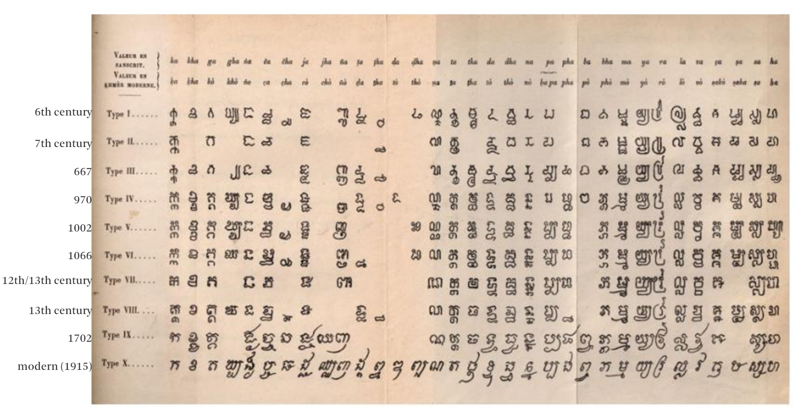

        29. Font Style

According to Scheuren (ibid:9-10) there are three main types of Khmer font styles: (a) មូល Mool ‘lit. round’, (b) ជ្រៀង Chrieng ‘lit. slanted’ and (c) Upright which is the standing version of Chrieng. Mool style was commonly found in inscriptions, while Chrieng was used in palm-leaf manuscript (a.k.a. Sastra) which existed before the printing types introduced in 1877. 

To date, the Mool style is usually used in banners and titles of books or articles; while the Upright, the standing Chrieng, is of everyday uses. The table below shows how the three styles look.

<table>
  <tr>
   <td>Mool Style in Khmer OS Moul font face
   </td>
   <td>

>>>>>  gd2md-html alert: inline image link here (to images/Khmer-Character18.png). Store image on your image server and adjust path/filename if necessary.  (<a href="#">Back to top</a>)(<a href="#gdcalert45">Next alert</a>) >>>>> 

   </td>
  </tr>
  <tr>
   <td>Chrieng Style in Khmer OS Metalchrieng font face
   </td>
   <td>

>>>>>  gd2md-html alert: inline image link here (to images/Khmer-Character19.png). Store image on your image server and adjust path/filename if necessary.  (<a href="#">Back to top</a>)(<a href="#gdcalert46">Next alert</a>) >>>>> 

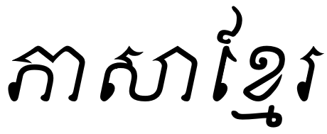

   </td>
  </tr>
  <tr>
   <td>Upright style in Khmer OS system font face
   </td>
   <td>

>>>>>  gd2md-html alert: inline image link here (to images/Khmer-Character20.png). Store image on your image server and adjust path/filename if necessary.  (<a href="#">Back to top</a>)(<a href="#gdcalert47">Next alert</a>) >>>>> 

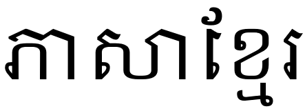

   </td>
  </tr>
</table>

        30. Font Rendering 

Khmer font rendering is complex because characters are not rendered in a linear order. Vowels are not always found after the base consonant. They can go to the left, right, above, below or even around the base. Similarly, subscripts can be rendered to the left, right or below the base. These make it confusing to the users as to what should be typed when and placed where.

Lists of vowel according to their positions when collating with the base are shown in the table below. 

<table>
  <tr>
   <td><strong>left</strong>
   </td>
   <td><strong>above</strong>
   </td>
   <td><strong>below</strong>
   </td>
   <td><strong>right</strong>
   </td>
   <td><strong>around</strong>
   </td>
  </tr>
  <tr>
   <td>េ (U+17C1)

ែ (U+17C2)

ៃ (U+17C3)
   </td>
   <td>ិ (U+17B7)

ី (U+17B8)

ឹ (U+17B9)

ឺ (U+17BA)

ំ (U+17C6)
   </td>
   <td>ុ (U+17BB)

ូ (U+17BC)

ួ (U+17BD)
   </td>
   <td>ា (U+17B6)

ះ (U+17C7)

ៈ (U+17C8)

ាំ (U+17B6 U+17C6)
   </td>
   <td>ើ (U+17BE)

ឿ (U+17BF)

ៀ (U+17C0)

ោ (U+17C4)

ៅ (U+17C5)

ុំ (U+17BB U+17C6)

ុះ (U+17BB U+17C7)

េះ (U+17C1 U+17C7)

ោះ (U+17C4 U+17C7)
   </td>
  </tr>
</table>

Here is a list of subscripts and where they should be rendered in their respective categories.

<table>
  <tr>
   <td><strong>left</strong>
   </td>
   <td colspan="3" ><strong>below</strong>
   </td>
   <td><strong>right</strong>
   </td>
  </tr>
  <tr>
   <td>្រ
   </td>
   <td>្ក

្ខ

្គ

្ង

្ច

្ឆ

្ជ

្ញ
   </td>
   <td>្ដ

្ឋ

្ឌ

្ណ

្ត

្ថ

្ទ

្ធ
   </td>
   <td>្ន

្ផ

្ព

្ភ

្ម

្ល

្វ

្ហ

្អ
   </td>
   <td>្ឃ

្ឈ

្ឍ

្ប

្យ

្ស
   </td>
  </tr>
</table>

    27. Diacritic Position

All diacritics are placed on top of the base: ៉ ៊ ់ ៌ ៍ ័ ៏ ៎ ៝. Only one diacritic is usually found on a consonant in a syllable, except ‘a Consonant Shifter + Samyok Sannya’. There is also a common occurence of a consonant shifter with Nikahit “Consonant Shifter + Nikahit,” but be aware that Nikahit functions as a vowel in that environment, despites its name.

9. Application of Khmer Script to Other Languages

Khmer alphabet is not only used to write Khmer language, but it  is also used to write at least six ethnic minority languages (i.e. Bunong, Tampuan, Brao, Krung, Jarai and Kuay) and two dead languages (i.e. Pali and Sanskrit). Each language requires unique syllable configuration and character sequences. This section describes the two main points in each language:

*   a list of consonants, subscripts, vowels, diacritics, symbols and punctuations if applicable
*   how the writing system is different from Khmer

See 

>>>>>  gd2md-html alert: undefined internal link (link text: "Appendix 5"). Did you generate a TOC?  (<a href="#">Back to top</a>)(<a href="#gdcalert48">Next alert</a>) >>>>> 

[Appendix 5](#heading=h.z08bndir6nke) for a side by side comparison of the characters existing in Khmer and each ethnic language.

The following sections has a list of characters used in each ethnic minority language if the form of table where the orthographic characters are in the first row, phonemic representations corresponding with the orthographic characters in the second row and the unicode code points in the third row.

    28. Bunong

According to the Bunong-Khmer Bilingual Dictionary​ (2011:ទ-ន), 53 Khmer characters are used in writing Bunong. 

        31. Bunong Consonants

There are 28 orthographic consonants in Bunong. យ្ស /ç/ and ស /h/ always occurs at the final position. 

<table>
  <tr>
   <td>ក
   </td>
   <td>ខ
   </td>
   <td>គ
   </td>
   <td>ង
   </td>
   <td>ច
   </td>
   <td>ឆ
   </td>
   <td>ជ
   </td>
   <td>ញ
   </td>
   <td>ដ
   </td>
   <td>ត
   </td>
  </tr>
  <tr>
   <td>/k/
   </td>
   <td>/kʰ/
   </td>
   <td>/g/
   </td>
   <td>/ŋ/
   </td>
   <td>/c/
   </td>
   <td>/cʰ/
   </td>
   <td>/ɟ/
   </td>
   <td>/ɲ/
   </td>
   <td>/ɗ/
   </td>
   <td>/t/
   </td>
  </tr>
  <tr>
   <td>U+1780
   </td>
   <td>U+1781
   </td>
   <td>U+1782
   </td>
   <td>U+1784
   </td>
   <td>U+1785
   </td>
   <td>U+1786
   </td>
   <td>U+1787
   </td>
   <td>U+1789
   </td>
   <td>U+178A
   </td>
   <td>U+178F
   </td>
  </tr>
</table>

<table>
  <tr>
   <td>ថ
   </td>
   <td>ទ
   </td>
   <td>ន
   </td>
   <td>ប
   </td>
   <td>ផ
   </td>
   <td>ព
   </td>
   <td>ម
   </td>
   <td>យ
   </td>
   <td>យ្ស
   </td>
   <td>រ
   </td>
  </tr>
  <tr>
   <td>/tʰ/
   </td>
   <td>/d/
   </td>
   <td>/n/
   </td>
   <td>/ɓ/
   </td>
   <td>/pʰ/
   </td>
   <td>/p/
   </td>
   <td>/m/
   </td>
   <td>/j/
   </td>
   <td>/ç/
   </td>
   <td>/r/
   </td>
  </tr>
  <tr>
   <td>U+1790
   </td>
   <td>U+1791
   </td>
   <td>U+1793
   </td>
   <td>U+1794
   </td>
   <td>U+1795
   </td>
   <td>U+1796
   </td>
   <td>U+1798
   </td>
   <td>U+1799
   </td>
   <td>U+1799

U+17D2

U+179F
   </td>
   <td>U+179A
   </td>
  </tr>
</table>

<table>
  <tr>
   <td>ល
   </td>
   <td>វ
   </td>
   <td>ឞ
   </td>
   <td>ស
   </td>
   <td>ហ
   </td>
   <td>អ
   </td>
   <td>អ្យ
   </td>
   <td>អ្វ
   </td>
  </tr>
  <tr>
   <td>/l/
   </td>
   <td>/w/
   </td>
   <td>/b/
   </td>
   <td>/h/
   </td>
   <td>/h/
   </td>
   <td>/ʔ/
   </td>
   <td>/ʔj/
   </td>
   <td>/ʔw/
   </td>
  </tr>
  <tr>
   <td>U+179B
   </td>
   <td>U+179C
   </td>
   <td>U+179E
   </td>
   <td>U+179F
   </td>
   <td>U+17A0
   </td>
   <td>U+17A2
   </td>
   <td>U+17A2

U+17D2

U+179A
   </td>
   <td>U+17A2

U+17D2

U+179C
   </td>
  </tr>
</table>

        32. Bunong Subscripts

្អ [U+17D2 U+17A2] is not listed in the table because it is used not in the Bunong Khmer Dictionary, however, it is used by some speakers.

<table>
  <tr>
   <td>្យ
   </td>
   <td>្រ
   </td>
   <td>្ល
   </td>
   <td>្វ
   </td>
   <td>្ហ
   </td>
  </tr>
  <tr>
   <td>/j/
   </td>
   <td>/r/
   </td>
   <td>/l/
   </td>
   <td>/w/
   </td>
   <td>/h/
   </td>
  </tr>
  <tr>
   <td>U+17D2

U+1799
   </td>
   <td>U+17D2

U+179A
   </td>
   <td>U+17D2

U+179B
   </td>
   <td>U+17D2

U+179C
   </td>
   <td>U+17D2

U+17A0
   </td>
  </tr>
</table>

        33. Bunong Vowels

<table>
  <tr>
   <td>
ា
   </td>
   <td>ិ
   </td>
   <td>ី
   </td>
   <td>ឹ
   </td>
   <td>ឺ
   </td>
   <td>ុ
   </td>
   <td>ូ
   </td>
   <td>ើ
   </td>
   <td>ៀ
   </td>
   <td>េ
   </td>
  </tr>
  <tr>
   <td>/a/
   </td>
   <td>[ĭ]
   </td>
   <td>/i/
   </td>
   <td>[ɵ̆]
   </td>
   <td>/ɨ/
   </td>
   <td>/ŭ/
   </td>
   <td>/u/
   </td>
   <td>/ɵ/
   </td>
   <td>/iᵊ/
   </td>
   <td>/e/
   </td>
  </tr>
  <tr>
   <td>U+17B6
   </td>
   <td>U+17B7
   </td>
   <td>U+17B8
   </td>
   <td>U+17B9
   </td>
   <td>U+17BA
   </td>
   <td>U+17BB
   </td>
   <td>U+17BC
   </td>
   <td>U+17BE
   </td>
   <td>U+17C0
   </td>
   <td>U+17C1
   </td>
  </tr>
</table>

<table>
  <tr>
   <td>ែ
   </td>
   <td>ៃ
   </td>
   <td>ោ
   </td>
   <td>ៅ
   </td>
   <td>៝
   </td>
  </tr>
  <tr>
   <td>/ɛ/
   </td>
   <td>/ăj/
   </td>
   <td>/o/
   </td>
   <td>/ăw/
   </td>
   <td>/ɔ/
   </td>
  </tr>
  <tr>
   <td>U+17C2
   </td>
   <td>U+17C3
   </td>
   <td>U+17C4
   </td>
   <td>U+17C5
   </td>
   <td>U+17DD
   </td>
  </tr>
</table>

ៀ /iᵊ/ [U+17C0] is used in certain words borrowed from Khmer.

ៃ /ăj/ [17C3] and ៅ /ăw/ [U+17C5] are phonological compounds of a vowel and a consonant.

Bunong does not have an inherent vowel.

        34. Bunong Additional Vowels

<table>
  <tr>
   <td>
ាៈ or ា​់
   </td>
   <td>ឺៈ
   </td>
   <td>េៈ
   </td>
   <td>ែៈ
   </td>
   <td>ោៈ
   </td>
   <td>៝ៈ or ៝​់
   </td>
   <td>ឿ
   </td>
  </tr>
  <tr>
   <td>/ă/
   </td>
   <td>/ə̆/
   </td>
   <td>[ĕ]
   </td>
   <td>/ɛ̆/
   </td>
   <td>[ŏ]
   </td>
   <td>/ɔ̆/
   </td>
   <td>/ɨᵊ/
   </td>
  </tr>
  <tr>
   <td>U+17B6

U+17C8

or

U+17B6

U+17CB
   </td>
   <td>U+17BA

U+17C8
   </td>
   <td>U+17C1

U+17C8
   </td>
   <td>U+17C2

U+17C8
   </td>
   <td>U+17C4

U+17C8
   </td>
   <td>U+17DD

U+17C8

or

U+17DD

U+17CB
   </td>
   <td>U+17BF
   </td>
  </tr>
</table>

ឿ /ɨᵊ/ [U+17BF] is used in certain words borrowed from Khmer.

        35. Bunong Symbols and Punctuation

In Bunong writing, four symbols are used in the same way as those of Khmer language(i.e. ៗ ។ ៕ and ៖) and other which are borrowed.

        36. How is the writing system different from Khmer?
*   The use of two Khmer obsolete characters: 
    *   ឞ /b/ [U+179E] as in ឞារ (ឞ ា រ) /ɓar/ ‘two’
    *    ៝ /ɔ/ [U+17DD] as in ក៝ន (ក ៝ ន) /kɔn/ ‘child by birth; son’
*   ់ [U+17CB] can be placed on consonant រ [U+179A] as in ព៝រ់ (ព ៝ រ ់) /pɔ̆r/ ‘to burn’.
*   ៈ [U+17C8] cannot occur with a consonant on its own, it has to be preceded by a vowel as shown in “Additional Vowels” list above. This is the opposite of the Khmer spelling convention where ៈ [U+17C8] is usually used to attach to the consonant without any vowel intervening it.
*   ៝ [U+17DD] behaves like a vowel, and it can be followed by a final consonant with or without ់ as in គ៝ង (គ ៝ ង) /gɔŋ/ ‘k.o. gong’ and គ៝ង់ (គ ៝ ង ់) /gɔ̆ŋ/ ‘to roast’. 
*   Sequences uniquely used in Bungong (i.e. ប្ហ្យៅ, ប្ហ្វៃ, អ្យ្រ៝ស).
*   The writing system does not follow the Khmer two series system where one vowel symbol can represent two sounds, depending on which consonant series precedes it. In Bunong, each vowel symbol represents only one sound in every instance.
    29. Tampuan

The number of consonants and vowels in the Tampuan Alphabet book (Pech 2006) and the Tampuan-Khmer Dictionary (Muang 2012) varies. The first lists 30 consonants and 27 vowels. The latter lists 29 consonants and 28 vowels. The following details are adapted from the Tampuan Alphabet book (ibid), the Tampuan-Khmer dictionary (ibid) and other documents obtained from SIL members.

        37. Tampuan Consonants

<table>
  <tr>
   <td>
ក
   </td>
   <td>ខ
   </td>
   <td>គ
   </td>
   <td>ឃ
   </td>
   <td>ង
   </td>
   <td>ច
   </td>
   <td>ជ
   </td>
   <td>ញ
   </td>
   <td>ដ
   </td>
   <td>ឌ
   </td>
  </tr>
  <tr>
   <td>/k/
   </td>
   <td>/kh/
   </td>
   <td>/k/
   </td>
   <td>/kh/
   </td>
   <td>/ŋ/
   </td>
   <td>/c/
   </td>
   <td>/c/
   </td>
   <td>/ɲ/
   </td>
   <td>/ʔd/
   </td>
   <td>/ʔd/
   </td>
  </tr>
  <tr>
   <td>U+1780
   </td>
   <td>U+1781
   </td>
   <td>U+1782
   </td>
   <td>U+1783
   </td>
   <td>U+1784
   </td>
   <td>U+1785
   </td>
   <td>U+1787
   </td>
   <td>U+1789
   </td>
   <td>U+178A
   </td>
   <td>U+178C
   </td>
  </tr>
</table>

<table>
  <tr>
   <td>ណ
   </td>
   <td>ត
   </td>
   <td>ថ
   </td>
   <td>ទ
   </td>
   <td>ធ
   </td>
   <td>ន
   </td>
   <td>ប
   </td>
   <td>ផ
   </td>
   <td>ព
   </td>
   <td>ភ
   </td>
  </tr>
  <tr>
   <td>/n/
   </td>
   <td>/t/
   </td>
   <td>/th/
   </td>
   <td>/t/
   </td>
   <td>/th/
   </td>
   <td>/n/
   </td>
   <td>/ʔb/
   </td>
   <td>/ph/
   </td>
   <td>/p/
   </td>
   <td>/ph/
   </td>
  </tr>
  <tr>
   <td>U+178E
   </td>
   <td>U+178F
   </td>
   <td>U+1790
   </td>
   <td>U+1791
   </td>
   <td>U+1792
   </td>
   <td>U+1793
   </td>
   <td>U+1794
   </td>
   <td>U+1795
   </td>
   <td>U+1796
   </td>
   <td>U+1797
   </td>
  </tr>
</table>

<table>
  <tr>
   <td>ម
   </td>
   <td>យ
   </td>
   <td>រ
   </td>
   <td>ល
   </td>
   <td>វ
   </td>
   <td>ស
   </td>
   <td>ហ
   </td>
   <td>ឡ
   </td>
   <td>អ
   </td>
   <td>អ្យ
   </td>
  </tr>
  <tr>
   <td>/m/
   </td>
   <td>/j/
   </td>
   <td>/r/
   </td>
   <td>/l/
   </td>
   <td>/w/
   </td>
   <td>/ç/
   </td>
   <td>/h/
   </td>
   <td>/l/
   </td>
   <td>/ʔ/
   </td>
   <td>/ʔj/
   </td>
  </tr>
  <tr>
   <td>U+1798
   </td>
   <td>U+1799
   </td>
   <td>U+179A
   </td>
   <td>U+179B
   </td>
   <td>U+179C
   </td>
   <td>U+179F
   </td>
   <td>U+17A0
   </td>
   <td>U+17A1
   </td>
   <td>U+17A2
   </td>
   <td>U+17A2

U+17D2

U+1799
   </td>
  </tr>
</table>

<table>
  <tr>
   <td>ច្យ
   </td>
   <td>ហ្ញ
   </td>
  </tr>
  <tr>
   <td>/cj/
   </td>
   <td>/hɲ/
   </td>
  </tr>
  <tr>
   <td>U+1785

U+17D2

U+1799
   </td>
   <td>U+17A0

U+17D2

U+1789
   </td>
  </tr>
</table>

“Tampuan Khmer English Dictionary with English Khmer Tampuan Glossary” (2007)​ uses /ñ/ instead of /ɲ/ for ញ [U+1789] and /d/ instead of /ʔd/ for ដ [U+178A] and ឌ [U+178C].

        38. Tampuan Subscripts

<table>
  <tr>
   <td>
្គ
   </td>
   <td>្ង
   </td>
   <td>្ញ
   </td>
   <td>្ន
   </td>
   <td>្ម
   </td>
   <td>្យ
   </td>
   <td>្រ
   </td>
   <td>្ល
   </td>
   <td>្វ
   </td>
  </tr>
  <tr>
   <td>/ʔ/
   </td>
   <td>/ŋ/
   </td>
   <td>/ɲ/
   </td>
   <td>/n/
   </td>
   <td>/m/
   </td>
   <td>/j/
   </td>
   <td>/r/
   </td>
   <td>/l/
   </td>
   <td>/w/
   </td>
  </tr>
  <tr>
   <td>U+17D2

U+1782
   </td>
   <td>U+17D2

U+1784
   </td>
   <td>U+17D2

U+1789
   </td>
   <td>U+17D2

U+1793
   </td>
   <td>U+17D2

U+1798
   </td>
   <td>U+17D2

U+1799
   </td>
   <td>U+17D2

U+179A
   </td>
   <td>U+17D2

U+179B
   </td>
   <td>U+17D2

U+179C
   </td>
  </tr>
</table>

្ង [U+17D2 U+1784] and ្ញ [U+17D2 U+1789] are used to write proper names only. They do not usually used in common Tampuan words.

្គ [U+17D2 U+1782] only occurs word finally under វ and យ.

        39. Tampuan Vowels

<table>
  <tr>
   <td>
   </td>
   <td>
ា[^17]
   </td>
   <td>ិ
   </td>
   <td>ី
   </td>
   <td>ឹ
   </td>
   <td>ឺ
   </td>
   <td>ុ
   </td>
   <td>ូ
   </td>
   <td>ួ
   </td>
   <td>ើ
   </td>
  </tr>
  <tr>
   <td>/ɒː/  /ɔː/
   </td>
   <td>/aː/

N/A
   </td>
   <td>/ɛ/

/i̤/
   </td>
   <td>/əi/

/i̤ː/
   </td>
   <td>/ə/

/ɨ̤/
   </td>
   <td>/əɨ/

/ɨ̤ː/
   </td>
   <td>/o/

/ṳ/
   </td>
   <td>/oː|ɔː|ou /

/ṳː/
   </td>
   <td>/uə/

/ṳə/
   </td>
   <td>/aə/

/əː/
   </td>
  </tr>
  <tr>
   <td>
   </td>
   <td>U+17B6
   </td>
   <td>U+17B7
   </td>
   <td>U+17B8
   </td>
   <td>U+17B9
   </td>
   <td>U+17BA
   </td>
   <td>U+17BB
   </td>
   <td>U+17BC
   </td>
   <td>U+17BD
   </td>
   <td>U+17BE
   </td>
  </tr>
</table>

<table>
  <tr>
   <td>ឿ
   </td>
   <td>ៀ
   </td>
   <td>េ
   </td>
   <td>ែ
   </td>
   <td>ៃ
   </td>
   <td>ោ
   </td>
   <td>ៅ
   </td>
   <td>ុំ
   </td>
   <td>ំ
   </td>
   <td>ាំ
   </td>
  </tr>
  <tr>
   <td>/ɨə/

/ɨ̤ə/
   </td>
   <td>/iə/

/i̤ə/
   </td>
   <td>/eː/

/e̤ː|ɛ̤ː/
   </td>
   <td>N/A

/ɛː/
   </td>
   <td>/ai/

N/A
   </td>
   <td>/ao/

/o̤ː/
   </td>
   <td>N/A

/ɨ̤w/
   </td>
   <td>/om/

/ṳm/
   </td>
   <td>/ɒm/

N/A
   </td>
   <td>/am|a/

N/A
   </td>
  </tr>
  <tr>
   <td>U+17BF
   </td>
   <td>U+17C0
   </td>
   <td>U+17C1
   </td>
   <td>U+17C2
   </td>
   <td>U+17C3
   </td>
   <td>U+17C4
   </td>
   <td>U+17C5
   </td>
   <td>U+17BB

U+17C6
   </td>
   <td>U+17C6
   </td>
   <td>U+17B6

U+17C6
   </td>
  </tr>
</table>

<table>
  <tr>
   <td>ះ
   </td>
   <td>ុះ
   </td>
   <td>េះ
   </td>
   <td>ោះ
   </td>
   <td>ិះ
   </td>
   <td>ឹះ
   </td>
   <td>ើះ
   </td>
   <td>ែះ
   </td>
   <td>ូះ
   </td>
  </tr>
  <tr>
   <td>/ah/

N/A
   </td>
   <td>/oh/

/ṳh/
   </td>
   <td>/ɛh/

N/A
   </td>
   <td>/ɒh/

N/A
   </td>
   <td>N/A

/i̤h/
   </td>
   <td>/əh/

/ɨ̤h/
   </td>
   <td>/aəh/

N/A
   </td>
   <td>N/A

N/A
   </td>
   <td>/ouh/

/ṳːh/
   </td>
  </tr>
  <tr>
   <td>U+17C7
   </td>
   <td>U+17BB

U+17C7
   </td>
   <td>U+17C1

U+17C7
   </td>
   <td>U+17C4

U+17C7
   </td>
   <td>U+17B7

U+17C7
   </td>
   <td>U+17B9

U+17C7
   </td>
   <td>U+17BE

U+17C7
   </td>
   <td>U+17C2

U+17C7
   </td>
   <td>U+17BC

U+17C7
   </td>
  </tr>
</table>

ែះ exists in the Tampuan-Khmer dictionary (ibid), but not in the Tampuan alphabet book (ibid). One of the reference documents states that ែះ is not used.

The empty cell in the first column of the first vowel table above is the inherent vowel. 

        40. Tampuan Diacritics

The Tampuan Alphabet book (ibid) illustrates examples of the usage of ៉ (U+17C9) and ៊ (U+17CA). They are used to change the series of the consonant.

*   ប៉ ម៉ ង៉ យ៉ រ៉ វ៉ ញ៉
*   ស៊ ហ៊ ប៊ អ៊
        41. How is the writing system different from Khmer?
*   The ័ [U+17D0] symbol indicates that the main vowel is pronounced with a breathy phonation. The symbol only ever occurs word finally. It is only used in situations where the vowel would otherwise be tense. In most cases a second series consonant will indicate breathy phonation on the following vowel too. It should be noted that the ័ is supposed to stand at the word boundary​ (i.e. usually on the final consonant), but since there is restriction in the Khmer Unicode character ordering when combining ះ [U+17C7] with ័ , it has to be encoded before the vowel. If placing ័ after ះ , the text would not look right (i.e. the dotted circle appears in between the two characters). 
*   Only nine consonants have subscript forms.
*   ៉ [U+17C9] is used with clusters like ប្រ ប្ល to indicate that ប sounds [p], not [b]. Therefore, ប្រ is [br] and ប្រ៉ is [pr]; ប្ល is [bl] and ប្ល៉ is [pl].
*   ់ can be put on any final consonant. It does not have the same restriction as in Khmer.
*   A white space is used in between each word to denote a word boundary.
*   Subscript ្វ [U+17D2 U+179C] is placed after subscript ្រ [U+17D2 U+179A]. 
    30. Brao

The following is the character inventory of Brao language (a.k.a. Brao Ombaa). There are 36 consonants, 2 subscripts, 19 vowels and 5 diacritics.

        42. Brao Consonants

<table>
  <tr>
   <td>
ក
   </td>
   <td>ខ
   </td>
   <td>គ
   </td>
   <td>ឃ
   </td>
   <td>ង
   </td>
   <td>ច
   </td>
   <td>ឆ
   </td>
   <td>ជ
   </td>
   <td>ឈ
   </td>
   <td>ញ
   </td>
  </tr>
  <tr>
   <td>/k/
   </td>
   <td>/kʰ/
   </td>
   <td>/k/
   </td>
   <td>/kʰ/
   </td>
   <td>/ŋ/
   </td>
   <td>/c/
   </td>
   <td>/ɟ/
   </td>
   <td>/c/
   </td>
   <td>/ɟ/
   </td>
   <td>/ɲ/
   </td>
  </tr>
  <tr>
   <td>U+1780
   </td>
   <td>U+1781
   </td>
   <td>U+1782
   </td>
   <td>U+1783
   </td>
   <td>U+1784
   </td>
   <td>U+1785
   </td>
   <td>U+1786
   </td>
   <td>U+1787
   </td>
   <td>U+1788
   </td>
   <td>U+1789
   </td>
  </tr>
</table>

<table>
  <tr>
   <td>ដ
   </td>
   <td>ឋ
   </td>
   <td>ឌ
   </td>
   <td>ឍ
   </td>
   <td>ណ
   </td>
   <td>ត
   </td>
   <td>ថ
   </td>
   <td>ទ
   </td>
   <td>ធ
   </td>
   <td>ន
   </td>
  </tr>
  <tr>
   <td>/d/
   </td>
   <td>/ʔd/
   </td>
   <td>/d/
   </td>
   <td>/ʔn/
   </td>
   <td>/n/
   </td>
   <td>/t/
   </td>
   <td>/tʰ/
   </td>
   <td>/t/
   </td>
   <td>/tʰ/
   </td>
   <td>/n/
   </td>
  </tr>
  <tr>
   <td>U+178A
   </td>
   <td>U+178B
   </td>
   <td>U+178C
   </td>
   <td>U+178D
   </td>
   <td>U+178E
   </td>
   <td>U+178F
   </td>
   <td>U+1790
   </td>
   <td>U+1791
   </td>
   <td>U+1792
   </td>
   <td>U+1793
   </td>
  </tr>
</table>

<table>
  <tr>
   <td>ប
   </td>
   <td>ផ
   </td>
   <td>ព
   </td>
   <td>ភ
   </td>
   <td>ម
   </td>
   <td>យ
   </td>
   <td>រ
   </td>
   <td>ល
   </td>
   <td>វ
   </td>
   <td>ស
   </td>
  </tr>
  <tr>
   <td>/b/
   </td>
   <td>/pʰ/
   </td>
   <td>/p/
   </td>
   <td>/pʰ/
   </td>
   <td>/m/
   </td>
   <td>/j/
   </td>
   <td>/r/
   </td>
   <td>/l/
   </td>
   <td>/w/
   </td>
   <td>/ç/
   </td>
  </tr>
  <tr>
   <td>U+1794
   </td>
   <td>U+1795
   </td>
   <td>U+1796
   </td>
   <td>U+1797
   </td>
   <td>U+1798
   </td>
   <td>U+1799
   </td>
   <td>U+179A
   </td>
   <td>U+179B
   </td>
   <td>U+179C
   </td>
   <td>U+179F
   </td>
  </tr>
</table>

<table>
  <tr>
   <td>ហ
   </td>
   <td>ឡ
   </td>
   <td>អ
   </td>
   <td>អ្យ
   </td>
   <td>ឝ
   </td>
   <td>ឞ
   </td>
  </tr>
  <tr>
   <td>/h/
   </td>
   <td>/l/
   </td>
   <td>/ʔ/
   </td>
   <td>/ʔɟ/
   </td>
   <td>/g/
   </td>
   <td>/ʔb/
   </td>
  </tr>
  <tr>
   <td>U+17A0
   </td>
   <td>U+17A1
   </td>
   <td>U+17A2
   </td>
   <td>U+17A2

U+17D2

U+1799
   </td>
   <td>U+179D
   </td>
   <td>U+179E
   </td>
  </tr>
</table>

        43. Brao Subscripts

<table>
  <tr>
   <td>
្រ
   </td>
   <td>្ល
   </td>
  </tr>
  <tr>
   <td>/r/
   </td>
   <td>/l/
   </td>
  </tr>
  <tr>
   <td>U+17D2 U+179A
   </td>
   <td>U+17D2 U+179B
   </td>
  </tr>
</table>

        44. Brao Vowels

Some vowels in Brao have two phonemic representations: one for the 1st series and another is for the 2nd series. For instance, ិ is realized as /ɛ/ in the 1st series and /i/ for the 2nd series.

<table>
  <tr>
   <td>inherent
   </td>
   <td>ា
   </td>
   <td>ិ
   </td>
   <td>ី
   </td>
   <td>ឹ
   </td>
   <td>ឺ
   </td>
   <td>ុ
   </td>
   <td>ូ
   </td>
   <td>ួ
   </td>
   <td>ឿ
   </td>
  </tr>
  <tr>
   <td>/ɔɔ/

N/A
   </td>
   <td>/aa/

N/A
   </td>
   <td>/ɛ/

/i/
   </td>
   <td>/ɨj/

/ii/
   </td>
   <td>/ə/

/ɨ/
   </td>
   <td>N/A

/ɨɨ/
   </td>
   <td>/o/

/u/
   </td>
   <td>/oo/

/uu/
   </td>
   <td>/uə/

N/A
   </td>
   <td>/ɨə/

N/A
   </td>
  </tr>
  <tr>
   <td>
   </td>
   <td>U+17B6
   </td>
   <td>U+17B7
   </td>
   <td>U+17B8
   </td>
   <td>U+17B9
   </td>
   <td>U+17BA
   </td>
   <td>U+17BB
   </td>
   <td>U+17BC
   </td>
   <td>U+17BD
   </td>
   <td>U+17BF
   </td>
  </tr>
</table>

<table>
  <tr>
   <td>ៀ
   </td>
   <td>ើ
   </td>
   <td>ែ
   </td>
   <td>ៃ
   </td>
   <td>ំ
   </td>
   <td>ះ
   </td>
   <td>ោះ
   </td>
   <td>ុំ
   </td>
   <td>ាំ
   </td>
  </tr>
  <tr>
   <td>/iə/

N/A
   </td>
   <td>/əə/

N/A
   </td>
   <td>N/A

/ɛɛ/
   </td>
   <td>/aj/

N/A
   </td>
   <td>/ɔm/

N/A
   </td>
   <td>/ah/

N/A
   </td>
   <td>/ɔh/

/uəh/
   </td>
   <td>/om/

/um/
   </td>
   <td>/am/

N/A
   </td>
  </tr>
  <tr>
   <td>U+17C0
   </td>
   <td>U+17BE
   </td>
   <td>U+17C2
   </td>
   <td>U+17C3
   </td>
   <td>U+17C6
   </td>
   <td>U+17C7
   </td>
   <td>U+17C4

U+17C7
   </td>
   <td>U+17BB

U+17C6
   </td>
   <td>U+17B6

U+17C6
   </td>
  </tr>
</table>

<table>
  <tr>
   <td>ាំង
   </td>
  </tr>
  <tr>
   <td>/aŋ/

N/A
   </td>
  </tr>
  <tr>
   <td>U+17B6

U+17C6

U+1784
   </td>
  </tr>
</table>

        45. Brao Diacritics

<table>
  <tr>
   <td>
់
   </td>
   <td>៉
   </td>
   <td>៊
   </td>
   <td>៝
   </td>
   <td>៎
   </td>
  </tr>
  <tr>
   <td>U+17CB
   </td>
   <td>U+17C9
   </td>
   <td>U+17CA
   </td>
   <td>U+17DD
   </td>
   <td>U+17CE
   </td>
  </tr>
</table>

        46. How is the writing system different from Khmer?
*   Two obsolete  characters (i.e. ឝ and ឞ) are used as consonants. 
*   Only two subscripts are used in Brao.
*   Khmer does not have អ្យ as a cluster, nor អ្យ្រ៊ីប /ʔə̆rʔjiip/ ‘very black’.
*   ់ is placed on any final consonant whose vowel (either /aa/ and /ɔɔ/) before it is shortened.
*   A white space is used in between each word to denote a word boundary.
*   ៎ lengthens the vowel in the /ɔɔh/ sequence. 
    31. Krung

In Krung language, there are 33 consonants, 6 subscripts, 16 vowels and 3 diacritics. Krung series system mostly conforms to Khmer writing system.

        47. Krung Consonants

The source does not provide phonemic representation, but the romanized version of each orthographic consonant. They are listed in the second rows.

<table>
  <tr>
   <td>ក
   </td>
   <td>ខ
   </td>
   <td>គ
   </td>
   <td>ឃ
   </td>
   <td>ង
   </td>
   <td>ច
   </td>
   <td>ឆ
   </td>
   <td>ជ
   </td>
   <td>ឈ
   </td>
   <td>ញ
   </td>
  </tr>
  <tr>
   <td>k
   </td>
   <td>kh
   </td>
   <td>k
   </td>
   <td>kh
   </td>
   <td>ng
   </td>
   <td>c
   </td>
   <td>j
   </td>
   <td>c
   </td>
   <td>j
   </td>
   <td>nh
   </td>
  </tr>
  <tr>
   <td>U+1780
   </td>
   <td>U+1781
   </td>
   <td>U+1782
   </td>
   <td>U+1783
   </td>
   <td>U+1784
   </td>
   <td>U+1785
   </td>
   <td>U+1786
   </td>
   <td>U+1787
   </td>
   <td>U+1788
   </td>
   <td>U+1789
   </td>
  </tr>
</table>

<table>
  <tr>
   <td>ដ
   </td>
   <td>ឋ
   </td>
   <td>ឌ
   </td>
   <td>ឍ
   </td>
   <td>ណ
   </td>
   <td>ត
   </td>
   <td>ទ
   </td>
   <td>ន
   </td>
   <td>ប
   </td>
   <td>ផ
   </td>
  </tr>
  <tr>
   <td>d
   </td>
   <td>qd
   </td>
   <td>d
   </td>
   <td>qd
   </td>
   <td>n
   </td>
   <td>t
   </td>
   <td>t
   </td>
   <td>n
   </td>
   <td>b
   </td>
   <td>ph
   </td>
  </tr>
  <tr>
   <td>U+178A
   </td>
   <td>U+178B
   </td>
   <td>U+178C
   </td>
   <td>U+178D
   </td>
   <td>U+178E
   </td>
   <td>U+178F
   </td>
   <td>U+1791
   </td>
   <td>U+1793
   </td>
   <td>U+1794
   </td>
   <td>U+1795
   </td>
  </tr>
</table>

<table>
  <tr>
   <td>ព
   </td>
   <td>ភ
   </td>
   <td>ម
   </td>
   <td>យ
   </td>
   <td>រ
   </td>
   <td>ល
   </td>
   <td>វ
   </td>
   <td>ស
   </td>
   <td>ហ
   </td>
   <td>ឡ
   </td>
  </tr>
  <tr>
   <td>p
   </td>
   <td>ph
   </td>
   <td>m
   </td>
   <td>j
   </td>
   <td>r
   </td>
   <td>l
   </td>
   <td>w
   </td>
   <td>s
   </td>
   <td>h
   </td>
   <td>l
   </td>
  </tr>
  <tr>
   <td>U+1796
   </td>
   <td>U+1797
   </td>
   <td>U+1798
   </td>
   <td>U+1799
   </td>
   <td>U+179A
   </td>
   <td>U+179B
   </td>
   <td>U+179C
   </td>
   <td>U+179F
   </td>
   <td>U+17A0
   </td>
   <td>U+17A1
   </td>
  </tr>
</table>

<table>
  <tr>
   <td>អ
   </td>
   <td>ឝ
   </td>
   <td>ឞ
   </td>
  </tr>
  <tr>
   <td>q
   </td>
   <td>g
   </td>
   <td>qb
   </td>
  </tr>
  <tr>
   <td>U+17A2
   </td>
   <td>U+179D
   </td>
   <td>U+179E
   </td>
  </tr>
</table>

        48. Krung Subscripts

<table>
  <tr>
   <td>
្ង
   </td>
   <td>្ន
   </td>
   <td>្ម
   </td>
   <td>្រ
   </td>
   <td>្ល
   </td>
   <td>្អ
   </td>
  </tr>
  <tr>
   <td>ng
   </td>
   <td>n
   </td>
   <td>m
   </td>
   <td>r
   </td>
   <td>l
   </td>
   <td>q
   </td>
  </tr>
  <tr>
   <td>U+17D2

U+1784
   </td>
   <td>U+17D2

U+1793
   </td>
   <td>U+17D2

U+1798
   </td>
   <td>U+17D2

U+179A
   </td>
   <td>U+17D2

U+179B
   </td>
   <td>U+17D2

U+17A2
   </td>
  </tr>
</table>

        49. Krung Vowels

<table>
  <tr>
   <td>
Inherent
   </td>
   <td>ា
   </td>
   <td>ិ
   </td>
   <td>ី
   </td>
   <td>ឹ
   </td>
   <td>ឺ
   </td>
   <td>ុ
   </td>
   <td>ូ
   </td>
   <td>ួ
   </td>
   <td>ើ
   </td>
  </tr>
  <tr>
   <td>/àà/

N/A
   </td>
   <td>/aa/

N/A
   </td>
   <td>/è/

/i/
   </td>
   <td>/ùy/

/ii/
   </td>
   <td>/e/

/ù/
   </td>
   <td>N/A

/ùù/
   </td>
   <td>/o/

/u/
   </td>
   <td>/oo/

/uu/
   </td>
   <td>/ue/

/ue/
   </td>
   <td>/ee/

N/A
   </td>
  </tr>
  <tr>
   <td>
   </td>
   <td>U+17B6
   </td>
   <td>U+17B7
   </td>
   <td>U+17B8
   </td>
   <td>U+17B9
   </td>
   <td>U+17BA
   </td>
   <td>U+17BB
   </td>
   <td>U+17BC
   </td>
   <td>U+17BD
   </td>
   <td>U+17BE
   </td>
  </tr>
</table>

<table>
  <tr>
   <td>ៀ
   </td>
   <td>ែ
   </td>
   <td>ៃ
   </td>
   <td>ះ
   </td>
   <td>ោះ
   </td>
   <td>ិះ
   </td>
   <td>ាំង
   </td>
  </tr>
  <tr>
   <td>/ie/

/ie/
   </td>
   <td>N/A

/èè/
   </td>
   <td>/ay/

N/A
   </td>
   <td>/ah/

N/A
   </td>
   <td>/àh/

N/A
   </td>
   <td>/èh/

N/A
   </td>
   <td>/ang/

N/A
   </td>
  </tr>
  <tr>
   <td>U+17C0
   </td>
   <td>U+17C2
   </td>
   <td>U+17C3
   </td>
   <td>U+17C7
   </td>
   <td>U+17C4

U+17C7
   </td>
   <td>U+17B7

U+17C7
   </td>
   <td>U+17B6

U+17C6

U+1784
   </td>
  </tr>
</table>

        50. Krung Diacritics

Three diacritics are used:

*   ់ shortens the vowel length.
*   ៉ changes the consonant to the 1st series
*   ៊ changes the consonant to the 2nd series

<table>
  <tr>
   <td>
់
   </td>
   <td>៉
   </td>
   <td>៊
   </td>
  </tr>
  <tr>
   <td>U+17CB
   </td>
   <td>U+17C9
   </td>
   <td>U+17CA
   </td>
  </tr>
</table>

        51. How is the writing system different from Khmer?
*   Two obsolete  characters (i.e. ឝ and ឞ) are used as consonants. 
*   The consonant shifters are used with the obsolete characters (i.e. ឝ៊ and ឞ៊).
*   A white space is used in between each word to denote a word boundary.
    32. Jarai

In Jarai language, there are 35 consonants, nine subscripts, 22 vowels and four diacritics.

        52. Jarai Consonants

<table>
  <tr>
   <td>
ក
   </td>
   <td>ខ
   </td>
   <td>គ
   </td>
   <td>ឃ
   </td>
   <td>ង
   </td>
   <td>ច
   </td>
   <td>ឆ
   </td>
   <td>ជ
   </td>
   <td>ឈ
   </td>
   <td>ញ
   </td>
  </tr>
  <tr>
   <td>/k/
   </td>
   <td>/kʰ/
   </td>
   <td>/k/
   </td>
   <td>/kʰ/
   </td>
   <td>/ŋ/
   </td>
   <td>/c/
   </td>
   <td>/cV̤/
   </td>
   <td>/c/
   </td>
   <td>/cV̤/
   </td>
   <td>/ɲ/
   </td>
  </tr>
  <tr>
   <td>U+1780
   </td>
   <td>U+1781
   </td>
   <td>U+1782
   </td>
   <td>U+1783
   </td>
   <td>U+1784
   </td>
   <td>U+1785
   </td>
   <td>U+1786
   </td>
   <td>U+1787
   </td>
   <td>U+1788
   </td>
   <td>U+1789
   </td>
  </tr>
</table>

<table>
  <tr>
   <td>ដ
   </td>
   <td>ឋ
   </td>
   <td>ឌ
   </td>
   <td>ឍ
   </td>
   <td>ណ
   </td>
   <td>ត
   </td>
   <td>ថ
   </td>
   <td>ទ
   </td>
   <td>ធ
   </td>
   <td>ន
   </td>
  </tr>
  <tr>
   <td>/tV̤/
   </td>
   <td>/ˀd/
   </td>
   <td>/tV̤/
   </td>
   <td>/ˀd/
   </td>
   <td>/n/
   </td>
   <td>/t/
   </td>
   <td>/tʰ/
   </td>
   <td>/t/
   </td>
   <td>/tʰ/
   </td>
   <td>/n/
   </td>
  </tr>
  <tr>
   <td>U+178A
   </td>
   <td>U+178B
   </td>
   <td>U+178C
   </td>
   <td>U+178D
   </td>
   <td>U+178E
   </td>
   <td>U+178F
   </td>
   <td>U+1790
   </td>
   <td>U+1791
   </td>
   <td>U+1792
   </td>
   <td>U+1793
   </td>
  </tr>
</table>

<table>
  <tr>
   <td>ប
   </td>
   <td>ផ
   </td>
   <td>ព
   </td>
   <td>ភ
   </td>
   <td>ម
   </td>
   <td>យ
   </td>
   <td>រ
   </td>
   <td>ល
   </td>
   <td>វ
   </td>
   <td>ស
   </td>
  </tr>
  <tr>
   <td>/bV̤/
   </td>
   <td>/pʰ/
   </td>
   <td>/p/
   </td>
   <td>/pʰ/
   </td>
   <td>/m/
   </td>
   <td>/j/
   </td>
   <td>/ɣ/
   </td>
   <td>/l/
   </td>
   <td>/w/
   </td>
   <td>/s/
   </td>
  </tr>
  <tr>
   <td>U+1794
   </td>
   <td>U+1795
   </td>
   <td>U+1796
   </td>
   <td>U+1797
   </td>
   <td>U+1798
   </td>
   <td>U+1799
   </td>
   <td>U+179A
   </td>
   <td>U+179B
   </td>
   <td>U+179C
   </td>
   <td>U+179F
   </td>
  </tr>
</table>

<table>
  <tr>
   <td>ហ
   </td>
   <td>ឡ
   </td>
   <td>អ
   </td>
   <td>ឝ
   </td>
   <td>ឞ
   </td>
  </tr>
  <tr>
   <td>/h/
   </td>
   <td>/l/
   </td>
   <td>/ʔ/
   </td>
   <td>/kV̤/
   </td>
   <td>/ˀb/
   </td>
  </tr>
  <tr>
   <td>U+17A0
   </td>
   <td>U+17A1
   </td>
   <td>U+17A2
   </td>
   <td>U+179D
   </td>
   <td>U+179E
   </td>
  </tr>
</table>

        53. Jarai Subscripts

<table>
  <tr>
   <td>
្គ
   </td>
   <td>្ង
   </td>
   <td>្ញ
   </td>
   <td>្ន
   </td>
   <td>្ម
   </td>
   <td>្យ
   </td>
   <td>្ល
   </td>
   <td>្វ
   </td>
  </tr>
  <tr>
   <td>/k/
   </td>
   <td>/ŋ/
   </td>
   <td>/ɲ/
   </td>
   <td>/n/
   </td>
   <td>/m/
   </td>
   <td>/j/
   </td>
   <td>/l/
   </td>
   <td>/w/
   </td>
  </tr>
  <tr>
   <td>U+17D2

U+1782
   </td>
   <td>U+17D2

U+1784
   </td>
   <td>U+17D2

U+1789
   </td>
   <td>U+17D2

U+1793
   </td>
   <td>U+17D2

U+1798
   </td>
   <td>U+17D2

U+1799
   </td>
   <td>U+17D2

U+179B
   </td>
   <td>U+17D2

U+179C
   </td>
  </tr>
</table>

        54. Vowels

<table>
  <tr>
   <td>
inherent
   </td>
   <td>ា
   </td>
   <td>ិ
   </td>
   <td>ី
   </td>
   <td>ឹ
   </td>
   <td>ឺ
   </td>
   <td>ុ
   </td>
   <td>ូ
   </td>
   <td>ួ
   </td>
   <td>ើ
   </td>
  </tr>
  <tr>
   <td>/ə/

/ɔ/
   </td>
   <td>/aː/

N/A
   </td>
   <td>/ɛʔ/

/iʔ/
   </td>
   <td>N/A

/iː/
   </td>
   <td>/əʔ/

/ɨʔ/
   </td>
   <td>N/A

/ɨː/
   </td>
   <td>/oʔ/

/uʔ/
   </td>
   <td>/oː/

/uː/
   </td>
   <td>N/A

/uə/
   </td>
   <td>N/A

/əː/
   </td>
  </tr>
  <tr>
   <td>
   </td>
   <td>U+17B6
   </td>
   <td>U+17B7
   </td>
   <td>U+17B8
   </td>
   <td>U+17B9
   </td>
   <td>U+17BA
   </td>
   <td>U+17BB
   </td>
   <td>U+17BC
   </td>
   <td>U+17BD
   </td>
   <td>U+17BE
   </td>
  </tr>
</table>

<table>
  <tr>
   <td>ឿ
   </td>
   <td>ៀ
   </td>
   <td>េ
   </td>
   <td>ែ
   </td>
   <td>ំ
   </td>
   <td>ះ
   </td>
   <td>ៈ
   </td>
   <td>ោះ
   </td>
   <td>ិះ
   </td>
   <td>ែះ
   </td>
  </tr>
  <tr>
   <td>/ɨɑ/

/ɨa/
   </td>
   <td>/ie/

N/A
   </td>
   <td>N/A

/eː/
   </td>
   <td>N/A

/ɛː/
   </td>
   <td>/ɑm/

N/A
   </td>
   <td>/ah/

N/A
   </td>
   <td>/aʔ/

N/A
   </td>
   <td>/ɑh/

N/A
   </td>
   <td>/ɛh/

/ih/
   </td>
   <td>N/A

/ɛɛh/
   </td>
  </tr>
  <tr>
   <td>U+17BF
   </td>
   <td>U+17C0
   </td>
   <td>U+17C1
   </td>
   <td>U+17C2
   </td>
   <td>U+17C6
   </td>
   <td>U+17C7
   </td>
   <td>U+17C8
   </td>
   <td>U+17C4

U+17C7
   </td>
   <td>U+17B7

U+17C7
   </td>
   <td>U+17C2

U+17C7
   </td>
  </tr>
</table>

<table>
  <tr>
   <td>ុំ
   </td>
   <td>ាំ
   </td>
   <td>ាំង
   </td>
   <td>ឹះ
   </td>
   <td>ុះ
   </td>
  </tr>
  <tr>
   <td>/om/

/um/
   </td>
   <td>/am/

N/A
   </td>
   <td>/aŋ/

N/A
   </td>
   <td>/əh/

/ɨh/
   </td>
   <td>/oh/

/uh/
   </td>
  </tr>
  <tr>
   <td>U+17BB

U+17C6
   </td>
   <td>U+17B6

U+17C6
   </td>
   <td>U+17B6

U+17C6

U+1784
   </td>
   <td>U+17B9

U+17C7
   </td>
   <td>U+17BB

U+17C7
   </td>
  </tr>
</table>

        55. Jarai Diacritics

Four diacritics are used.

*   ់ [U+17CB] marks short vowel.
    *   
*   ៉ [U+17C9] changes second series consonant to the first series.
*   ៊ [U+17CA] changes the first series consonant to the second series.
*   ័ [U+17D0] marks nasalization, but since it can be confused in function with the Khmer Samyok Sannya, another form is proposedː ម៍, placing before the syllable it modifies. 
        56. How is the writing system different from Khmer?
*   Two obsolete  characters (i.e. ឝ and ឞ) are used as consonants. 
*   A white space is used in between each word to denote a word boundary.
*   The placement of  ័ is unclear, but it seems to be inconsistent with how it is used in Khmer.
    *   ឝ៉្លំ័ 	ឝ ៉ ្ល ំ ័  
    *   ឆ័រុម	ឆ ័ រ ុ ម	[ɟɨɣũm]		‘needle’
    *   ប្វៈ័	?		[bũaʔ]		‘work’	
    *   វុៈ័	?		[wãʔ]		‘oil’
    *   ក្លា័ប	?		[klaap]		‘difficult’
    *   ឝ្វ័ះ	?		[gũah]		‘morning’
    33. Kuay

In Kuay language, there are 34 consonants, 21 subscripts, 25 vowels, and 4 diacritics.

        57. Kuay Consonants

<table>
  <tr>
   <td>
ក
   </td>
   <td>ខ
   </td>
   <td>គ
   </td>
   <td>ឃ
   </td>
   <td>ង
   </td>
   <td>ច
   </td>
   <td>ឆ
   </td>
   <td>ជ
   </td>
   <td>ឈ
   </td>
   <td>ញ
   </td>
  </tr>
  <tr>
   <td>/k/
   </td>
   <td>/kʰ/
   </td>
   <td>/k/
   </td>
   <td>/kʰ/
   </td>
   <td>/ŋ/
   </td>
   <td>/c/
   </td>
   <td>/cʰ/
   </td>
   <td>/c/
   </td>
   <td>/cʰ/
   </td>
   <td>/ɲ/
   </td>
  </tr>
  <tr>
   <td>U+1780
   </td>
   <td>U+1781
   </td>
   <td>U+1782
   </td>
   <td>U+1783
   </td>
   <td>U+1784
   </td>
   <td>U+1785
   </td>
   <td>U+1786
   </td>
   <td>U+1787
   </td>
   <td>U+1788
   </td>
   <td>U+1789
   </td>
  </tr>
</table>

<table>
  <tr>
   <td>ដ
   </td>
   <td>ឌ
   </td>
   <td>ណ
   </td>
   <td>ត
   </td>
   <td>ថ
   </td>
   <td>ទ
   </td>
   <td>ធ
   </td>
   <td>ន
   </td>
   <td>ប
   </td>
   <td>ផ
   </td>
  </tr>
  <tr>
   <td>/ɗ/
   </td>
   <td>/ɗ/
   </td>
   <td>/n/
   </td>
   <td>/t/
   </td>
   <td>/tʰ/
   </td>
   <td>/t/
   </td>
   <td>/tʰ/
   </td>
   <td>/n/
   </td>
   <td>/ɓ/
   </td>
   <td>/pʰ/
   </td>
  </tr>
  <tr>
   <td>U+178A
   </td>
   <td>U+178C
   </td>
   <td>U+178E
   </td>
   <td>U+178F
   </td>
   <td>U+1790
   </td>
   <td>U+1791
   </td>
   <td>U+1792
   </td>
   <td>U+1793
   </td>
   <td>U+1794
   </td>
   <td>U+1795
   </td>
  </tr>
</table>

<table>
  <tr>
   <td>ព
   </td>
   <td>ម
   </td>
   <td>យ
   </td>
   <td>រ
   </td>
   <td>ល
   </td>
   <td>វ
   </td>
   <td>ស
   </td>
   <td>ហ
   </td>
   <td>ឡ
   </td>
   <td>អ
   </td>
  </tr>
  <tr>
   <td>/p/
   </td>
   <td>/m/
   </td>
   <td>/j/
   </td>
   <td>/r/
   </td>
   <td>/l/
   </td>
   <td>/w/
   </td>
   <td>/s/
   </td>
   <td>/h/
   </td>
   <td>/l/
   </td>
   <td>/ʔ/
   </td>
  </tr>
  <tr>
   <td>U+1796
   </td>
   <td>U+1798
   </td>
   <td>U+1799
   </td>
   <td>U+179A
   </td>
   <td>U+179B
   </td>
   <td>U+179C
   </td>
   <td>U+179F
   </td>
   <td>U+17A0
   </td>
   <td>U+17A1
   </td>
   <td>U+17A2
   </td>
  </tr>
</table>

<table>
  <tr>
   <td>អ្ច
   </td>
  </tr>
  <tr>
   <td>/ʄ/
   </td>
  </tr>
  <tr>
   <td>U+17A2

U+17D2

U+1785
   </td>
  </tr>
</table>

        58. Kuay Subscripts

<table>
  <tr>
   <td>
្ក
   </td>
   <td>្ខ
   </td>
   <td>្គ
   </td>
   <td>្ឃ
   </td>
   <td>្ង
   </td>
   <td>្ច
   </td>
   <td>្ជ
   </td>
   <td>្ញ
   </td>
   <td>្ដ
   </td>
   <td>្ឌ
   </td>
  </tr>
  <tr>
   <td>[k]
   </td>
   <td>[kʰ]
   </td>
   <td>[k]
   </td>
   <td>[kʰ]
   </td>
   <td>[ŋ]
   </td>
   <td>[c]
   </td>
   <td>[c]
   </td>
   <td>[ɲ]
   </td>
   <td>[ɗ]
   </td>
   <td>[ɗ]
   </td>
  </tr>
  <tr>
   <td>U+17D2

U+1780
   </td>
   <td>U+17D2

U+1781
   </td>
   <td>U+17D2

U+1782
   </td>
   <td>U+17D2

U+1783
   </td>
   <td>U+17D2

U+1784
   </td>
   <td>U+17D2

U+1785
   </td>
   <td>U+17D2

U+1787
   </td>
   <td>U+17D2

U+1789
   </td>
   <td>U+17D2

U+178A
   </td>
   <td>U+17D2

U+178C
   </td>
  </tr>
</table>

<table>
  <tr>
   <td>្ត
   </td>
   <td>្ថ
   </td>
   <td>្ទ
   </td>
   <td>្ន
   </td>
   <td>្ប
   </td>
   <td>្ព
   </td>
   <td>្ភ
   </td>
   <td>្ម
   </td>
   <td>្យ
   </td>
   <td>្រ
   </td>
  </tr>
  <tr>
   <td>[t]
   </td>
   <td>[tʰ]
   </td>
   <td>[t]
   </td>
   <td>[n]
   </td>
   <td>[ɓ]
   </td>
   <td>[p]
   </td>
   <td>[pʰ]
   </td>
   <td>[m]
   </td>
   <td>[j]
   </td>
   <td>[r]
   </td>
  </tr>
  <tr>
   <td>U+17D2

U+178F
   </td>
   <td>U+17D2

U+1790
   </td>
   <td>U+17D2

U+1791
   </td>
   <td>U+17D2

U+1793
   </td>
   <td>U+17D2

U+1794
   </td>
   <td>U+17D2

U+1796
   </td>
   <td>U+17D2

U+1797
   </td>
   <td>U+17D2

U+1798
   </td>
   <td>U+17D2

U+1799
   </td>
   <td>U+17D2

U+179A
   </td>
  </tr>
</table>

<table>
  <tr>
   <td>្ល
   </td>
   <td>្វ
   </td>
   <td>្ស
   </td>
   <td>្ហ
   </td>
   <td>្អ
   </td>
  </tr>
  <tr>
   <td>[l]
   </td>
   <td>[β]
   </td>
   <td>[s]
   </td>
   <td>[h]
   </td>
   <td>[ʔ]
   </td>
  </tr>
  <tr>
   <td>U+17D2

U+179B
   </td>
   <td>U+17D2

U+179C
   </td>
   <td>U+17D2

U+179F
   </td>
   <td>U+17D2

U+17A0
   </td>
   <td>U+17D2

U+17A2
   </td>
  </tr>
</table>

        59. Kuay Vowels

<table>
  <tr>
   <td>
inherent
   </td>
   <td>ា
   </td>
   <td>ិ
   </td>
   <td>ី
   </td>
   <td>ឹ
   </td>
   <td>ឺ
   </td>
   <td>ុ
   </td>
   <td>ូ
   </td>
   <td>ួ
   </td>
   <td>ើ
   </td>
  </tr>
  <tr>
   <td>/ɐː/

N/A
   </td>
   <td>/aː/

/ia/
   </td>
   <td>/ɛ/

/i/
   </td>
   <td>[ɐj]

/i̤ː/
   </td>
   <td>/ɜ/

/ə̤/
   </td>
   <td>/əː/

/ɨ̤ː/
   </td>
   <td>/ɔ|o/

/ṳː/
   </td>
   <td>/oː/

/ṳː/
   </td>
   <td>/uə/

N/A
   </td>
   <td>/ɜː/

/ə̤ː/
   </td>
  </tr>
  <tr>
   <td>
   </td>
   <td>U+17B6
   </td>
   <td>U+17B7
   </td>
   <td>U+17B8
   </td>
   <td>U+17B9
   </td>
   <td>U+17BA
   </td>
   <td>U+17BB
   </td>
   <td>U+17BC
   </td>
   <td>U+17BD
   </td>
   <td>U+17BE
   </td>
  </tr>
</table>

<table>
  <tr>
   <td>ឿ
   </td>
   <td>ៀ
   </td>
   <td>េ
   </td>
   <td>ែ
   </td>
   <td>ៃ
   </td>
   <td>ោ
   </td>
   <td>ៅ
   </td>
   <td>ំ
   </td>
   <td>ះ
   </td>
   <td>េះ
   </td>
  </tr>
  <tr>
   <td>/ɨə/

/ɨ̤ə/
   </td>
   <td>/iə/

/i̤ə/
   </td>
   <td>/eː/

/e̤ː/
   </td>
   <td>/ɛː/

N/A
   </td>
   <td>[aj]

[ej]
   </td>
   <td>/ɔː/

/o̤ː/
   </td>
   <td>N/A

[o̤w]
   </td>
   <td>[ɐm]

[ɔ̤m]
   </td>
   <td>[ah]

[a̤h]
   </td>
   <td>[ɛh]

[ɛ̤h]
   </td>
  </tr>
  <tr>
   <td>U+17BF
   </td>
   <td>U+17C0
   </td>
   <td>U+17C1
   </td>
   <td>U+17C2
   </td>
   <td>U+17C3
   </td>
   <td>U+17C4
   </td>
   <td>U+17C5
   </td>
   <td>U+17C6
   </td>
   <td>U+17C7
   </td>
   <td>U+17C1

U+17C7
   </td>
  </tr>
</table>

<table>
  <tr>
   <td>ោះ
   </td>
   <td>ុះ
   </td>
   <td>ិះ
   </td>
   <td>ឹះ
   </td>
   <td>ាំ
   </td>
   <td>ាំង
   </td>
  </tr>
  <tr>
   <td>[ɐh]

[a̤h]
   </td>
   <td>[ɔh]

[uh]
   </td>
   <td>N/A

[ih]
   </td>
   <td>[ɜh]

N/A
   </td>
   <td>[am]

[ɜ̤m]
   </td>
   <td>[aŋ]

[a̤ŋ]
   </td>
  </tr>
  <tr>
   <td>U+17C4

U+17C7
   </td>
   <td>U+17BB

U+17C7
   </td>
   <td>U+17B7

U+17C7
   </td>
   <td>U+17B9

U+17C7
   </td>
   <td>U+17B6

U+17C6
   </td>
   <td>U+17B6

U+17C6

U+1784
   </td>
  </tr>
</table>

        60. Kuay Diacritics

Four diacritics are used.

<table>
  <tr>
   <td>់
   </td>
   <td>៉
   </td>
   <td>៊
   </td>
   <td>័
   </td>
  </tr>
  <tr>
   <td>U+17CB
   </td>
   <td>U+17C9
   </td>
   <td>U+17CA
   </td>
   <td>U+17D0
   </td>
  </tr>
</table>

Punctuation are used in the same as in Khmer language (i.e. ។ “” «» ? ! ៖ ៗ … ៕ ‌៚).

        61. How is the writing system different from Khmer?
*   ់ gets to be used on រ, a thing which never occurs in Khmer.
*   ់ can be used on a final consonant preceded by a Samyok Sannya or ែ.
    34. Sastras
        62. Pali

Nhok (1962:1-2) wrote that there are 41 characters in the Pali alphabet inventory--8 vowels and 33 consonants. Note that vowels are divided into two groups: independent and dependent. It is observed independent vowels usually start a syllable, while the dependent ones always attached to a initial consonant.

No diacritic is used in Pali.

The tables below present Khmer characters used in Pali in the first row, romanization of them in the second and the unicode code points in the third row.

            17. Pali Consonants

<table>
  <tr>
   <td>
ក
   </td>
   <td>ខ
   </td>
   <td>គ
   </td>
   <td>ឃ
   </td>
   <td>ង
   </td>
   <td>ច
   </td>
   <td>ឆ
   </td>
   <td>ជ
   </td>
   <td>ឈ
   </td>
   <td>ញ
   </td>
  </tr>
  <tr>
   <td>k
   </td>
   <td>kh
   </td>
   <td>g
   </td>
   <td>gh
   </td>
   <td>ṅ
   </td>
   <td>c
   </td>
   <td>ch
   </td>
   <td>j
   </td>
   <td>jh
   </td>
   <td>ñ
   </td>
  </tr>
  <tr>
   <td>U+1780
   </td>
   <td>U+1781
   </td>
   <td>U+1782
   </td>
   <td>U+1783
   </td>
   <td>U+1784
   </td>
   <td>U+1785
   </td>
   <td>U+1786
   </td>
   <td>U+1797
   </td>
   <td>U+1788
   </td>
   <td>U+1789
   </td>
  </tr>
</table>

<table>
  <tr>
   <td>ដ
   </td>
   <td>ឋ
   </td>
   <td>ឌ
   </td>
   <td>ឍ
   </td>
   <td>ណ
   </td>
   <td>ត
   </td>
   <td>ថ
   </td>
   <td>ទ
   </td>
   <td>ធ
   </td>
   <td>ន
   </td>
  </tr>
  <tr>
   <td>ṭ
   </td>
   <td>ṭh
   </td>
   <td>ḍ
   </td>
   <td>ḍh
   </td>
   <td>ṇ
   </td>
   <td>t
   </td>
   <td>th
   </td>
   <td>d
   </td>
   <td>dh
   </td>
   <td>n
   </td>
  </tr>
  <tr>
   <td>U+178A
   </td>
   <td>U+178B
   </td>
   <td>U+178C
   </td>
   <td>U+178D
   </td>
   <td>U+178E
   </td>
   <td>U+178F
   </td>
   <td>U+1790
   </td>
   <td>U+1791
   </td>
   <td>U+1792
   </td>
   <td>U+1793
   </td>
  </tr>
</table>

<table>
  <tr>
   <td>ប
   </td>
   <td>ផ
   </td>
   <td>ព
   </td>
   <td>ភ
   </td>
   <td>ម
   </td>
   <td>យ
   </td>
   <td>រ
   </td>
   <td>ល
   </td>
   <td>វ
   </td>
   <td>ស
   </td>
  </tr>
  <tr>
   <td>p
   </td>
   <td>ph
   </td>
   <td>b
   </td>
   <td>bh
   </td>
   <td>m
   </td>
   <td>y
   </td>
   <td>r
   </td>
   <td>l
   </td>
   <td>v
   </td>
   <td>s
   </td>
  </tr>
  <tr>
   <td>U+1794
   </td>
   <td>U+1795
   </td>
   <td>U+1796
   </td>
   <td>U+1797
   </td>
   <td>U+1798
   </td>
   <td>U+1799
   </td>
   <td>U+179A
   </td>
   <td>U+179B
   </td>
   <td>U+179C
   </td>
   <td>U+179F
   </td>
  </tr>
</table>

<table>
  <tr>
   <td>ហ
   </td>
   <td>ឡ
   </td>
   <td>ំ
   </td>
  </tr>
  <tr>
   <td>h
   </td>
   <td>ḷ
   </td>
   <td>ṃ
   </td>
  </tr>
  <tr>
   <td>U+17A0
   </td>
   <td>U+17A1
   </td>
   <td>U+17C6
   </td>
  </tr>
</table>

            18. Pali Subscripts

<table>
  <tr>
   <td>
្ក
   </td>
   <td>្ខ
   </td>
   <td>្គ
   </td>
   <td>្ឃ
   </td>
   <td>្ង
   </td>
   <td>្ច
   </td>
   <td>្ឆ
   </td>
   <td>្ជ
   </td>
   <td>្ឈ
   </td>
   <td>្ញ
   </td>
  </tr>
  <tr>
   <td>k
   </td>
   <td>kh
   </td>
   <td>g
   </td>
   <td>gh
   </td>
   <td>ṅ
   </td>
   <td>c
   </td>
   <td>ch
   </td>
   <td>j
   </td>
   <td>jh
   </td>
   <td>ñ
   </td>
  </tr>
  <tr>
   <td>U+17D2

U+1780
   </td>
   <td>U+17D2

U+1781
   </td>
   <td>U+17D2

U+1782
   </td>
   <td>U+17D2

U+1783
   </td>
   <td>U+17D2

U+1784
   </td>
   <td>U+17D2

U+1785
   </td>
   <td>U+17D2

U+1786
   </td>
   <td>U+17D2

U+1797
   </td>
   <td>U+17D2

U+1788
   </td>
   <td>U+17D2

U+1789
   </td>
  </tr>
</table>

<table>
  <tr>
   <td>្ដ
   </td>
   <td>្ឋ
   </td>
   <td>្ឌ
   </td>
   <td>្ឍ
   </td>
   <td>្ណ
   </td>
   <td>្ត
   </td>
   <td>្ថ
   </td>
   <td>្ទ
   </td>
   <td>្ធ
   </td>
   <td>្ន
   </td>
  </tr>
  <tr>
   <td>ṭ
   </td>
   <td>ṭh
   </td>
   <td>ḍ
   </td>
   <td>ḍh
   </td>
   <td>ṇ
   </td>
   <td>t
   </td>
   <td>th
   </td>
   <td>d
   </td>
   <td>dh
   </td>
   <td>n
   </td>
  </tr>
  <tr>
   <td>U+17D2

U+178A
   </td>
   <td>U+17D2

U+178B
   </td>
   <td>U+17D2

U+178C
   </td>
   <td>U+17D2

U+178D
   </td>
   <td>U+17D2

U+178E
   </td>
   <td>U+17D2

U+178F
   </td>
   <td>U+17D2

U+1790
   </td>
   <td>U+17D2

U+1791
   </td>
   <td>U+17D2

U+1792
   </td>
   <td>U+17D2

U+1793
   </td>
  </tr>
</table>

<table>
  <tr>
   <td>្ប
   </td>
   <td>្ផ
   </td>
   <td>្ព
   </td>
   <td>្ភ
   </td>
   <td>្ម
   </td>
   <td>្យ
   </td>
   <td>្រ
   </td>
   <td>្ល
   </td>
   <td>្វ
   </td>
   <td>្ស
   </td>
  </tr>
  <tr>
   <td>p
   </td>
   <td>ph
   </td>
   <td>b
   </td>
   <td>bh
   </td>
   <td>m
   </td>
   <td>y
   </td>
   <td>r
   </td>
   <td>l
   </td>
   <td>v
   </td>
   <td>s
   </td>
  </tr>
  <tr>
   <td>U+17D2

U+1794
   </td>
   <td>U+17D2

U+1795
   </td>
   <td>U+17D2

U+1796
   </td>
   <td>U+17D2

U+1797
   </td>
   <td>U+17D2

U+1798
   </td>
   <td>U+17D2

U+1799
   </td>
   <td>U+17D2

U+179A
   </td>
   <td>U+17D2

U+179B
   </td>
   <td>U+17D2

U+179C
   </td>
   <td>U+17D2

U+179F
   </td>
  </tr>
</table>

<table>
  <tr>
   <td>្ហ
   </td>
  </tr>
  <tr>
   <td>h
   </td>
  </tr>
  <tr>
   <td>U+17D2

U+17A0
   </td>
  </tr>
</table>

            19. Pali Independent Vowels

<table>
  <tr>
   <td>
ឣ 
   </td>
   <td>ឤ
   </td>
   <td>ឥ
   </td>
   <td>ឦ
   </td>
   <td>ឧ
   </td>
   <td>ឩ
   </td>
   <td>ឯ
   </td>
   <td>ឱ
   </td>
  </tr>
  <tr>
   <td>a
   </td>
   <td>ā
   </td>
   <td>i
   </td>
   <td>ī
   </td>
   <td>u
   </td>
   <td>ū
   </td>
   <td>e
   </td>
   <td>o
   </td>
  </tr>
  <tr>
   <td>U+17A3
   </td>
   <td>U+17A4
   </td>
   <td>U+17A5
   </td>
   <td>U+17A6
   </td>
   <td>U+17A7
   </td>
   <td>U+17A9
   </td>
   <td>U+17AF
   </td>
   <td>U+17B1
   </td>
  </tr>
</table>

            20. Pali Dependent Vowels

<table>
  <tr>
   <td>
inherent
   </td>
   <td>ា
   </td>
   <td>ិ
   </td>
   <td>ី
   </td>
   <td>ុ
   </td>
   <td>ូ
   </td>
   <td>េ
   </td>
   <td>ោ
   </td>
  </tr>
  <tr>
   <td>a
   </td>
   <td>ā
   </td>
   <td>i
   </td>
   <td>ī
   </td>
   <td>u
   </td>
   <td>ū
   </td>
   <td>e
   </td>
   <td>o
   </td>
  </tr>
  <tr>
   <td>N/A
   </td>
   <td>U+17B6
   </td>
   <td>U+17B7
   </td>
   <td>U+17B8
   </td>
   <td>U+17BB
   </td>
   <td>U+17BC
   </td>
   <td>U+17C1
   </td>
   <td>U+17C4
   </td>
  </tr>
</table>

            21. Pali Vowel Combination

<table>
  <tr>
   <td>
ំ
   </td>
   <td>ិំ
   </td>
   <td>ុំ
   </td>
  </tr>
  <tr>
   <td>ṃ
   </td>
   <td>iṃ
   </td>
   <td>uṃ
   </td>
  </tr>
  <tr>
   <td>U+17C6
   </td>
   <td>U+17B7

U+17C6
   </td>
   <td>U+17BB

U+17C6
   </td>
  </tr>
</table>

            22. How is the writing system different from Khmer?
*   Nikahit (​ំ) is in the consonant chart and used in the same way as a consonant. Chin et. al. (2012:2) wrote that it is not only used to put on top of a consonant, but also on one of these three independent vowels: ឣ ឥ ឧ (i.e. ឣំ ឥំ ឧំ).
*   Nikahit is used to combine with two vowels: ិ and ុ to make ិំ and ុំ. ិំ is exceptionally found in Pali, and never in Khmer spelling convention. (It may be replaced by ឹ in Khmer alphabet.)
*   Consonants can be stacked together but not pronounced as a cluster. The subscript is pronounced as an initial consonant of the next syllable whether or not there is a vowel after it.
        63. Sanskrit

This inventory is adapted from Huot (1956:1-5,18-21). In a more recent book, Hum (2005:ឌ,ឍ,ធ) includes three additional consonants: ឡ ក្ស ជ្ញ. Sanskrit has 33 consonants, 33 subscripts, nine dependent vowels, 13 independent vowels and six diacritics.

The tables that follow present Khmer characters used in Sanskrit in the first row, romanization of them in the second and the unicode code points in the third row.

            23. Sanskrit Consonants

<table>
  <tr>
   <td>
ក
   </td>
   <td>ខ
   </td>
   <td>គ
   </td>
   <td>ឃ
   </td>
   <td>ង
   </td>
   <td>ច
   </td>
   <td>ឆ
   </td>
   <td>ជ
   </td>
   <td>ឈ
   </td>
   <td>ញ
   </td>
  </tr>
  <tr>
   <td>k
   </td>
   <td>kh
   </td>
   <td>g
   </td>
   <td>gh
   </td>
   <td>ṅ
   </td>
   <td>c
   </td>
   <td>ch
   </td>
   <td>j
   </td>
   <td>jh
   </td>
   <td>ñ
   </td>
  </tr>
  <tr>
   <td>U+1780
   </td>
   <td>U+1781
   </td>
   <td>U+1782
   </td>
   <td>U+1783
   </td>
   <td>U+1784
   </td>
   <td>U+1785
   </td>
   <td>U+1786
   </td>
   <td>U+1797
   </td>
   <td>U+1788
   </td>
   <td>U+1789
   </td>
  </tr>
</table>

<table>
  <tr>
   <td>ដ
   </td>
   <td>ឋ
   </td>
   <td>ឌ
   </td>
   <td>ឍ
   </td>
   <td>ណ
   </td>
   <td>ត
   </td>
   <td>ថ
   </td>
   <td>ទ
   </td>
   <td>ធ
   </td>
   <td>ន
   </td>
  </tr>
  <tr>
   <td>ṭ
   </td>
   <td>ṭh
   </td>
   <td>ḍ
   </td>
   <td>ḍh
   </td>
   <td>ṇ
   </td>
   <td>t
   </td>
   <td>th
   </td>
   <td>d
   </td>
   <td>dh
   </td>
   <td>n
   </td>
  </tr>
  <tr>
   <td>U+178A
   </td>
   <td>U+178B
   </td>
   <td>U+178C
   </td>
   <td>U+178D
   </td>
   <td>U+178E
   </td>
   <td>U+178F
   </td>
   <td>U+1790
   </td>
   <td>U+1791
   </td>
   <td>U+1792
   </td>
   <td>U+1793
   </td>
  </tr>
</table>

<table>
  <tr>
   <td>ប
   </td>
   <td>ផ
   </td>
   <td>ព
   </td>
   <td>ភ
   </td>
   <td>ម
   </td>
   <td>យ
   </td>
   <td>រ
   </td>
   <td>ល
   </td>
   <td>វ
   </td>
   <td>ឝ
   </td>
  </tr>
  <tr>
   <td>p
   </td>
   <td>ph
   </td>
   <td>b
   </td>
   <td>bh
   </td>
   <td>m
   </td>
   <td>y
   </td>
   <td>r
   </td>
   <td>l
   </td>
   <td>v
   </td>
   <td>ç
   </td>
  </tr>
  <tr>
   <td>U+1794
   </td>
   <td>U+1795
   </td>
   <td>U+1796
   </td>
   <td>U+1797
   </td>
   <td>U+1798
   </td>
   <td>U+1799
   </td>
   <td>U+179A
   </td>
   <td>U+179B
   </td>
   <td>U+179C
   </td>
   <td>U+179D
   </td>
  </tr>
</table>

<table>
  <tr>
   <td>ឞ
   </td>
   <td>ស
   </td>
   <td>ហ
   </td>
  </tr>
  <tr>
   <td>ṣ
   </td>
   <td>s
   </td>
   <td>h
   </td>
  </tr>
  <tr>
   <td>U+179E
   </td>
   <td>U+179F
   </td>
   <td>U+17A0
   </td>
  </tr>
</table>

            24. Sanskrit Subscripts

<table>
  <tr>
   <td>
្ក
   </td>
   <td>្ខ
   </td>
   <td>្គ
   </td>
   <td>្ឃ
   </td>
   <td>្ង
   </td>
   <td>្ច
   </td>
   <td>្ឆ
   </td>
   <td>្ជ
   </td>
   <td>្ឈ
   </td>
   <td>្ញ
   </td>
  </tr>
  <tr>
   <td>k
   </td>
   <td>kh
   </td>
   <td>g
   </td>
   <td>gh
   </td>
   <td>ṅ
   </td>
   <td>c
   </td>
   <td>ch
   </td>
   <td>j
   </td>
   <td>jh
   </td>
   <td>ñ
   </td>
  </tr>
  <tr>
   <td>U+17D2

U+1780
   </td>
   <td>U+17D2

U+1781
   </td>
   <td>U+17D2

U+1782
   </td>
   <td>U+17D2

U+1783
   </td>
   <td>U+17D2

U+1784
   </td>
   <td>U+17D2

U+1785
   </td>
   <td>U+17D2

U+1786
   </td>
   <td>U+17D2

U+1797
   </td>
   <td>U+17D2

U+1788
   </td>
   <td>U+17D2

U+1789
   </td>
  </tr>
</table>

<table>
  <tr>
   <td>្ដ
   </td>
   <td>្ឋ
   </td>
   <td>្ឌ
   </td>
   <td>្ឍ
   </td>
   <td>្ណ
   </td>
   <td>្ត
   </td>
   <td>្ថ
   </td>
   <td>្ទ
   </td>
   <td>្ធ
   </td>
   <td>្ន
   </td>
  </tr>
  <tr>
   <td>ṭ
   </td>
   <td>ṭh
   </td>
   <td>ḍ
   </td>
   <td>ḍh
   </td>
   <td>ṇ
   </td>
   <td>t
   </td>
   <td>th
   </td>
   <td>d
   </td>
   <td>dh
   </td>
   <td>n
   </td>
  </tr>
  <tr>
   <td>U+17D2

U+178A
   </td>
   <td>U+17D2

U+178B
   </td>
   <td>U+17D2

U+178C
   </td>
   <td>U+17D2

U+178D
   </td>
   <td>U+17D2

U+178E
   </td>
   <td>U+17D2

U+178F
   </td>
   <td>U+17D2

U+1790
   </td>
   <td>U+17D2

U+1791
   </td>
   <td>U+17D2

U+1792
   </td>
   <td>U+17D2

U+1793
   </td>
  </tr>
</table>

<table>
  <tr>
   <td>្ប
   </td>
   <td>្ផ
   </td>
   <td>្ព
   </td>
   <td>្ភ
   </td>
   <td>្ម
   </td>
   <td>្យ
   </td>
   <td>្រ
   </td>
   <td>្ល
   </td>
   <td>្វ
   </td>
   <td>្ឝ
   </td>
  </tr>
  <tr>
   <td>p
   </td>
   <td>ph
   </td>
   <td>b
   </td>
   <td>bh
   </td>
   <td>m
   </td>
   <td>y
   </td>
   <td>r
   </td>
   <td>l
   </td>
   <td>v
   </td>
   <td>ç
   </td>
  </tr>
  <tr>
   <td>U+17D2

U+1794
   </td>
   <td>U+17D2

U+1795
   </td>
   <td>U+17D2

U+1796
   </td>
   <td>U+17D2

U+1797
   </td>
   <td>U+17D2

U+1798
   </td>
   <td>U+17D2

U+1799
   </td>
   <td>U+17D2

U+179A
   </td>
   <td>U+17D2

U+179B
   </td>
   <td>U+17D2

U+179C
   </td>
   <td>U+17D2

U+179D
   </td>
  </tr>
</table>

<table>
  <tr>
   <td>្ឞ
   </td>
   <td>្ស
   </td>
   <td>្ហ
   </td>
  </tr>
  <tr>
   <td>ṣ
   </td>
   <td>s
   </td>
   <td>h
   </td>
  </tr>
  <tr>
   <td>U+17D2

U+179E
   </td>
   <td>U+17D2

U+179F
   </td>
   <td>U+17D2

U+17A0
   </td>
  </tr>
</table>

            25. Sanskrit Independent Vowels

<table>
  <tr>
   <td>
ឣ 
   </td>
   <td>ឤ
   </td>
   <td>ឥ
   </td>
   <td>ឦ
   </td>
   <td>ឧ
   </td>
   <td>ឩ
   </td>
   <td>ឫ
   </td>
   <td>ឬ
   </td>
   <td>ឭ
   </td>
   <td>ឯ
   </td>
  </tr>
  <tr>
   <td>a
   </td>
   <td>ā
   </td>
   <td>i
   </td>
   <td>ī
   </td>
   <td>u
   </td>
   <td>ū
   </td>
   <td>r
   </td>
   <td>ṝ
   </td>
   <td>ḷ
   </td>
   <td>e
   </td>
  </tr>
  <tr>
   <td>U+17A3
   </td>
   <td>U+17A4
   </td>
   <td>U+17A5
   </td>
   <td>U+17A6
   </td>
   <td>U+17A7
   </td>
   <td>U+17A9
   </td>
   <td>U+17AB
   </td>
   <td>U+17AC
   </td>
   <td>U+17AD
   </td>
   <td>U+17AF
   </td>
  </tr>
</table>

<table>
  <tr>
   <td>ឰ
   </td>
   <td>ឱ
   </td>
   <td>ឳ
   </td>
  </tr>
  <tr>
   <td>ai
   </td>
   <td>o
   </td>
   <td>au
   </td>
  </tr>
  <tr>
   <td>U+17B0
   </td>
   <td>U+17B1
   </td>
   <td>U+17AA
   </td>
  </tr>
</table>

            26. Sanskrit Dependent Vowels

<table>
  <tr>
   <td>
inherent
   </td>
   <td>ា
   </td>
   <td>ិ
   </td>
   <td>ី
   </td>
   <td>ុ
   </td>
   <td>ូ
   </td>
   <td>េ
   </td>
   <td>ៃ
   </td>
   <td>ោ
   </td>
   <td>ៅ
   </td>
  </tr>
  <tr>
   <td>a
   </td>
   <td>ā
   </td>
   <td>i
   </td>
   <td>ī
   </td>
   <td>u
   </td>
   <td>ū
   </td>
   <td>e
   </td>
   <td>ai
   </td>
   <td>o
   </td>
   <td>au
   </td>
  </tr>
  <tr>
   <td>N/A
   </td>
   <td>U+17B6
   </td>
   <td>U+17B7
   </td>
   <td>U+17B8
   </td>
   <td>U+17BB
   </td>
   <td>U+17BC
   </td>
   <td>U+17C1
   </td>
   <td>U+17C3
   </td>
   <td>U+17C4
   </td>
   <td>U+17C5
   </td>
  </tr>
</table>

            27. Sanskrit Combinations of Consonant and Independent Vowel

ក [U+1780] serves as a placeholder for any consonant.

<table>
  <tr>
   <td>ក្ឫ
   </td>
   <td>ក្ឬ
   </td>
   <td>ក្ឭ[^18]
   </td>
  </tr>
  <tr>
   <td>kṛ
   </td>
   <td>kṝ
   </td>
   <td>kḷ
   </td>
  </tr>
  <tr>
   <td>U+1780 \
U+17D2 \
U+17AB
   </td>
   <td>U+1780 \
U+17D2 \
U+17AC
   </td>
   <td>U+1780 \
U+17D2 \
U+17AD
   </td>
  </tr>
</table>

ក្ឭ is rendered incorrectly here, it should be rendered as shown below

            28. Sanskrit Diacritics

<table>
  <tr>
   <td>
៑
   </td>
   <td>ៜ
   </td>
   <td>ំ
   </td>
   <td>ៈ
   </td>
   <td>៌
   </td>
   <td>

>>>>>  gd2md-html alert: inline image link here (to images/Khmer-Character21.png). Store image on your image server and adjust path/filename if necessary.  (<a href="#">Back to top</a>)(<a href="#gdcalert49">Next alert</a>) >>>>> 

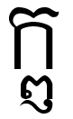

   </td>
  </tr>
  <tr>
   <td>Virama \
វិរាមៈ
   </td>
   <td>Avakraha

អវគ្រហៈ
   </td>
   <td>Anusvara

អនុស្វរៈ
   </td>
   <td>Visarga

វិសគ៌ៈ
   </td>
   <td>Athisvara

អធ៌ស្វរៈ
   </td>
   <td>Anuneaseka[^19]

អនុនាសិកៈ
   </td>
  </tr>
  <tr>
   <td>U+17D1
   </td>
   <td>U+17DC
   </td>
   <td>U+17C6
   </td>
   <td>U+17C8
   </td>
   <td>U+17CC
   </td>
   <td>N/A
   </td>
  </tr>
  <tr>
   <td>VIRIAM
   </td>
   <td>AVAKRAHASANYA
   </td>
   <td>NIKAHIT
   </td>
   <td>YUUKALEAPINTU
   </td>
   <td>ROBAT
   </td>
   <td>-
   </td>
  </tr>
</table>

*    ៑ Virama (Huot 1956:20-21)
*   ៜ Avakraha (Huot 1956:21)
*    ំ Anusvara or Nikahit (Huot 1956:18-19)
    *   Anusvara is placed on a vowel (ibid:117) \
ហវីំឞិ \

>>>>>  gd2md-html alert: inline image link here (to images/Khmer-Character22.png). Store image on your image server and adjust path/filename if necessary.  (<a href="#">Back to top</a>)(<a href="#gdcalert50">Next alert</a>) >>>>> 

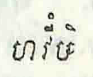

    *   Anusvara is placed on an indepdent vowel (ibid:115) \
ឧំឞិ \

>>>>>  gd2md-html alert: inline image link here (to images/Khmer-Character23.png). Store image on your image server and adjust path/filename if necessary.  (<a href="#">Back to top</a>)(<a href="#gdcalert51">Next alert</a>) >>>>> 

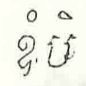

*    ះ Visarga or Visachani (Huot 1956:19-20)
*   

>>>>>  gd2md-html alert: inline image link here (to images/Khmer-Character24.png). Store image on your image server and adjust path/filename if necessary.  (<a href="#">Back to top</a>)(<a href="#gdcalert52">Next alert</a>) >>>>> 

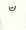
 Anuneaseka (Huot 1956:19)
*   ៌ Athisvara RO in a cluster as the second member (Huot 1956:26). It is not listed as one of the 5 diacritics. It is instead an alternative appearance of រ when occurring after another consonant in an initial cluster.
    *   AbvV can be placed above the Athisvara (ibid:133) \
ចតុថ៌ី \

>>>>>  gd2md-html alert: inline image link here (to images/Khmer-Character25.png). Store image on your image server and adjust path/filename if necessary.  (<a href="#">Back to top</a>)(<a href="#gdcalert53">Next alert</a>) >>>>> 

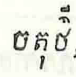

    *   The Athisvara is placed on a subscript (ibid:160) \
ចតុក្យ៌ស៑ \

>>>>>  gd2md-html alert: inline image link here (to images/Khmer-Character26.png). Store image on your image server and adjust path/filename if necessary.  (<a href="#">Back to top</a>)(<a href="#gdcalert54">Next alert</a>) >>>>> 

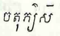

            29. How is the writing system different from Khmer?
*   The use of the two obsolete characters (i.e. ឞ ឝ ៑).
*   Anuneaseka doesn’t exist in the current version of Khmer Unicode character inventory.
*   Independent vowels are seen to be used like subscripts.
    *   ក្ឫឞ្ណ		kṛṣṇa	‘black’		(Huot 1956ː12)
    *   ស្ប្ឫហា		spṛha	‘wish (n)’	(Huot 1956ː12)
*   Independent vowel which is used like a subscript can be placed under a subscript (ibid:87)
    *   ស្ម្ឫតិ \

>>>>>  gd2md-html alert: inline image link here (to images/Khmer-Character27.png). Store image on your image server and adjust path/filename if necessary.  (<a href="#">Back to top</a>)(<a href="#gdcalert55">Next alert</a>) >>>>> 

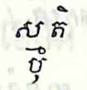
 \

*   Consonant clusters which never exist in Khmer languageː
    *   សត្ត្វ		sattva	‘animal’
    *   មត្ស្យ		matsya	‘fish’
    *   វ្រត		vrata	‘buddhist temple’

មត្ស្យ is not rendered correctly here, it should be rendered as shown below:

>>>>>  gd2md-html alert: inline image link here (to images/Khmer-Character28.png). Store image on your image server and adjust path/filename if necessary.  (<a href="#">Back to top</a>)(<a href="#gdcalert56">Next alert</a>) >>>>> 

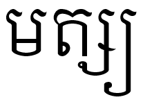

10. Stone Inscriptions (Pre-Angkor, Angkor, Post-Angkor Era)

The oldest stone inscriptions written in Khmer language dated back to the 5th century. In stone inscriptions, there are 33 consonants, 14 vowels and three diacritics (Vong 2011ː15). These are used to transcribe inscriptions as they were carved in the stones. The table below shows the equivalence of each of them. For more details on character comparison, see [https://drive.google.com/drive/folders/1jxv9xxrWNPd0U7j1wDW838elUQMUMrV0?usp=sharing](https://drive.google.com/drive/folders/1jxv9xxrWNPd0U7j1wDW838elUQMUMrV0?usp=sharing).

<table>
  <tr>
   <td><strong>Consonant</strong>
   </td>
   <td><strong>Subscript</strong>
   </td>
   <td><strong>Vowels</strong>
   </td>
   <td><strong>Special Signs</strong>
   </td>
  </tr>
  <tr>
   <td>ក 
   </td>
   <td>្ក 
   </td>
   <td>ឣ
   </td>
   <td>ំ
   </td>
  </tr>
  <tr>
   <td>ខ 
   </td>
   <td>្ខ 
   </td>
   <td>ឤ 
   </td>
   <td>ះ
   </td>
  </tr>
  <tr>
   <td>គ 
   </td>
   <td>្គ 
   </td>
   <td>ឥ 
   </td>
   <td>
<h3>៑[^20]
   </td>
  </tr>
  <tr>
   <td>ឃ 
   </td>
   <td>្ឃ 
   </td>
   <td>ឦ 
   </td>
   <td>
   </td>
  </tr>
  <tr>
   <td>ង 
   </td>
   <td>្ង 
   </td>
   <td>ឧ 
   </td>
   <td>
   </td>
  </tr>
  <tr>
   <td>ច 
   </td>
   <td>្ច 
   </td>
   <td>ឩ 
   </td>
   <td>
   </td>
  </tr>
  <tr>
   <td>ឆ 
   </td>
   <td>្ឆ 
   </td>
   <td>ឯ 
   </td>
   <td>
   </td>
  </tr>
  <tr>
   <td>ជ 
   </td>
   <td>្ជ 
   </td>
   <td>ឰ 
   </td>
   <td>
   </td>
  </tr>
  <tr>
   <td>ឈ 
   </td>
   <td>្ឈ 
   </td>
   <td>ឱ 
   </td>
   <td>
   </td>
  </tr>
  <tr>
   <td>ញ 
   </td>
   <td>្ញ 
   </td>
   <td>ឳ
   </td>
   <td>
   </td>
  </tr>
  <tr>
   <td>ដ 
   </td>
   <td>្ដ 
   </td>
   <td>ឫ 
   </td>
   <td>
   </td>
  </tr>
  <tr>
   <td>ឋ 
   </td>
   <td>្ឋ 
   </td>
   <td>ឬ 
   </td>
   <td>
   </td>
  </tr>
  <tr>
   <td>ឌ 
   </td>
   <td>្ឌ 
   </td>
   <td>ឭ 
   </td>
   <td>
   </td>
  </tr>
  <tr>
   <td>ឍ 
   </td>
   <td>្ឍ 
   </td>
   <td>ឮ 
   </td>
   <td>
   </td>
  </tr>
  <tr>
   <td>ណ 
   </td>
   <td>្ណ 
   </td>
   <td>
   </td>
   <td>
   </td>
  </tr>
  <tr>
   <td>ត 
   </td>
   <td>្ត 
   </td>
   <td>
   </td>
   <td>
   </td>
  </tr>
  <tr>
   <td>ថ 
   </td>
   <td>្ថ 
   </td>
   <td>
   </td>
   <td>
   </td>
  </tr>
  <tr>
   <td>ទ 
   </td>
   <td>្ទ 
   </td>
   <td>
   </td>
   <td>
   </td>
  </tr>
  <tr>
   <td>ធ 
   </td>
   <td>្ធ 
   </td>
   <td>
   </td>
   <td>
   </td>
  </tr>
  <tr>
   <td>ន 
   </td>
   <td>្ន 
   </td>
   <td>
   </td>
   <td>
   </td>
  </tr>
  <tr>
   <td>ប 
   </td>
   <td>្ប 
   </td>
   <td>
   </td>
   <td>
   </td>
  </tr>
  <tr>
   <td>ផ 
   </td>
   <td>្ផ 
   </td>
   <td>
   </td>
   <td>
   </td>
  </tr>
  <tr>
   <td>ព 
   </td>
   <td>្ព 
   </td>
   <td>
   </td>
   <td>
   </td>
  </tr>
  <tr>
   <td>ភ 
   </td>
   <td>្ភ 
   </td>
   <td>
   </td>
   <td>
   </td>
  </tr>
  <tr>
   <td>ម 
   </td>
   <td>្ម 
   </td>
   <td>
   </td>
   <td>
   </td>
  </tr>
  <tr>
   <td>យ 
   </td>
   <td>្យ 
   </td>
   <td>
   </td>
   <td>
   </td>
  </tr>
  <tr>
   <td>រ 
   </td>
   <td>្រ 
   </td>
   <td>
   </td>
   <td>
   </td>
  </tr>
  <tr>
   <td>ល 
   </td>
   <td>្ល 
   </td>
   <td>
   </td>
   <td>
   </td>
  </tr>
  <tr>
   <td>វ 
   </td>
   <td>្វ 
   </td>
   <td>
   </td>
   <td>
   </td>
  </tr>
  <tr>
   <td>ឝ
   </td>
   <td>្ឝ
   </td>
   <td>
   </td>
   <td>
   </td>
  </tr>
  <tr>
   <td>ឞ
   </td>
   <td>្ឞ 
   </td>
   <td>
   </td>
   <td>
   </td>
  </tr>
  <tr>
   <td>ស
   </td>
   <td>្ស
   </td>
   <td>
   </td>
   <td>
   </td>
  </tr>
  <tr>
   <td>ហ
   </td>
   <td>្ហ
   </td>
   <td>
   </td>
   <td>
   </td>
  </tr>
</table>

    35. How is the writing system different from Khmer?
*   the use of obsolete characters (ឞ ឝ )
11. Sample Texts for Orthography Check

This section includes sample text of each ethnic minority language.

    36. Bunong Sample Text

នអើន​ទែស​ក៝ន​នទ្រោក.. នើម​ងក៝ច​ម៝ស ក្រូយ ចិត.. នតើម​ឆា​អើម ឞុត​ឞូនុយ្ស​ឞារ​ហៃ​គុ​ប៝ន​នហាញ។ ឞុត​នទ្រោក​ទូ​ហៃ​ម្វាយ​ៗ ទូ​ហៃ​ឞុត​នទ្រោក​ងក្វាង់ ទូ​ហៃ​ជឹត​ឞុត​នទ្រោក​មែ គុ​នហាញ ច្យាប់​នហាញ។ ជ៝ៈ​នារ​ជ៝ៈ​ខៃ​ជ៝ៈ​នាម់​ពាង់​អី​ច្យាប់​នទ្រោក​មែ នទ្រោក​មែ​រី​ឞុន ឞុន​រី​គែស​ក៝ន។ ពាង់​ឞារ​ហៃ​ហោម​ច្យាប់​នទ្រោក​នហាញ​ដ៝ង់។ ទូ​នារ​រី​ពាង់​អី​ច្យាប់​នទ្រោក​ងក្វ៝ង់​គែស​រាវេ។ រាវេ​ឞារ​ពែ​នារ ឞិច​មោ​រើយ ឆោង​មោ​កាស។ ទាស​អី​ពាង់​ទូ​ហៃ​ជាៈ​ឆោង​នហាញ ឆោង​នហាញ​មោ​អុច​ដ៝ង់។ ងើយ​ឞាស​ពាង់​អី​ច្យាប់​នទ្រោក​មែ ពាង់​អី​ច្យាប់​នទ្រោក​មែ​គែស​នាវ​រាវេ​មា​ពាង់​អី​ច្យាប់​នទ្រាក​ងក្វ៝ង់។ ពាង់​អោប ៖ “ហៃ​កោញ! ម៝ស​នាវ​រាវេ​ម្រែ​នៃ? ឞារ​ពែ​នារ​ហើយ មោ​លាង់​ឆោង​មោ​លាង់​ឆា​រ៝​នៃ”។ ពាង់​រី កោញ​ពាង់​អើស ៖ “មោ​ឞុត​នាវ​រាវេ​អោស គ៝ប់​រាវេ​អាប់​នារ​កាល់​ទឹ​រាវេ​នាវ​ក៝ន​នទ្រោក​នៃ​ទើម”។ ពាង់​អី​ច្យាប់​នទ្រោក​មែ​អោប ៖ “មើម​ក៝ន​នទ្រោក?” “អើ ក៝ន​នទ្រោក​មៃ​នៃ ក៝ន​នទ្រោក​គ៝ប់”។ ពាង់​ព្លើង​អើស ៖ “ក៝ន​នទ្រោក​មៃ?” ពាង់​អើស ៖ “អើ ក៝ន​នទ្រោក​នៃ​ក៝ន​នទ្រោក​គ៝ប់​ងាន់​គ៝ប់​ឞិច​អា​មាង់​ងក្ល៝ន់​នហេល​មៃ​រាលាច់​មា​គ៝ប់​មោ​ទើយ​អោស”។ ព្លើង ៖ “មោ​ក៝ន​នទ្រោក​មៃ ក៝ន​នទ្រោក​គ៝ប់​ងាន់ នទ្រោក​មៃ​នទ្រោក​ងក្វ៝ង់​មោ​ឞ្លោវ​គែស​ក៝ន។ នទ្រោក​មែ​ជេង​ឞុត​ក៝ន”។ “មៃ​លើយ​រាលាច់ រាលាវ​នទ្រោក​គ៝ប់​ជើង​នទ្រោក​មែ​មៃ នទ្រី​នទ្រោក​នៃ​ក៝ន​នទ្រោក​គ៝ប់​ងាន់ គែស​នទ្រោក​ងក្វ៝ង់​គ៝ប់​ទឹង​គែស​ក៝ន​នទ្រោក​មែ​មៃ”។ ជេសរី​ពាង់​អី​ច្យាប់​នទ្រោក​មែ​មោ​ទើយ​រាលាច់ ពាង់​គុ​ឆ្រុង​ជេសរី​ហាន់​ឆឹត​អា​ច្វាញ។ ត៝ត់​ឆឹត​អា​ច្វាញ​គែស​នាវ​រាវេ​ឞឹច​មោ​រើយ​ឆោង​មោ​កាស​ងោយ​មា​រាវេ​ក៝ន​នទ្រោក ក៝ប់​ត៝ត់​អាង​អោយ​មា​ព្លឹ​រាលាច់​នាវ​ក៝ន​នទ្រោក​ជឹត។ រី​រាលាច់​មោ​ទើយ តា​ឆាក់​ពាង់​នូយ្ស​ហោ​ងាន់ មោ​លែៈ​នូយ្ស​អោស ៖ ​“ក៝ន​នទ្រោក​នៃ​ក៝ន​នទ្រោក​គ៝ប់​ងាន់ មើម​ទឹង​លាស​ក៝ន​នទ្រោក​ពាង់​ច្រាវ”។ ជេសរី​ពាង់​ងើយ​អ៝ន់​មា​ពាង់​ច្យាប់​នទ្រោក​ងក្វ៝ង់ ៖ ​“មៃ​លាស​ក៝ន​នទ្រោក​មៃ​នឹង​នែង នទ្រី​ហាន់​ជ៝យ​ឞូ​រាញ​ញច្រាៈ​នាវ​ទោយ្ស​អ៝ន់​រាង្លាច់​នាវ​អា មៃ​ហាន់​ជ៝យ​ឞូរាញ​មៃ គ៝ប់​ជ៝យ​ឞូរាញ​គ៝ប់”។ ជេសរី​ផូង​ខាន់ពាង់​​តឹមនាល​នារ ឞារ​នារ​ហែ​តឹម​ម៝ប់​ឞាល់។ “ល៝រ​មៃ មៃ​ក៝ប់​គ៝ប់ ល៝រ​គ៝ប់​គ៝ប់​ក៝ប​មៃ”។ ជេសរី​កោញ​អី​ច្យាប់​នទ្រោក​ងក្វ៝ង់ ជ៝យ​ឞូ​រាញ​គែស​ល៝រ​ពាង់​អី​ច្យាប់​នទ្រោក​មែ​ងោយ​មា​រាវេ ឞើយ​មោ​គែស​ឞូរាញ​ញច្រាៈ។ ជេសរី​ពាង់​កាស​ឞើស​អោយ​ហាន់​ជ៝យ​ឞូនុយ្ស​ហាន់​ត៝ត់​អា​ត្រ៝ង​រី​ម៝ប់​មា​កោញ​រាពាយ​ញច្វាត់ នទ្រ៝ត់​ព្រុស មផារ​នទ្រ៝ត់​រាពាយ​រី​ពាង់​រាក​រាពាយ​ឞើស​កើយ​លាស៖ “​ច្យាក​រាពាយ​មពីក​កាប់​យៅ​ឆា​ម៝ស​ញច្វាត់​ពាង់​តើម​អោយ​តើម​ព្លា​នៃ”។ ជេសរី​រាពាយ​តាង់​ពាង់​រាក រាពាយ​លាស ៖ “ហៃ​កោញ! ម៝ស​មៃ​ទឹង​រាក​គ៝ប់​មេស?” ពាង់​អើស ៖ “គ៝ប់​នទ្រ៝ត់​មៃ​នៃ​ហើយ មៃ​ម៝ន​រាពាយ​ឞើស?” “អើ​គ៝ប់។ គ៝ប់​ហើយ​រាពាយ”។ “នទ្រី​កោញ​ទាន់​ទោយ្ស​ម៝ន​អើ គ៝ប់​លិច គឹត”។ “លិច​ច្រាវ​អោស គ៝ប់​មោ​នូយ្ស​មា​មៃ​អោស រាពាយ​អោប៖ ​មៃ​អាស​ហាន់​ហាៈ​កោញ​ឞើស​អើម​អោយ​នៃ​ញអោត​នទ៝ស​មោ​នាន់​ញអោត​នទើ​មោ​នាន់​ក្វាន់​ព្រីត​តា​តី​ឞារ​អឹ”។ ពាង់​អើស ៖ “គ៝ប់​គើញ​ហាន់​ជ៝យ​ឞូរាញ​ច្រាៈ​ទោយ្ស​ម៝ស​ម្រែ​ហៃ”។ រាពាយ​អោប ៖ “មើម​នាវ​មៃ​រី កោញ?” កោញ​ពាង់​ងក៝ច​លែៈ​រាងោច​នាវ​ផូង​ខាន់ពាង់​វៃ​គុ​នហាញ​ច្យាប់​នទ្រោក​នហាញ​មា​ត៝ត់​នទ្រោក​គែស​ក៝ន រាពាយ​អ្យាត់​លែៈ​នោ​នាវ​រាពាយ​អោប ៖ “នទ្រី​នតើម​នាវ​មៃ​រី​កោញ”។ “អើ​ទាស​រី​ទើម​ម៝ន មេៈ”។ “មៃ​លិច​ច្រាវ​អោស​តៃ​គ៝ប់​កើល​មៃ នទ្រី​មៃ​ហាន់​ជ៝យ​ព្រីត​អ៝ន់​គ៝ប់​ទោស​មៃ​ជ៝យ​ព្រីត​អ៝ន់​គ៝ប់ គែស​មៃ​ហាន់​ល៝រ​អា​នតិច គ៝ប់​ហាន់​ឞើស​កើយ”។ ជេសរី​កោញ​អី​ច្យាប់​នទ្រោក​មែ ហាន់​ឆឹត​ល៝រ។ ​ពាង់​ទឹង​លែៈ​គុ​ក៝ប់ ក៝ប់​ទុត​មា​ជ៝ៈ ជេសរី​ត៝ត់​រាពាយ​ឆៃ​ត៝ត់​រាពាយ​ឞូរាញ​បាៈៗ អោប​អ្វែស​លាង។ ត្រុយ្ស​កោញ​អី​ច្យាប់​នទ្រាក​ងក្វ៝ង់ ៖ “ម៝ស​ជ៝ៈ​មៃ? ជ៝ៈ​ឞូរាញ​គុ​ក៝ប់​មៃ​ទូ​ហៃ​ទើម”។ រាពាយ​អើស ៖ “គែស​នាវ​ដ៝ង់”។ ពាង់​អីរី​អោប​ជឹត ៖ “ម៝ស​នាវ​មៃ?” “មោ​នី​អោស​នាវ។ នទ្រី​រឹង​លែៈ​ឞូរាញ​ឞ៝ន់?” អើស ៖ “រឹង​លែៈ​ហើយ ក៝ប់​មៃ​ទើម”។ “គ៝ប់​អោយ​អា​នើស​ម៝ស​មោ​ជ៝ៈ​ម្រែ​ហៃ ពើស​អ្វាញ់​ទែស​ក៝ន​កោញ​គ៝ប់​មេៈ”។ ផូង​ខាន់ពាង់​ហីស​រាហ៝ល់។ ជេសរី អោប ៖ “អាស​ទែស​ក៝ន​កោញ?” “អើ​ទែស​ក៝ន​កោញ​គ៝ប់​ងាន់​ហែស”។ ពាង់​អី​ច្យាប់​នទ្រោក​ងក្វ៝ង់​អើស ៖ “គ៝ប់​មោ​អ្យាត់​លិច​វៃ​ឆៃ​ឞូនុយ្ស​ឞូក្លោ​គែស​ក៝ន​អោស”។ “ងាន់​ហែស គ៝ប់​នើស​អ្វាញ់​អុញ។ អូរ​ពាង់​នទុត​ហាន់​អា​មីរ កោញ​គ៝ប់​នើស​ទែស​ឞើស​កើយ”។ ពាង់​អី​ច្យាប់​នទ្រោក​ងក្វ៝ង់​រី​រាលាច់ ៖ “គ៝ប់​មោ​តាង់​រ៝​វៃ​លាស​ឞូនុយ្ស​ឞូក្លោ​គែស​ក៝ន​អោស”។ រាពាយ​អើស ៖ “មៃ​មោ​អ្យាត់​គ៝ប់ គ៝ប់​មោ​អ្យាត់​មៃ​ដ៝ង់។ គ៝ប់​មោ​វៃ​តាង់​នទ្រោក​ងក្វ៝ង់​ទែស​ក៝ន។ នទ្រី​ឞូរាញ​អើម​វៃ​ឆៃ វៃ​តាង់​នទ្រោក​ងក្វ៝ង់​ទែស​ក៝ន​ដ៝ង់?” ឞើស​ផូង​ឞូរាញ​អើស ៖ “មោ​វៃ​ឆៃ​អោស”។ ទឹង​លែៈ​ឞូ​លាស​កើត​រី​ទាទេ។ “លាស​នទ្រី​មើម​លាស​ក៝ន​នទ្រោក​ពាង់​ច្រាវ? លាស​នទ្រោក​ងក្វ៝ង់​ពាង់​ឞ្លាវ​ទែស​ក៝ន កោញ​គ៝ប់​ឞ្លាវ​ទែស​ក៝ន​ដ៝ង់។ លាស​នទ្រី​ក៝ន​នទ្រោក​នៃ​ក៝ន​នទ្រោក​ឞូ មោ​ទី​ក៝ន​នទ្រោក​មៃ​ក៝ន​នទ្រោក​មែ​ពាង់​អី​តី នទ្រោក​មៃ​ងក្វ៝ង់”។ កោញ​អី​ច្យាប់​នទ្រោក​ងក្វ៝ង់​តាង់​រាពាយ​លាស​នទ្រី មឞើស​ឞូ​លាស​ហាន់​អាច់​ទាច់​មា​ទុត​ញច្វាត់​ឆឹត​អា​ច្វាញ​រី៕

    37. Tampuan Sample Text

(A drowning boy)

ទី ដារ់ ម៉ោញ អាញ់ លូ គួប អាញ់ ទី ជៀក គួប សោប ឡាំ ប៉ាគ់ ទៀក តាំងលោ័ ភឿ ហៀន រែ ទៀក។ ផះ ឡាំ ទឹល ប៉ាគ់ ទៀក ណោះ អាញ់ កា ប៉ាស្រាំ រែ ទៀក។ អាញ់ សាំលឹះ រែ អាញ់ កា ឡង់ ទៀក។ ផះ អាញ់ ឡង់ ណោះ អាញ់ អ្យូគ ខាក់។ អាញ់ កា ឡុង អើ ពូ ណាំង ប៉ាណូស តង័ អាញ់។ ណោះ ហង អាញ់ កា កាវ៉ះ័ ណាំង គួប អាញ់ គួប អាញ់ ណោះ អ៊ែ អ្លុ រែ ទៀក អ៊ែ ប៉ប័ អាញ់ ឡង់។ អ៊ែ កា ទី តង័ អាញ់ អ្យក់ អាញ់ ហាវ ឡាំ ប៉ាគ់ គូក។ កេះណោះ អ៊ែ ប៉ាំងហៀន ឡឹង កាន រែ ទៀក ណោះ អន់ កា អាញ់។ ឡៃង ឡឹង ណោះ អាញ់ កា ទី ប្រ៉គ័ ពួយ កាន អ៊ែ ប៉ាំងហៀន ណោះ។ កេះណោះ អាញ់ កា អ្លុ រែ សឹត រែ ឡាំ រែ សឹត រែ ឡាំ។ ទឹល ទុញ ទុញ អាញ់ កា អ្លុ រែ ទៀក ទឹល រ៉ប់ ដារ់ អា។ ‌៚

    38. Brao Sample Text

លឿង ឝ្រុង ប៊ិះ

ប៊ិច លឿង មូយ អៃ អំម៉ាច ហំម៉ាច លឿង យ៉ាគ់ អាត់ញ៉ា។

យ៉ាគ់ អាត់ញ៉ា នែ ឡើ ប៊ិច កួន ប្រោះ ប៉ឹះ រ៉ា។ តង៉ៃ មូយ យ៉ាគ់ អាត់ញ៉ា ឡើ ដក់ កូវ ឡង ណគ ហឹ មឺរ អ៊ែ ទឹង ឡើ កូវ ឡង ណគ ឡើ ត្រប្លូច ប្រយ ជូង ណគ ហឹ ត្រម ឡង។ អ៊ែ ឡើ តង៉ូក ប្រយ ដើ ជូង ណគ តៃ ដើ ង៉ាយ យ៉ាវ លំកូវ ឡង ណគ អ៊ែ ឡើ ជឹ ហឹ ហន់ណាម។ អ៊ែ ឡើ ជឹ កី ក្រសឹប កឌឹប ក្លើម អ៊ែ ទ្រី ណគ ឡើ ឌឹក តង៉ា៖ «អើយ បើគ ណគ ចង់ ចា អ៊ឺម ឡះ? ហៃ ហឈិ ឡះ?» តៃ ត្រណើវ ហំប៉ើវ។ អ៊ែ ឡើ ឌឹក តង៉ា ឡឹះ អន់ណាវ៖ «អើយ ហឈិ ឡះ អ៊ែ បក់ អន់ណោះ»។ អ៊ែ ក្ល ណគ ឡើ ត្រណើវ៖ «អ៊ឺម អឈិ អ៊ឺម អតង៉ូក ដើ ជូង អៃ ឡើ ប៉ាត់ ញឹះ តៃ ដើ ង៉ាយ យ៉ាវ អង់កូវ ឡង អៃ។ អ៊ែ ប៉ាគ់ អ៊ិន អ៊ែ ទ្រី ណគ ប្រ៉ៃ ប្រយ មែ ខំឡាំង ឞាវ ដក់ សាត ជូង ណគ ទឹង មឺរ។ មែ អិះ សាត តៃ តៃ អ៊ឺម ប្រសាវ កតាម មែ ង៉ាយ កតាម «ប៉ាគ់ មន់តៃ អ៊ែ អន់អាំ កួន ប្រោះ អន់សូច ណគ អន់នែ»។

អ៊ែ ឡើ ម៉ាង ដើ មែ ទឹង ស្រ៊ុក រៀន៖ «មែ ង៉ាយ មន់តៃ ជូង អៃ ដើ មែ អ៊ែ អៃ អន់អាំ កួន ប្រោះ ដើ មែ អ៊ែ»។ អ៊ែ ម៉ើ សាត ប្រយ ត្រំ ក្រាន ម៉ើ ដក់ មែ អ៊ិះ តៃ ម៉ើ តៃ អ៊ឺម។

អែ ឡើ កឡឹ ឡើ ដក់ សាត ឡឹះ អន់ណាវ តគ់ កណូវ ឡង ណគ ឡឹះ អន់ណាវ ណាគ់ តៃ ឡើ តៃ។ អ៊ែ ឡើ កឡូវ ប្រយ៖ «ឡា អុះ ប្រះ ប្រ៊ី យ៉ាង បង៉ាង ជ្រឺវ អរ៉ាក់ ប្រ៊ី ដាក គ្រែដៃ ថែ ពឋា វន់សាត ជូង អៃ អុះ ណាគ់ អន់ឡាប់ អាំ កួន ប្រោះ ហឹ ហន់ណាម ប៉ាគ់ មន់តៃ ជូង អៃ ណាគ់ អន់ឡាប់ អាំ កួន ប្រោះ អន់សូច ហឹ ហន់ណាម តគ់»។

	អ៊ែ គ្រុង ប៊ិះ នែ ឡើ ដុង ប៉ាគ់ អ៊ិន ឌិះ ម៉ាត។ អែ ឡើ តទឺត ចាក់ ណគ ឡើ វឹរ ប៊ិះ ក្រាគ់ អ៊ែ ឡើ ដក់ ប្រយ តគ់ យ៉ាគ់ អាត់ញ៉ា អ៊ែ ឡើ តង៉ា៖ «អង់ង៉ាយ យ៉ាគ់ អ ហដាំង?» យ៉ាគ់ អាត់ញ៉ា ឡើ ត្រណើវ រៀន៖ «អដាំង ជូង អៃ»។ គ្រុង ប៊ិះ ឡើ តង៉ា៖ «ឡើ បើម ង៉ាយ ដឹះ ជូង ហៃ អ៊ិន?» យ៉ាគ់ អាត់ញ៉ា ឡើ ត្រណើវ៖ «អកូវ ឡង ឡើយ ឡើ ប៉ាត់ ទឹង ណិះ ឡើយ។ ប៉ាគ់ ហន់សាត តៃ ចូវ អើយ ណាគ់ អន់ឡាប់ អង់អាំ កួន ប្រោះ ដើ ហៃ»។ អ៊ែ ឡើ ត្រណើវ៖ «ណោះ អន់សាត រួយ ឞ»។ អែ ឡើ សាត ប្រយ ឈុំ តើម ឡង អ៊ែ ឡើ តៃ ប្រយ ទឹង ត្រម ឡង។ អ៊ែ ឡើ រៀន៖ «នែ យ៉ាគ់ អ ជូង ហៃ ឡើ ទឹប ទឹង ត្រម ឡង»។ អ៊ែ យ៉ាគ់ អាត់ញ៉ា ឡើ ហួត ប្រយ ជឹ តៀត ហឹ ហន់ណាម។ អ៊ែ ឡើ កឡូវ ប្រយ មែ ខំឡាំង ឞាវ ណគ៖ «ម៉ិច វន់កួន ចូវ វន់ដក់ ទូង ប៊ិះ ក្រាគ់ ហឹ មឺរ អៃ តគ់»។ អ៊ែ ម៉ើ ដក់ ប្រយ អ៊ែ ម៉ើ តៃ ប៊ិះ ក្រាគ់ ទិះ អ៊ែ ម៉ើ រៀន៖ «យ៉ើយ ប៊ិះ ទិះ ឌិះ ងំចា អាត លំញឹម ប្រយ!»។ អ៊ែ យ៉ាគ់ អាត់ញ៉ា ឡើ ត្រណើវ៖ «ងំចា បើម ង៉ាយ យ៉ាក់ ណគ ឡើយ ឡើ តៃ ជូង អៃ ទឹង ត្រម ឡង។ ណិះៗ នែ អំប្រយ៉ង់ ប៊ឹង កួន អៃ»។ អ៊ែ ម៉ើ ជឹ ទូង ម៉ើ ចក់ ឞ ម៉ើ ទូង ជឹ តៀត ហឹ ហន់ណាម តគ់។ អ៊ែ ឡើ ប៉្រៃ ប្រយ កួន អិះ តៃ ឌីៗ មន់ចក់ បើម ក្ល។ អ៊ែ ប៊ិះ រៀន៖ «យ៉ាគ់ អើយ ហន់ដុង ប៉ាគ់ តៃ ហរែម ហង់កោះ កជែត តាក់»។ អ៊ែ ណាំង អន់សូច អ៊ែ លំចក់ បើម ក្ល។

    39. Jarai Sample Text
*   ហ្មវ ហា រ៉ាំង មនូស ញូ ណាវ ច្យៈ បាវ ញូ ពគ ចល
*   ឆ្រង់ ទើល រើយ ដង់ ញូ កៈ លើយ បាវ ញូ ញូ ឝ៉្លៃគ ណាវ ពគ សាង ញូ ឞង់ សយ។ 
*   វីគ មឹង នុន អ៊ើយ មង បាត យ ញូ ប៉គ ហិ បាវ។
*   ញូ ហ្យាប់ម៍ ហ្ងំ បាវ ឡៃគ៖ «យ្វ៉ា យ៉ិត អ៊ិះម៍ លហូតម៍ ឆាត  ប៊្រើយ មនូស ចុត ឌុង អ៊ិះម៍?
*   ញូ អ្និតអ្និវម៍ ឍើច អ៊ិះម៍ ឌុត ឋល នុន យ៉ិត អ៊ិះម៍ ប៊្រើយ ញូ ចុត ឌុង អ៊ិះម៍?»
*   បាវ ឡៃគ់ ឝ្ល៉ៃគ៖ «អ៊ិះម៍ អ្នាំ ឡៃគ អុះ! មនូស ផា រ៉ា ណោះ! កតាំង ណោះ! តា អូ ឃិន ញូ អុះ!» «ហ្វ៊ិម៍ យ៉ិត ឝញូ? ពគ ប៉ៈ ញូ ណាវ?»
*   បាវ  នុន ឡៃគ ឝ៉្លៃគ៖ «ញូ ឝ្ល៉ៃគ ណាវ ពគ សាង បស ញូ ណាវ ឞង់ សយ ញូ។
*   គើញ ញូ រ៉ៃ បស រើយ ដង់ គើញ ញូ រ៉ៃ ដគ ឝ៉ន មើយ្គ។»
    40. Kuay Sample Text and the Translation in English

(The Story about Angels and Men))

រើង​ទេវតា​រ៉ើ​​កួយ

   រ៉ើដើម​ កួយ​ណាវ​ប៉ាយ ​ក្តែក​រ៉ើ​ពព័ក​កួ​​ជាប់​ឃ្នា​ កើត​​ទេវតា​កួ​អាទី​រ៉ើ​​កួយ​កួ​អា​ទាប​ ​ប៉ក​ជួប​ឃ្នា​ មោះ​​ឃ្នា​​ចៀ​ចូវ​បឺន​ ម៉ឹ​ទឹត​លោះ​កួ​ឆ្ងាយ​​ឃ្នា​យ៉ាំង​រងៃ​អឺ​ កើត​​អាលឹម​អិង ​ទេវតា​ណាវ​សួរ​អន​កួយ​កួ​អា​ទាប​​​ អន​អែល​​ម្ហូ​ប​អន​​ណាវ​ចា​រាល់ត្ងៃ​​ បើ​បឺន​ប៉សមូយ​ អន​ណាវលូមូយ​ បើ​បឺន​លីកកឹ​ណាវ​ទារ​ដក​អន​ណាវ​លូ​មូយ​ ។

   តក់​ឌូញ​ៗ​​ចៀ​ កួយ​ណាវ​ខ្ជិល​រេប​តូន​ កឹ​ទេវតា​​ណាវ​ច្លក់​ កឹ​ណាវ​ប៉ាយ ”ផូក​​ម័ង ​កើត​ន្ទ័​បឺន​ម៉ឹ​អែល​ចូវ​អន​កឺ”​ កឹ​បេក​នឺច​ណាវ​ប៉ាយណាវ​​ក្លក់ ​បេក​នឺច​ណាវ​ប៉ាយណាវ​ខ្ជឹល​ កឹ​ទេវតា​ណាវ​វ័​​អន​​ន្ទ្រុះដាក​មា​ចូវ​ច្នាប់​​ កឹ​លិច​ក្តែក​ក្ចែត​ម៉ាត់​កួយ​ ណង់​កឹ​មេៗ​​ប៉ៃ​ណាក់ម្អិង​​ ប៉ាច់​ស្រង់​វ័​ក្បូនកឹ​នាំ​ឃ្នា​សោះ​ជិះ​ប៉ង​ក្បូន​អិង ដាក​សោះ​ម្នា​ ក្បូនកឹ​ចេះកឹ​ប៉្តល​សោះម្អិង​ កឹ​ដាក​សោះ​ច្នាប់​​ចៀ​ច្នាប់​ ក្បូន​កឹ​ប៉្តល​កឹប​រ៉ើ​ពព័ក​​ កឹ​នាំ​ឃ្នា​សោះ​ចៀ​ថ្វាយ​ង្គំ​ទេវតា​ កឹ​ទេវតា​ប៉ាយ​ ”ផូក​ម័ង​ចូវ​វ័ន្ទ័​ កឺរ៉ើផូក​​ម័ង​ម៉ឹ​ក្រៃ​ចួប​ឃ្នា​ទ័ន​អឺ​ ច្បោះផូក​ម័ង​ម៉ឹ​ច្ងាត់​តូនកឺ​ ​ក្រៃ​កឹ​យ៉ាំង​អិងបឺន​សំមុក​ផូក​ម័ង”​ កឹ​ផូក​អិងទារ​ ”អូ​ ! លោក​ទេវតា​អើយ ​អន​ហៃ​កួ​ឡង់​ ក្តែក​អា​ទាប​ដាក​លិច​ម៉ាត់​ហឺយ​ ម៉ឹ​កើត​បន​កួ​អឺ​ ហើ​យ​បេក​ស្រុក​កឹ​ក្ចែត​ម៉ាត់​ ណង់​ត្មង់​កឹ​ហៃ​ប៉ៃ​ណាក់​អឺ”​ កឹ​ទេវតា​សង់​ប៉ាយ​កួយ​អាទាប​ក្ចែត​ម៉ាត់​ក្លឹង​ កឹម្នះច្លក់​​​ កឺ​ព្រ័ម​អន​ផូក​ម័ង​កួ​អាទី មូយ​រយាក់ ។​

   កឹ​កួ​ចៀ​ៗ​ផូក​អិង​អាត់​ប៉្សុក​ កឹ​ទារ​ទេវតា​ប៉ាយ ”​ហៃ​ស្អៀ​ចៀ​កួ​អាទាបចៀ​ក្រោយ​​ ហៃ​ស្អៀ​ប៉្ចួរ​រះ​យ៉ាំង​រ៉ើ​ញោង​​ ចោះ​ស្រ​ ចោះ​ប៉ន្លែ​ចា”​ កឹ​ទេវតា​ប៉ាយ​ ”តូន​កឹ​​​ចិត​ម័ង​អឺ​ កឹ​រេប​តឹង​សែង​ចៀ”​ ទេវតា​ប៉ាយ ”​អែល​ត្រៀក​នី​មូយ​ចៀ ​ដក​ប៉្ចួរ​​ប៉ៃ​ណាក់​ ចោះ​ស្រ ​ចោះ​ច្តង” បឺន​ប៉្លីចូវ​កឹ​នាំ​ឃ្នា​តាក់​ចា​ ម៉ឹ​កើត​ក្រប៉ៃ​អឺ​ ។

   កឹ​កន្ទ្រូស​តឹងប៉ៃ​ណាក់​​ កួ​ឌូញៗ​​ចៀ ​កឹ​ប៉ឹតត្រៀក​អិង​ ត្រៀកអិង​​ណាវ​បោល​សោះ​ទី​ចៀ​ក្រោយ​ កឹ​នាំ​ឃ្នា​ប៉ឺរ​កឹ​ម៉ឹក​ពើក​ កឹ​សោះចៀ​​ប៉ឺរ​អា​ទី ​បឺន​ពើក​ កឹ​តឹក​អែល​ចូវ​ចៀ​ក្រោយ​ កឹ​តក់​ត្ងៃ​មូយ​អិង​​ ត្រៀក​ណាវ​បោល​សោះទ័ន​ កឹ​ចៀ​អែល​ចូវ​ទ័ន​ កឹ​ទេវតា​ណាវ​វ័រ៍​អន​ទឹត​ក្តែក​លោះ​រ៉ើ​ពព័ក​ ឆុប​​អន​ត្រៀក​បោល​សោះទ័ន​​ កឹ​ប៉ឹត​ក្រោយ​ៗ​ទ័ន ​ឆុប​​បោល​សោះ​រោច​ទ័ន​ហឺយ​ កឹ​ត្រៀក​​កួ​អាទាប​ទាល់​កឹ​ក្ចែត ។​

   ត្រៀក​អិង​ក្ចែត​​ចៀ ​ពើកហន​តោល​លោះ​ចូវ​រ៉ើ​មុះ​​ កឹ​តោល​អិង​ប៉្លី​មូយ​ពឺត​ កឹតក់​តោល​អិង​ចែន​ច្នាប់ ​ណាវ​ស្លេះ​លោះរ៉ើ​ទ័ង កឹ​សង់​សម្លេង​កួ​ឡឹង​តោល​អិង​ កឹ​ផូក​អិង​ណាវ​ចោះ ចោះ​ចៀ​ពើក​កួយ​ កឹ​កួយ​លោះ​ចូវ​ម៉្រង​មូយ​ៗ​ កើត​កន្ទ្រូស​កើត​ក្រប៉ៃ​ កឹ​កួយ​លោះ​រ៉ើ​តោល​អិង​ ប៉ៃ​ត្រប៊ឺប៉ៃ​ត្ងៃ​ បឺន​ម៉ាត់​កួយ​ឡឹង​តោល​អិង​ កឹ​កើត​កូយ​ក្លឹង​កួ​ឡឹងក្តែក​តក់​រងៃ ៕  

    41. Pali Sample Text

(The Verses of the Buddha's Auspicious Victories)

(១)​ ពាហុំ សហស្សមភិនិមិ្មតសា វុធន្តំ គ្រីមេខលំ ឧទិតឃោ រសសេនមារំ

ទានាទិធម្មវិធិនា ជិតវា មុនិន្ទោ តន្តេជសា ភវតុ តេ ជយមង្គលានិ ។

(២)​ មារាតិរេកមភិយុជ្ឈិតសព្វរត្តឹ ឃោរម្បនា ឡវក មក្ខមថទ្ធយក្ខំ ខន្តីសុទន្ត

វិធិនា ជិតវា មុនិន្ទោ តន្តេជសា ភវតុ តេ ជយមង្គលានិ ។

(៣)​ នាឡាគិរី គជវរំ អតិមត្តភូតំ ទាវគ្គិចក្កមសនីវ សុទារុណន្តំ មេត្តម្ពុសេក

វិធិនា ជិតវា មុនិន្ទោ តន្តេជសា ភវតុ តេ ជយមង្គលានិ ។

(៤)​ ឧក្ខិត្តខគ្គ មតិហត្ថសុទារុណន្តំ ធាវន្តិយោ ជនបថង្គុលិមា លវន្តំ ឥទ្ធីភិសង្ខ

តមនោ ជិតវា មុនិន្ទោ តន្តេជសា ភវតុ តេ ជយមង្គលានិ ។

(៥)​ កត្វាន កដ្ឋមុទរំ ឥវ គព្ភិនីយា ចិញ្ចាយ ទុដ្ឋវចនំ ជនកាយ មជ្ឈេ សន្តេន

សោមវិធិនា ជិតវា មុនិន្ទោ តន្តេជសា ភវតុ តេ ជយមង្គលានិ ។

(៦)​ សច្ចំ វិហាយមតិ សច្ចកវាទកេតុំ វាទាភិរោ បិតមនំ អតិអន្ធ ភូតំ បញ្ញាបទី

បជលិតោ ជិតវា មុនិន្ទោ តន្តេជសា ភវតុ តេ ជយមង្គលានិ ។

(៧)​ នន្ទោបនន្ទភុជគំ វិពុធំ មហិទ្ធឹ បុត្តេន ថេរភុជគេន ទមាបយន្តោ ឥទ្ធូបទេស

វិធិនា ជិតវា មុនិន្ទោ តន្តេជសា ភវតុ តេ ជយមង្គលានិ ។

(៨)​ ទុគ្គាហទិដ្ឋិ ភុជគេន សុទដ្ឋហត្ថំ ព្រហ្មំ វិសុទ្ធិ ជុតិមិទ្ធិ ពកាភិធានំ ញាណគទេន

វិធិនា ជិតវា មុនិន្ទោ តន្តេជសា ភវតុ តេ ជយមង្គលានិ ។

(៩)​ ឯតាបិ ពុទ្ធជយមង្គលអដ្ឋគាថា យោ វាចនោ ទិនទិនេ សរតេ មតន្ទី ហិត្វាននេកវិ

វិធានី ចុបទ្ទវានី មោក្ខំ សុខំ អធិគមេយ្យ នរោ សបញ្ញោ ។

    42. Sanskrit Sample Text
    43. Inscription Sample Text

(K.557 Inscription, Mungkol Borey, Takeo)

១- ត្រៃត្រីឝោត្តរបញ្ចឝតឝកបរិគ្រហត្រយោទឝីកេតមាឃបុឞ្យនក្ឞត្រតូលលគ្ន។ បោញឧយឱយក្ញុំឰតក្បោញកម្រតាងអញ។ វក្លបិត១វកន្តាងស្រាង១វត្លោង១

២- វក្ចារ១កុកន្តោ១កោនកុវអលង១កុយលេង១ត្មុរ៦០ក្របិ២វវេ១០តោងត្នេំ៤០ស្រេសន្រេ២ឰអំបោង។ ក្ញុំអំនោយជំអញឰតវ្រះកម្រងតាងអញមហាគណបតិ។

៣- វន្ញា១វកន្តាង១វក្នោច១វត្មោ១វទឝមី១កុកោញវ្រះ១កុជុងបោញ១កោនកុ១កុមាន្រអញ១កុប្លស១ត្មុរ២០កន្តៃតបោសឱយ(យ)ជមានក្បោញ១តចុះត្ងៃវ្រះជោនវ្ងេជ្នៅទន្ហុំ១ចិអញ១តាញ១

12. Wordlist for Orthography Check

The database of the Chuon Nath dictionary is available at: [https://code.google.com/archive/p/khmer-dictionary-tools/downloads](https://code.google.com/archive/p/khmer-dictionary-tools/downloads). This is a complete dictionary with headwords, subentries, part of speech, Khmer pronunciation of certain borrowed words, meanings and cross references. 

13. Summary

Khmer script is used to write Khmer, minority languages (i.e. Bunong, Tampuan, Brao, Jarai and Kuay), Pali, Sanskrit and inscription. When working with Khmer script on computer, according to the Unicode Standard, it is important to be mindful of the order of characters within each word. To compensate for sounds which do not exist in Khmer, the minority languages make use of characters that are no longer used in modern Khmer. (i.e. ឝ ឞ ៝). This paper seeks to describe each character in use in the Khmer script, including usage in _ligatures, unicode encoding, text processing _and_ how usage of the characters may differ in  minority languages._

It is observed (1) that some obsolete characters are commonly used in minority languages, Sastra and inscriptions. One has to consider the outlook and rendering of those characters. (2) The character ordering is also another issue when it comes to one size fit all scenario. Khmer language uses certain characters for one purpose in one way, while they may be used differently for different purposes in minority languages.

14. References

    Bernard, J. B. (1902). Dictionnaire cambodgien-français. Hongkong: Imprimerie de la Société des missions étrangères.

    Bunong-Khmer Bilingual Dictionary. (n.d.). Retrieved from[ http://icc.org.kh/download/Bunong-Khmer_Bilingual%20_Dictionary.pdf](http://icc.org.kh/download/Bunong-Khmer_Bilingual%20_Dictionary.pdf)

    Chan, S. (2010). វិធី​បង្កើត​ពាក្យ កម្ចី​ពាក្យ និង ការ​ប្រើប្រាស់​ពាក្យ “Creating Words, Borrowing Words and Using Words.” Phnom Penh: Royal Academy of Cambodia.

    Chin, C., Ung, S., Men, P., Em, U., & Kheang, S. (2012). ភាសាបាលី ថ្នាក់​ទី១ “Pali Language, Grade 1.” National Buddhist Studies.

    Chuon, N. (1967) វចនានុក្រមខ្មែរ “Khmer Dictionary”. Phnom Penh: Buddhist Institute.

    Doek, K. (2000). A Study on the Evolution of Khmer Letters. Apsara. Retrieved from[ http://www.elibraryofcambodia.org/ka-seuk-sa-ompi-viwat-ney-aksor-khmer-ebook/](http://www.elibraryofcambodia.org/ka-seuk-sa-ompi-viwat-ney-aksor-khmer-ebook/)

    Ehrman, M. E., & Kem, S. (1972). Contemporary Cambodian: A Grammatical Sketch. Washington. DC: Foreign Service Institute.

    Ethnolinguistic Groups of Cambodia. (2011, December). Retrieved January 24, 2018, from[ http://www.unesco.org/new/fileadmin/MULTIMEDIA/FIELD/Phnom_Penh/pdf/ethnolinguistic_groups_of_cambodia_poster.pdf](http://www.unesco.org/new/fileadmin/MULTIMEDIA/FIELD/Phnom_Penh/pdf/ethnolinguistic_groups_of_cambodia_poster.pdf).

    Headley, R. K., Rath Chim, Ok Soeum. (1997). Modern Cambodian-English Dictionary. Kensington, Md: Dunwoody Pr.

    Headley, R. K., Rath Chim. (2014). Modern Cambodian-English Dictionary, Second Edition. Hyattsville, Md: Dunwoody Pr.

    Henderson, E. J. A. (1952). The Main Features of Cambodian Pronunciation. Bulletin of the School of Oriental and African Studies, University of London, 14(1), 149–174.

    Horton, J., Sok, M., Durdin, M., & Ty, R. (2017). Spoof-Vulnerable Rendering in Khmer Unicode Implementations. Presented at the ACIS2017.

    Huffman F.E. (1970). Cambodian System of Writing and Beginning Reader with Drills and Glossary. Retrieved from[ http://archive.org/details/CambodianSystemOfWritingAndBeginningReader](http://archive.org/details/CambodianSystemOfWritingAndBeginningReader)

    Huffman, F. E. (1972). The Boundary Between the Monosyllable and the Disyllable in Cambodian. North-Holland Publishing Company, 29(1), 54–66.

    Hum, S. (2005). មេរៀន​ភាសាសំស្ក្រឹត “Sanskrit Language Lessons.” Retrieved February 14, 2018, from[ http://www.elibraryofcambodia.org/mereang-pheasa-somskrert-prer-lout-proyouk-ning-somrourl-veyeakor-banthem-ebook/](http://www.elibraryofcambodia.org/mereang-pheasa-somskrert-prer-lout-proyouk-ning-somrourl-veyeakor-banthem-ebook/)

    Huot, T. (1956). វេយ្យាករណ៍សំស្ក្រឹត “Sanskrit Grammar” (2nd ed.). Phnom Penh: Buddhist Institute. Retrieved February 14, 2018, from[ http://www.elibraryofcambodia.org/veyeakor-sam-skert-ebook/](http://www.elibraryofcambodia.org/veyeakor-sam-skert-ebook/)

    Jordi, J. (n.d.). Brao Ombaa Writing System. ICC & SIL.

    Kanjahn, D. (2012, November 1). The Mondulkiri Font Family. Retrieved April 30, 2019, from http://scripts.sil.org/cms/scripts/page.php?site_id=nrsi&id=mondulkiri#23f7dd25

    Keller, C. E. (2005). Two Systems for Writing Krung. SIL.

    Khin S. (2007). វេយ្យាករណ៍ភាសាខ្មែរ “Khmer Grammar.” Royal Academy of Cambodia. Retrieved from[ http://www.elibraryofcambodia.org/veyeakor-peasa-khmer/](http://www.elibraryofcambodia.org/veyeakor-peasa-khmer/)

    Kul, S. (2008). ភាសាខ្មែរ “Khmer Language.” Nikrotheawoan Pagoda.

    Maspero, G. (1915). Grammaire de la langue khmère (cambodgien). Paris, Impr. nationale. Retrieved from[ http://archive.org/details/grammairedelala00maspgoog](http://archive.org/details/grammairedelala00maspgoog)

    Muang, P. (2012). វចនានុក្រម​ទំពួន-ខ្មែរ “Tampuan-Khmer Dictionary.” (P. Tuy & S. Chhuk, Eds.) (First Draft). Phnom Penh. Retrieved from[ http://www.tampuanreader.com/en/dictionary](http://www.tampuanreader.com/en/dictionary)

    Nhok, T. (1962). បែបរៀនថ្មី ភាសាបាលីជាន់ដំបូង “New Method to Learn Basic Pali.” Retrieved February 14, 2018, from[ http://www.elibraryofcambodia.org/beb-rean-thmey-pheasa-balei-jon-dombong/](http://www.elibraryofcambodia.org/beb-rean-thmey-pheasa-balei-jon-dombong/)

    Nuon, B. (1954). អក្ខរានុក្រមខ្មែរ “Khmer Lexicon.” Phnom Penh

    Open Forum of Cambodia. (2004) How to Type Khmer Unicode, Version 1.0:7–14. Retrieved from[ http://khmeros.info/download/KhmerUnicodeTyping.pdf](http://khmeros.info/download/KhmerUnicodeTyping.pdf)

    Developing OpenType Fonts for Khmer Script - Typography. (2018, February 8). Retrieved from[ https://docs.microsoft.com/en-us/typography/script-development/khmer](https://docs.microsoft.com/en-us/typography/script-development/khmer)

    Pawley, M.-S., & Pawley, E. (2013). Cambodian Jarai Khmer Based Writing System.

    Pech, Y. (2006). Tampuan Alphabet Book. Retrieved from[ http://tampuanreader.com/en/mlsp-dl/481/28096/76388?r=0](http://tampuanreader.com/en/mlsp-dl/481/28096/76388?r=0)

    Pech, Y. (2006). សៀវភៅ​អក្សរ​ទំពួន “Tampuan Alphabet Book.” (T. Way, W. Wang, K. Sraen, S. Thieng, L. Thoung, T. Lan, … S. Chhuk, Eds.). Retrieved from[ http://tampuanreader.com/en/mlsp-dl/481/28096/76388?r=0](http://tampuanreader.com/en/mlsp-dl/481/28096/76388?r=0)

    Scheuren, Z. Q. (2010). Khmer Printing Types and the Introduction of Print in Cambodia: 1877–1977 (Dissertation). University of Reading. Retrieved from[ https://issuu.com/typefacedesign/docs/zachary_scheuren_matd_dissertationw](https://issuu.com/typefacedesign/docs/zachary_scheuren_matd_dissertationw)

    SCHILLER, E. (1994). Khmer nominalizing and causativizing infixes. Papers from the Second Annual Meeting of the Southeast Asian Linguistics Society, 309–326.

    Simons, Gary F. and Charles D. Fennig (eds.). 2017. Ethnologue: Languages of the World, Twentieth edition. Dallas, Texas: SIL International. Online version:[ http://www.ethnologue.com](http://www.ethnologue.com).

    Sok, M. (2016). Phonological principles and automatic phonemic and phonetic transcription of Khmer words (Master’s Thesis). Payap University, Thailand. Retrieved from[ http://inter.payap.ac.th/wp-content/uploads/linguistics_students/Makaras-Thesis.pdf](http://inter.payap.ac.th/wp-content/uploads/linguistics_students/Makaras-Thesis.pdf)

    The Unicode Consortium. The Unicode Standard, Version 10.0.0, (Mountain View, CA: The Unicode Consortium, 2017. ISBN 978-1-936213-16-0). Retrieved January 23, 2018, from[ http://www.unicode.org/versions/Unicode10.0.0/](http://www.unicode.org/versions/Unicode10.0.0/).

    Thun, H. (2011). វេយ្យាករណ៍ខ្មែរ “Khmer Grammar.” Retrieved January 16, 2019, from \
[http://www.elibraryofcambodia.org/veyeakor-khmer-somrab-krob-phom-siksa-ebook/](http://www.elibraryofcambodia.org/veyeakor-khmer-somrab-krob-phom-siksa-ebook/) 

    Um, B., & Seng, T. (2012). Khmer Grammar for Primary School. Phnom Penh: Publishing and Distribution House.

    Vong, S. (2011). សិលាចារឹក​នៃ​ប្រទេស​កម្ពុជា​សម័យ​មុន​អង្គរ  “Pre-Angkor Inscriptions of Cambodia” (2nd ed., Vol. 1). Phnom Penh: Editions Angkor.

# Appendixes

1. Word-Initial Consonant Clusters

All possible word-initial consonant clusters as found in the headwords in Khmer-Khmer Dictionary together with their phonemic representations, series, number of instances in the dictionary and the examples are illustrated in the table below. In the official Khmer-Khmer dictionary, 4397 instances of word-initial consonant clusters are found and and there are at least 164 possible unique clusters. Nine consonants (#33, #55, #56, #57, #58, #59, #134, #135 and #169) do not take a subscript in word-initial position. 

The number of instances found in the Khmer-Khmer Dictionary (KKD) is obtained by doing RegEx[^21] searches on a pattern matching any words whose first member in the word-initial position is a consonant followed by a subscript without any trailing subscript after it. For instance, to find words beginning with ក្ង, look this pattern “^ក្ង([^្]|$)” up in an online dictionary (i.e. [http://dictionary.tovnah.com/reg-search](http://dictionary.tovnah.com/reg-search)). This could give a list of words which begin with ក្ង followed by either any character beside a subscript or nothing at all.

<table>
  <tr>
   <td><strong>No</strong>
   </td>
   <td><strong>Cluster</strong>
   </td>
   <td><strong>Phoneme</strong>
   </td>
   <td><strong>Series</strong>
   </td>
   <td><strong>Instances in KKD</strong>
   </td>
   <td><strong>Grapheme Example</strong>
   </td>
   <td><strong>Phonemic Transcription</strong>
   </td>
   <td><strong>Gloss</strong>
   </td>
  </tr>
  <tr>
   <td>1
   </td>
   <td>ក្ង-
   </td>
   <td>kŋ
   </td>
   <td>1st
   </td>
   <td>21
   </td>
   <td>ក្ងោក
   </td>
   <td>kŋaok
   </td>
   <td>peacock
   </td>
  </tr>
  <tr>
   <td>2
   </td>
   <td>ក្ដ-
   </td>
   <td>kɗ
   </td>
   <td>1st
   </td>
   <td>44
   </td>
   <td>ក្ដាម
   </td>
   <td>kɗaam
   </td>
   <td>crab
   </td>
  </tr>
  <tr>
   <td>3
   </td>
   <td>ក្ឌ-
   </td>
   <td>kɗ
   </td>
   <td>2nd
   </td>
   <td>5
   </td>
   <td>ក្ឌុក
   </td>
   <td>kɗuk
   </td>
   <td>sound of something falling
   </td>
  </tr>
  <tr>
   <td>4
   </td>
   <td>ក្ទ-
   </td>
   <td>kt
   </td>
   <td>2nd
   </td>
   <td>2
   </td>
   <td>ក្ទម្ព
   </td>
   <td>ktum
   </td>
   <td>tree of paradise
   </td>
  </tr>
  <tr>
   <td>5
   </td>
   <td>ក្ន-
   </td>
   <td>kn
   </td>
   <td>1st
   </td>
   <td>6
   </td>
   <td>ក្នុង
   </td>
   <td>knoŋ
   </td>
   <td>in
   </td>
  </tr>
  <tr>
   <td>6
   </td>
   <td>ក្ប-
   </td>
   <td>kɓ
   </td>
   <td>1st
   </td>
   <td>32
   </td>
   <td>ក្បាល
   </td>
   <td>kɓaal
   </td>
   <td>head
   </td>
  </tr>
  <tr>
   <td>7
   </td>
   <td>ក្ម-
   </td>
   <td>km
   </td>
   <td>1st
   </td>
   <td>4
   </td>
   <td>ក្មេង
   </td>
   <td>kmeeŋ
   </td>
   <td>young
   </td>
  </tr>
  <tr>
   <td>8
   </td>
   <td>ក្រ-
   </td>
   <td>kr
   </td>
   <td>1st
   </td>
   <td>313
   </td>
   <td>ក្រោម
   </td>
   <td>kraom
   </td>
   <td>under
   </td>
  </tr>
  <tr>
   <td>9
   </td>
   <td>ក្ល-
   </td>
   <td>kl
   </td>
   <td>1st
   </td>
   <td>36
   </td>
   <td>ក្លៀក
   </td>
   <td>kliək
   </td>
   <td>armpit
   </td>
  </tr>
  <tr>
   <td>10
   </td>
   <td>ក្វ-
   </td>
   <td>kw
   </td>
   <td>1st
   </td>
   <td>4
   </td>
   <td>ក្វែន
   </td>
   <td>kwaen
   </td>
   <td>agile
   </td>
  </tr>
  <tr>
   <td>11
   </td>
   <td>ក្ស-
   </td>
   <td>ks
   </td>
   <td>1st
   </td>
   <td>17
   </td>
   <td>ក្សាន្ត
   </td>
   <td>ksaan
   </td>
   <td>serene
   </td>
  </tr>
  <tr>
   <td>12
   </td>
   <td>ក្អ-
   </td>
   <td>kʔ
   </td>
   <td>1st
   </td>
   <td>24
   </td>
   <td>ក្អម
   </td>
   <td>kʔɑɑm
   </td>
   <td>clay pot
   </td>
  </tr>
  <tr>
   <td>13
   </td>
   <td>ខ្ច-
   </td>
   <td>kc
   </td>
   <td>1st
   </td>
   <td>16
   </td>
   <td>ខ្ចៅ
   </td>
   <td>kcaw
   </td>
   <td>snail
   </td>
  </tr>
  <tr>
   <td>14
   </td>
   <td>ខ្ជ-
   </td>
   <td>kc
   </td>
   <td>2nd
   </td>
   <td>23
   </td>
   <td>ខ្ជិល
   </td>
   <td>kcɨl
   </td>
   <td>lazy
   </td>
  </tr>
  <tr>
   <td>15
   </td>
   <td>ខ្ញ-
   </td>
   <td>kɲ
   </td>
   <td>1st
   </td>
   <td>32
   </td>
   <td>ខ្ញី
   </td>
   <td>kɲəj
   </td>
   <td>ginger
   </td>
  </tr>
  <tr>
   <td>16
   </td>
   <td>ខ្ត-
   </td>
   <td>kt
   </td>
   <td>1st
   </td>
   <td>1
   </td>
   <td>ខ្តត
   </td>
   <td>ktɑɑt
   </td>
   <td>to cackle (of hen)
   </td>
  </tr>
  <tr>
   <td>17
   </td>
   <td>ខ្ទ-
   </td>
   <td>kt
   </td>
   <td>2nd
   </td>
   <td>30
   </td>
   <td>ខ្ទម
   </td>
   <td>ktɔɔm
   </td>
   <td>hut
   </td>
  </tr>
  <tr>
   <td>18
   </td>
   <td>ខ្ន-
   </td>
   <td>kn
   </td>
   <td>1st
   </td>
   <td>34
   </td>
   <td>ខ្នង
   </td>
   <td>knɑɑŋ
   </td>
   <td>back (of a person)
   </td>
  </tr>
  <tr>
   <td>19
   </td>
   <td>ខ្ព-
   </td>
   <td>kp
   </td>
   <td>2nd
   </td>
   <td>16
   </td>
   <td>ខ្ពស់
   </td>
   <td>kpuəh
   </td>
   <td>tall, high
   </td>
  </tr>
  <tr>
   <td>20
   </td>
   <td>ខ្ម-
   </td>
   <td>km
   </td>
   <td>1st
   </td>
   <td>34
   </td>
   <td>ខ្មែរ
   </td>
   <td>kmae
   </td>
   <td>Khmer
   </td>
  </tr>
  <tr>
   <td>21
   </td>
   <td>ខ្យ-
   </td>
   <td>kj
   </td>
   <td>1st
   </td>
   <td>3
   </td>
   <td>ខ្យង
   </td>
   <td>kjɑɑŋ
   </td>
   <td>mollusc
   </td>
  </tr>
  <tr>
   <td>22
   </td>
   <td>ខ្ល-
   </td>
   <td>kl
   </td>
   <td>1st
   </td>
   <td>25
   </td>
   <td>ខ្លា
   </td>
   <td>klaa
   </td>
   <td>tiger
   </td>
  </tr>
  <tr>
   <td>23
   </td>
   <td>ខ្វ-
   </td>
   <td>kw
   </td>
   <td>1st
   </td>
   <td>53
   </td>
   <td>ខ្វិត
   </td>
   <td>kwət
   </td>
   <td>wood apple
   </td>
  </tr>
  <tr>
   <td>24
   </td>
   <td>ខ្ស-
   </td>
   <td>ks
   </td>
   <td>1st
   </td>
   <td>33
   </td>
   <td>ខ្សាច់
   </td>
   <td>ksac
   </td>
   <td>sand
   </td>
  </tr>
  <tr>
   <td>25
   </td>
   <td>គ្ន-
   </td>
   <td>kn
   </td>
   <td>2nd
   </td>
   <td>6
   </td>
   <td>គ្នា
   </td>
   <td>knie
   </td>
   <td>1S, 3S (informal)
   </td>
  </tr>
  <tr>
   <td>26
   </td>
   <td>គ្រ-
   </td>
   <td>kr
   </td>
   <td>2nd
   </td>
   <td>143
   </td>
   <td>គ្រាប់
   </td>
   <td>kroap
   </td>
   <td>seed
   </td>
  </tr>
  <tr>
   <td>27
   </td>
   <td>គ្វ-
   </td>
   <td>kw
   </td>
   <td>2nd
   </td>
   <td>1
   </td>
   <td>គ្វាម
   </td>
   <td>kwaam
   </td>
   <td>text, composition (Thai loanword)
   </td>
  </tr>
  <tr>
   <td>28
   </td>
   <td>ឃ្ញ-
   </td>
   <td>kɲ
   </td>
   <td>2nd
   </td>
   <td>1
   </td>
   <td>ឃ្ញើច
   </td>
   <td>kɲəəc
   </td>
   <td>in a jerking manner
   </td>
  </tr>
  <tr>
   <td>29
   </td>
   <td>ឃ្ន-
   </td>
   <td>kn
   </td>
   <td>2nd
   </td>
   <td>7
   </td>
   <td>ឃ្នាប
   </td>
   <td>kniep
   </td>
   <td>pincers
   </td>
  </tr>
  <tr>
   <td>30
   </td>
   <td>ឃ្ម-
   </td>
   <td>km
   </td>
   <td>2nd
   </td>
   <td>10
   </td>
   <td>ឃ្មុំ
   </td>
   <td>kmum
   </td>
   <td>bee
   </td>
  </tr>
  <tr>
   <td>31
   </td>
   <td>ឃ្ល-
   </td>
   <td>kl
   </td>
   <td>2nd
   </td>
   <td>27
   </td>
   <td>ឃ្លង់
   </td>
   <td>kluəŋ
   </td>
   <td>leprosy
   </td>
  </tr>
  <tr>
   <td>32
   </td>
   <td>ឃ្វ-
   </td>
   <td>kw
   </td>
   <td>2nd
   </td>
   <td>9
   </td>
   <td>ឃ្វាល
   </td>
   <td>kwiel
   </td>
   <td>to herd
   </td>
  </tr>
  <tr>
   <td>33
   </td>
   <td>ង្-
   </td>
   <td>
   </td>
   <td>
   </td>
   <td>0
   </td>
   <td>
   </td>
   <td>
   </td>
   <td>
   </td>
  </tr>
  <tr>
   <td>34
   </td>
   <td>ច្ន-
   </td>
   <td>cn
   </td>
   <td>1st
   </td>
   <td>4
   </td>
   <td>ច្នៃ
   </td>
   <td>cnaj
   </td>
   <td>to polish a gem
   </td>
  </tr>
  <tr>
   <td>35
   </td>
   <td>ច្ប-
   </td>
   <td>cɓ
   </td>
   <td>1st
   </td>
   <td>23
   </td>
   <td>ច្បាំង
   </td>
   <td>cɓaŋ
   </td>
   <td>to do battle
   </td>
  </tr>
  <tr>
   <td>36
   </td>
   <td>ច្យ-
   </td>
   <td>cj
   </td>
   <td>1st
   </td>
   <td>2
   </td>
   <td>ច្យុត
   </td>
   <td>cjot
   </td>
   <td>to die (of angel)
   </td>
  </tr>
  <tr>
   <td>37
   </td>
   <td>ច្រ-
   </td>
   <td>cr
   </td>
   <td>1st
   </td>
   <td>132
   </td>
   <td>ច្រើន
   </td>
   <td>crəən
   </td>
   <td>much/many/a lot
   </td>
  </tr>
  <tr>
   <td>38
   </td>
   <td>ឆ្ក-
   </td>
   <td>ck
   </td>
   <td>1st
   </td>
   <td>20
   </td>
   <td>ឆ្កែ
   </td>
   <td>ckae
   </td>
   <td>dog
   </td>
  </tr>
  <tr>
   <td>39
   </td>
   <td>ឆ្គ-
   </td>
   <td>ck
   </td>
   <td>2nd
   </td>
   <td>2
   </td>
   <td>ឆ្គង
   </td>
   <td>ckɔɔŋ
   </td>
   <td>to be awkward
   </td>
  </tr>
  <tr>
   <td>40
   </td>
   <td>ឆ្ង-
   </td>
   <td>cŋ
   </td>
   <td>1st
   </td>
   <td>12
   </td>
   <td>ឆ្ងាយ
   </td>
   <td>cŋaaj
   </td>
   <td>far
   </td>
  </tr>
  <tr>
   <td>41
   </td>
   <td>ឆ្ដ-
   </td>
   <td>cɗ
   </td>
   <td>1st
   </td>
   <td>4
   </td>
   <td>ឆ្ដោ
   </td>
   <td>cɗao
   </td>
   <td>k.o. fish
   </td>
  </tr>
  <tr>
   <td>42
   </td>
   <td>ឆ្ន-
   </td>
   <td>cn
   </td>
   <td>1st
   </td>
   <td>21
   </td>
   <td>ឆ្នុក
   </td>
   <td>cnok
   </td>
   <td>cork, stopper
   </td>
  </tr>
  <tr>
   <td>43
   </td>
   <td>ឆ្ព-
   </td>
   <td>cp
   </td>
   <td>2nd
   </td>
   <td>7
   </td>
   <td>ឆ្ពិន
   </td>
   <td>cpɨn
   </td>
   <td>k.o. fish
   </td>
  </tr>
  <tr>
   <td>44
   </td>
   <td>ឆ្ម-
   </td>
   <td>cm
   </td>
   <td>1st
   </td>
   <td>11
   </td>
   <td>ឆ្មា
   </td>
   <td>cmaa
   </td>
   <td>cat
   </td>
  </tr>
  <tr>
   <td>45
   </td>
   <td>ឆ្ល-
   </td>
   <td>cl
   </td>
   <td>1st
   </td>
   <td>26
   </td>
   <td>ឆ្លើយ
   </td>
   <td>claəj
   </td>
   <td>to answer
   </td>
  </tr>
  <tr>
   <td>46
   </td>
   <td>ឆ្វ-
   </td>
   <td>cw
   </td>
   <td>1st
   </td>
   <td>16
   </td>
   <td>ឆ្វេង
   </td>
   <td>cweeŋ
   </td>
   <td>left (side)
   </td>
  </tr>
  <tr>
   <td>47
   </td>
   <td>ឆ្អ-
   </td>
   <td>cʔ
   </td>
   <td>1st
   </td>
   <td>15
   </td>
   <td>ឆ្អឹង
   </td>
   <td>cʔəŋ
   </td>
   <td>bone
   </td>
  </tr>
  <tr>
   <td>48
   </td>
   <td>ជ្រ-
   </td>
   <td>cr
   </td>
   <td>2nd
   </td>
   <td>83
   </td>
   <td>ជ្រូក
   </td>
   <td>cruuk
   </td>
   <td>pig
   </td>
  </tr>
  <tr>
   <td>49
   </td>
   <td>ជ្វ-
   </td>
   <td>cw
   </td>
   <td>2nd
   </td>
   <td>2
   </td>
   <td>ជ្វា
   </td>
   <td>cwie
   </td>
   <td>Java
   </td>
  </tr>
  <tr>
   <td>50
   </td>
   <td>ឈ្ង-
   </td>
   <td>cŋ
   </td>
   <td>2nd
   </td>
   <td>5
   </td>
   <td>ឈ្ងោក
   </td>
   <td>cŋook
   </td>
   <td>to bow the head
   </td>
  </tr>
  <tr>
   <td>51
   </td>
   <td>ឈ្ន-
   </td>
   <td>cn
   </td>
   <td>2nd
   </td>
   <td>13
   </td>
   <td>ឈ្នួត
   </td>
   <td>cnuət
   </td>
   <td>headband
   </td>
  </tr>
  <tr>
   <td>52
   </td>
   <td>ឈ្ម-
   </td>
   <td>cm
   </td>
   <td>2nd
   </td>
   <td>11
   </td>
   <td>ឈ្មោល
   </td>
   <td>cmool
   </td>
   <td>male (non-human)
   </td>
  </tr>
  <tr>
   <td>53
   </td>
   <td>ឈ្ល-
   </td>
   <td>cl
   </td>
   <td>2nd
   </td>
   <td>19
   </td>
   <td>ឈ្លើង
   </td>
   <td>cləəŋ
   </td>
   <td>leech
   </td>
  </tr>
  <tr>
   <td>54
   </td>
   <td>ឈ្វ-
   </td>
   <td>cw
   </td>
   <td>2nd
   </td>
   <td>4
   </td>
   <td>ឈ្វេង
   </td>
   <td>cweeŋ
   </td>
   <td>to be clear, pure
   </td>
  </tr>
  <tr>
   <td>55
   </td>
   <td>ញ្-
   </td>
   <td>
   </td>
   <td>
   </td>
   <td>0
   </td>
   <td>
   </td>
   <td>
   </td>
   <td>
   </td>
  </tr>
  <tr>
   <td>56
   </td>
   <td>ដ្-
   </td>
   <td>
   </td>
   <td>
   </td>
   <td>0
   </td>
   <td>
   </td>
   <td>
   </td>
   <td>
   </td>
  </tr>
  <tr>
   <td>57
   </td>
   <td>ឋ្-
   </td>
   <td>
   </td>
   <td>
   </td>
   <td>0
   </td>
   <td>
   </td>
   <td>
   </td>
   <td>
   </td>
  </tr>
  <tr>
   <td>58
   </td>
   <td>ឌ្-
   </td>
   <td>
   </td>
   <td>
   </td>
   <td>0
   </td>
   <td>
   </td>
   <td>
   </td>
   <td>
   </td>
  </tr>
  <tr>
   <td>59
   </td>
   <td>ឍ្-
   </td>
   <td>
   </td>
   <td>
   </td>
   <td>0
   </td>
   <td>
   </td>
   <td>
   </td>
   <td>
   </td>
  </tr>
  <tr>
   <td>60
   </td>
   <td>ណ្ហ-
   </td>
   <td>nh
   </td>
   <td>1st
   </td>
   <td>2
   </td>
   <td>ណ្ហើយ
   </td>
   <td>nhaəj
   </td>
   <td>Don't bother
   </td>
  </tr>
  <tr>
   <td>61
   </td>
   <td>ត្ង-
   </td>
   <td>tŋ
   </td>
   <td>1st
   </td>
   <td>1
   </td>
   <td>ត្ងោក
   </td>
   <td>tŋaok
   </td>
   <td>neck-fetter (for criminals)
   </td>
  </tr>
  <tr>
   <td>62
   </td>
   <td>ត្ន-
   </td>
   <td>tn
   </td>
   <td>1st
   </td>
   <td>1
   </td>
   <td>ត្នោត
   </td>
   <td>tnaot
   </td>
   <td>sugar-palm tree
   </td>
  </tr>
  <tr>
   <td>63
   </td>
   <td>ត្ប-
   </td>
   <td>tɓ
   </td>
   <td>1st
   </td>
   <td>15
   </td>
   <td>ត្បាល់
   </td>
   <td>tɓal
   </td>
   <td>mortar
   </td>
  </tr>
  <tr>
   <td>64
   </td>
   <td>ត្ម-
   </td>
   <td>tm
   </td>
   <td>1st
   </td>
   <td>6
   </td>
   <td>ត្មាត
   </td>
   <td>tmaat
   </td>
   <td>vulture
   </td>
  </tr>
  <tr>
   <td>65
   </td>
   <td>ត្រ-
   </td>
   <td>tr
   </td>
   <td>1st
   </td>
   <td>230
   </td>
   <td>ត្រល់
   </td>
   <td>trɑl
   </td>
   <td>weaver's shuttle
   </td>
  </tr>
  <tr>
   <td>66
   </td>
   <td>ត្ល-
   </td>
   <td>tl
   </td>
   <td>1st
   </td>
   <td>9
   </td>
   <td>ត្លុក
   </td>
   <td>tlok
   </td>
   <td>clown
   </td>
  </tr>
  <tr>
   <td>67
   </td>
   <td>ត្វ-
   </td>
   <td>tw
   </td>
   <td>1st
   </td>
   <td>3
   </td>
   <td>ត្វា
   </td>
   <td>twaa
   </td>
   <td>beef sausage
   </td>
  </tr>
  <tr>
   <td>68
   </td>
   <td>ត្អ-
   </td>
   <td>tʔ
   </td>
   <td>1st
   </td>
   <td>7
   </td>
   <td>ត្អើក
   </td>
   <td>tʔaək
   </td>
   <td>to hiccup
   </td>
  </tr>
  <tr>
   <td>69
   </td>
   <td>ថ្ក-
   </td>
   <td>tk
   </td>
   <td>1st
   </td>
   <td>14
   </td>
   <td>ថ្កល់
   </td>
   <td>tkɑl
   </td>
   <td>to prop up
   </td>
  </tr>
  <tr>
   <td>70
   </td>
   <td>ថ្គ-
   </td>
   <td>tk
   </td>
   <td>2nd
   </td>
   <td>2
   </td>
   <td>ថ្គាម
   </td>
   <td>tkiem
   </td>
   <td>molar (tooth)
   </td>
  </tr>
  <tr>
   <td>71
   </td>
   <td>ថ្ង-
   </td>
   <td>tŋ
   </td>
   <td>1st
   </td>
   <td>13
   </td>
   <td>ថ្ងាស
   </td>
   <td>tŋaah
   </td>
   <td>forehead
   </td>
  </tr>
  <tr>
   <td>72
   </td>
   <td>ថ្ដ-
   </td>
   <td>tɗ
   </td>
   <td>1st
   </td>
   <td>4
   </td>
   <td>ថ្ដោក
   </td>
   <td>tɗaok
   </td>
   <td>small wooden bells
   </td>
  </tr>
  <tr>
   <td>73
   </td>
   <td>ថ្ន-
   </td>
   <td>tn
   </td>
   <td>1st
   </td>
   <td>22
   </td>
   <td>ថ្នាល
   </td>
   <td>tnaal
   </td>
   <td>seed bed
   </td>
  </tr>
  <tr>
   <td>74
   </td>
   <td>ថ្ព-
   </td>
   <td>tp
   </td>
   <td>2nd
   </td>
   <td>9
   </td>
   <td>ថ្ពាល់
   </td>
   <td>tpoal
   </td>
   <td>cheek(s)
   </td>
  </tr>
  <tr>
   <td>75
   </td>
   <td>ថ្ម-
   </td>
   <td>tm
   </td>
   <td>1st
   </td>
   <td>11
   </td>
   <td>ថ្ម
   </td>
   <td>tmɑɑ
   </td>
   <td>rock, stone, concrete
   </td>
  </tr>
  <tr>
   <td>76
   </td>
   <td>ថ្ល-
   </td>
   <td>tl
   </td>
   <td>1st
   </td>
   <td>20
   </td>
   <td>ថ្លើម
   </td>
   <td>tlaəm
   </td>
   <td>liver
   </td>
  </tr>
  <tr>
   <td>77
   </td>
   <td>ថ្វ-
   </td>
   <td>tw
   </td>
   <td>1st
   </td>
   <td>15
   </td>
   <td>ថ្វាយ
   </td>
   <td>twaaj
   </td>
   <td>to give, offer (to royalty, clergy or deities)
   </td>
  </tr>
  <tr>
   <td>78
   </td>
   <td>ទ្យ-
   </td>
   <td>tj
   </td>
   <td>2nd
   </td>
   <td>1
   </td>
   <td>ទ្យោតិសាស្ត្រ
   </td>
   <td>tjoo.teʔ. sah
   </td>
   <td>a sacred script foretelling future
   </td>
  </tr>
  <tr>
   <td>79
   </td>
   <td>ទ្រ-
   </td>
   <td>tr
   </td>
   <td>2nd
   </td>
   <td>129
   </td>
   <td>ទ្រ
   </td>
   <td>trɔɔ
   </td>
   <td>Cambodian stringed fiddle
   </td>
  </tr>
  <tr>
   <td>80
   </td>
   <td>ទ្វ-
   </td>
   <td>tw
   </td>
   <td>2nd
   </td>
   <td>30
   </td>
   <td>ទ្វារ
   </td>
   <td>twie
   </td>
   <td>door
   </td>
  </tr>
  <tr>
   <td>81
   </td>
   <td>ធ្ង-
   </td>
   <td>tŋ
   </td>
   <td>2nd
   </td>
   <td>8
   </td>
   <td>ធ្ងន់
   </td>
   <td>tŋuən
   </td>
   <td>to be heavy
   </td>
  </tr>
  <tr>
   <td>82
   </td>
   <td>ធ្ន-
   </td>
   <td>tn
   </td>
   <td>2nd
   </td>
   <td>13
   </td>
   <td>ធ្នើរ
   </td>
   <td>tnəə
   </td>
   <td>shelf
   </td>
  </tr>
  <tr>
   <td>83
   </td>
   <td>ធ្ម-
   </td>
   <td>tm
   </td>
   <td>2nd
   </td>
   <td>21
   </td>
   <td>ធ្មេញ
   </td>
   <td>tmɨɲ
   </td>
   <td>tooth
   </td>
  </tr>
  <tr>
   <td>84
   </td>
   <td>ធ្យ-
   </td>
   <td>tj
   </td>
   <td>2nd
   </td>
   <td>9
   </td>
   <td>ធ្យូង
   </td>
   <td>tjuuŋ
   </td>
   <td>charcoal
   </td>
  </tr>
  <tr>
   <td>85
   </td>
   <td>ធ្ល-
   </td>
   <td>tl
   </td>
   <td>2nd
   </td>
   <td>21
   </td>
   <td>ធ្លាក់
   </td>
   <td>tleak
   </td>
   <td>to fall (unintentionally)
   </td>
  </tr>
  <tr>
   <td>86
   </td>
   <td>ធ្វ-
   </td>
   <td>tw
   </td>
   <td>2nd
   </td>
   <td>5
   </td>
   <td>ធ្វើ
   </td>
   <td>twəə
   </td>
   <td>to do
   </td>
  </tr>
  <tr>
   <td>87
   </td>
   <td>ន្រ-
   </td>
   <td>nr
   </td>
   <td>2nd
   </td>
   <td>2
   </td>
   <td>ន្រាយ
   </td>
   <td>nriej
   </td>
   <td>Narayana (epithet of Vishnu)
   </td>
  </tr>
  <tr>
   <td>88
   </td>
   <td>ន្អ-
   </td>
   <td>nʔ
   </td>
   <td>1st
   </td>
   <td>1
   </td>
   <td>ន្អាលនឹង
   </td>
   <td>nʔaal.nɨŋ
   </td>
   <td>in order that
   </td>
  </tr>
  <tr>
   <td>89
   </td>
   <td>ប្ដ-
   </td>
   <td>pɗ
   </td>
   <td>1st
   </td>
   <td>4
   </td>
   <td>ប្ដី
   </td>
   <td>pɗəj
   </td>
   <td>husband
   </td>
  </tr>
  <tr>
   <td>90
   </td>
   <td>ប្រ-
   </td>
   <td>pr
   </td>
   <td>1st
   </td>
   <td>517
   </td>
   <td>ប្រាក់
   </td>
   <td>prak
   </td>
   <td>silver
   </td>
  </tr>
  <tr>
   <td>91
   </td>
   <td>ប្ល-
   </td>
   <td>ɓl
   </td>
   <td>1st
   </td>
   <td>39
   </td>
   <td>ប្លែក
   </td>
   <td>plaek
   </td>
   <td>to be odd
   </td>
  </tr>
  <tr>
   <td>92
   </td>
   <td>ប្អ-
   </td>
   <td>ɓʔ
   </td>
   <td>1st
   </td>
   <td>2
   </td>
   <td>ប្អូន
   </td>
   <td>pʔoon
   </td>
   <td>younger sibling
   </td>
  </tr>
  <tr>
   <td>93
   </td>
   <td>ផ្ក-
   </td>
   <td>pk
   </td>
   <td>1st
   </td>
   <td>20
   </td>
   <td>ផ្កាយ
   </td>
   <td>pkaaj
   </td>
   <td>star
   </td>
  </tr>
  <tr>
   <td>94
   </td>
   <td>ផ្គ-
   </td>
   <td>pk
   </td>
   <td>2nd
   </td>
   <td>13
   </td>
   <td>ផ្គុំ
   </td>
   <td>pkum
   </td>
   <td>to group/assemble
   </td>
  </tr>
  <tr>
   <td>95
   </td>
   <td>ផ្ង-
   </td>
   <td>pŋ
   </td>
   <td>1st
   </td>
   <td>9
   </td>
   <td>ផ្ងារ
   </td>
   <td>pŋaa
   </td>
   <td>to be face up
   </td>
  </tr>
  <tr>
   <td>96
   </td>
   <td>ផ្ច-
   </td>
   <td>pc
   </td>
   <td>1st
   </td>
   <td>13
   </td>
   <td>ផ្ចាញ់
   </td>
   <td>pcaɲ
   </td>
   <td>to defeat
   </td>
  </tr>
  <tr>
   <td>97
   </td>
   <td>ផ្ញ-
   </td>
   <td>pɲ
   </td>
   <td>1st
   </td>
   <td>7
   </td>
   <td>ផ្ញើ
   </td>
   <td>pɲaə
   </td>
   <td>to send
   </td>
  </tr>
  <tr>
   <td>98
   </td>
   <td>ផ្ដ-
   </td>
   <td>pɗ
   </td>
   <td>1st
   </td>
   <td>33
   </td>
   <td>ផ្ដិត
   </td>
   <td>pɗət
   </td>
   <td>to pat dry
   </td>
  </tr>
  <tr>
   <td>99
   </td>
   <td>ផ្ត-
   </td>
   <td>pt
   </td>
   <td>1st
   </td>
   <td>7
   </td>
   <td>ផ្តិល
   </td>
   <td>ptəl
   </td>
   <td>copper/silver bowl for water
   </td>
  </tr>
  <tr>
   <td>100
   </td>
   <td>ផ្ទ-
   </td>
   <td>pt
   </td>
   <td>2nd
   </td>
   <td>30
   </td>
   <td>ផ្ទះ
   </td>
   <td>pteah
   </td>
   <td>house
   </td>
  </tr>
  <tr>
   <td>101
   </td>
   <td>ផ្ន-
   </td>
   <td>pn
   </td>
   <td>1st
   </td>
   <td>21
   </td>
   <td>ផ្នូរ
   </td>
   <td>pnoo
   </td>
   <td>tomb
   </td>
  </tr>
  <tr>
   <td>102
   </td>
   <td>ផ្ល-
   </td>
   <td>pl
   </td>
   <td>1st
   </td>
   <td>28
   </td>
   <td>ផ្លូវ
   </td>
   <td>pləw
   </td>
   <td>road, street, path
   </td>
  </tr>
  <tr>
   <td>103
   </td>
   <td>ផ្ស-
   </td>
   <td>ps
   </td>
   <td>1st
   </td>
   <td>32
   </td>
   <td>ផ្សែង
   </td>
   <td>psaeŋ
   </td>
   <td>smoke (n)
   </td>
  </tr>
  <tr>
   <td>104
   </td>
   <td>ផ្អ-
   </td>
   <td>pʔ
   </td>
   <td>1st
   </td>
   <td>31
   </td>
   <td>ផ្អែម
   </td>
   <td>pʔaem
   </td>
   <td>to be sweet
   </td>
  </tr>
  <tr>
   <td>105
   </td>
   <td>ព្ក-
   </td>
   <td>pk
   </td>
   <td>1st
   </td>
   <td>1
   </td>
   <td>ព្កុល
   </td>
   <td>pkol
   </td>
   <td>k.o. large tree
   </td>
  </tr>
  <tr>
   <td>106
   </td>
   <td>ព្ន-
   </td>
   <td>pn
   </td>
   <td>2nd
   </td>
   <td>8
   </td>
   <td>ព្នង
   </td>
   <td>pnɔɔŋ
   </td>
   <td>Bunong ethnic group
   </td>
  </tr>
  <tr>
   <td>107
   </td>
   <td>ព្យ-
   </td>
   <td>pj
   </td>
   <td>2nd
   </td>
   <td>34
   </td>
   <td>ព្យុះ
   </td>
   <td>pjuh
   </td>
   <td>storm
   </td>
  </tr>
  <tr>
   <td>108
   </td>
   <td>ព្រ-
   </td>
   <td>pr
   </td>
   <td>2nd
   </td>
   <td>201
   </td>
   <td>ព្រាន
   </td>
   <td>prien
   </td>
   <td>hunter
   </td>
  </tr>
  <tr>
   <td>109
   </td>
   <td>ព្ល-
   </td>
   <td>pl
   </td>
   <td>2nd
   </td>
   <td>3
   </td>
   <td>ព្លុក
   </td>
   <td>pluk
   </td>
   <td>ceremonial leader in cremating a corpse
   </td>
  </tr>
  <tr>
   <td>110
   </td>
   <td>ព្អ-
   </td>
   <td>pʔ
   </td>
   <td>2nd
   </td>
   <td>1
   </td>
   <td>ព្អឹះ
   </td>
   <td>pʔɨh
   </td>
   <td>tightly
   </td>
  </tr>
  <tr>
   <td>111
   </td>
   <td>ភ្ង-
   </td>
   <td>pŋ
   </td>
   <td>2nd
   </td>
   <td>10
   </td>
   <td>ភ្ងូត
   </td>
   <td>pŋuut
   </td>
   <td>to give someone a bath
   </td>
  </tr>
  <tr>
   <td>112
   </td>
   <td>ភ្ជ-
   </td>
   <td>pc
   </td>
   <td>2nd
   </td>
   <td>12
   </td>
   <td>ភ្ជិត
   </td>
   <td>pcɨt
   </td>
   <td>to seal
   </td>
  </tr>
  <tr>
   <td>113
   </td>
   <td>ភ្ញ-
   </td>
   <td>pɲ
   </td>
   <td>2nd
   </td>
   <td>7
   </td>
   <td>ភ្ញាក់
   </td>
   <td>pɲeak
   </td>
   <td>to wake up
   </td>
  </tr>
  <tr>
   <td>114
   </td>
   <td>ភ្ន-
   </td>
   <td>pn
   </td>
   <td>2nd
   </td>
   <td>28
   </td>
   <td>ភ្នែក
   </td>
   <td>pnɛɛk
   </td>
   <td>eyes
   </td>
  </tr>
  <tr>
   <td>115
   </td>
   <td>ភ្ម-
   </td>
   <td>pm
   </td>
   <td>2nd
   </td>
   <td>1
   </td>
   <td>ភ្មាស
   </td>
   <td>pmieh
   </td>
   <td>entirely
   </td>
  </tr>
  <tr>
   <td>116
   </td>
   <td>ភ្ល-
   </td>
   <td>pl
   </td>
   <td>2nd
   </td>
   <td>49
   </td>
   <td>ភ្លុក
   </td>
   <td>pluk
   </td>
   <td>tusk
   </td>
  </tr>
  <tr>
   <td>117
   </td>
   <td>ភ្រ-
   </td>
   <td>pr
   </td>
   <td>2nd
   </td>
   <td>4
   </td>
   <td>ភ្រូន
   </td>
   <td>pruun
   </td>
   <td>stomach worm
   </td>
  </tr>
  <tr>
   <td>118
   </td>
   <td>ភ្ស-
   </td>
   <td>ps
   </td>
   <td>2nd
   </td>
   <td>1
   </td>
   <td>ភ្សាំ
   </td>
   <td>psoam
   </td>
   <td>to accustom to
   </td>
  </tr>
  <tr>
   <td>119
   </td>
   <td>ម្ក-
   </td>
   <td>mk
   </td>
   <td>1st
   </td>
   <td>2
   </td>
   <td>ម្កាក់
   </td>
   <td>mkak
   </td>
   <td>k.o. fruit tree
   </td>
  </tr>
  <tr>
   <td>120
   </td>
   <td>ម្ខ-
   </td>
   <td>mkʰ
   </td>
   <td>1st
   </td>
   <td>1
   </td>
   <td>ម្ខាង
   </td>
   <td>mkʰaaŋ
   </td>
   <td>one side
   </td>
  </tr>
  <tr>
   <td>121
   </td>
   <td>ម្ង-
   </td>
   <td>mŋ
   </td>
   <td>2nd
   </td>
   <td>2
   </td>
   <td>ម្ង៉ៃ
   </td>
   <td>mŋaj
   </td>
   <td>one day
   </td>
  </tr>
  <tr>
   <td>122
   </td>
   <td>ម្ច-
   </td>
   <td>mc
   </td>
   <td>1st
   </td>
   <td>6
   </td>
   <td>ម្ចាស់
   </td>
   <td>mcah
   </td>
   <td>owner
   </td>
  </tr>
  <tr>
   <td>123
   </td>
   <td>ម្ជ-
   </td>
   <td>mc
   </td>
   <td>2nd
   </td>
   <td>2
   </td>
   <td>ម្ជុល
   </td>
   <td>mcul
   </td>
   <td>needle
   </td>
  </tr>
  <tr>
   <td>124
   </td>
   <td>ម្ញ-
   </td>
   <td>mɲ
   </td>
   <td>2nd
   </td>
   <td>2
   </td>
   <td>ម្ញ៉ែម្ញ៉
   </td>
   <td>mɲae.mɲɑɑ
   </td>
   <td>to be always making excuses
   </td>
  </tr>
  <tr>
   <td>125
   </td>
   <td>ម្ដ-
   </td>
   <td>mɗ
   </td>
   <td>1st
   </td>
   <td>5
   </td>
   <td>ម្ដង
   </td>
   <td>mɗɑɑŋ
   </td>
   <td>one time
   </td>
  </tr>
  <tr>
   <td>126
   </td>
   <td>ម្ន-
   </td>
   <td>mn
   </td>
   <td>2nd
   </td>
   <td>14
   </td>
   <td>ម្នាក់
   </td>
   <td>mneak
   </td>
   <td>one person
   </td>
  </tr>
  <tr>
   <td>127
   </td>
   <td>ម្ភ-
   </td>
   <td>mpʰ
   </td>
   <td>2nd
   </td>
   <td>1
   </td>
   <td>ម្ភៃ
   </td>
   <td>mpʰej
   </td>
   <td>twenty
   </td>
  </tr>
  <tr>
   <td>128
   </td>
   <td>ម្យ-
   </td>
   <td>mj
   </td>
   <td>2nd
   </td>
   <td>6
   </td>
   <td>ម្យ៉ាង
   </td>
   <td>mjaaŋ
   </td>
   <td>one way
   </td>
  </tr>
  <tr>
   <td>129
   </td>
   <td>ម្រ-
   </td>
   <td>mr
   </td>
   <td>2nd
   </td>
   <td>23
   </td>
   <td>ម្រាម
   </td>
   <td>mriem
   </td>
   <td>finger/toe
   </td>
  </tr>
  <tr>
   <td>130
   </td>
   <td>ម្ល-
   </td>
   <td>ml
   </td>
   <td>2nd
   </td>
   <td>10
   </td>
   <td>ម្លប់
   </td>
   <td>mlup
   </td>
   <td>shade
   </td>
  </tr>
  <tr>
   <td>131
   </td>
   <td>ម្ស-
   </td>
   <td>ms
   </td>
   <td>1st
   </td>
   <td>7
   </td>
   <td>ម្សៅ
   </td>
   <td>msaw
   </td>
   <td>flour
   </td>
  </tr>
  <tr>
   <td>132
   </td>
   <td>ម្ហ-
   </td>
   <td>mh
   </td>
   <td>1st
   </td>
   <td>10
   </td>
   <td>ម្ហូប
   </td>
   <td>mhoop
   </td>
   <td>food
   </td>
  </tr>
  <tr>
   <td>133
   </td>
   <td>ម្អ-
   </td>
   <td>mʔ
   </td>
   <td>1st
   </td>
   <td>2
   </td>
   <td>ម្អម
   </td>
   <td>mʔɑɑm
   </td>
   <td>k.o. aromatic grass
   </td>
  </tr>
  <tr>
   <td>134
   </td>
   <td>យ្-
   </td>
   <td>
   </td>
   <td>
   </td>
   <td>0
   </td>
   <td>
   </td>
   <td>
   </td>
   <td>
   </td>
  </tr>
  <tr>
   <td>135
   </td>
   <td>រ្-
   </td>
   <td>
   </td>
   <td>
   </td>
   <td>0
   </td>
   <td>
   </td>
   <td>
   </td>
   <td>
   </td>
  </tr>
  <tr>
   <td>136
   </td>
   <td>ល្ក-
   </td>
   <td>lk
   </td>
   <td>1st
   </td>
   <td>2
   </td>
   <td>ល្កម
   </td>
   <td>lkɑɑm
   </td>
   <td>to be very tender
   </td>
  </tr>
  <tr>
   <td>137
   </td>
   <td>ល្ខ-
   </td>
   <td>lkʰ
   </td>
   <td>1st
   </td>
   <td>1
   </td>
   <td>ល្ខោន
   </td>
   <td>lkʰaon
   </td>
   <td>theatrical performance
   </td>
  </tr>
  <tr>
   <td>138
   </td>
   <td>ល្គ-
   </td>
   <td>lk
   </td>
   <td>2nd
   </td>
   <td>6
   </td>
   <td>ល្គឹក
   </td>
   <td>lkɨk
   </td>
   <td>if only
   </td>
  </tr>
  <tr>
   <td>139
   </td>
   <td>ល្ង-
   </td>
   <td>lŋ
   </td>
   <td>2nd
   </td>
   <td>10
   </td>
   <td>ល្ង
   </td>
   <td>lŋɔɔ
   </td>
   <td>sesame
   </td>
  </tr>
  <tr>
   <td>140
   </td>
   <td>ល្ប-
   </td>
   <td>lɓ
   </td>
   <td>1st
   </td>
   <td>29
   </td>
   <td>ល្បាយ
   </td>
   <td>lɓaaj
   </td>
   <td>solution, blended
   </td>
  </tr>
  <tr>
   <td>141
   </td>
   <td>ល្ព-
   </td>
   <td>lp
   </td>
   <td>2nd
   </td>
   <td>2
   </td>
   <td>ល្ពៅ
   </td>
   <td>lpɨw
   </td>
   <td>pumpkin
   </td>
  </tr>
  <tr>
   <td>142
   </td>
   <td>ល្ម-
   </td>
   <td>lm
   </td>
   <td>2nd
   </td>
   <td>23
   </td>
   <td>ល្មុត
   </td>
   <td>lmut
   </td>
   <td>sapodilla tree
   </td>
  </tr>
  <tr>
   <td>143
   </td>
   <td>ល្យ-
   </td>
   <td>lj
   </td>
   <td>2nd
   </td>
   <td>1
   </td>
   <td>ល្យំ
   </td>
   <td>ljum
   </td>
   <td>to be dangling
   </td>
  </tr>
  <tr>
   <td>144
   </td>
   <td>ល្វ-
   </td>
   <td>lw
   </td>
   <td>2nd
   </td>
   <td>16
   </td>
   <td>ល្វីង
   </td>
   <td>lwiiŋ
   </td>
   <td>bitter
   </td>
  </tr>
  <tr>
   <td>145
   </td>
   <td>ល្ហ-
   </td>
   <td>lh
   </td>
   <td>1st
   </td>
   <td>16
   </td>
   <td>ល្ហុង
   </td>
   <td>lhuŋ
   </td>
   <td>papaya
   </td>
  </tr>
  <tr>
   <td>146
   </td>
   <td>ល្អ-
   </td>
   <td>lʔ
   </td>
   <td>1st
   </td>
   <td>21
   </td>
   <td>ល្អាង
   </td>
   <td>lʔaaŋ
   </td>
   <td>cave
   </td>
  </tr>
  <tr>
   <td>147
   </td>
   <td>វ្ហ-
   </td>
   <td>wh
   </td>
   <td>1st
   </td>
   <td>3
   </td>
   <td>វ្ហី
   </td>
   <td>whəj
   </td>
   <td>in a daze
   </td>
  </tr>
  <tr>
   <td>148
   </td>
   <td>ស្ក-
   </td>
   <td>sk
   </td>
   <td>1st
   </td>
   <td>29
   </td>
   <td>ស្ករ
   </td>
   <td>skɑɑ
   </td>
   <td>sugar
   </td>
  </tr>
  <tr>
   <td>149
   </td>
   <td>ស្គ-
   </td>
   <td>sk
   </td>
   <td>2nd
   </td>
   <td>19
   </td>
   <td>ស្គរ
   </td>
   <td>skɔɔ
   </td>
   <td>drum
   </td>
  </tr>
  <tr>
   <td>150
   </td>
   <td>ស្ង-
   </td>
   <td>sŋ
   </td>
   <td>1st
   </td>
   <td>12
   </td>
   <td>ស្ងាប
   </td>
   <td>sŋaap
   </td>
   <td>to yawn
   </td>
  </tr>
  <tr>
   <td>151
   </td>
   <td>ស្ញ-
   </td>
   <td>sɲ
   </td>
   <td>1st
   </td>
   <td>15
   </td>
   <td>ស្ញើប
   </td>
   <td>sɲaəp
   </td>
   <td>to shudder (in fear)
   </td>
  </tr>
  <tr>
   <td>152
   </td>
   <td>ស្ដ-
   </td>
   <td>sɗ
   </td>
   <td>1st
   </td>
   <td>29
   </td>
   <td>ស្ដាំ
   </td>
   <td>sɗam
   </td>
   <td>right (hand side)
   </td>
  </tr>
  <tr>
   <td>153
   </td>
   <td>ស្ត-
   </td>
   <td>st
   </td>
   <td>1st
   </td>
   <td>16
   </td>
   <td>ស្តុក
   </td>
   <td>stok
   </td>
   <td>stock
   </td>
  </tr>
  <tr>
   <td>154
   </td>
   <td>ស្ថ-
   </td>
   <td>stʰ
   </td>
   <td>1st
   </td>
   <td>14
   </td>
   <td>ស្ថាន
   </td>
   <td>stʰaan
   </td>
   <td>place
   </td>
  </tr>
  <tr>
   <td>155
   </td>
   <td>ស្ទ-
   </td>
   <td>st
   </td>
   <td>2nd
   </td>
   <td>54
   </td>
   <td>ស្ទង
   </td>
   <td>stɔɔŋ
   </td>
   <td>bunch (of banana)
   </td>
  </tr>
  <tr>
   <td>156
   </td>
   <td>ស្ន-
   </td>
   <td>sn
   </td>
   <td>1st
   </td>
   <td>60
   </td>
   <td>ស្នា
   </td>
   <td>snaa
   </td>
   <td>crossbow
   </td>
  </tr>
  <tr>
   <td>157
   </td>
   <td>ស្ប-
   </td>
   <td>sɓ
   </td>
   <td>1st
   </td>
   <td>33
   </td>
   <td>ស្បូវ
   </td>
   <td>sɓəw
   </td>
   <td>k.o. coarse grass
   </td>
  </tr>
  <tr>
   <td>158
   </td>
   <td>ស្ព-
   </td>
   <td>sp
   </td>
   <td>2nd
   </td>
   <td>28
   </td>
   <td>ស្ពាន
   </td>
   <td>spien
   </td>
   <td>bridge
   </td>
  </tr>
  <tr>
   <td>159
   </td>
   <td>ស្ម-
   </td>
   <td>sm
   </td>
   <td>1st
   </td>
   <td>69
   </td>
   <td>ស្មា
   </td>
   <td>smaa
   </td>
   <td>shoulder
   </td>
  </tr>
  <tr>
   <td>160
   </td>
   <td>ស្រ-
   </td>
   <td>sr
   </td>
   <td>1st
   </td>
   <td>318
   </td>
   <td>ស្រះ
   </td>
   <td>srah
   </td>
   <td>pond
   </td>
  </tr>
  <tr>
   <td>161
   </td>
   <td>ស្ល-
   </td>
   <td>sl
   </td>
   <td>1st
   </td>
   <td>74
   </td>
   <td>ស្លឹក
   </td>
   <td>slək
   </td>
   <td>leaf
   </td>
  </tr>
  <tr>
   <td>162
   </td>
   <td>ស្វ-
   </td>
   <td>sw
   </td>
   <td>1st
   </td>
   <td>67
   </td>
   <td>ស្វាយ
   </td>
   <td>swaaj
   </td>
   <td>mango
   </td>
  </tr>
  <tr>
   <td>163
   </td>
   <td>ស្អ-
   </td>
   <td>sʔ
   </td>
   <td>1st
   </td>
   <td>25
   </td>
   <td>ស្អែក
   </td>
   <td>sʔaek
   </td>
   <td>tomorrow
   </td>
  </tr>
  <tr>
   <td>164
   </td>
   <td>ហ្ន-
   </td>
   <td>n
   </td>
   <td>1st
   </td>
   <td>6
   </td>
   <td>ហ្នឹង
   </td>
   <td>nəŋ
   </td>
   <td>this, these
   </td>
  </tr>
  <tr>
   <td>165
   </td>
   <td>ហ្ម-
   </td>
   <td>m
   </td>
   <td>1st
   </td>
   <td>14
   </td>
   <td>ហ្មត់
   </td>
   <td>mɑt
   </td>
   <td>all gone
   </td>
  </tr>
  <tr>
   <td>166
   </td>
   <td>ហ្រ-
   </td>
   <td>r
   </td>
   <td>1st
   </td>
   <td>3
   </td>
   <td>ហ្រស្វ
   </td>
   <td>hrah.swaʔ
   </td>
   <td>dwarf
   </td>
  </tr>
  <tr>
   <td>167
   </td>
   <td>ហ្ល-
   </td>
   <td>l
   </td>
   <td>1st
   </td>
   <td>10
   </td>
   <td>ហ្លួង
   </td>
   <td>luəŋ
   </td>
   <td>king
   </td>
  </tr>
  <tr>
   <td>168
   </td>
   <td>ហ្វ-
   </td>
   <td>w
   </td>
   <td>1st
   </td>
   <td>10
   </td>
   <td>ហ្វ៊‌ីល
   </td>
   <td>fiil
   </td>
   <td>film
   </td>
  </tr>
  <tr>
   <td>169
   </td>
   <td>ឡ្-
   </td>
   <td>
   </td>
   <td>
   </td>
   <td>0
   </td>
   <td>
   </td>
   <td>
   </td>
   <td>
   </td>
  </tr>
  <tr>
   <td>170
   </td>
   <td>អ្ង-
   </td>
   <td>ʔŋ
   </td>
   <td>1st
   </td>
   <td>1
   </td>
   <td>អ្ងែង
   </td>
   <td>ʔŋaeŋ
   </td>
   <td>2P (to younger girls)
   </td>
  </tr>
  <tr>
   <td>171
   </td>
   <td>អ្ន-
   </td>
   <td>ʔn
   </td>
   <td>1st
   </td>
   <td>15
   </td>
   <td>អ្នក
   </td>
   <td>neak
   </td>
   <td>2P
   </td>
  </tr>
  <tr>
   <td>172
   </td>
   <td>អ្វ-
   </td>
   <td>ʔw
   </td>
   <td>1st
   </td>
   <td>2
   </td>
   <td>អ្វី
   </td>
   <td>ʔwəj
   </td>
   <td>what
   </td>
  </tr>
  <tr>
   <td>173
   </td>
   <td>អ្ហ-
   </td>
   <td>ʔh
   </td>
   <td>1st
   </td>
   <td>17
   </td>
   <td>អ្ហែង
   </td>
   <td>ʔhaeŋ
   </td>
   <td>2P (to younger people)
   </td>
  </tr>
</table>

1. Word-Medial Consonant Clusters

The table below show a list of all possible consonant clusters occurs in word-medial position. To do so, a RegEx pattern is used to filter for them. The pattern is “[^្]C្C[^្]” which guarantees that there is no preceding or trailing subscript. Figures and examples are obtained from an online dictionary ([http://dictionary.tovnah.com/reg-search](http://dictionary.tovnah.com/reg-search)). For example, [^្]ក្.[^្] matches any word containing ក and ្ which is followed by a consonant which has no subscript after it. 

In order not to show the same sequences of the consonant clusters, only the ones whose sequences are different from the ones occurs in the word-initial position are presented. 

<table>
  <tr>
   <td><strong>-CS-</strong>
   </td>
   <td><strong>Instances</strong>
   </td>
   <td><strong>Example</strong>
   </td>
  </tr>
  <tr>
   <td>-ក្.-

 -ក្ក-

 -ក្ខ-

 -ក្យ-

 -ក្ដ-[^22]

 -ក្ត-

 -ក្ស-
   </td>
   <td><strong>430</strong>

46

117

4

27

9

61
   </td>
   <td>តក្កមា /tak.kaʔ.maa/ ‘to be stupefied’

អក្ខរា /ʔak.kʰaʔ.raa/ ‘letters’

ពាក្យកំព្រា /piek.kɑm.prie/ ‘a single character word’

ភក្ដី /pʰeaʔ.kɗəj/ ‘loyalty’

អបសក្តិ /ʔap.sak/ ‘powerless’

ទក្សិណ /teak.sən/ ‘the south’
   </td>
  </tr>
  <tr>
   <td>-ខ្.-
   </td>
   <td>68
   </td>
   <td>(All are similar to word-initial consonant clusters.)
   </td>
  </tr>
  <tr>
   <td>-គ្.-

 -គ្គ-

 -គ្យ-

 -គ្ឃ-

 -គ្ល-
   </td>
   <td><strong>157</strong>

50

2

2

2
   </td>
   <td>បុគ្គល /ɓok.kul/ ‘individual’

យោគ្យភាព /joo.kjeaʔ.pʰiep/ ‘intelligence’

ឧគ្ឃោសនា /ʔuk.kʰoo.saʔ.naa/ ‘public address’

អង់គ្លេស /ʔaŋ.kleh/ ‘English’
   </td>
  </tr>
  <tr>
   <td>-ឃ្.-

 -ឃ្រ-
   </td>
   <td><strong>16</strong>

1
   </td>
   <td>វិឃ្រភាព /wiʔ.kreaʔ.pʰiep/ ‘destruction’
   </td>
  </tr>
  <tr>
   <td>-ង្.-

 -ង្ក-

 -ង្ខ-

 -ង្គ-

 -ង្ឃ-

 -ង្ប-

 -ង្រ-

 -ង្វ-

 -ង្ស-

 -ង្ហ-

 -ង្អ-
   </td>
   <td><strong>640</strong>

172

33

153

27

1

59

58

30

62

46
   </td>
   <td>កង្កែប /kɑŋ.kaep/ ‘frog’

ដង្ខៅ /ɗɑŋ.kʰaw/ ‘head of a commercial house’

ដង្គុំ /ɗɑŋ.kum/ ‘bunched together (of trees)’

សង្ឃឹម /sɑŋ.kʰɨm/ ‘hope (n)’

បង្បោយ /ɓɑŋ.ɓaoj/ ‘to swing the arms while walking’

ពង្រីក /puŋ.riik/ ‘to magnify’

កង្វល់ /kɑŋ.wɑl/ ‘worry (n)’

សង្ស័យ /sɑŋ.saj/ ‘to suspect’

កង្ហារ /kɑŋ.haa/ ‘fan’

បង្អែម /ɓɑŋ.ʔaem/ ‘dessert’
   </td>
  </tr>
  <tr>
   <td>-ច្.-

 -ច្ច-

 -ច្ឆ-
   </td>
   <td>167

53

88
   </td>
   <td>បច្ច័យ /pac.caj/ ‘suffix’

មច្ឆា /mac.cʰaa/ ‘fish’
   </td>
  </tr>
  <tr>
   <td>-ឆ្.-
   </td>
   <td><strong>28</strong>
   </td>
   <td>(All are similar to the word-initial consonant cluster.)
   </td>
  </tr>
  <tr>
   <td>-ជ្.-

 -ជ្ញ-

 -ជ្ជ-

 -ជ្ឈ-

 -ជ្យ-
   </td>
   <td><strong>120</strong>

6

64

23

2
   </td>
   <td>ប្ដេជ្ញា /pɗac.ɲaa/ ‘to commit’

ពាណិជ្ជកម្ម /pie.nɨc.ceaʔ.kam/ ‘commercial’

មជ្ឈដ្ឋាន /mac.cʰeaʔ.tʰaan/ ‘habitat’

រាជ្យាង្គ /riec.jieŋ.keaʔ/ ‘royal administration’
   </td>
  </tr>
  <tr>
   <td>-ឈ្.-
   </td>
   <td>6
   </td>
   <td>(All are similar to the word-initial consonant cluster.)
   </td>
  </tr>
  <tr>
   <td>-ញ្.-

-ញ្ច-

-ញ្ឆ-

-ញ្ជ-

-ញ្ឈ-

-ញ្ញ-

-ញ្ហ-
   </td>
   <td><strong>320</strong>

71

33

91

9

113

1
   </td>
   <td>កញ្ចក់ /kaɲ.cɑk/ ‘mirror, glass’

កញ្ឆា /kaɲ.cʰaa/ ‘marijuana’

កញ្ជើ /kaɲ.cəə/ ‘basket’

កញ្ឈូស /kaɲ.cʰuuh/ ‘to scrape the foot on the ground’

កញ្ញា /kaɲ.ɲaa/ ‘young woman’

បញ្ហា /paɲ.haa/ ‘problem’
   </td>
  </tr>
  <tr>
   <td>-ដ្.-

 -ដ្ឋ-

 -ដ្ដ-
   </td>
   <td><strong>114</strong>

109

5
   </td>
   <td>សេដ្ឋី /see.tʰəj/ ‘wealthy man’

អដ្ដប្រតិភូ /ʔat.ɗaʔ.praʔ.teʔ.pʰuu/ ‘advocate’
   </td>
  </tr>
  <tr>
   <td>-ឋ្.-
   </td>
   <td>0
   </td>
   <td>(no result found)
   </td>
  </tr>
  <tr>
   <td>-ឌ្.-

 -ឌ្ឍ-

 -ឌ្ឌ-
   </td>
   <td><strong>18</strong>

16

2
   </td>
   <td>វុឌ្ឍិ /wut.tʰiʔ/ ‘prosperity’

លេឌ្ឌុបាត /leet.duʔ.baat/ ‘the fall of a clump of earth’
   </td>
  </tr>
  <tr>
   <td>-ឍ្.-

 -ឍ្យ-
   </td>
   <td>1

1
   </td>
   <td>អាឍ្យចរ /ʔaa.tjeaʔ.cɑɑ/ ‘to have been formerly wealthy’
   </td>
  </tr>
  <tr>
   <td>-ណ្.-

-ណ្ដ-

-ណ្ឋ-

-ណ្ឌ-

-ណ្ឍ-

-ណ្ណ-

-ណ្យ-

-ណ្ហ-
   </td>
   <td>138

7

75

1

11

32

1
   </td>
   <td>កណ្ដឹង /kɑn.ɗəŋ/ ‘bell’

សណ្ឋាគារ /san.tʰaa.kie/ ‘hotel’

ឥណ្ឌូ /ʔən.duu/ ‘Hindu’

ឍុណ្ឍិ /tʰun.tʰiʔ/ ‘Genesha (son of Shiva)’

បណ្ណាគារ /pan.naa.kie/ ‘bookstore’

បុណ្យទិន /ɓon.jeaʔ.tɨn/ ‘holiday’

តណ្ហា /tɑn.haa/ ‘desire, passion’
   </td>
  </tr>
  <tr>
   <td>-ត្.-

 -ត្ត-[^23]

 -ត្ដ​-

 -ត្យ-

 -ត្ថ-

 -ត្ស-

 -ត្វ-
   </td>
   <td><strong>479</strong>

236

7

17

82

4

4
   </td>
   <td>កិត្តិយស /kət.teʔ.juəh/ ‘reputation’

ឧត្ដម /ʔut.ɗɑm/ ‘excellent’

សត្យា /saʔ.tjaa/ ‘true words’

វត្ថុ /woat.tʰoʔ/ ‘thing’

ទសវត្សរ៍ /tuə.saʔ.woat/ ‘ a period of ten years’

ចត្វា /cat.twaa/ ‘four’
   </td>
  </tr>
  <tr>
   <td>-ថ្.-

 -ថ្យ-
   </td>
   <td><strong>25</strong>

1
   </td>
   <td>មិថ្យាចារ /miʔ.tjaa.caa/ ‘adultery’
   </td>
  </tr>
  <tr>
   <td>-ទ្.-

 -ទ្ធ-

 -ទ្ទ-
   </td>
   <td><strong>235</strong>

102

40
   </td>
   <td>ពុទ្ធិ /put.tʰiʔ/ ‘intellect’

សទ្ទជាតិ /sat.teaʔ.ciet/ ‘sound, voice, speech’
   </td>
  </tr>
  <tr>
   <td>-ធ្.-
   </td>
   <td><strong>30</strong>
   </td>
   <td>(All are similar to the word-initial consonant cluster.)
   </td>
  </tr>
  <tr>
   <td>-ន្.-

-ន្ត-

-ន្ថ-

-ន្ទ-

-ន្ធ-

-ន្ន-

-ន្ម-

-ន្យ-

-ន្រ-

-ន្ល-

-ន្ស-
   </td>
   <td><strong>735</strong>

141

25

224

93

34

7

21

1

141

34
   </td>
   <td>ខន្តី /kʰan.təj/ ‘tolerance’

កន្ថោរ /kɑn.tʰao/ ‘spittoon’

កន្ទុយ /kɑn.tuj/ ‘tail’

កន្ធាយ /kɑn.tʰiej/ ‘soft-shelled turtle’

ទិន្នន័យ /tɨn.neaʔ.nej/ ‘data’

ប៉ុន្មាន /pon.maan/ ‘how much/many’

កន្យា /kɑn.jaa/ ‘unmarried girl’

ពន្រាយ /pun.riej/ ‘bright and shining with different colors’

កន្លាត /kɑn.laat/ ‘cockroach’

ទន្សាយ /tun.saaj/ ‘rabbit’
   </td>
  </tr>
  <tr>
   <td>-ប្.-

 -ប្ប-

 -ប្ផ-

 -ប្ត-

 -ប្ដ- 

 -ប្ស-

 -ប្យ-
   </td>
   <td><strong>319</strong>

116

9

8

2

4

1
   </td>
   <td>កប្បាស /kap.ɓah/ ‘cotton’

បុប្ផា /ɓop.pʰaa/ ‘flower’

ប្រញប្តិ /prɑ.ɲap/ ‘prohibition’

ប្រាប្ដាភិលាភ /praa.pɗaa.pʰiʔ.liep/ ‘full of luck’

អប្សរា /ʔap.saʔ.raa/ ‘Apsara’

អឺរ៉ូប្យាំង /ʔəə.roo.pjaŋ/ ‘european’
   </td>
  </tr>
  <tr>
   <td>-ផ្.-
   </td>
   <td><strong>76</strong>
   </td>
   <td>(All are similar to the word-initial consonant cluster.)
   </td>
  </tr>
  <tr>
   <td>-ព្.-

 -ព្វ-

 -ព្ភ-

 -ព្ត-
   </td>
   <td><strong>225</strong>

53

25

1
   </td>
   <td>និព្វាន /nɨp.pien/ ‘Nirvana’

ទុព្ភាសិត /tuʔ.pʰie.sət/ ‘bad language/advice’

ទេព្តា /tep.ɗaa/ ‘angel’
   </td>
  </tr>
  <tr>
   <td>-ភ្.-

 -ភ្យ-
   </td>
   <td><strong>63</strong>

3
   </td>
   <td>អភ្យាគម /ʔaʔ.pjie.kum/ ‘war’
   </td>
  </tr>
  <tr>
   <td>-ម្.-

-ម្គ-

-ម្ប-

-ម្ផ-

-ម្ព-

-ម្ភ-

-ម្ម-
   </td>
   <td><strong>660</strong>

5

81

9

83

61

66
   </td>
   <td>សម្គុល /sɑm.kul/ ‘to be swollen and ugly’

តម្បៀត /tɑm.ɓiət/ ‘tweezers’

សម្ផស្ស /sɑm.pʰoah/ ‘perception, sensation’

សម្ពៀត /sɑm.piət/ ‘school bag’

អារម្មណ៍ /ʔaa.rɑm/ ‘feeling’

រម្លើង /rom.ləəŋ/ ‘to uproot’
   </td>
  </tr>
  <tr>
   <td>-យ្.-

 -យ្យ-

 -យ្ហ-
   </td>
   <td><strong>51</strong>

50

1
   </td>
   <td>ទេយ្យទាន /tej.jeaʔ.tien/ ‘gift given to a Buddhist monk’

គុយ្ហៈ /kuj.hak/ ‘genitals’
   </td>
  </tr>
  <tr>
   <td>-រ្.-

 -រ្ត-

 -រ្ម-

 -រ្យ-

 -រ្ថ-

 -រ្ព-

 -រ្ភ-

 -រ្ស-
   </td>
   <td><strong>18</strong>

5

2

7

1

1

1

1
   </td>
   <td>កេរ្តិ៍ /kee/ ‘honor’

វរ្ម័ន /weaʔ.reaʔ.man/ ‘Varman (title used by Khmer kings)’

សូរ្យកាន្ត /soo.reaʔ.kaan/ ‘k.o. mythical stone’

អន្យតិរ្ថិយ /ʔɑn.ɗee.raʔ.tʰəj/ ‘non-Buddhist’

អាសិរ្ពិស /ʔaa.see.reaʔ.pɨh/ ‘poisonous snake’

ទុរ្ភិក្ស /tuʔ.reaʔ.pʰɨk/ ‘famine’

ពរ្សឺឡែន /poa.səə.laen/ ‘porcelain’
   </td>
  </tr>
  <tr>
   <td>-ល្.-

 -ល្ល-
   </td>
   <td><strong>68</strong>

26
   </td>
   <td>ដុល្លារ /ɗol.laa/ ‘dollar’
   </td>
  </tr>
  <tr>
   <td>-វ្.-

 -វ្ហ-
   </td>
   <td>4

4
   </td>
   <td>ជិវ្ហា /ciʔ.whaa/ ‘tongue’
   </td>
  </tr>
  <tr>
   <td>-ស្.-

 -ស្ស-

 -ស្ណ-

 -ស្ត-

 -ស្ច-
   </td>
   <td><strong>442</strong>

110

5

41

7
   </td>
   <td>និស្សិត /niʔ.sət/ ‘student’

ពិស្ណុ​លោក /piʔ.snuʔ.look/ ‘rank given to provincial chieves’

ប៉ុស្តិ៍ /poh/ ‘post’

អស្ចារ្យ /ʔɑh.caa/ ‘wonderful’
   </td>
  </tr>
  <tr>
   <td>-ហ្.-

 -ហ្ឫ-
   </td>
   <td><strong>40</strong>

2
   </td>
   <td>សុហ្ឫទ /soʔ.rɨt/ ‘(close) friend’
   </td>
  </tr>
  <tr>
   <td>-ឡ្.-

 -ឡ្ហ-
   </td>
   <td><strong>12</strong>

12
   </td>
   <td>ទឡ្ហីករណ៍ /teaʔ.lhəj.kɑɑ/ ‘proof’
   </td>
  </tr>
  <tr>
   <td>-អ្.-
   </td>
   <td><strong>2</strong>
   </td>
   <td>(All are similar to the word-initial consonant cluster.)
   </td>
  </tr>
</table>

2. Word-Final Consonant Clusters

Words ending in consonant clusters are Pali/Sanskrit loanwords.

<table>
  <tr>
   <td><strong>-CS</strong>
   </td>
   <td><strong>Instances</strong>
   </td>
   <td><strong>Example</strong>
   </td>
  </tr>
  <tr>
   <td>-ក្ក
   </td>
   <td>6
   </td>
   <td> សក្ក
   </td>
  </tr>
  <tr>
   <td>-ក្ខ
   </td>
   <td>37
   </td>
   <td>ទុក្ខ
   </td>
  </tr>
  <tr>
   <td>-ក្ដ
   </td>
   <td>1
   </td>
   <td>បុក​ល័ក្ដ
   </td>
  </tr>
  <tr>
   <td>-ក្ត
   </td>
   <td>4
   </td>
   <td>ល័ក្ត
   </td>
  </tr>
  <tr>
   <td>-ក្យ
   </td>
   <td>8
   </td>
   <td>ពាក្យ
   </td>
  </tr>
  <tr>
   <td>-ក្រ
   </td>
   <td>6
   </td>
   <td>សុក្រ
   </td>
  </tr>
  <tr>
   <td>-ក្ស
   </td>
   <td>39
   </td>
   <td>ប្រត្យក្ស
   </td>
  </tr>
  <tr>
   <td>-ខ្យ
   </td>
   <td>1
   </td>
   <td>ប្រមុខ្យ
   </td>
  </tr>
  <tr>
   <td>-គ្គ
   </td>
   <td>20
   </td>
   <td>វគ្គ
   </td>
  </tr>
  <tr>
   <td>-គ្ឃ
   </td>
   <td>3
   </td>
   <td>អនគ្ឃ
   </td>
  </tr>
  <tr>
   <td>-គ្ធ
   </td>
   <td>2
   </td>
   <td>ពិទ័គ្ធ
   </td>
  </tr>
  <tr>
   <td>-គ្យ
   </td>
   <td>3
   </td>
   <td>អារោគ្យ
   </td>
  </tr>
  <tr>
   <td>-គ្រ
   </td>
   <td>2
   </td>
   <td>ស្ម័គ្រ
   </td>
  </tr>
  <tr>
   <td>-ង្ក
   </td>
   <td>6
   </td>
   <td> បល្ល័ង្ក
   </td>
  </tr>
  <tr>
   <td>-ង្គ
   </td>
   <td>50
   </td>
   <td>អង្គ
   </td>
  </tr>
  <tr>
   <td>-ង្ឃ
   </td>
   <td>4
   </td>
   <td>សង្ឃ
   </td>
  </tr>
  <tr>
   <td>-ង្រ
   </td>
   <td>1
   </td>
   <td>ពង្រ
   </td>
  </tr>
  <tr>
   <td>-ង្ស
   </td>
   <td>19
   </td>
   <td>ហង្ស
   </td>
  </tr>
  <tr>
   <td>-ង្ហ
   </td>
   <td>1
   </td>
   <td>សិង្ហ
   </td>
  </tr>
  <tr>
   <td>-ច្ច
   </td>
   <td>32
   </td>
   <td>កិច្ច
   </td>
  </tr>
  <tr>
   <td>-ច្ឆ
   </td>
   <td>2
   </td>
   <td>អប្បិច្ឆ
   </td>
  </tr>
  <tr>
   <td>-ជ្ជ
   </td>
   <td>8
   </td>
   <td>ពាណិជ្ជ
   </td>
  </tr>
  <tr>
   <td>-ជ្ឈ
   </td>
   <td>1
   </td>
   <td>សជ្ឈ
   </td>
  </tr>
  <tr>
   <td>-ជ្ញ
   </td>
   <td>6
   </td>
   <td>ប្រាជ្ញ
   </td>
  </tr>
  <tr>
   <td>-ជ្យ
   </td>
   <td>9
   </td>
   <td>រាជ្យ
   </td>
  </tr>
  <tr>
   <td>-ជ្រ
   </td>
   <td>1
   </td>
   <td>ពេជ្រ
   </td>
  </tr>
  <tr>
   <td>-ញ្ច
   </td>
   <td>4
   </td>
   <td>ប្រវ័ញ្ច
   </td>
  </tr>
  <tr>
   <td>-ញ្ញ
   </td>
   <td>15
   </td>
   <td>សាមញ្ញ
   </td>
  </tr>
  <tr>
   <td>-ដ្ដ
   </td>
   <td>5
   </td>
   <td>វដ្ដ
   </td>
  </tr>
  <tr>
   <td>-ដ្ឋ
   </td>
   <td>34
   </td>
   <td>រដ្ឋ
   </td>
  </tr>
  <tr>
   <td>-ឌ្គ
   </td>
   <td>1
   </td>
   <td>ខ័ឌ្គ
   </td>
  </tr>
  <tr>
   <td>-ឌ្ឍ
   </td>
   <td>3
   </td>
   <td>អភិវឌ្ឍ
   </td>
  </tr>
  <tr>
   <td>-ណ្ដ
   </td>
   <td>4
   </td>
   <td>វណ្ដ
   </td>
  </tr>
  <tr>
   <td>-ណ្ឌ
   </td>
   <td>37
   </td>
   <td>ខណ្ឌ
   </td>
  </tr>
  <tr>
   <td>-ណ្ណ
   </td>
   <td>16
   </td>
   <td>វណ្ណ
   </td>
  </tr>
  <tr>
   <td>-ណ្យ
   </td>
   <td>7
   </td>
   <td>បុណ្យ
   </td>
  </tr>
  <tr>
   <td>-ណ្ហ
   </td>
   <td>3
   </td>
   <td>ឧណ្ហ
   </td>
  </tr>
  <tr>
   <td>-ត្ត
   </td>
   <td>93
   </td>
   <td>មិត្ត
   </td>
  </tr>
  <tr>
   <td>-ត្ថ
   </td>
   <td>10
   </td>
   <td>បរមត្ថ
   </td>
  </tr>
  <tr>
   <td>-ត្ន
   </td>
   <td>5
   </td>
   <td>នារី​រត្ន
   </td>
  </tr>
  <tr>
   <td>-ត្ម
   </td>
   <td>1
   </td>
   <td>អាត្ម
   </td>
  </tr>
  <tr>
   <td>-ត្យ
   </td>
   <td>19
   </td>
   <td>ពិនិត្យ
   </td>
  </tr>
  <tr>
   <td>-ត្រ
   </td>
   <td>72
   </td>
   <td>ក្សត្រ
   </td>
  </tr>
  <tr>
   <td>-ត្វ
   </td>
   <td>15
   </td>
   <td>សត្វ
   </td>
  </tr>
  <tr>
   <td>-ត្ស
   </td>
   <td>2
   </td>
   <td>បៀវត្ស
   </td>
  </tr>
  <tr>
   <td>-ថ្ម
   </td>
   <td>1
   </td>
   <td>ពពូលថ្ម
   </td>
  </tr>
  <tr>
   <td>-ទ្ទ
   </td>
   <td>4
   </td>
   <td>សទ្ទ
   </td>
  </tr>
  <tr>
   <td>-ទ្ធ
   </td>
   <td>40
   </td>
   <td>ប្រយុទ្ធ
   </td>
  </tr>
  <tr>
   <td>-ទ្ម
   </td>
   <td>2
   </td>
   <td>រចនាប័ទ្ម
   </td>
  </tr>
  <tr>
   <td>-ទ្យ
   </td>
   <td>13
   </td>
   <td>ពេទ្យ
   </td>
  </tr>
  <tr>
   <td>-ទ្រ
   </td>
   <td>4
   </td>
   <td>សូទ្រ
   </td>
  </tr>
  <tr>
   <td>-ធ្យ
   </td>
   <td>1
   </td>
   <td>សូធ្យ
   </td>
  </tr>
  <tr>
   <td>-ន្ត
   </td>
   <td>62
   </td>
   <td>យន្ត
   </td>
  </tr>
  <tr>
   <td>-ន្ថ
   </td>
   <td>2
   </td>
   <td>និគ្រន្ថ
   </td>
  </tr>
  <tr>
   <td>-ន្ទ
   </td>
   <td>37
   </td>
   <td>សុរិន្ទ
   </td>
  </tr>
  <tr>
   <td>-ន្ធ
   </td>
   <td>33
   </td>
   <td>ប្រពន្ធ
   </td>
  </tr>
  <tr>
   <td>-ន្ន
   </td>
   <td>13
   </td>
   <td>បច្ចុប្បន្ន
   </td>
  </tr>
  <tr>
   <td>-ន្ម
   </td>
   <td>2
   </td>
   <td>ជន្ម
   </td>
  </tr>
  <tr>
   <td>-ន្យ
   </td>
   <td>5
   </td>
   <td>សូន្យ
   </td>
  </tr>
  <tr>
   <td>-ន្ល
   </td>
   <td>1
   </td>
   <td>ជន្ល
   </td>
  </tr>
  <tr>
   <td>-ប្ត
   </td>
   <td>5
   </td>
   <td>ប្រញប្ត
   </td>
  </tr>
  <tr>
   <td>-ប្ន
   </td>
   <td>1
   </td>
   <td>យល់សប្ន
   </td>
  </tr>
  <tr>
   <td>-ប្ប
   </td>
   <td>11
   </td>
   <td>កប្ប
   </td>
  </tr>
  <tr>
   <td>-ព្ទ
   </td>
   <td>20
   </td>
   <td>ទូរសព្ទ
   </td>
  </tr>
  <tr>
   <td>-ព្ធ
   </td>
   <td>3
   </td>
   <td>ប្រារព្ធ
   </td>
  </tr>
  <tr>
   <td>-ព្ភ
   </td>
   <td>1
   </td>
   <td>អព្ភ
   </td>
  </tr>
  <tr>
   <td>-ព្យ
   </td>
   <td>7
   </td>
   <td>ទ្រព្យ
   </td>
  </tr>
  <tr>
   <td>-ព្វ
   </td>
   <td>14
   </td>
   <td>សព្វ
   </td>
  </tr>
  <tr>
   <td>-ភ្រ
   </td>
   <td>1
   </td>
   <td>អ័ភ្រ
   </td>
  </tr>
  <tr>
   <td>-ម្ព
   </td>
   <td>6
   </td>
   <td>ពុម្ព
   </td>
  </tr>
  <tr>
   <td>-ម្ភ
   </td>
   <td>9
   </td>
   <td>បារម្ភ
   </td>
  </tr>
  <tr>
   <td>-ម្ម
   </td>
   <td>103
   </td>
   <td>កសិកម្ម
   </td>
  </tr>
  <tr>
   <td>-ម្យ
   </td>
   <td>6
   </td>
   <td>មនោរម្យ
   </td>
  </tr>
  <tr>
   <td>-ម្រ
   </td>
   <td>4
   </td>
   <td>កម្រ
   </td>
  </tr>
  <tr>
   <td>-ម្ល
   </td>
   <td>3
   </td>
   <td>សម្ល
   </td>
  </tr>
  <tr>
   <td>-ម្ហ
   </td>
   <td>2
   </td>
   <td>លម្ហ
   </td>
  </tr>
  <tr>
   <td>-ម្អ
   </td>
   <td>1
   </td>
   <td>លម្អ
   </td>
  </tr>
  <tr>
   <td>-យ្យ
   </td>
   <td>19
   </td>
   <td>គណនេយ្យ
   </td>
  </tr>
  <tr>
   <td>-រ្យ
   </td>
   <td>22
   </td>
   <td>អាចារ្យ
   </td>
  </tr>
  <tr>
   <td>-រ្ស
   </td>
   <td>1
   </td>
   <td>សិរ្ស
   </td>
  </tr>
  <tr>
   <td>-ល្ក
   </td>
   <td>1
   </td>
   <td> សុល្ក
   </td>
  </tr>
  <tr>
   <td>-ល្ង
   </td>
   <td>1
   </td>
   <td>បំណែកល្ង
   </td>
  </tr>
  <tr>
   <td>-ល្ប
   </td>
   <td>3
   </td>
   <td>កល្ប
   </td>
  </tr>
  <tr>
   <td>-ល្ម
   </td>
   <td>1
   </td>
   <td>ពាយុគុល្ម
   </td>
  </tr>
  <tr>
   <td>-ល្យ
   </td>
   <td>4
   </td>
   <td>គរុកោសល្យ
   </td>
  </tr>
  <tr>
   <td>-ល្ល
   </td>
   <td>6
   </td>
   <td>កោសល្ល
   </td>
  </tr>
  <tr>
   <td>-ស្ក
   </td>
   <td>1
   </td>
   <td> សិលោរស្ក
   </td>
  </tr>
  <tr>
   <td>-ស្ដ
   </td>
   <td>2
   </td>
   <td>ស្ប័ស្ដ
   </td>
  </tr>
  <tr>
   <td>-ស្ឋ
   </td>
   <td>4
   </td>
   <td>ជេស្ឋ
   </td>
  </tr>
  <tr>
   <td>-ស្ថ
   </td>
   <td>2
   </td>
   <td>គ្រហស្ថ
   </td>
  </tr>
  <tr>
   <td>-ស្ន
   </td>
   <td>1
   </td>
   <td>ប្រតិស្ន
   </td>
  </tr>
  <tr>
   <td>-ស្ប
   </td>
   <td>2
   </td>
   <td>អង្គាបុស្ប
   </td>
  </tr>
  <tr>
   <td>-ស្ម
   </td>
   <td>1
   </td>
   <td>ស្លេស្ម
   </td>
  </tr>
  <tr>
   <td>-ស្ស
   </td>
   <td>24
   </td>
   <td>សិស្ស
   </td>
  </tr>
  <tr>
   <td>-ហ្ម
   </td>
   <td>2
   </td>
   <td>ព្រហ្ម
   </td>
  </tr>
  <tr>
   <td>-ឡ្ហ
   </td>
   <td>2
   </td>
   <td>អវិរូឡ្ហ
   </td>
  </tr>
</table>

3. Three Consonant Clusters

The consonant clusters with two subscripts occurs mostly in word-medial position (i.e. 170 instances found in the Khmer-Khmer Dictionary), then less frequent in the word-final position (i.e. 50 instances), and it rarely occurs in the initial position (i.e. only 4 instances found). There is no instance of when there are three subscripts follows a consonant. See the table below. Instances of three subscripts following a consonant does not exist in the KKD.

<table>
  <tr>
   <td colspan="3" ><strong>Word-Initial</strong>
   </td>
  </tr>
  <tr>
   <td><strong>^.្.្. </strong>

 ស្ត្រ-

<strong> </strong>ហ្វ្រ-[^24]
   </td>
   <td><strong>4</strong>

2

2
   </td>
   <td>ស្ត្រី /strəj/ ‘woman’

ហ្វ្រ័ង /fraŋ/ ‘brake’
   </td>
  </tr>
  <tr>
   <td colspan="3" ><strong>Word-Medial</strong>
   </td>
  </tr>
  <tr>
   <td><strong>-.្.្-</strong>

-ក្ស្ម-

-ង្ក្រ-

-ង្ខ្យ-

-ង្គ្ល-

-ង្គ្រ-

-ង្ឃ្រ-

-ញ្ច្រ-

-ញ្ជ្រ-

-ដ្ឋ្យ-

-ន្ត្រ-

-ន្ទ្រ-

-ន្ធ្យ-

-ស្គ្វ-

-ហ្វ្រ-
   </td>
   <td><strong>170</strong>

3

14

2

1

21

1

10

21

1

33

43

1

1

3
   </td>
   <td>លក្ស្មី /leak.sməj/ ‘prosperous, wealthy’

បង្ក្រាប /ɓɑŋ.kraap/ ‘to defeat’

សង្ខ្យា /sɑŋ.kjaa/ ‘counting’

អង្គ្លេស /ʔɑŋ.kleh/ ‘English’

ចង្គ្រុង /cɑŋ.kruŋ/ ‘wide open’

សង្ឃ្រាជ /sɑŋ.kriec/ ‘head master (Buddhist monk)

ចិញ្ច្រាំ /cəɲ.cram/ ‘to chop’

បញ្ជ្រួស /ɓaɲ.cruəh/ ‘to purposely avoid (of travelling)’

បិដ្ឋ្យដ្ឋិក​សត្វ /pət.tjat.tʰeʔ.kaʔ.sat/ ‘vertebrate’

កន្ត្រោង /kɑn.traoŋ/ ‘to jump up (to get something)’

កន្ទ្រួក /kɑn.truək/ ‘to be worn out’

សន្ធ្យា /sɑn.tjie/ ‘twilight’

ប៊ិស្គ្វីត៍ /ɓih.kwii/ ‘biscuit’

អាហ្រ្វិក	/ʔaa.frik/ ‘Africa’
   </td>
  </tr>
  <tr>
   <td colspan="3" ><strong>Word-Final</strong>
   </td>
  </tr>
  <tr>
   <td><strong>.្.្.$ </strong>

<strong> </strong>ក្ត្រ-

 ន្ទ្រ-

<strong> </strong>ស្ត្រ-
   </td>
   <td><strong>50</strong>

1

13

36
   </td>
   <td>ភក្ត្រ /peak/ ‘face’

នរេន្រ្ទ /nɔɔ.reen/ ‘reigning king

រាស្រ្ត /rieh/ ‘citizen’
   </td>
  </tr>
</table>

4. Initial Consonant Clusters in Both Series

The following table is an extended list of 

>>>>>  gd2md-html alert: undefined internal link (link text: "Initial Consonant Clusters"). Did you generate a TOC?  (<a href="#">Back to top</a>)(<a href="#gdcalert57">Next alert</a>) >>>>> 

[Initial Consonant Clusters](#heading=h.m5yfr5ee1x2b). The clusters modified by 

>>>>>  gd2md-html alert: undefined internal link (link text: "Consonant Shifters"). Did you generate a TOC?  (<a href="#">Back to top</a>)(<a href="#gdcalert58">Next alert</a>) >>>>> 

[Consonant Shifters](#heading=h.nkrxdor2oauz) are included next to their respective pair, however they are not officially used or recognized by the public yet. They are there as a reminder that they might be needed in the future, especially with transliterated words. 

No attempt has been made to create a list of the more complex initial consonant clusters (i.e. three consonant clusters).

<table>
  <tr>
   <td><strong>1st Series</strong>
   </td>
   <td><strong>2nd Series</strong>
   </td>
   <td><strong>Phoneme</strong>
   </td>
   <td>
   </td>
   <td><strong>1st Series</strong>
   </td>
   <td><strong>2nd Series</strong>
   </td>
   <td><strong>Phoneme</strong>
   </td>
  </tr>
  <tr>
   <td>ក្ង
   </td>
   <td>គ្ង
   </td>
   <td>kŋ
   </td>
   <td>
   </td>
   <td>ផ្ន
   </td>
   <td>ភ្ន
   </td>
   <td>pn
   </td>
  </tr>
  <tr>
   <td>ក្ដ
   </td>
   <td>ក្ឌ / គ្ឌ?
   </td>
   <td>kɗ
   </td>
   <td>
   </td>
   <td>ផ្ល
   </td>
   <td>ភ្ល
   </td>
   <td>pl
   </td>
  </tr>
  <tr>
   <td>ក្ត
   </td>
   <td>ក្ទ
   </td>
   <td>kt
   </td>
   <td>
   </td>
   <td>ផ្ស
   </td>
   <td>ភ្ស
   </td>
   <td>ps
   </td>
  </tr>
  <tr>
   <td>ក្ន
   </td>
   <td>គ្ន
   </td>
   <td>kn
   </td>
   <td>
   </td>
   <td>ផ្អ
   </td>
   <td>ផ្អ៊ / ភ្អ៊?
   </td>
   <td>pʔ
   </td>
  </tr>
  <tr>
   <td>ក្ប
   </td>
   <td>ក្ប៊ / គ្ប៊?
   </td>
   <td>kɓ
   </td>
   <td>
   </td>
   <td>ព្ក
   </td>
   <td>ព្គ
   </td>
   <td>pk
   </td>
  </tr>
  <tr>
   <td>ក្ម
   </td>
   <td>គ្ម
   </td>
   <td>km
   </td>
   <td>
   </td>
   <td>ផ្ន
   </td>
   <td>ព្ន
   </td>
   <td>pn
   </td>
  </tr>
  <tr>
   <td>ក្រ
   </td>
   <td>គ្រ
   </td>
   <td>kr
   </td>
   <td>
   </td>
   <td>ផ្យ
   </td>
   <td>ព្យ
   </td>
   <td>pj
   </td>
  </tr>
  <tr>
   <td>ក្ល
   </td>
   <td>គ្ល
   </td>
   <td>kl
   </td>
   <td>
   </td>
   <td>ប្រ
   </td>
   <td>ព្រ
   </td>
   <td>pr
   </td>
  </tr>
  <tr>
   <td>ក្វ
   </td>
   <td>គ្វ
   </td>
   <td>kw
   </td>
   <td>
   </td>
   <td>ផ្ល
   </td>
   <td>ព្ល
   </td>
   <td>pl
   </td>
  </tr>
  <tr>
   <td>ក្ស
   </td>
   <td>គ្ស
   </td>
   <td>ks
   </td>
   <td>
   </td>
   <td>ផ្អ
   </td>
   <td>ព្អ
   </td>
   <td>pʔ
   </td>
  </tr>
  <tr>
   <td>ក្អ
   </td>
   <td>ក្អ៊ / គ្អ៊?
   </td>
   <td>kʔ
   </td>
   <td>
   </td>
   <td>ផ្ង
   </td>
   <td>ភ្ង
   </td>
   <td>pŋ
   </td>
  </tr>
  <tr>
   <td>ខ្ច
   </td>
   <td>ខ្ជ
   </td>
   <td>kc
   </td>
   <td>
   </td>
   <td>ផ្ច
   </td>
   <td>ភ្ជ
   </td>
   <td>pc
   </td>
  </tr>
  <tr>
   <td>ខ្ញ
   </td>
   <td>ឃ្ញ
   </td>
   <td>kɲ
   </td>
   <td>
   </td>
   <td>ផ្ញ
   </td>
   <td>ភ្ញ
   </td>
   <td>pɲ
   </td>
  </tr>
  <tr>
   <td>ខ្ត
   </td>
   <td>ខ្ទ
   </td>
   <td>kt
   </td>
   <td>
   </td>
   <td>ផ្ន
   </td>
   <td>ភ្ន
   </td>
   <td>pn
   </td>
  </tr>
  <tr>
   <td>ខ្ន
   </td>
   <td>ឃ្ន
   </td>
   <td>kn
   </td>
   <td>
   </td>
   <td>ផ្ម
   </td>
   <td>ភ្ម
   </td>
   <td>pm
   </td>
  </tr>
  <tr>
   <td>ឃ្ព
   </td>
   <td>ខ្ព
   </td>
   <td>kp
   </td>
   <td>
   </td>
   <td>ផ្រ
   </td>
   <td>ភ្រ
   </td>
   <td>pr
   </td>
  </tr>
  <tr>
   <td>ខ្ម
   </td>
   <td>ឃ្ម
   </td>
   <td>km
   </td>
   <td>
   </td>
   <td>ផ្ល
   </td>
   <td>ភ្ល
   </td>
   <td>pl
   </td>
  </tr>
  <tr>
   <td>ខ្យ
   </td>
   <td>ឃ្យ
   </td>
   <td>kj
   </td>
   <td>
   </td>
   <td>ផ្ស
   </td>
   <td>ភ្ស
   </td>
   <td>ps
   </td>
  </tr>
  <tr>
   <td>ខ្ល
   </td>
   <td>ឃ្ល
   </td>
   <td>kl
   </td>
   <td>
   </td>
   <td>ម្ក
   </td>
   <td>ម្គ
   </td>
   <td>mk
   </td>
  </tr>
  <tr>
   <td>ខ្វ
   </td>
   <td>ឃ្វ
   </td>
   <td>kw
   </td>
   <td>
   </td>
   <td>ម្ខ
   </td>
   <td>ម្ឃ
   </td>
   <td>mkʰ
   </td>
  </tr>
  <tr>
   <td>ខ្ស
   </td>
   <td>ខ្ស៊ / ឃ្ស?
   </td>
   <td>ks
   </td>
   <td>
   </td>
   <td>ម្ង៉
   </td>
   <td>ម្ង
   </td>
   <td>mŋ
   </td>
  </tr>
  <tr>
   <td>ច្ន
   </td>
   <td>ឈ្ន
   </td>
   <td>cn
   </td>
   <td>
   </td>
   <td>ម្ច
   </td>
   <td>ម្ជ
   </td>
   <td>mc
   </td>
  </tr>
  <tr>
   <td>ច្ប
   </td>
   <td>ច្ប៊ / ជ្ប៊?
   </td>
   <td>cɓ
   </td>
   <td>
   </td>
   <td>ម្ញ៉
   </td>
   <td>ម្ញ
   </td>
   <td>mɲ
   </td>
  </tr>
  <tr>
   <td>ច្យ
   </td>
   <td>ជ្យ
   </td>
   <td>cj
   </td>
   <td>
   </td>
   <td>ម្ដ
   </td>
   <td>ម្ឌ
   </td>
   <td>mɗ
   </td>
  </tr>
  <tr>
   <td>ច្រ
   </td>
   <td>ជ្រ
   </td>
   <td>cr
   </td>
   <td>
   </td>
   <td>ម្ន៉
   </td>
   <td>ម្ន
   </td>
   <td>mn
   </td>
  </tr>
  <tr>
   <td>ឆ្ក
   </td>
   <td>ឆ្គ
   </td>
   <td>ck
   </td>
   <td>
   </td>
   <td>ម្ផ
   </td>
   <td>ម្ភ
   </td>
   <td>mpʰ
   </td>
  </tr>
  <tr>
   <td>ឆ្ង
   </td>
   <td>ឈ្ង
   </td>
   <td>cŋ
   </td>
   <td>
   </td>
   <td>ម្យ៉
   </td>
   <td>ម្យ
   </td>
   <td>mj
   </td>
  </tr>
  <tr>
   <td>ឆ្ដ
   </td>
   <td>ឆ្ឌ
   </td>
   <td>cɗ
   </td>
   <td>
   </td>
   <td>ម្រ៉
   </td>
   <td>ម្រ
   </td>
   <td>mr
   </td>
  </tr>
  <tr>
   <td>ឆ្ន
   </td>
   <td>ឈ្ន
   </td>
   <td>cn
   </td>
   <td>
   </td>
   <td>ម្ល៉
   </td>
   <td>ម្ល
   </td>
   <td>ml
   </td>
  </tr>
  <tr>
   <td>ឆ្ប៉
   </td>
   <td>ឆ្ព
   </td>
   <td>cp
   </td>
   <td>
   </td>
   <td>ម្ស
   </td>
   <td>ម្ស៊
   </td>
   <td>ms
   </td>
  </tr>
  <tr>
   <td>ឆ្ម
   </td>
   <td>ឈ្ម
   </td>
   <td>cm
   </td>
   <td>
   </td>
   <td>ម្ហ
   </td>
   <td>ម្ហ៊
   </td>
   <td>mh
   </td>
  </tr>
  <tr>
   <td>ឆ្ល
   </td>
   <td>ឈ្ល
   </td>
   <td>cl
   </td>
   <td>
   </td>
   <td>ម្អ
   </td>
   <td>ម្អ៊
   </td>
   <td>mʔ
   </td>
  </tr>
  <tr>
   <td>ឆ្វ
   </td>
   <td>ឈ្វ
   </td>
   <td>cw
   </td>
   <td>
   </td>
   <td>ល្ក
   </td>
   <td>ល្គ
   </td>
   <td>lk
   </td>
  </tr>
  <tr>
   <td>ឆ្អ
   </td>
   <td>ឆ្អ៊ / ឈ្អ៊?
   </td>
   <td>cʔ
   </td>
   <td>
   </td>
   <td>ល្ខ
   </td>
   <td>ល្ឃ
   </td>
   <td>lkʰ
   </td>
  </tr>
  <tr>
   <td>ច្វ
   </td>
   <td>ជ្វ
   </td>
   <td>cw
   </td>
   <td>
   </td>
   <td>ល្ង៉
   </td>
   <td>ល្ង
   </td>
   <td>lŋ
   </td>
  </tr>
  <tr>
   <td>ណ្ហ
   </td>
   <td>ណ្ហ៊
   </td>
   <td>nh
   </td>
   <td>
   </td>
   <td>ល្ប
   </td>
   <td>ល្ប៊
   </td>
   <td>lɓ
   </td>
  </tr>
  <tr>
   <td>ត្ង
   </td>
   <td>ទ្ង
   </td>
   <td>tŋ
   </td>
   <td>
   </td>
   <td>ល្ប៉
   </td>
   <td>ល្ព
   </td>
   <td>lp
   </td>
  </tr>
  <tr>
   <td>ត្ន
   </td>
   <td>ទ្ន
   </td>
   <td>tn
   </td>
   <td>
   </td>
   <td>ល្ម៉
   </td>
   <td>ល្ម
   </td>
   <td>lm
   </td>
  </tr>
  <tr>
   <td>ត្ប
   </td>
   <td>ត្ប៊ / ទ្ប៊?
   </td>
   <td>tɓ
   </td>
   <td>
   </td>
   <td>ល្យ៉
   </td>
   <td>ល្យ
   </td>
   <td>lj
   </td>
  </tr>
  <tr>
   <td>ត្ម
   </td>
   <td>ទ្ម
   </td>
   <td>tm
   </td>
   <td>
   </td>
   <td>ល្វ៉
   </td>
   <td>ល្វ
   </td>
   <td>lw
   </td>
  </tr>
  <tr>
   <td>ត្រ
   </td>
   <td>ទ្រ
   </td>
   <td>tr
   </td>
   <td>
   </td>
   <td>ល្ហ
   </td>
   <td>ល្ហ៊
   </td>
   <td>lh
   </td>
  </tr>
  <tr>
   <td>ត្ល
   </td>
   <td>ទ្ល
   </td>
   <td>tl
   </td>
   <td>
   </td>
   <td>ល្អ
   </td>
   <td>ល្អ៊
   </td>
   <td>lʔ
   </td>
  </tr>
  <tr>
   <td>ត្វ
   </td>
   <td>ទ្វ
   </td>
   <td>tw
   </td>
   <td>
   </td>
   <td>វ្ហ
   </td>
   <td>វ្ហ៊
   </td>
   <td>wh
   </td>
  </tr>
  <tr>
   <td>ត្អ
   </td>
   <td>ត្អ៊ / ទ្អ៊?
   </td>
   <td>tʔ
   </td>
   <td>
   </td>
   <td>ស្ក
   </td>
   <td>ស្គ
   </td>
   <td>sk
   </td>
  </tr>
  <tr>
   <td>ថ្ក
   </td>
   <td>ថ្គ
   </td>
   <td>tk
   </td>
   <td>
   </td>
   <td>ស្ង
   </td>
   <td>ស្ង៊
   </td>
   <td>sŋ
   </td>
  </tr>
  <tr>
   <td>ថ្ង
   </td>
   <td>ធ្ង
   </td>
   <td>tŋ
   </td>
   <td>
   </td>
   <td>ស្ញ
   </td>
   <td>ស្ញ៊
   </td>
   <td>sɲ
   </td>
  </tr>
  <tr>
   <td>ថ្ដ
   </td>
   <td>ធ្ឌ ថ្ឌ
   </td>
   <td>tɗ
   </td>
   <td>
   </td>
   <td>ស្ដ
   </td>
   <td>ស្ឌ
   </td>
   <td>sɗ
   </td>
  </tr>
  <tr>
   <td>ថ្ន
   </td>
   <td>ធ្ន
   </td>
   <td>tn
   </td>
   <td>
   </td>
   <td>ស្ត
   </td>
   <td>ស្ទ
   </td>
   <td>st
   </td>
  </tr>
  <tr>
   <td>ថ្ប៉
   </td>
   <td>ថ្ព
   </td>
   <td>tp
   </td>
   <td>
   </td>
   <td>ស្ថ
   </td>
   <td>ស្ធ
   </td>
   <td>stʰ
   </td>
  </tr>
  <tr>
   <td>ថ្ម
   </td>
   <td>ធ្ម
   </td>
   <td>tm
   </td>
   <td>
   </td>
   <td>ស្ន
   </td>
   <td>ស្ន៊
   </td>
   <td>sn
   </td>
  </tr>
  <tr>
   <td>ថ្ល
   </td>
   <td>ធ្ល
   </td>
   <td>tl
   </td>
   <td>
   </td>
   <td>ស្ប
   </td>
   <td>ស្ប៊
   </td>
   <td>sɓ
   </td>
  </tr>
  <tr>
   <td>ថ្វ
   </td>
   <td>ធ្វ
   </td>
   <td>tw
   </td>
   <td>
   </td>
   <td>ស្ប៉
   </td>
   <td>ស្ព
   </td>
   <td>sp
   </td>
  </tr>
  <tr>
   <td>ត្យ
   </td>
   <td>ទ្យ
   </td>
   <td>tj
   </td>
   <td>
   </td>
   <td>ស្ម
   </td>
   <td>ស្ម៊
   </td>
   <td>sm
   </td>
  </tr>
  <tr>
   <td>ថ្យ
   </td>
   <td>ធ្យ
   </td>
   <td>tj
   </td>
   <td>
   </td>
   <td>ស្រ
   </td>
   <td>ស្រ៊
   </td>
   <td>sr
   </td>
  </tr>
  <tr>
   <td>ន្រ៉ / ណ្រ៉
   </td>
   <td>ន្រ
   </td>
   <td>nr
   </td>
   <td>
   </td>
   <td>ស្ល
   </td>
   <td>ស្ល៊
   </td>
   <td>sl
   </td>
  </tr>
  <tr>
   <td>ន្អ
   </td>
   <td>ន្អ៊
   </td>
   <td>nʔ
   </td>
   <td>
   </td>
   <td>ស្វ
   </td>
   <td>ស្វ៊
   </td>
   <td>sw
   </td>
  </tr>
  <tr>
   <td>ប្ដ
   </td>
   <td>ប្ឌ
   </td>
   <td>pɗ
   </td>
   <td>
   </td>
   <td>ស្អ
   </td>
   <td>ស្អ៊
   </td>
   <td>sʔ
   </td>
  </tr>
  <tr>
   <td>ប្រ
   </td>
   <td>ព្រ
   </td>
   <td>pr
   </td>
   <td>
   </td>
   <td>ហ្ន
   </td>
   <td>ហ្ន៊
   </td>
   <td>n
   </td>
  </tr>
  <tr>
   <td>ប្ល
   </td>
   <td>ព្ល
   </td>
   <td>pl
   </td>
   <td>
   </td>
   <td>ហ្ម
   </td>
   <td>ហ្ម៊
   </td>
   <td>m
   </td>
  </tr>
  <tr>
   <td>ប្អ
   </td>
   <td>ប្អ៊
   </td>
   <td>pʔ
   </td>
   <td>
   </td>
   <td>ហ្រ
   </td>
   <td>ហ្រ៊
   </td>
   <td>r
   </td>
  </tr>
  <tr>
   <td>ផ្ក
   </td>
   <td>ផ្គ
   </td>
   <td>pk
   </td>
   <td>
   </td>
   <td>ហ្ល
   </td>
   <td>ហ្ល៊
   </td>
   <td>l
   </td>
  </tr>
  <tr>
   <td>ផ្ង
   </td>
   <td>ភ្ង
   </td>
   <td>pŋ
   </td>
   <td>
   </td>
   <td>ហ្វ
   </td>
   <td>ហ្វ៊
   </td>
   <td>w
   </td>
  </tr>
  <tr>
   <td>ផ្ច
   </td>
   <td>ភ្ជ
   </td>
   <td>pc
   </td>
   <td>
   </td>
   <td>អ្ង
   </td>
   <td>អ្ង៊
   </td>
   <td>ʔŋ
   </td>
  </tr>
  <tr>
   <td>ផ្ញ
   </td>
   <td>ភ្ញ
   </td>
   <td>pɲ
   </td>
   <td>
   </td>
   <td>អ្ន
   </td>
   <td>អ្ន៊
   </td>
   <td>ʔn
   </td>
  </tr>
  <tr>
   <td>ផ្ដ
   </td>
   <td>ភ្ឌ
   </td>
   <td>pɗ
   </td>
   <td>
   </td>
   <td>អ្វ
   </td>
   <td>អ្វ៊
   </td>
   <td>ʔw
   </td>
  </tr>
  <tr>
   <td>ផ្ត
   </td>
   <td>ផ្ទ
   </td>
   <td>pt
   </td>
   <td>
   </td>
   <td>អ្ហ
   </td>
   <td>អ្ហ៊
   </td>
   <td>ʔh
   </td>
  </tr>
</table>

5. Orthographic comparison [charts](https://docs.google.com/spreadsheets/d/1z-bBl4KJCcD2HNFnAgeshK7gNF37cJJi1nv30btg8Mk/edit#gid=13999464)
6. Khmer signs distribution [chart](https://docs.google.com/spreadsheets/d/1oDN8Eg05nXxVrrph3HBowa_R-2W75afB6uGNVDXfqBs/edit#gid=0)

<!-- Footnotes themselves at the bottom. -->
## Notes

[^1]:

     Mnong is usually referred to as “Bunong” in Cambodia.

[^2]:

     Kuay is usually referred to as “Kuy” or “Kui” in Cambodia.

[^3]:

     Headley (2014ːx) uses /ɯ/.

[^4]:

     Headley (2014ːx) and Huffman (1970ː8-9) uses /ei/.

[^5]:

     Huffman (1970ː8-9) uses /əɨ/

[^6]:

     Headley (2014ːx) and Huffman (1970ː8-9) uses /ou/.

[^7]:

     There is still a discussion over whether អ is a consonant or a vowel. It is widely considered as a consonant though.

[^8]:

     When there is no final orthographic consonant, ិ is realized as /eʔ/ (Huffman 1970ː26)

[^9]:

     ឲ្យ is discouraged in formal writing.

[^10]:

     ZWNJ is used to prevent the default rendering from happening.

[^11]:

     ះ (Reahmuk) in many way behaves like a vowel, but since the Unicode has it as an After Diacritic, no other diacritic should be placed after it, or it would not be rendered correctly (i.e. ណ ះ ៎ = ណះ៎).

[^12]:

     The Sanskrit name of these months are adopted from <a href="https://en.wikipedia.org/wiki/Month#Hindu_calendar">https://en.wikipedia.org/wiki/Month#Hindu_calendar</a>. 

[^13]:
     Below Vowels are: ុ ូ ួ. 

[^14]:
     The vowel can be any of these: ា, ោ and ៅ. 

[^15]:

     This is only found in documents published for the fifth edition of the Chuon Nath dictionary, i.e. បាយ (ប ា យ) ‘rice’ in present day Khmer is written as បា្យ (ប ា ្យ) in Khmer-French dictionary (Bernard 1902). 

[^16]:
     The paper can be accessed at: [http://www.panl10n.net/english/final%20reports/pdf%20files/Cambodia/CAM01.pdf](http://www.panl10n.net/english/final%20reports/pdf%20files/Cambodia/CAM01.pdf) 

[^17]:

     The alphabet book only includes the first series of the vowels.

[^18]:

     Chrome does not render this sequence correctly, it should be shown up like the other two in the table.

[^19]:

     This sign should be added to the Unicode character inventory.

[^20]:     Viriam is no longer used due to readability issue (ibid:16).</h3>

[^21]:
     RegEx is a shorthand for [Regular Expression](https://en.wikipedia.org/wiki/Regular_expression).

[^22]:

     -ក្ដ- and  -ក្ត- look identical, but they are different.

[^23]:

     -ត្ត- and  -ត្ដ​- looks identical, but they are different.

[^24]:

     The data in the Khmer-Khmer online dictionary has different character sequences. Instead of ហ្វ្រ (ហ ្វ ្រ), its sequence is ហ្រ្វ (ហ ្រ ្វ). The one used in this documentation is ហ្វ្រ (ហ ្វ ្រ).

<!-- Docs to Markdown version 1.0β17 -->
